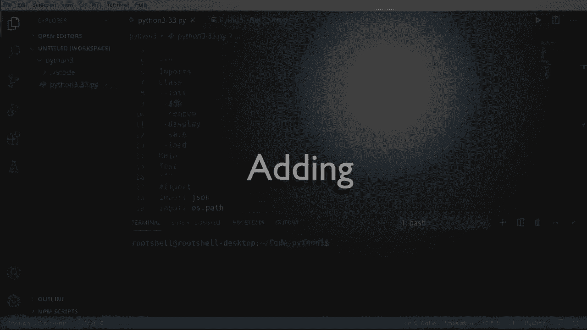

# 【双语字幕+资料下载】Python 3全系列基础教程，全程代码演示&讲解！10小时视频42节，保证你能掌握Python！快来一起跟着视频敲代码~＜快速入门系列＞ - P33：33）构建宠物店应用程序 - ShowMeAI - BV1yg411c7Nw

Welcome back everyone。 this is Briant。 We're going to take everything that we've learned so far and make a pet shop application。

 This is going to be like a mini inventory system。So let's talk about the design real quick before we dive into this thing。

First thing that's going to happen is Python' is going to start our script。From there。

 what we're going to do is we're going to go out to the desk and we're going to load。

Any existing file。Then we're going to go into a loop and let me find a good representation of a loop here。

And this loop is simply going to ask them what do you want to do？

It's going to do something like this， you have a few options that you can choose from。

Any one of those options is going to go right back into the loop， so let me just grab this。

 go right up into here。And eventually。We will exit the program。

 at which point it will automatically save the progress。

The end result is going to look something like this。 Start to load to loop some options。

 and then we're going to save when we exit。Let's dive in and take a look。

Okay， moving right along， we are going to import， I'm just going to plot some notes in here so we can kind of see the structure from the image we had in the previous little section。

 We're going to makes it mans， make a class。 The class is going to have some functions。

 We're going to have our main function。 Then we're going to do some testing。 But first things first。

 we need to import what we're going to use。So we're going to use two things。

 we're going to import J and OS。path。Jason's going to be used to save and load that file。

 we want to have a dictionary， we want to be able to persist that out to the disk。And then import。

 we're going to use the OS do path， there are more modern ways of doing this。

 but we want to be able to check if the file exists。

 so we're going to use OS do path because that's kind of like the old school way of doing things。

Once we have those imports in， we're ready to rock and roll。

Now， inventory systems can get a little bit complex， so what I want to do is I want to make a class。

 and I want to wrap the functionality in this class so if we had multiple inventories。

 we could handle it separately。Someet class。Inventory。And let's go ahead and make a dictionary。

And we're just going to make some functions。 So we're going to。Do our initialization。

And for these initially， I'm just going to put pass because we don't really want any code in here just yet。

 we're going to fill this in as we go。Want to add。And we can speed this process up just a little bit here。

So we're going to add remove。I do want to be able to display what's in the inventory。

We also want to be able to save， obviously， because we're going to put this out to file。

And because we can say we also want to load this。Now you may be wondering why am I not putting this into a separate file。

 I kind of want an all in one solution just to show you that we can actually do an all in one solution。

Next step， now that we have our classes， we're going to start filling in these functions。

Al right， so far， we have a class。 and this is kind of a high level view of this class。

 It's got init， add， remove， display， save and load。 We're going to fill in and knit and add。

 So let's go down to our init。 And honestly， I want to keep this just ridiculously simple。

 We said in the very beginning， as soon as this thing starts up， we want to be able to load。

 I' say self。😊，That load， and we're just going to put all that functionality in that function。Now。

 add is going to be a little bit different here。 I'm going to get rid of this pass。

 and we are going to modify the function itself。We want to have a key。And a quantity。

The premise being， when we add， we're going to add some sort of animal like a cat。

 a dog or something and a quantity that we're going to add into the inventory。

So I'm going to say the Q short version for quantity is going to be zero。Now， if you look at。

For dictionary， there's absolutely nothing in it。 So we can't just go out and grab the key。

 We have to actually test to see if it exists first。 So it key in self dot pets。

Then we're going to go ahead and grab the current value。

 like how many we actually have in the inventory。Self dot pets。And we want the key。

And we're going to update our quantity。So we're going to say take that current value and add the quantity to it。

Now， we have the opposite of that。 It just simply wasn't in the inventory。

 in which case we're just going to say Q equals。Thequ。From here， it becomes pretty straightforward。

 We're going to say self dot pets。Whatever the key was。

And we're just going to update that with our updated quantity。From there。I'm going to put。

 And just for the sake of time， I'm going to copy and paste。

Added the quantity and key and the total is now， whatever is actually out in our inventory system。

 So it's pretty simple， but there's a couple key concepts you have to wrap around here。 First。

 is we don't want to trust that the key is actually in there。 We want to test to make sure it exists。

 and we want to have some functionality in case it's not there。

Back at the top of our file， we've done our imports。

 we've created the class we've filled in and in and add now we're going to do remove and display。

So let's go down here and remove a display just half pass them。

 So the first thing I'm going to do is I'm going to go to add and I want to kind of copy this。

That way。We have a very similar， very structured API to add or remove you just need a key and a quantity。

 we won't have any weird data that we got to figure out。So remove is well， the exact opposite here。

 but we can actually pull parts of this out。 So for example。We can just take this entire structure。

Just paste it right in here。 So we're going to start off with0。 we're going to say if the key exists。

 then go ahead and get the key。And then the quantity instead of addition is going to be subtraction。

And then we want some sort of other value here。 So for example。

I don't really need an else because Q is already set to 0。 And actually。

 let me put that on the right line。So what we're going to do here is now test to make sure that we didn't subtract too much。

Say if Q is less than 0。Then。We want to make sure that Q is equal to 0。 In other words。

 you don't want a negative balance in your inventory that just simply wouldn't make any sense。

And then， of course， we are updating the inventory and now。

We've got some sort of display going out to the end user。We're going to say removed quantity key。

 the total is now， whatever the total is。Now for our display， this is going to be just very。

 very simple。Or keya value in。And we want to go into the self dot pets。

 And if any of this that I've been talking about is just making you scratch your head。

 I'd highly encourage you to go out and watch the videos where we talked about these key subjects here。

 For example， we've talked about classes。 we've talked about dictionaries。

 we've talked about four loopbes and things of that nature。

 We've also talked about Jason and pretty much everything we're talking about。

 We've done in the 32 other videos that we've done here so。And let's go ahead and print this out。

 I'm going say print。And I want to do a formatted print。And I want to say the key。Equals。

 and then whatever the value is。Now， what I typically like to do at this point before we start getting into I O is actually run this just to make sure we don't have any crazy errors。

 The script's going to do absolutely nothing。 We don't even have a main function。

 We just want to make sure it doesn't have any weird syntax error， anything like that。Okay。

 in our class， we are at the save part and let's kind of go down here all the way to save we're going to handle save and load in separate sections。

 so we're just going to focus on saving。So I'm going to get rid of this pass。

And I want to print out to the user that we're going to do something because。Well。

 because we're working with Python， I'm just going to be brutally honest with you。

 We don't know what sort of end devices this is going to be running on。

 It could be a high end blistering fast server。 It could be a painfully slow embedded device。

 We simply don't know。So I want to tell these are we're going to do something。Saving inventory。

And I typically do this whenever I'm working with anything I owe related。

 I will tell the user before and after， meaning I'm going to do something and I have done it or I had some error or something like that。

 So I'll start off with a structure like this。Saving and saved。 And then I'll actually work with I O。

 The reason being。If you were looking at a computer。

 the computer's hardware drive is probably really fast。

 but if you get into like an embedded Linux device and the script is running on that。

It may be really slow。 Or what if the hard drive went to sleep。

 I'm sure you've had that before where you go to save a file。

 and then you hear the hard drive spinning up。We want to make sure the user knows our application didn't freeze up。

So we're going to say with。Open。And let's just say inventory。 Txt。Now。

 this is where we're going to kind of break our own rules just for the sake of time here。

We are talking about。Putting all this in a class so that it can be reused。

 The problem is now I'm hard coding the file name in there。Not a major deal breaker。

 but if you're going to use this for any sort of production。

 you're going to want to actually be able to dynamically set that string。All right。

 so with open and we're going to open this file in right mode。

 plain text as F F is shorthand for file we're right here。 Now we want to do a J。That doubt。Now。

 remember， there's dump and dumps。You see the S at the end that' we're going to convert it to a string。

 We don't want to do that。 We want to actually dump it out to a file。 So first things first。

 we have to give it the object in this case， the self pets and then the file that we're going to dump it to。

And the great thing about the width keyword we've covered this before in previous videos is it's going to automatically close that file for us。

 so we don't have to worry about flushing the contents or closing the file or anything like that。

 So Jason's just going to take this dictionary， convert it into adjacent format。

 dump it out to the file and then with is going to close the file for us。

 and then we're just going to print out saved that way the end user knows， hey。

 we have actually done the IO completely and there were no errors。

We've only got one more。 the load function。 Oops helped if I selected it right。 So here's our class。

 I've tried to indent it to make it a little obvious what the functions inside the class are。

 We've got one left load。 and of course， it will load the file。

 We've already done save so we can just kind of borrow this little structure here。

 so let's grab this。😊，And just paste it。And we can say we can spell it， right， loading inventory。

And then load it。And then with and remember the file name's important。

 So we have to say with the same file， we're going to go ahead and read that as plain text。Now。

 we want to do the opposite of a dump。 So this is where。We need to slow down。

We've gotten a little ahead of ourselves here， and I'm wondering if you can see the problem。

And in case you can't。With open file， we're just assuming that when we load。

 the file exists and we need to be a little bit careful with that because that could cause some real problems。

 But that's why at the very beginning of this。We did an import OS path because we're going to check to make sure the file exists。

 so let's go back down here。And will say。If not， O， S。Dot path， dot exists。

And here we want to make sure we have the same file name， so I'm literally just going to copy this。

And paste it。Then， we want to say。Rs。Skippping。Nothing should load。

And then let's go ahead and return out of here。We're doing this because when the load function is called。

 it's going to print out loading inventory。And if we just， you know， return。

 it's going to look like the program's hung because it's going to just say loading inventory and stop。

So we want to make sure the file。Exists， and if it does not。

 then we're going to say skipping nothing to load that way the user knows there just simply isn't a file there。

 and you could make this a little prettier。And then we would turn out， however， if there is a file。

 we're going to say with open。Open that file up in Read mode as file。

 and now we need to do a J load instead of a dump。Al must say self dot pets。Equals。Jason dot load。

 And remember， there's a loads S。 If it ends in S， it's going to do it to a string。

 and we don't want that。So we want load and we're just going to give it our file。

And then last but not least， we're printing out loaded that way， the end user knows， hey。

 we successfully did our I O to completion， and we didn't have any bad issues。Again， I like to run。

 Scripp's not going to do anything， but if I have like a major syntax error。

 it'll definitely spit it out and tell me。 And we're good to go。Looking at our little flow here。

 we've come a long way， we've done the imports， we've done the entire class and now we're down at main。

 we're going to put a main function in here。So I'm going to go all the way to the bottom。

And I'm going to say。Main， and it's going to put this in here for me automatically。

 depending on your IDE， you may have to actually type that out or saying if the name is main。

 meaning Python is running this file directly， then I want to。Call a main function。Now。

 a lot of people will want to just use this as if it is some sort of function itself。

 I don't like doing that。 I like actually making my own main function。

That way I can actually just copy and paste this function and use it in other places。

 whatever I want to do。So we need to make an instance。Of our inventory， Because remember。

 a class is a blueprint。 It's not actually the objects。

 now we're can take that blueprint to tell Python， take the blueprint。

And create an object from it and give us that object in the form of a variable named I N V。

 short for inventory。Now that we have that， what we can do is create a loop。

And I know in past videos， I've said Loer， the root of all evil。

 and you should avoid them unless you know what you're doing， but。If you've been following along。

 we should know what we're doing at this point。So first thing we're going to do is prompt the user for some type of action。

 So I'm going to say the action equals。And we want input。And we're going to tell the user， hey。

 tell us what you want done， and I've already got this keyed up and ready to go in my notes off to the screen here。

I should say off the side of the screen。 So we're going to say actions you can add， remove， list。

 save or exit。 And these are the actions we're going to flesh out here。So first things first。

 if the action。Is equal to exit。Then let's go ahead and break out of this loop。

 Notice I'm not returning because I want to actually do something at the end of this and let me go back here。

And we're going to say I and V， dot save。So no matter what actions the user takes。

 once we're done with this loop， the inventory is going to save itself before the program exits。

I'm going to put it right here。Exit。The way Python treats a script is once it has nothing else to do。

 it simply exits out of Python itself and that's why you see it stopping down here。All right， so。

Once we've got this in place now we just really flesh out the other actions。So， I'm going to say。If。

 and we can actually just copy this， make life a little simpler， honest。

Big fan of copy and paste here。 I must say if the action is list。Then I want I N B that display。

If the action is。Save。We can go ahead and say I And B， at stave。

And you could do load and all that other stuff， you notice this how I didn't put load in there because the inventory is going to load automatically。

In the constructor。But you could， you know， if you really want to go crazy。

 you could put that action in there， Defite put it in there if you wanted to。 Now。

 I'm going to put in right here。A little bit of logic where we're going to say if the action is add。

Or。The action。Is remove。Then we're going to take pretty much the same。

Type of functionality here because it doesn't matter if we're adding or removing。

 We have the same API。 and let's kind of scroll up here。 So remove， we want key and quantity， add。

 we want key and quantity。 So it doesn't matter which one we're doing here。So in here。

 I'm going to say the key equals input。Mature。An animal。And for the quantity。Input。Once they enter。

关了y。Now that we have those two， we need to figure out which one was actually called。

 So I'm going to say action。Equals。Addd。Then do something。 And if you already know a bit of Python。

 you probably know there's better ways of doing this， But we're just using what we've learned so far。

 So I've got to kind of， I don't want to say dumb it down。

 but I've got to make it a little bit rudimentary here。So， and this is barrier。

 we're going to just branch off in our logic and say if it's add do one thing。

 if it's removed do the other。There we go。up。Proably help if I actually called remove。 Otherwise。

 we're just going to add it twice。 This is the beautiful part about having the same type of API。

 if you will， I you can now start wrapping functionality in here and make it super streamlined。

 super easy to follow。😊，So following our logic， and let me just grab some screen real estate here。

When we go into the main， we're going to create an instance of the inventory and then we're going to start a loop。

After the loops completed， no matter what the user's done， we're going to save that inventory。

In the loop， we're going to continuously ask the user。

 what do you want to do and then take action depending on what they entered。

The only thing left to do is fasten your seatbelts and lets test this out。If you have， if underscore。

 underscore name， underscore， underscore equals main。

And you've got your main function and you don't have any syntax errors， you should be good to go。

 let's go ahead and grab。Some area here so we can see the program in action， we're going to run this。

And it says loading inventory， skipping nothing to load because we don't have adjacent file here。

 And it's going to say actions。 add， remove list， save and exit。 So let's go ahead and add。

And I want to enter a cat。And I enter a quantity of six cats。

 because you have to have six cats in life。 it's just， it's mandatory。

 And so let's say added 6 cat total equals 6。 So let's add。At。And I want to add three cats here。

 So we've added three cats in O0， total 63。 We have a bobo in our program。

 Let's go ahead and let's kill this terminal。Let's figure out what we did wrong here。嗯。

Notice anything funky about the output。 It sit 63 instead of 9。 We need to convert this now。

Do an integer。Remember， we talked briefly about casting。

 where think of casting like a wizard with a magic wand he's going to cast a spell and convert it from one thing to another。

Really， what we were doing under the hood is we were saying quantity and then action add go up here。

And it's saying V plus QTY， this is the blessing and curse of Python and other languages like this where you don't have a type。

It knows that they're both strings， so it just adds them together as a string。So， a string。WhatSting。

We'll look like this， which is exactly what we just saw。O。Enough of that。

 let's go ahead and rerun this。 Now， because we killed our console， we still don't have a JSson file。

Which is exactly what we want at this point， so let's run this fresh。All right， let's try this again。

 add。At。6， because you have to have six cats in life。 Sa it with me。 We're going to add。At。

And we want to add3。 Now we have a total of 9。 So our logic is now working as expected。

 Let's go ahead and let's。Add。A dog。I't say we want 99 dogs。

 And then we realize that's a lot of dogs。 We really can't have 99 dogs and 9 cats。 So let's just。

Take that down a notch。 let's remove。Dogs。And man， you know， I like dogs just as much as I like cats。

 So this is a very difficult time for me。 Let's go ahead and。Remove 98 dogs。 I'm very sorry， dogs。

 Today was not your day。We've removed 98 dogs。 We now have a total of one。 Now， we could type save。

 but I'm just going to exit。Saving inventory saved。

 so it automatically saved for us and it put this inventory TxT and if we go out here。

 we have nine cats and one dogs and everything works as expected。I'm going to clear our console。

And rerun this and something magical happens。Loading inventory low did。 Let's go ahead and call list。

We have。Nine cats and one dog， so it has now loaded that Json Voil， loaded it up into the dictionary。

And everything's working as expected。 I'm going to go ahead and say， just enter， enter enter。

 And you can see because it doesn't have valid input， it just goes back into the loops。

 I'm going to enter just garbage。 Does't matter what we do。I'm going to go ahead and add。Fish。

 and I want 45 fish。I'm going to go ahead and intentionally save this。Saving inventory saved。

 And I'm going to go ahead and display。Basically， you can do this all day long， but oh oh， display。

 I don't want display， I want to list。You can see how we have nine cats， one dog and 45 fish。

 we could do this all day， but really what I'm getting at here is now we have some programming logic and everything's working as expected。

So I' going to go ahead and exit out。We'm going to save our inventory。

 we can go ahead and peek at it and sure enough everything's exactly the way it was when we finished the application。

All right， major takeaways from this video。 This is kind of the culmination of everything that we've learned so far。

 We've worked with imports， we've learned classes， we've learned functions。

 we've learned flow control。 We've learned about Ma。 We've done some testing。

 We've learned about Jason， the O path and kind of breaking this down here。😊，Always， always。

 always initialize your variables， even if it's just empty because you don't want to have something not defined。

Constructors are your friends because you can set up some sort of default action。And when in doubt。

 always check your data types。Make sure you're giving the user some sort of visual feedback。

And there are times where life is not that simple and you'll need to check to make sure whether a file exists or something like that。

 we've also covered things like the with keyword and how to read and write files in plain text and I think we did cover binary as well。

But one major takeaway， some minor tweaks to this is do not hard code the file name like I did。

 I kind of just did that to save some time， But you may want to actually ask。

 like if you wanted to really tweak this。Make like another function and put it in the constructor and basically say。

 if we don't have a file。What file do you want to work with and just let the user enter it something like that？

So I hope you found this educational entertainment drop a comment below and let me know what you think。

