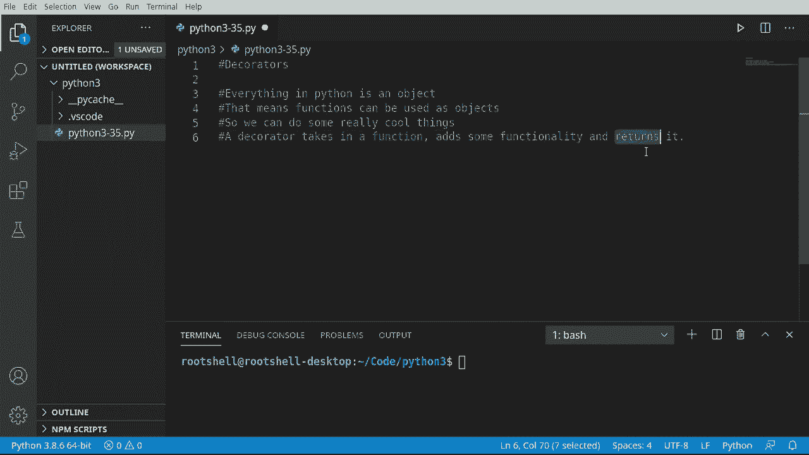

# 【双语字幕+资料下载】Python 3全系列基础教程，全程代码演示&讲解！10小时视频42节，保证你能掌握Python！快来一起跟着视频敲代码~＜快速入门系列＞ - P35：35）装饰器 - ShowMeAI - BV1yg411c7Nw

Welcome back， everyone。 This is Brian。 In this episode， we're going to talk about decorators。 And no。 it's not about making things prettier， although it does look a little better on the screen。 So everything in Python is an object。 That means even functions can be used as objects。 And that's really what decorator is going demonstrate。 We can do some really cool things。

 at the heart。 A decorator takes a function。😊，Add some functionality and returns it。 keyword returns it。

All right， let's dive in and take a look。

So I'm going to do a decorator and I'm going to do it wrong。 I'm going to do it intentionally wrong to show you how decorators actually function。So we're going to say de， and let's say。Asest。Deck orator。And I want to give it a function。Notice how that's just a variable， that's because everything in Python is an object， so say print。Or。

Then we're going to actually call that function。IfYou you're a little confused here。 we have a variable called funk， and it is actually a reference to。A function。That's because you can pass functions back and forth， like variables。So it just simply says before。Coar function and after， so let's go ahead save run and nothing happens because we didn't call this function。

Now， let's introduce the concept of a decorator， some to say de。Do stuff。And let's go ahead and say print。Doing stuff。Now， if you look at these two functions。They're very basic， I mean， this is very easy to understand。 you have a function that has a function as a parameter。

 we're going to take that argument and then call it inside so it's just。 you know calling another function。So we've got our do stuff。 Now， what a decorator is meant to do。Its say something like this。 F equals。 So we're going to get some function。And we're going to say。Test decorator。Do stuff。That's really what a decorator is meant to replace。

So let's get rid of that and let's call the decorator and this is where a lot of newbie's really。 really stumble。Or say test decorator。It's really that simple to create a decorator。 You just have an at symbol with the name of the function。Over whatever function you want to decorate。Now， there is a sneaky little problem here。

This test decorator is not returning something。 So when I run this。Guess what happens。 And I'm going to go ahead and clear this out just so you can see it。Did you catch the problem。We never called either of these functions， but yet it executed。And that's because what Python's doing under the hood is it's taking this and saying at test decorator。

 it's going to take this。And put it right here and then just immediately call it。 So the code's getting executed， even though we did not directly execute the code。 that's a fundamental newbie mistake。 So be very mindful of that。Let's take a look at an example of a real decorator， we're going to do this the correct way。

 and it's very， very similar。I'm going to say de。 and I want to make bold。 We're going follow just kind of the same pattern here。And then I'm going to define an inner function。Now， before I do anything。 I'm going to immediately return。That inner function without calling it。

 So really what I'm doing is I'm passing a variable back。Very， very， very important。 You just kind of understand that concept of what we're doing here。 We're making a function。And we have a function inside of a function， and we're returning the inter function。 So in the inner function here。I'm going to go ahead and just pretty much take the same pattern here。

So now we have a before and an after， and I'm going to， because we're making this bold。 we're just going to say we're working with like some HTML。So we're just going to。Do the。Different codes for HTML， if you don't know HTML， basically what we're saying is start making this bold。 stop making this bold， it's really all that is。All right， So now。We can take that。And say， yeah。

Print name。Capitalze that just so it looks a little better there。And then we're just going to go ahead and print whatever your name is。Now。 we've learned from the last segment here that the at symbol with the function name is the actual decorator。 so I'm going to just copy that name。Go at， and then make bold。Now。

 watch what happens when I run this， we're going to see this up here execute。 but we don't actually see the Bryan Karens。OkaySo really what we're doing here。Is we're making an equivalent to and I'm going to copy some stuff on the screen。Let's say off the screen， we're saying@ makeBold is equal to function equal to make bold print name and then calling that function。

But that function call is just returning。This inner function， if that seems really confusing。 think of it this way。At make boldd， so we're saying make bold， take this function。As the variable。And then。We're going to say enter is going to be。Priinnt， call our function， print。 and then return the enter without actually calling it。

 So now we have this variable we can work with。 man， that seems super， super confusing。But in reality， it's very easy to work with here。 Now we can just say something like this。Prt name and call our function。And under the hood， remember。 what's going to happen is it's going to go through all of this decorator， return this inner。

 And when we call print name， it's actually going to call。 make bold and then call this code gets kind of confusing， but the results。Are pretty astounding。Okay， just in case you need a quick， quick recap。At symbol means we're using a decorator。 we're calling this function。 we're returning this to the function as the parameter。

And then the inner function is going to run some code。 and we're just going to return that inner function as a variable。 So essentially basically what we're doing here is that。We're calling that inner function。 but we don't have direct access to it， and that's why people get so hung up on decorators。

Once you wrap your head around that， they're actually pretty simple。

Okay， if this was not confusing enough now， let's make it even more confusing。 What if we wanted to pass parameters to this， How would we go about passing parameters to all these。 you know， functions and inner functions and all this fun stuff。 So that's what we're really going to look at in this little section here。 Decators with parameters。

 So let's say we want to make some sort of function。Alllled divide。And this function should。 shockingly divide things。So the problem we have with Python is， well， it is very。Weake typed。 what I mean by that is。What is A and B is an integer， is it afloat is a string as it a class。 for example， can you divide A by cats？That's a really good question。So what we would need to do。

Is something like this print。A divided by B。Now， if we were to， and I'm going to just。Put some stuff out here。Hopy and paste。 What do you think is going to happen if we do 100 divided by 3。 What about 100 divided by 0， You're can get division by0 error。 What about 100 divided by a string。Well， you're going get some really bad results。 Let's just run this and see。 yep， division by zero。

 boom， let's just try to。I pass that， and let's do it again。 and a O unsupported opera and type in string。Super， super frustrating。What we want is a decorator。That will check to make sure if we can even do the division。And if we can to actually divide and return the result。

Which means we're now doing type checking and we're passing parameters。 Let's go ahead and make it real quick。 So I a site de。 And let's call this numb check。I almost wanted to call it nubchuck。Gotta behave。 All right， so numb check， short for number check。This is going to be our decorator， and we're going to have two functions in here， I must say de。

Check int。Doesn't necessarily need to be an endt。 but just as an example。 we're going to check to make sure it's an integer。And I'm going to immediately pass。And then let's say de enter。And in， inner， we want an x and a y。 And you notice this has a defined number of parameters。 What's going on here。Is we are matching。

The function call see how we have one，2 and one，2。 so pretty much we have two parameters。 we want to make sure we are lining up with two parameters。We're going to show you how to get around this in the next segment。 but I want to show you how to just pass the parameters。

 and that's why I have this at a specific number，1，2 and 1，2。All right， so in our inner。I'm going to say simply。F。Not。Check in。And I want to check X。And will say。Or not。Check out。I want to check why because we're going to check both of those。 make sure they're both。Numbers。 if they're not， we're going to return。 I notice how we're not returning inner。 We're just returning。

 So it's going to take no action whatsoever。Then we're going to drop out here and say otherwise。 we're going to return。The function。And if you're confused about where we're getting that。 it is the parameter for our decorator right up here。And we're going to return。X comma Y。Now。 let's go ahead and return。Our inner。 And if this seems confusing。

 it's because it is bloody confusing。 I'm sorry， it just is。 I love decorators。 but these are so confusing so。😊，Once we make this a decorator。 and let's actually just do that right now。So。Python is going to say numch。 and then it's going to say divide， past divide to this。

Which is going to go down into our inner and all this other stuff。 and it's going to get passed around like hot potato and try to figure it out。That's confusing。 That is so ridiculously confusing。Let's go ahead and do our check int。 and then we'll step through this whole thing step by step。 make sure we understand the logic here。

 So' going to say F is instance。0ero comma。 And so we're just doing some type checking here。 some real basic type checking。And then beyond type checking， we had that division by  zero。 So if it's an integer， we want to make sure if。Oh。Equals zero。Want to let the user know something happened here， print。And not divide by 0。

 Then we just want to return faults。Okay。If we've gotten past all this。Let's drop out here。 We're going to go to return true because it is not 0 and it is an integer。 So we should be able to do some sort of division。If we've gotten to this point and we haven't already returned true or false。 I'm just going to say print， this is not a number。Then'll get rid of our pesky string problem。

 And then we're going to go ahead and return false。Okay， so。The base logic here。Man。 fasten your seat belt for this one。 So our our decorator is going to be numbmchuck some function。 Our inner is going to come down in here and say， okay， we've got two parameters X and Y， If not。 and then check in on X and check in on Y。 Check in is going to say， is it an integer。

If it is an integer。Then we're going to say is it 0， if it's 0， then we're going to return false。 However， if it is an integer， we're going to return true。And if we have not returned out of there。 we're going to return false and say it's not a number。 There's probably a vastly prettier way of doing this。 I was just hashing out some code real fast。

Once we've said， okay， it is not an integer or it does not pass this check in。 and we're just going to return nothing。However， if we are able to。 then we're going to return the function X Y， which means it's going to actually do our division for us。Wow， that's crazy art。We've got our decorator in there。 Let's just test it with 103。 Sa run。

Sure enough， it returns 3。3 repeating。Let's try our division by 0。Cannot divide by zero。 so it caught that。Now， let's try to divide 100 by cat。And a cat is not a number。Very cool。 very functional design without having to do a whole lot of back and forth。 we can just simply define a decorator。And then。You guessed it， use it。

 and we can use this over and over and over again。 It makes it so simple once we get to this point。

Okay， the last little section there was really， really confusing。 but the main takeaway here is that you can get some really complex functionality out of a simple decorator。The big problem was we had two arguments and only to。 what if we wanted to have an unknown number of arguments and we want to chain them together。

 Let's take a look。So I'm going to make two decorators， say de。And will outline。And initially。 I'm just going to pass。I can take this copy。ased。It'sCall this list items。Now we're going to make another function and let's call it display。Splay is just going to display a variable called message or MSG。Very simple。

 Just going to print it out。HNot sure where copy and paste has betrayed me there， there we go。All right， very simple， very easy to understand structure here。 we're going to take these two and chain them together。 And when I say chain。 what we're talking about is something like this。So we've created a chain and it looks like a chain because you've got these little at symbols or links in the chain。

And these could。Just to kind of give you a graphical representation here。 it looks like you have a chain going down the screen。Really， it's first come first serve。 so outline will get called first and then list items will get called second。 and we could just keep adding and adding and adding if we wanted to。

 But this is the main reason why we have to return our inner function。So let's start fleshing these things out。Now， I want to say as。Which stands for zero or more arguments， or。Zero or more E word args。 If you skip that video。 I highly encourage you to go back through the playlist link is down below。

 watch the video and understand the difference between As and keyword as。And then， print。We're just going to print out。T灯。I's 20。Because outline is going to shockingly just outline whatever we put out here。Now we're going to call our function。With our star as。And。Heward arks。Once we've gotten to this point， very simple， just return。Our inner。

We've got our first decorator pretty much done。 All it's going to do is outline。Our function。 very straightforward。 Now， list items is a little bit more confusing， but not by much。First off。 let's go down here and fix this。 MS G。 There we go。Make a little more apparent what display is actually going to do。So we're going to enter。And we can。

Just go right up here。And grab this。Save as a smuddge of typing。Here we go。So first thing we're going to do is just， well。I must have clicked something。 There we go。First thing we're going to do is just call our function。Then we want to be able to list it out。 but before we do that， I'm going to just print。F。And we're going to say as equals。

 And I just want to see what Python is actually handing us that way you can kind of wrap your head around this。We can do the same thing with our keyword args。And let's go ahead and return。Our inner。So now we have two different decorators that do two totally different things。We can then just call our function。And see them in action。So。We got Hello world Args Args。

 and this should actually be keyword as。Notice what's happening if you were expecting hello world with a bunch of tils underneath it。 no。 So basically， list items is being called inside of outline。 That's part of the chaining。 So outlines being called first。And because we are now passing。This other decorator。 it's now forming that chain。 See how that works。Here is our end right here。

And to just kind of break that up， we could actually turn this into like a plus similar or something。Just so you can see the start in the finish。对。叫呢。Asems start finish。Very， very interesting。 The way that works。 I absolutely love it。😊，But notice， right off the bat here。Args is a tuple。 Keyword args is a dictionary。 O， okay， so that tells us exactly how we need to iterate through these things。

Some say， 4 x and as。Let's good ahead， print。And we're going to format that format that。And I want Arg。Equals。And then， x。And we can do something very， very similar for our keyword as。Except for that's a dictionary so we're going to do a key value pair。 if what I just did on the screen looks like black magic， go back in the playlist。

 link is down below and watch the video on the for loop on dictionaries and we're going to do the keyword as。 items。And then we're going to say key。Equals x。And of value equals。Actually not x， sorry about that。E is K and value is V。There we go。Save run and sure enough， our hello world， notice how it's not。Got anything in this dictionary here it's because we have no keyword arcs。See。

 we're just panning a normal argument。So， let's go ahead and。Do something a little different here。We're say the birthday。 And I want some keyword a， name。Equals。Whatever and age equals zero。And I would say print。Format。Happy birthday。Whatever the name is。You are。Whatever their age is。Years old。Now let's go ahead and call our function。With the keyword arguments。

And we can go ahead and just reuse these decorators， so I'm just going to literally copy。And paste。Notice how there are two different functions to two totally different things。 and they even have different parameter types， but we can use the same decorator。 let's see it in action。Happy birthday， Brian， you are 46 years old， and now we have no as。

 but we have this nice dictionary， and we get the key and value out of that。And if I just。Go up。 you can see how it fired off both of them。And everything's working as expected。So decorators main takeaway here is， well， they're complex and they get really confusing really。 really fast。But the biggest takeaway you should really understand from a decorator going all the way back to the very beginning is it's going to call this function right here。

And if you don't return。Your inner function is just going to execute the code。 So a real decorator looks something like this。 You have your function。 You've got your decorator。 The decorator is going to have an inner function， and you're going to return a variable that points to that inner function。From there， really the imagination you have is your limit。

 you can do just about anything you want and these become highly。 highly reusable and you can make them as simple or as complex as you want。 and you can reuse them across many different types of functions。