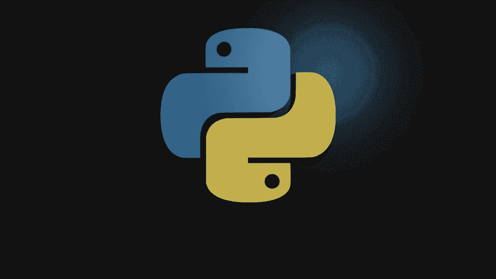
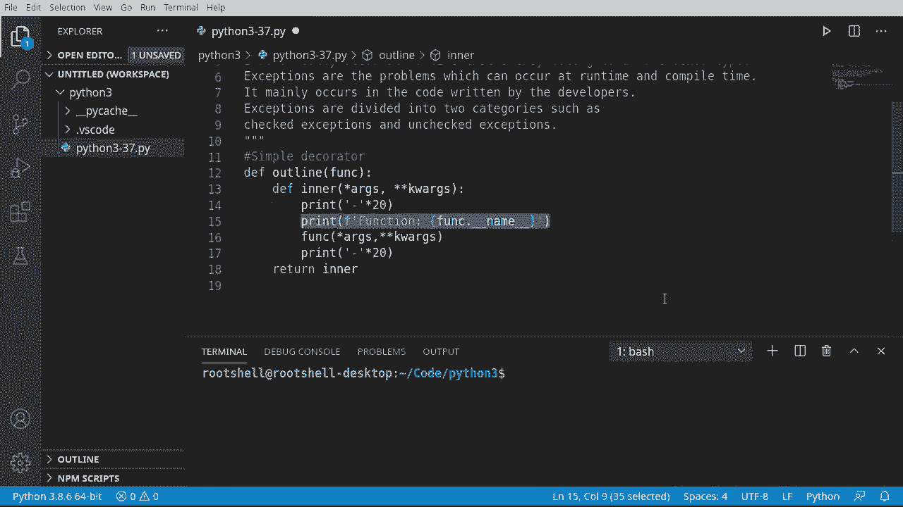
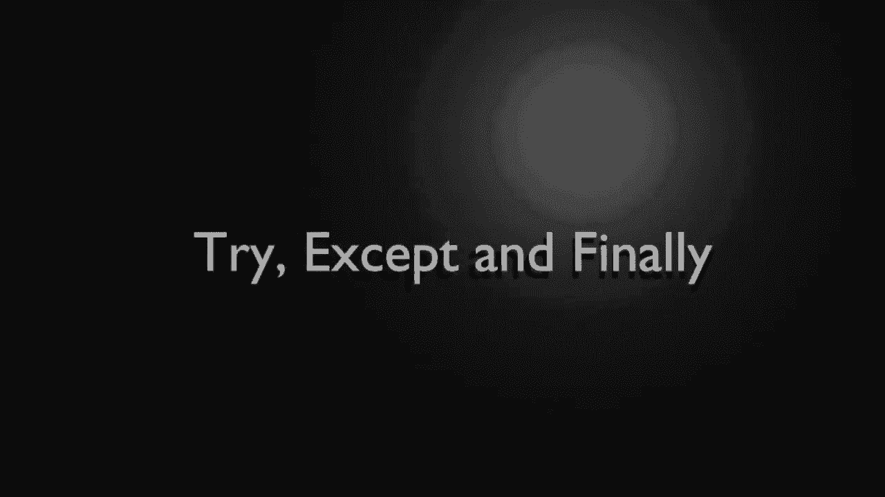
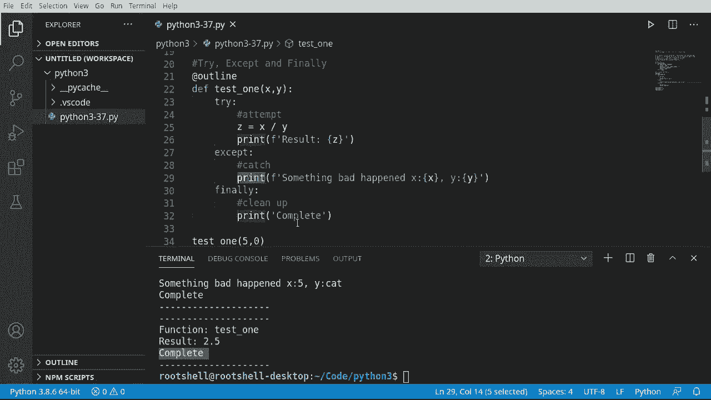
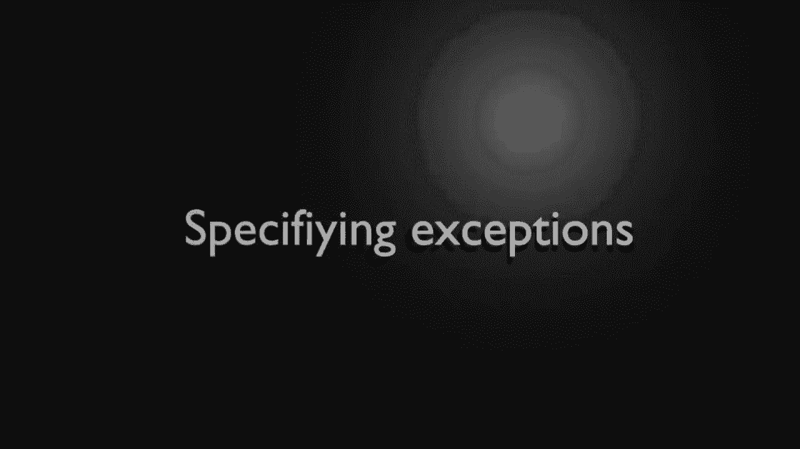
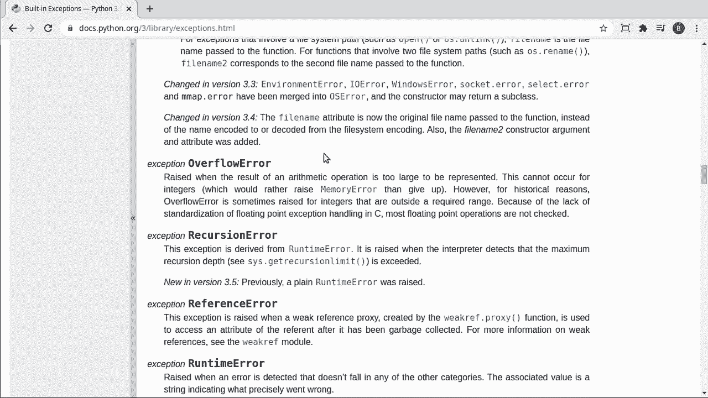
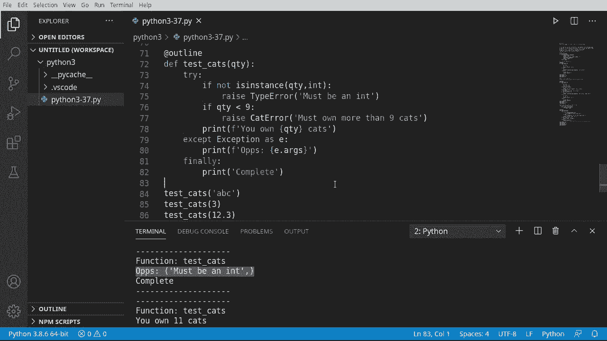

# 【双语字幕+资料下载】Python 3全系列基础教程，全程代码演示&讲解！10小时视频42节，保证你能掌握Python！快来一起跟着视频敲代码~＜快速入门系列＞ - P37：37）异常处理 - ShowMeAI - BV1yg411c7Nw

Welcome back， everyone。 This is Brian。 We're going to continue our journey into Python 3 with the exceptions。 So basically， bad things happen。 and we need to know how to handle them。 We've already seen that in these videos。 and I'm sure you've seen it millions of times working with a computer where it just says like error or unknown error accident denied or。 you know， some other crazy thing。But we need to understand a subtle difference here。

 An error occurs mostly at runtime。And it belongs to an unchecked type。 This is things like your hardware failing or your network connection dropping or something like that。 something completely。Unexpected that there's really nothing we could do about it。Exceptions。 on the other hand， occur run time and compile time and occur mainly by code written by developers。

 meaning we are now creating our own problems。So， yes， we can write code to defend against errors。 but we can never truly。Defend 100% against an error。 like how do you defend against your CPU exploding， you just can't， your code will stop working。Exceptions， on the other hand， would be like division by zero， wrong data types， things like that。

 So that's what we're going to really dive into in this video Also before we begin。I'm going to put a simple decorator in here， we covered this in a previous video。 but just a quick recap in case this looks like ancient Egyptian algebra。A decorator is a function call that is used by another function call to decorate it。 and basically。

 we have a inner function that is going to return a function with any number of arguments or keyword arguments。 and we're simply going to print out。And when I say print out。 so you're going to see a bunch of dashes before and a bunch of dashes after we call that function。 and just for a little bit of flavor， I put in the function name and we're going to use this on every single function。

To begin， we're going to look at the try except and finally。Now。 this is going to be a little challenging to really wrap your head around it first。 but what we're really doing here is we're creating some special scopes。 and those scopes have special reasons for existing。So first things first。

 I'm going to create a function called test 1。 I'm going to give it parameters of x and y。And I'm just immediately going to call pass。 we're going to go ahead and use our decorator。 Again。 if you have no idea what a decorator is or if this looks horrible or if you don't understand this。 watch the previous video I've done on decorators。 But basically， when we call this。

 it's going to print。Pall the function， and then print again。That's really all we're doing。 even though it looks kind of confusing。All right。 so to dive in here。We are going to usery。 And you notice， we get some options in our IdeE， your I may look vastly different。 and these look confusing。 try up， trycept else。 finally， so on and so forth。

 that we're going to go over all of these。 But the first thing I'm just going to do is just try。And got to end it a Col。I'm going to go ahead and pass for the moment， drop down。 and we are going to。Except。We're going to pass again。Just going to flesh this out and then finally。 I want to talk about each one of these in turn。If you're coming from another language。

 this is basically a try catch finallyly。So try means we're going to try some code。 It may work。 It may not。 So， for example， we could say z equals。X divided by y。And then we're just going to print out。 oops， we're going to print out， see what I mean。 I'm creating my own errors here。The result。This code looks just well boring。

 It's just basic division。 But what could we do here， horribly， horribly wrong。 We could do like a division by 0。 And because Python isn't really strongly typed。We could send non numerical values to this and crash this whole thing。 We've seen this before。 I've done this in this series before。 So we're going to have to defend against that， so。

We want to do except， which is the basic version of like another languages version of catch。 And I'm going to actually put that right here as a comment， catch。 So if you're coming from another language， this is catch。It's easier to explain in other languagesca it's like catching the ball。

 You're catching the exemption or somebody's dropping the baby and you're catching it before it hits the floor。 And the program， of course， is your baby in this analogy。So we're going to keep our program or catch our program before it fails。 and we're going to now execute some type of logic。Something。Ad happens。

Now the problem with this is we don't really know for sure what happened。 We just know that something bad happened。And we're going to look at later on in this video how to determine what happened and the take specific actions based on that。All right， but right now we're at really， really newbie land here and we just want to know something bad happened。Now， finally。Finally is going to be called no matter what。 So try is an attempt。Zempt is a catch it。

 If it falls， you know， something bad happened。 We got to catch it before it meets a horrible。 untimely death and。Moving along is what I call finally。 it doesn't matter what happens up here finally is going to be called。Let's take a look。 So I'm going to just print out。Complete， and in case you're wondering with my herbal typing。Yes。

 most of the programming bugs are misspellings， misstypings， things like that。 or just bad data types， things of that nature。Let's see this in action。We're going to say。Test1。And let's do 5 and 0。What is immediately standing out that zero， very ugly， let's check it out。U oh。 function test 1， something bad happened， so immediately。

 instead of having a division by zero error in our program crashing， we were able to catch it。And do something。Now， let's give it another untimely death here and must subtest。1。And let's say  five and at。How do you divide 5 by cats， I'd be really interested in knowing that。 But let's try it again。 And sure enough， S1， something bad app in 5 in cats。

 So we know that it's not doable。 Let's just take this and。Let's divide。Copy and pastees failed me。 There we go。 Let's divide 5 by 2 and see what we get here。So the result is 2。5。So we know our function now works and we can defend against well exceptions。The biggest takeaway from this segment of the video is that you have a try。

 which in an attempt exempt， which is a catch and a finally。 which is going to be called no matter what happenss you can see in。Each one of these examples。 whether something bad happened or successfully ran。Finally was called。That's your cleanup code。 so we're going to change this to clean up。So think about this in terms of like IO。

 you're going to write to a file， you're going to attempt to open the file and write to it。 something bad happens， and then you would close the file regardless。

There are tons of built in exceptions， and we're looking at the official Python documentation。 and I'm just going to scroll down。 we're not going to go through all these because we'll be here all day。 but there's the generic high level1， and then it gets into very specifics like arithmetic buffer assertions。 Now we're going to talk about assertions right now。 but I want you to understand what's going on。

Assertion is not a true error。 It's something that we're actually creating。 So we're going to assert that a condition is true。 And if it's true， nothing happens。 If it's false。 though。Arror is raised see raised when an assert statement fails， we're going to do that right now。 also understand that you can have tons and tons and tons of these and you can even define your own so。

Wow， lots of information taken in， but I'm going to leave a link。That out there。 And we're going to just take。Oed from the last one。And just copy it。And we're going to do a bit of surgery here。All this test， too。All right。 so we've got our attempt catch and finally， and let's kind of change around a little bit。

First thing I want to do is add in N else。So think of this now like a giant if statement。 we're saying if。And then if and then else。So when we get to elses。 we trust this code and this code should run， I don't like doing this。Because what happens if something blows up， So then you end up doing another try exempt block in here。

 and I don't like doing them in line over and over。 It just gets really messy， so。We're going to move that here。And I'm going to call this trusted code and personally I don't trust code。 I usually do it up here， but you'll see this out there where people are going say。 else just do this。 And when it gets here， you trust this implicitly。It can do no wrong。

So attempt is now something we have to do some testing， so we're going to assert。Now。 if you're a parent， you know exactly what an assertion is because you walk up to your child and say。 you will clean your room right now。And if they do not comply， if you get a false back， then well。 bad things happen。 They get grounded。 So we're going to say x is greater than 0。

Sert's going to go in and evaluate this condition if it's true， nothing bad happens， however。If it's false。Bad things happen very quickly， meaning。It's going to。Say it's failed and it's going to raise an assertion error。 which we'll call exempt in any other catch condition that we put in here。So let's just grab。

ThePrevious。Tests that we had。 And let's rename these gotta look， copy and paste， making life simple。Al right， so we're going do five divided by0，5 cat，5，2。 And let's go ahead and test this out。Move this up。All right， so we can see now that。Our assertions are working。 So function is test 2。 something bad happened。 So it's immediately saying， Serert failed and then printing this out。

Asert is a powerful tool， but it's not perfect。 We want to know exactly what happened。 and we want to be able to handle things on a case by case basis。So typically。 what I'll do is I'll change this too。Exception as E or error or whatever you want to put in here。And then I will actually add in the issue。And then E， of course。

 has other properties if you wanted to dive into them。 but we're just going to leave it asie and we're just going to print E out here and let's clear this out。And rerun this。See what's going on。Okay， so something bad happened。 The issue is that is not supportive between instances of string and int。

 So now we have some sort of typing issue。 But notice how division by 0 never got caught。 So we have a couple choices here， we can leave that in the catch all or we could do a division by0 error or we can make a custom error。 However， we wanted to do it。 So if we wanted to catch a specific condition here。We're going to say。 except。Assertion error。Then， I'm going to say。Prenent。F。And fail to assert。X。And why。

When you look at this now， we have two exceptions that we're handling。 We have the assertion error and just the general catch all。 So I'm going to put here specific。And you can chain these out to infffinity。 you can basically do every single error。 But what I'll do is I'll do things that I would expect。 like if I fail an assertion。

 I want to know it's just garbage data the user gave us， or if something higher level happened。 I want to be able to catch that。 But I want to be able to distinguish in the application。 the difference between the two。 So if we fill an assertion。That's going to get called if something else happens， this is going to get called。All right。

 let's try it out。All right， so something bad happened。 All right， and then failed to assert。So you can see the two different ones firing off here。Faiil to assert， meaning we failed our test。 assert y greater than zero， let me see if I can get some room here。That failed。 which triggered this off。But then you notice how why， if this was cat greater than zero。

 how does Python even begin to evaluate that it can't， so it skips over and says bad things happen。 we cannot compare these two so then it jumps down to the。Exemption code right here。So for our assertion logic， it's going to do this one for other things。 our catchall is going to get fired off。That is actually really， really powerful。 But one thing。

I want to really caution you on is not to go overboard with this。 So， for example。 if you try to do like a。Exempt。What am I looking for here type？Air。And then we could just say like wrong type。And let's clear and rerun。you see now it's saying wrong type X and cat can't be compared。

 But what I'm doing here is my code is getting longer and longer and more and more complex。 So I would say， look for the specific errors that you absolutely must handle and let everything else fall into a catch all if。At a minimum， you have just to catch all that's still acceptable。 but you want to be able to catch things。I rarely use Else because now I am completely trusting all of this code to run without any single issue。

And what happens if we do something like that， I just hit space。 There's just a blank space right here。Go ahead and clear that out and let's run。Notice how our program， even though we have all the security baked in has now crashed and my IDE is not showing me。 hey， there's a problem right here。This is why I tend not to use else。

 Let me go and fix that before we move on and make sure everything's working。As you can see。 this can get very complex。 I mean， our little function here is now bigger than the screen。 I've got to either zoom out， which will make the code small and hard for you to read。 or I've got to。Well， figure something else out。 So we're going to add another complexity here。

 We're going to make a user defined exception and we're going to raise it。 meaningan we're going to create our own error and then catch it and show why you'd want to do something like that。So this is pretty typical in file I O。 But first off。 let's go ahead and make a class and let's call this cat error。

Because every cat has some kind of error。Why not？ And so cat air is going to inherit a run time error。So we're going to use the built in class runtime error inherit it。 and now we have all of that functionality baked in。 let's go ahead and sayDe。And we're going to in。Self with。And as。And I'm just going to say self that。Args。I always like that word as。

 soundss like a pirate。Anyway we're gonna say that is the arts， so。Very， very simple class。You can feel free to make that as complex as you want， but just know that。These error classes are meant to be very short lived。 The lifespan of these is basically from the time something happened to the time it's caught。

 you don't want these things lingering around。 Their sole purpose is just to carry information about what happened。All right。 So I'm going to say at。Outline because we're going to use our decorator again。And I'm gonna define。Let's call this， test cats。And we're going to test a quantity of cats。And then I'm going to do a try。 Now you start to understand what all this gibberish intelligence was popping up in the very beginning。

 We can do a try exempt。 We can do a try exempt else finally， blah， blah blah。 any other than combination， I'm just going to pick try except finally and it's going to do the code for us。Now， I don't really need all of this stuff。So I'm going to just change this a little bit。To suit my needs， Intelence is great， but it doesn't always have to be the way they want it to be。

So now I just have a try， except And finally。What we're going to do in here is I'm going to say。In our try。If not。His instance。Then we're going to test to make sure that Q T Y is actually an integer。Because you could， know， hand it a string and we don't want to take some sort of mathematical operation on a string。Now， if it's not。An integer we't want to raise。Now raise is basically like throwing a ball。

 we're saying， you know what， this is an error， you go fix it and we're throwing。A rock or a ball at a window saying here， go catch it。 And if you don't catch it。 your program's going to break and crash much like a window would。Maybe I just made a joke about Microsoft Windows。 I don't know。 Anyways， interpret that as you will。

 So we're going to raise some type of error。 And when I say type of error， I don't mean。This。 the class type error。 I mean， this could be an assertion error。Or anything that inherits basically a error or runtime error。But for this case。 we're going to do a type error because we know that there is a specific issue。And then from here。

 we're going to say。Must be an hint。So you want to be very careful when you're raising an error that you raise the correct type。 And this is one of the few times where Python really， really， really cares about the type。 If you try to raise like a string or something， you're going to get some weird results。 although I suspect you could probably do it。 All right。 So now we're going to。Check for a quantity。

 So we're going to go back here and say if。Q TY， and if we got to this point， we know。Because this has not been raised。 We know that this is an integer。 and we can work with it mathematically。So now I can say the quantity is less than 9 then。Well。 who in their right mind would have less than 9 cats。 So I'm going to raise our cat he and say， must。

哦，呢。More than 9 cat。Because I don't know what lunatic in their right mind would have less than nine cats。 that's why the cat air exists。But now what I'm really demonstrating here is we can make our own custom class as long as it inherits the runtime error and we can throw it or raise as it's called。

Just like any other setup type。Very， very cool。Okay， so。Now that we've got this。 I'm just going to say print。And we're going to format that on。 I'm just going to say oops。 Ca this is our catch all。 We're going to say like oops， unknown error。 Sorry， my bad。And we're going to say E do as。Now， for finally， I'm just going to say。认。Complete。

Notice how this is much， much， much， much， much more streamlined than this big， bulky thing up here。 This is what I'm talking about。 Air handling can get very complex， very fast。 So General Ro thumb try to keep it short， simple and to the point。All right。 let's go ahead and test out our CAs class。Imna say test cats。 And we want to。

There's some crazy person that only has three cats。There's some crazy person who has 12。3 cats。 I don't know how you would get a。3 cats。 That's kind of gruesome。 And then we're going to。Test for 11 cats。And we could， if we wanted to even just really throw this thing for a curve ball here and say。ABC。Let's clear out our results and fire it off。All right， so。We see， must be an int。

Must own more than9 cats。 Must be an int。 I mean， so this is now working as expected。 So this must be an int。 must own more than9 cats。Must be an int。 And then Ta。 finally。 we have some sane person out there who did follow the directions。And I'm just going to， for clarity。You own X number of cats。Play this out， right it off one last time。You own 11 cats。

You can see that you own 11 or you own whatever is not in there because we threw and caught the exceptions。So whenever you see try， think of this like playing baseball or some sport， they have the ball。And if something happens they don't like， they're going to throw the ball。And it's up to something else to catch it。 And regardless of what happens。

 the sports caster is going to， well， call it like these season and says， Anne， we're done， folks。