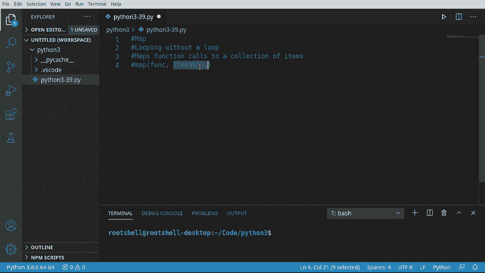
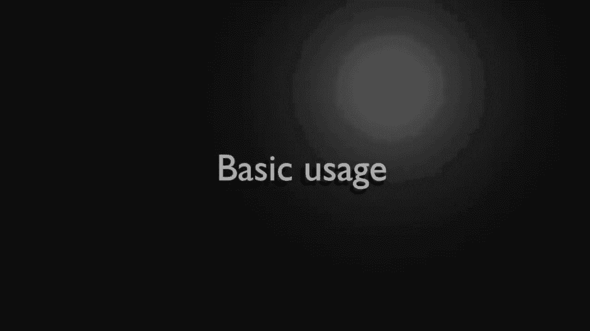
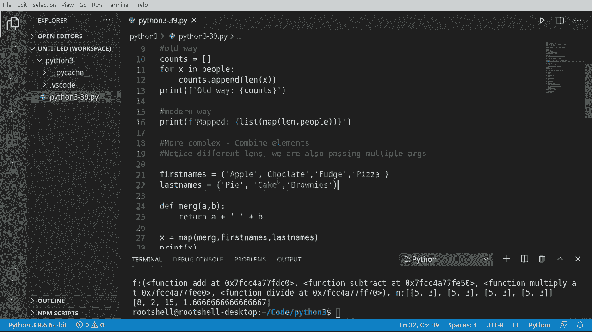

# 【双语字幕+资料下载】Python 3全系列基础教程，全程代码演示&讲解！10小时视频42节，保证你能掌握Python！快来一起跟着视频敲代码~＜快速入门系列＞ - P39：39）Map函数 - ShowMeAI - BV1yg411c7Nw

Welcome back everyone， this is Brian， and we're going to talk about the map function。 specifically this is looping without actually having a loop。And under the hood maps a function call to a collection of items and it looks like this map function to whatever collection we have。So for example， we could have a list and each item in that list we could pass it to the function。

 let's dive in and take a look。

Let's start off with some basic usage， so we're going to get a list of people。And in that list of people。Matt Brian Tammy Marcus， we want to pass this to a function。And count the length of each item。And we want to get another list that has those links。 So we're going to cover an old way。And a modern way。So let's do the old way first。

 So the old way would be something like。Counts。Equals and we're just going to make a blank list and then or x in。结播。Then we would just want to go something like。Counce do append。 prettyty simple what we're doing here。 which we say Ly。And we want to get the length of each element。Then when we're done， we just want to print it out。

 so we're going to say print。Allold way。And let's just go ahead and print that out。Pretty simple。 pretty easy to understand， works exactly the way you would think it would。 And it's a little wordy。 Now， the modern way is going to use the map function。And we're going to shorten this。 Remember when I said at the very beginning of this， as code becomes more complex。

 what we have to write actually becomes shorter and harder to understand。 This is a great example。 So I'm actually going to start off with print。And then we're going to format that。Same mapped。I want to actually capitalize that just so it stands out。Now we're going to say list。 which is literally going to convert this into a list， going to list through every element。

 We're going called the map function。And inside the map function， we're going to call L。年的。Table。What this looks crazy， Let's run this。Sure enough， it works as expected。 So what's going on under the hood here is we're saying， okay。Call print。 and then we're going to list map。 Now what map's going to do is it's going to take all of these people right here。

And shove it into a function。 In this case， we're using the built in length function or L。 which is going to get the size。 so essentially we're replacing all of this code in one line。It's very， very cool。The main takeaway from this little segment， though。 is we're taking a collection of items and going through each and every single item and sending it to that function one at a time。

We're getting back a map object， so we have to convert that to a list。

Let's go deeper still into complexity land， and we're going to make this a little bit more complex。 We're going to combine elements。And I put some notes， notice different links。 and we are also passing multiple arguments。 So what we're going to do here。 and I've got some stuff already queued up， ready to paste。First names and last names。

 we have two tuples。And we're going to combine apple and pie， chocolate and cake， fudge and brownies。 and u oh， notice how pizza does not have something we can partner it up with。We're going to examine how this works and how it behaves。 We're also going to define our own functions。 Some must say de merge and in merge we're going to have an A and a B。

Which is just simply going to return。诶？😊，Plus。Some sort of space。Plus B very simple function。That's all this needs to do。 So our function call just simply needs to return something。 and whatever we return is going to get added to the map object。So let's go ahead and say x equal map。And we're going to use our merge function that we just wrote the guy right here。

Now we're going to merge。The first names and of the last names。So really， when we look at this。 it should actually be something like this args。 So we can have zero or more arguments。 so I should say one or more arguments。 So that's why they do as initially。So we're going to map our merge function to these two arguments， first names and last names。

 which are these tuples right here。Let's go ahead and print out X and see what we get back。This is where newbies often get tripped up。 They go what is this， We have a map object。Well。 how do we work with this map object， The thing is you don't want to work with it directly。 what you're going to want to do is actually convert it into something that we can work with。

So we're going to say print。List。And we're going to just simply list out X。 And what this is going to do is it's going to go into the map object and say。 give me every single item。 and then it's going to convert it or cast it into a list that we can then use。For example， apple space pie， chocolate space cake， fudge space brownies。

 noticeice these are individual items that have been merged together， and there is no pizza。 so because it didn't have anything we could partner it up。 it just failed out silently and we don't have to worry about it crashing our program。Okay。 I'm just going to say if you're a newbie and you've skipped any of the videos。

 you're about to have a bad time， so we're going to do multiple functions。 meaning we're going to combine functions and call multiple functions in one map call。And if you have not been。Following along， you are about to have a really confusing time。So I'm going to paye some functions， add， subtract， multiply and divide， they're very simple。Add ads。

 subtract， subtracts， multily multiplies and divide well， shockingly divides。I don't want these to be complex because I don't want to focus on the mathematics here。 We are going to make another function， though， death。屌我。It's going to have funk。And。Noumb。Bunk is going to be a function and numb is going to be a list of numbers。And we are going to return。

The function call。With。U0。And nu1。So all we're doing is we're saying get the first element of the list and get the second element of the list。So matching this up， basically， add。Numb 0， nu 1。 So it would be something like bad nu 0。And then nu1， something like that。 And then subtract， multiply and divide and so on。In production level apps you're going to want to make sure that this actually has two elements and that they're the right data types。

 ettera and so forth， but I don't want to focus on the complexity of any of this。 I just want to show you this is the basic structure we're going to use。Now we're going to make a list， or actually， in this case， a tuple。Of unctions。We're going to have addtract。Multiply。And divide。And these are the functions we have pasted earlier。

Remember， functions in Python are upper objects so we can treat them as variables as objects。So I'm just making a tuple filled with those functions。Now I'm going to make some values。 and I'm going to just， this going to be a little confusing。We haven't done this before。 We're going to put a list inside of a list and almost a 5 comma 3。If that looks confusing。

It's because we have a list inside of a list。And this is the one and only element in that list。 It could be something like。So you would have 1，2，3，4 items in this one list。 So， yes。 you can put lists and stuff like that inside of lists。 Very cool。 how you can do that。 We haven't really touched on that complexity yet。 But today is that day。

 Now I'm going to make our numbers。😊，And I'm going to take values。Invert it into a list。That is going to be multiplied by the link。Of our functions。So basically。 I'm going to take this guy right here。And say， how many functions do we have 1，2，3，4？

Add subtract multiply and divide， and I'm going to multiply it by that number。From there。Just hit the pause button。 Let's print out what we have just to make sure what we're doing actually makes some type of logical sense。So we're going to print out F， those are our functions。And then let's go ahead and print out N。Just so we can see what this is。Save run。 Okay， so F is function a， function subtract。

 function multiply and function divide。 And you can see the memory locations of each one of those。 Now we have our list of data here。 This is list values time the length， and it is 1，2。3。Or。This is important because if you scroll up and you remember when we were combining first and last names。 if it doesn't have a matching partner， it will just skip over it silently。

 so we want to make sure that we have a list for each and every function call， so this would be add。Subtract， multiply， and divide。And that's where we're getting this non zero number one。 so zero in this case would be five and one would be three。Hopefully， that makes sense。 If not。 you may need to rewatch that。 I try to explain it the best I can。

 But if you've been skipping videos or haven't been watching them all the way。 that may make absolutely no sense。 So now we're going to say M equals map。We're going to call the map function， and we're going to map do all to F and N。What is this witchcraft？ What did we just do here so。Basically。

 what we're just saying is map the do all function to our list of functions and the data we want to put on each function is。 well， this big list of lists， so each function gets its own little list of data。Wow。 and it's going to return back a map object。 So we're just going to go ahead and print out。And we want to convert that。Map object to a list。Go ahead save run。

 and the result is going to be 8 to 15 and 1。6。So what is going on here？Well。5。And 3 is 8，5-3 is 2。5 times 3 is 15， and 5 divided by 3 is 1。6 Big long number here。But this is really， really cool。 We've just basically said。Do a ton of functions in one little call and gave it the information each function is going to use。So super quick recap before we close this video down， the mat function is very。

 very powerful Once you wrap your head around it， you're going to have a function and then you have some sort of iterable and you can have multiple iterables。 but they have to line up in order for them to call。😊，For example， first names and last names。

 we just simply didn't have anything that lined up with pizza so there was no like deep dish pizza or anything like that。 but we had apple pie， chocolate cake， fudge brownies。