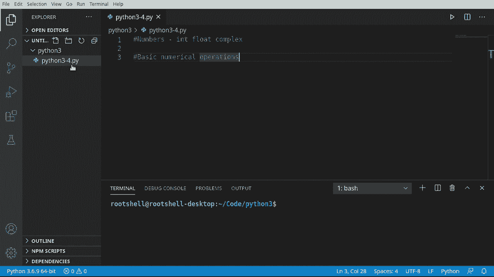
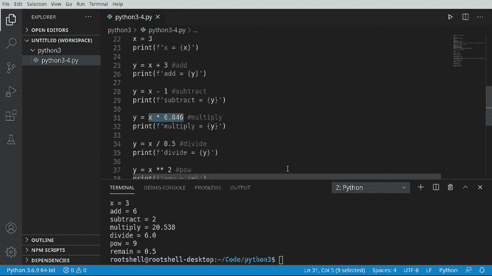

# 【双语字幕+资料下载】Python 3全系列基础教程，全程代码演示&讲解！10小时视频42节，保证你能掌握Python！快来一起跟着视频敲代码~＜快速入门系列＞ - P4：4）Python数字和基本数字运算 - ShowMeAI - BV1yg411c7Nw

Hello again， everyone。 This is Brian。 We're going to continue our journey into Python 3。This video。 we're going to cover numbers， the number data type， specifically the int。The float and the complex data types。 And we're going to cover some basic numerical operations。 For example， addition subtraction， things like that。 Whatever IE you're using。

 go ahead and make a blank file。 I've got mine titled Python 34 Py。 The name's not important at this point。 You just need a blank file to start with。

Last video， we talked about the bull。 this video we're going to talk about numbers。 I know everybody loves numbers。 So let's go ahead and start off with the integer type。And we're going to make a simple variable here。 and I'm going to call this Ival。 and let's give it a value of 34。 really doesn't matter what value we give it， though。Say， print and。

We're just going to print something out here。There we go。And let's call this Ival equals。And we just want to print that value out。Just to see what this looks like， Dave run。 this is pretty basic。 You pretty much guess what it's going to do。 It's going to say the eyeval equals 34。Very， very simple， Not super hard to wrap your head around。

 Now， we're going to take this through the magic of copy and paste here。And we're going to make a float。Loat sounds really good right about now like a ripier float or something like that。 But we're talking about numbers， not ripier floats。 unfortunately。 So we're going to make a floating point value。 and it's going to be 3。14。Sa run， on the surface。

 what we're doing looks very rudimentary， but under the hood。 Python' is doing all of this work for us。 We don't have to worry about what's actually going on。 So。 for example， there's a fundamental difference between an integer and a floating point number。 There's a lot of precision that happens in the background。

 and we don't have to even think about that。 Python takes care of it for us。I'm going to import。The cis module and what this is going to do is allow us to work with other people's code and we're going to talk about that in depth in another video。 but just right now take a huge leap of faith that we're using someone else's code。 This is actually part of Python， but we have to import it。 It's a little confusing Again。

 we'll talk about it in depth in another video。Usually it's at the top of the file。 we're just going to put it right here。But we want to be able to get some extra information。 some I must say cis do。Loat info and let's go ahead and copy and paste some notes in here just so we can see what's going on。Go'm to grab this in。Wila put that right there。That is the official Python documents。

 If you want to go out， look at it and see exactly what's going on。 we can run it and see under the hood。 This is what Python's really keeping track of when it talks about floats。 So we have the system float info。You have a max， which is a really， really， really large number。 and you can also have a max E X P and you could dive and all this stuff。 Now。

 if you're into numbers of math， you probably know what all this is。 But us mere mortals。 usually don't care。 Basically， if you have a number that has a decimal point。 you're going to use a float。 Otherwise， you'll use an int。Now we're going to talk about another one。And it's called complex， and it is well， complex。Now， when I say complex。

 actually Python makes it super simple to work with， but the data type itself under the hood。You guessed it is not super simple， it is complex， and it looks something like this。 a complex number is made up of two numbers， a real number and an imaginary number。Kind of sounds a little messed up。 but let's take a look。 So we're going to say C v equals。

And let's say，3。Plus，6 J giant leap of faith that I know what I'm doing there。What is that really going to do， what it's going to make that complex number？

And let's grab the name here。Cval， Cval， and let's print it out。Doesn't really look like we did a whole lot， it's just saying Cval equals 3 plus 6 J exactly what I typed。Let's split this apart here。What we're going to do is show an alternate way of creating a complex value。 and you can do this with Floni， but it really drives the point home with complex。

So I'm going to say complex。And notice how it wants， they float。In the image。 let's go ahead and give em bow。 So must say 5，3。And let's go ahead。 and I'm going to just through the magic。Goy and paste here。Grab this。Let's say。Clls that。 Now I want to print out。The real。And we want to go ahead and grab this。Opppy paste。

 and we want the second part of that number just so we can see what it is。Go ahead and save and run。So now you can see the complex number is made up of two parts and it actually would probably be better if I。Made it the way it was supposed to be。 There we go， real and imaginary。Two different parts。 that's what makes that a complex number。So the fundamental point we're driving home here is that numbers are very fundamental and simple data types。

 but they can get very complex very quickly， Python strips a lot of that complexity out。If you're coming from Python 2 or another language。 you're going to note this seems overly simplistic and it is by design。 Python 3 pretty much revamped the number system and did away with a lot of the old headaches。

 so it's super simple。General rule of thumbh。No decimal point， use an int， decimal point。 use a float。 If you need something else， use complex。 and there are others that we will cover in future videos， but this should get us going for now。Okay。 let's talk about basic numerical operations now don't worry， we're not going to get super complex。

 we're talking basics。Python can do some really complex stuff。 For example， you can do Calc， trig。 advanced eligible， pretty much any type of math。 you can imagine。 Pyth's actually used in scientific computations， and it can do things like artificial intelligence。 We are starting at the basics。 we need to talk about the basics。I'm going to say x equals 3。

 which is an integer。Now， I'm going to print this out。And I'm going to just grab the old。Print function here。 save us just a smidge at time。Nothing super fancy about that。 But what we're going to do now is we're going to make another variable。 Let's call it Y。And we're going to say y is equal to x plus 3。So what have we really done here。

 we've done basic addition。Let's go ahead and grab this。And let's call this add。 And this is going to be y。 And that's going to be our fundamental pattern here where we're going to do something。 And then we're going to just display the results。 And I'm going to say。Add that way we know what we're doing。Save and run and sure enough add is equal to 6 because x is 3。

 and we're adding 3，3 plus 3 is 6。Again， fundamentals。 Now。 we're going to start speeding this up because I think you're probably smart enough to understand basic math。 And we're just going to grab this。 And you guessed it， start plowing through this。 So if we can add。 we can also subtract。Let's go ahead and。Say we want to -1。Run， and you can see。

3 minus1 is actually two， so that works。Exactly the way you would expect it to。So I multiply。And we are going to say， hm。This is something you really can't do very easily in other languages。 Python makes it just beautifully simple。 So we're going to say6 point。8ight。4 6。Doesn't really matter what number we do。 just as long as we have that。 Now， if you look， X is an int。

 But what are we doing， We're multiplying it by a float。So what's going to happen under the hood here is Python's going to determine what the in value type actually is。 is it going to become an integer or is it become a afloat？

You notice how it's not really telling us when we hover over Inence。 and that's because the interpreter hasn't done the work yet， so it simply doesn't know。So let's call this multiply and the end result is 20。538， so that is a floating point number。Now we're going to do some division。Sra this。And we want to say x is going to be divided by 0。5。

Again， it's doing all of that hard number crunching in the background。 What it's actually doing is called casting。 And when you think of casting。 think of like a wizard waving a magic wand， converting something from one data type to another。 that is happening automatically for us。 We don't have to think about it。Now。

 it's not always going to happen automatically for us， but in this specific case it is。 and it's super， super convenient。Don't worry， we're going to talk about casting in depth in another video right now。 we're still at the fundamentals。 And let's play around a little bit。 We're going to make a power of。 So we're going to say。That is the power。So3 the power of  two is 9 and。One more。

 just to play around here。Let's do the remainder。 I think this is called the modulus operator。And we're going to get this。You don't know what this is。 This is kind of like the opposite。 I shouldn't say the opposite。 It's kind of like taking division and getting the remainder of what's out of that value。 It's kind of weird。 So let's take a look here。So 0。5。

 So what we're doing here is we're starting with x is 3。And we're getting the remainder of 2。5。 which is actually 0。5。Very simple， very easy to use。 So the fundamental concept we're trying to drive home here is there are some number data types int float and complex。 and you can do some basic numerical operations。 Python makes those numerical operations very simple because it handles all the complexity。

Under the hood for us。 And we don't even have to think about it。