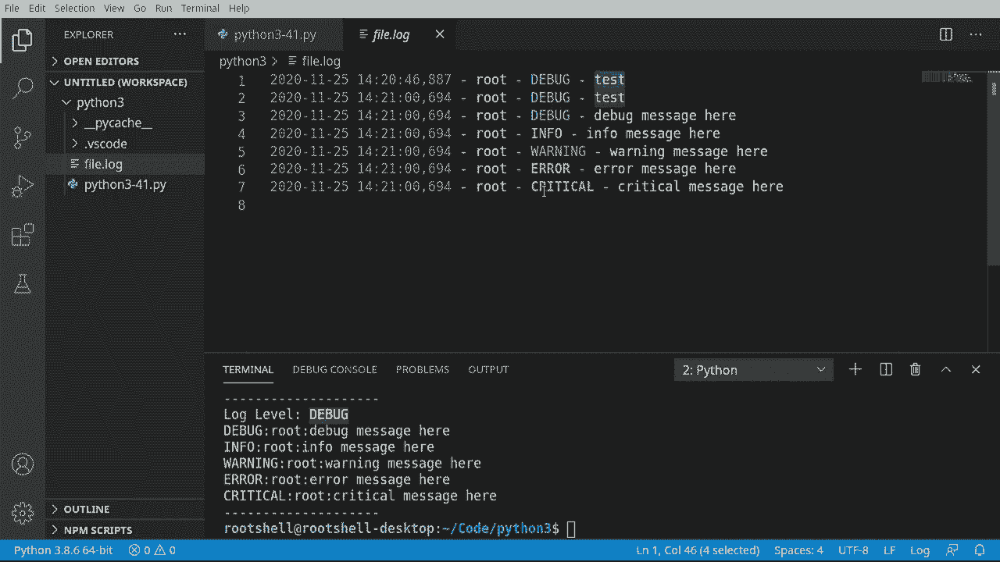

# 【双语字幕+资料下载】Python 3全系列基础教程，全程代码演示&讲解！10小时视频42节，保证你能掌握Python！快来一起跟着视频敲代码~＜快速入门系列＞ - P41：41）日志基础 - ShowMeAI - BV1yg411c7Nw

Welcome back， everyone。 My name is Brian。 And in this video， we're to talk about logging basics。 Now。 what is logging。 We're not cutting down trees or anything。 So so far。 we've been using the handy print function， but logging is way， way cooler than printing。 And it is kind of the de facto， but we really haven't been able to have this conversation because we haven't covered all the technology we need to to build up to this conversation。

😊，So what makes logging cooler than printing Well printing just prints something out on the screen。 but logging， you can have levels。 for example， you can say it's a debug message。 info warning error critical and some of these should be selfexplanatory。 debug is just for you。 the developer， you want to know what's happening。 infofo is just hey， something happened。

 you may want the user to see this you may not War is hey。 something bad may happen if this continues or if it's not fixed。Arrir is pretty self explanatory and critical is worse than error， so。These are the different levels。To start off with。We are going to import。The logging module。

You could also do something like this from。Lologging。Import。 and we're going to import the root logger。The reason why I add this is you need to understand that logging by default has a root logger and when I say root。 I mean it's the top level， you can define other loggers， custom loggers。 but we're going to be working with the top level logger。Okay。

 so I'm going to just comment this out just so people don't get confused about which one we're working with。 we're just importing the entire module here。And I'm going to work with basic logging。 notice how they do not get displayed by default。 This is the main takeaway of this segment。 This is going to be super confusing if you don't pay attention to that。

So I'm going to define a function。 We're going to use this over and over again。 It's going to just simply be test。And we're going to print some lines。And let's just do 20 of them。 Why not。And then I'm going to grab that。Give it the good old copy and paste。That way。 all of this is going to be separated out when we print it。Now， from here。We want to do a few things。

 I want to say。Logging dot。And we want to debug。Now this is a little confusing because we're not actually debug anything we're saying logging。 make a debug message， or more specifically， we're going to message something with the severity of debug on the root logger。

Remember， we're talking about levels of logging here。Dbug being the lowest critical meaning hey。 your programs just exploded and here's what happened。So we're going to say。The bug message here。And then we can take the same pattern and just you guessed it， copy and paste time。谁。林方。Now。 informational are， well， is that information。 It's not really anything super important。 It's just。

 hey， the file was changed or something modified warning。 However。 this is when things are starting to get a little serious。 You ever give like your kid a warning。 hey， you better go clean your room or else。Don't condone beating your child。 but sometimes you just got to make them clean the room。 So we've got debug info warning。

 And as we go further， further， this numbers changing。 There's a number in the background that we're going to really review later on。Now。 what's higher than a warning is， you guessed it an error。We talked about air handling and air conditions and things like that。

 And that's exactly what we're doing here。 We're saying， hey， some sort of error happened。 but using this will not throw an error。 We're just logging that an error occurred。And last。 but certainly not least， is critical。When you hear the word critical in computers。You need to believe that it is critical， meaning everything you know has just ceased to exist。

 and you need to focus on this， or everything you know has just disappeared because it has died。 That's basically what critical means in Comp lingo。Now。 we're just going to call this test function and see what happens。Notice how they do not all get displayed by default。 Let's go ahead and run。

All we see is warning erroring critical， but where's debug in info？To really understand this。 we need to set the level。 And when I talk about level。 we're talking about this debug info warning Aaron critical Under the hood。 each one of these has a number assigned to each level。

 Think of it like levels of a building starting at the bottom， going all the way to the top。Most important。Two least important。Okay， so we're going to say a level。Equals。 and I want to go logging。 We're going to use the logging module。 We're going to get the level name。 What this is going to do is convert that number in the background to a string representation。 But。

 of course， it's not that straightforward。 We now have to go logging。Yet， log Er。And what this will do is get the root logger， which ironically we're already working with。But the thing is， you can specify a name so you can have different types of loggers that do different things。 We're just going to get the root logger。And then we're going to say gi。Effective level。

Gett effective level is going to return what level of logging we're currently working with here。From here， we're just going to print that out。 so to it print。F。And we'll say a log level。All right。 so our log level is currently at warning。What we're going to look at the next section is how to specify that level。But what I really want to talk about is。What the level really means， what it means is。Warning。

 meaning anything more critical。Is going to be included， so we're going to do not just warnings。 but also errors and critical。But we don't really care about debug and info。 and this is one of the little gotchas about the logging class by default is people will start with this and start doing debug messages and then nothing happens and they go。 well， why and this is why we need to set the level。

Now that we understand the concept of logging levels。Let's look at how we can manipulate them we're going to get and set the logging levels。 This allows really for filtering。And the reason why you want to do this is in a typical application。 you're going to have a lot of information whipping around and you don't want to see all of that on the screen at once。

 you only want to see what's important to you。So first thing we're going to do here is we're going to。Get the root logger。 Now， the root logger is included by default。 but I want to actually go out and get it just to show you that we are getting an object。So I'm going to say root log。Equals logger， or I sorry， logging yet logger。

 See how that's a little confusing there。 Now， if you had multiple loggers。 you would have the name of the individual logger。 if you don't have a name。 its just the root or the main logger here。From here。We're going to just。Rrab this because this is just horrible looking。I must say print。And we're going to print the level。

want paste that out here。So we're saying logging。Yet， level name。This is a little misleading because we're not working with the main logger。 We're working with the logging modules。 we're saying the module。Should get the level name。 Now we want to get that from our root logger。 so effectively， instead of saying this。

We can replace with that。So。Logging module， get level name of whatever log we're working with。 get the effective level and under the hood， the level is just a number。Let's go ahead and run this。So level warning， I'm going to actually put something in there to split that up。So we know we're at the warning level and we've known that all along。

 but now we're going to set it to debug。Now， what does it mean said it to debug。Well。 it means we're going to include debug and anything more critical and sense。Up at the top here。 debug is the top of the chain。Anything's going to be included， not just debug。So we're going to say root log。Set level。And then we're going to say the logging module。E bug。

Then we can just call our handy test function that has all those。Beautiful little loggers going on。And run， sure enough now we're seeing the debug info warning erroring critical。So it is working as expected。 I'm going to grab this。And we can very quickly start changing the level as needed。 Some it change is too critical only。

Remember， critical is well， Cri， it means like something has exploded or is about to。And we're going to run this， and you can see logging level is now critical。There we go。 it's pretty easy to understand here what's going on。What you need to understand though。 is that the levels do not make those magically disappear。

 just means that we are not logging them or capturing them。 those messages are still being fired off。Okay， now let's just do it one more。And I want to set this to warning。Right back where we were。In critical root。Critical message here， you might be wondering what this root is， what is this root？

Well， that is the actual logger we're working with。 That's why I've been calling this the root logger because we're working with the root logger。 If we had a different logger， it would be the name of the logger right there。It's actually pretty elegant the way this works and you can flip these around as you need to。

 so if you're getting a lot of verbose information and you only want to see what's critical。 you can set it to critical。Then you're not getting warnings， so then you set it a warning。 and now you're getting the appropriate level of information you need to see。

Now， as cool as this is， what would be cooler is if we could log this directly to a file。 So as events happen， it gets dumped directly into a file。 And that's exactly what we're going to do。 But I want to show you something that will just infuriate you time and time again。😊。If you go out to Google and you type in how to use the logger。

You're going to get something that looks like this logging that basic config， setting to a file name。 everybody gets all super excited。 file mode， right， Yes， this is going to work。 You can even define the format。 This is super cool。 So we're going to say the level in the message。 and then we're going to say level equalal logging dot debug。😊，Notice what this is doing。

 this is setting the config it's setting some handlers and all this fun stuff。So people get super。 super excited。And they do something like this。 Loging dot Ebu。And we're going to send a debug of just hello。So in theory， when we run this。Logging is going to call debug with the message of Hello is going to create the file app。

txt in write mode。And then it's going to write this out in this format。 And we know that because we're setting logging debug so。Rm roll。Nothing happened。 That's right。 Absolutely， nothing happened。So then people get very frustrated and they do something like Google Why is logging not logging。 that's literally one of the most popular Google searches for this。The reason why is very simple。

 basic config will not work if we've already configured the logger。 it needs to be done before we take any action and so because we've already been working with the root logger and we've already configured it。 basic config does nothing。That's right。 It does absolutely nothing。 is so frustrating。So I'm just going to put in some notes。And then I'm going to comment these out。

 We're going to show you how to get around that。 Now， if this was actually the first line。 like if we had this way up here。It would work beautifully， but because we've done all this。 it's just simply not going to work。So we need to get a handler。I'm going to say logging dot。 and we want a file handler。And all a handler does is it says how to handle the log information as it come in。

 I must say file that log。namee it whatever you want really doesn't matter。 Now we want to define a formatter for that handler。And I'm going to say formater。And you know。 these are constructors， so yes， under the hood， we're actually creating classes。Now。 this is where I'm going to get a little copy and paste happy just because we'll be here all day watching me try to type this out。

 What we're going to do is we're going to take the time， string representation。 the name the level and the message。 If you want what name is it's the logger name。 So it's going to say time， logger name， the level and the actual message。And you can define whatever formatting you want， the guide is out in the official documentation for this。

Point being once we have a handler and a formatter， we're good to go。From here， we can say。Handler dot set。For matterer。And that's going to tell the handler how to format the information it is handling。Then we can simply say root。And we're going to say our root log。t add handler。Now。 what we can do is we can go in and say something like， let me get this back up to debug level。

Now we can set that to logging debug。Then we can say。Root log， dot Ebug。As。Save run。And sure enough。 our file out was created， and it is in the format that we wanted it in。 This is extremely cool。 and we can even call our test function。And because our log levels at debug and because we have set the handler in the format。 we can go back out to our file log and there is all information it is beautifully formatted。

 So we have the date time， we have the logger， we have the level， we have the message。 and you can see how it even color codes it for us。 This is just super impressive。