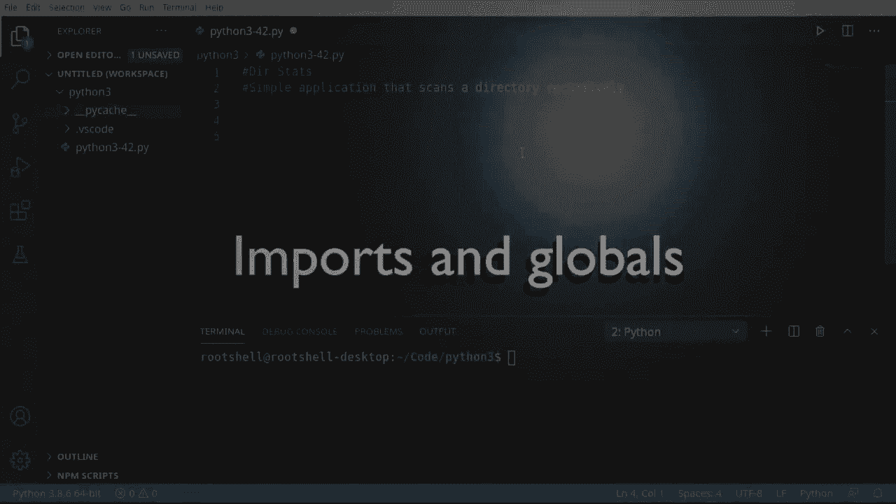
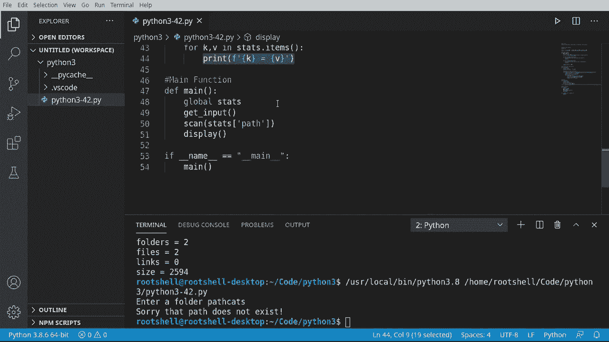

# 【双语字幕+资料下载】Python 3全系列基础教程，全程代码演示&讲解！10小时视频42节，保证你能掌握Python！快来一起跟着视频敲代码~＜快速入门系列＞ - P42：42）构建简单的应用程序：目录统计 - ShowMeAI - BV1yg411c7Nw

Welcome back， everyone。 My name is Brian， and we're going to make a simple application called D Stats。 And what this thing's going to do is it's going to scan a directory recursively。 You're new to programming。 You're probably going what does that even mean recursively。 Well。 let's say you have a directory。 and that has subfolders。

 and those folders have subfolds and so on and so on and so on。 And you have this nice tree structure similar to how we see over here。😊。We want to be able to scan all the way through that tree。

Let's take a look at a simple diagram here and don't worry I'm going to zoom in。 but we have a start in an end and our overall logic is going to be very linear。 very easy to understand， let's go ahead and zoom in。So we're going to start。 we're going to go to our main function， we're going to get some user input。

 and we're going to validate that that actually exists as a folder somewhere out on the operating system。If it does not， we're going to jump right to finished。 However， if it is actually in existence。 we're going to go into a for loop。 and this is the recursive bit right here。We're going to say for each item。If it has sub items。

 go back and scan those items and so on and so on all the way down the directory tree。 If we run out of items， then we're done。 And we're just going to display the results to the inducer。Pretty simple， pretty easy to understand logic。

Let's dive in and take a look。

Okay， first things first， we want to do some imports and make a global variable。 So our import。 we're just going to simply use O。 Now， OS in itself。 this module really allows us to deep dive into the operating system and get some details。 We're going to use this to get Well， the folder structure along with the file sizes and things of that nature。

 So let's go ahead and now let's make a dictionary。I'm going to call the stats。And we want a very simple dictionary here， I must say path equals personally。 I'm not a fan of global variables， although they do have their usage。 and I believe this is one of those times。So we're going to say path and then holds。Fileles。

And in case you're wondering， really， all this is going to do is just hold the metrics that we're going to scan。Say links。And then the total size in bys。Go ahead and run this。 just make sure we didn't misspell anything， we got no errors， so we're good to go。

Okay。Starting point， we need to get the user input。 We have to have something to scan。 So we're going say depth。It input。This function is going to be very simple。 but there is a bit of complexity we got to explain a little bit here。 So first thing we want to do is use this global variable。So we need to use the global keyword。

 So global stats。 If we forget to use the global keyword， we're now making a new variable。 and then Python will。Depending on the version of Python。 selectively choose to use the global variable or create a brand new variable inside of the function。So we want to tell Python use the global variable from here， we're going to get the user input。

 So we' going to say RE equals， and we're going to do this a little bit different instead of just saying input and then get the input。We want to convert that to a path all in one line。 So someone going say O S dot path。When we want the absolute path， now we want to get the user input。And we're just going to simply do this all in one line。

 we're going to say take the user input and convert it to the absolute path。Very cool how that works now that we've got this little guy here。We can just check to see if it actually exists。And we're going to use OS。path。exist。Notice how we're saying if not， meaning if it does not exist if this is going to return faults。

Then we want to take some sort of action。And in this case， I'm just going to let the user know， hey。 you screwed up。And we can't really move forward with this program， so。Sorry。Back path。Does not exist。And then I'm going to exit our little application here now if you don't know what an exit code is。Typically， when you run an application， it will run do its thing and then exit。And when it exits。

 it tells the operating system what happened。0 means that there were no problems。 This worked as intended。 But clearly， that's not the case。 So we're going to give it an exit code of one。And this is really up to you as the developer to determine what these exit codes are。 it could be one， could be 99，91， whatever we wanted， we're just going to do one。

That tells the operating system this did not work as expected and if we have an end user they can say。 oh， the program gave me exit code one and you can say，"U， yep， you gave me the wrong path。O。Now。 we want to say if。Not O S path。 And we want to make sure this is a directory。 because sometimes our users are not that smart and they're going to hand us a file or something like that。

 So we're going to say sorry， that path。Is not pat directory。And then let's say exit code2。 and we could define whatever we wanted。Now that we have reached this point。 we know that we have a valid path。And it exists and it is a directory。 so we're going to update our global variable and in here we have half。

 so that's what we're going to update here。And to say stats。Half equals。So we're just setting the dictionary value for path to whatever folder they entered。Very simple。 very easy to understand logic。Now that we've got the user input and we know what path they want to scan。 we want to scan that path recursively。 and we're going to do this in a function。

 So we're going to say de scan。Give it a path。And again。 we want to use that global variable so we can say global。Thats。I like that word。 stats reminds me of like a doctor or something。 If we want to be super nice。 we can actually print out what we're doing here。 So we're going to say scanning。

And then whatever our path is。Now you may be wondering why we would use a variable when the path is actually in stats。And the reason being is we're going to do this recursively。 meaning this path variable right here is going to change over time where the path inside of our dictionary is the root。So this could actually be a folder of a folder of a folder， something like that。

 So that's why just in case you're wondering。Now comes the fancy bit here。 We're going to use something called O S dot walk。 And I want to just preface this with there are a million different ways to do this。 We're just using one way。 So I'm going to actually put millions。Of ways to do this。And I'm sure people down in the comments will go， well， you shouldn't use OSW。

 you should use this other way or Gob or whatever， we're just going to use OS walk because it's simple to understand。So we're going to say four。Walk is going to return three values， it's going to say root。Ds。And files。So root is obviously the root D is a list of directory and files are a list of files。 I love how this is just super self explanatory。So。That is going to be in。O， S dot walk。

And this is why I like using walk because it's super simple to use。 It's super simple to understand。 We're going to scan that path if I can spell path correctly。And then I want to say on error。We're going to set this to none。 We have to do this because there's going to be some folders you just simply won't have access to like you'll get an access denied or you'll have some sort of weird hard drive error or something you don't want to crash your program。

 So we're going to say on error equals none。 We could set that to a function or whatever we wanted to do。 But we're just going to say none。 So take no action。And then follow links。We're going to set that to alts。What this means is if you had a link。Think of it like a short cut that points somewhere else。 If that was set to true。

You could scan way outside。 So like if you had a folder one。To comment this out。 let's say you had folder  one and inside a folder one， there was a link。That pointed to Boer 3。You kind of see what's going on here。Azure scanning folder 1。If you're following that link。 you're going to jump to a completely different folder， even though say folder 3。

Is at the root level like up here， so we don't want to do that。 want to make sure that we're not following those links。All right， From here。 We're going to say stats。And we want to update our metrics here。 So we want to know the folders。And the folders are going to be plus equals， and we want the link。Of， you guessed it， yours。

So this is going to be a list。And we want to get the length or the number of items in that list。 I don't remember if it's actually a list or tuple。 but Telec is telling me it's a list and files will be a list as well。List your tus I don't care。 we're just going to get the length of it now we're going to say files。

 we're going to update the files metric as well。You got to be a little bit careful that it is folders。 filess， we're spelling those correctly， otherwise we're actually adding a different key altogether。Now， from here。What we want to do is say。Or。Name in files。 And we're going to go through and scan each one of these files independently。

We're going to say full name。Equals O dot。Half。At join。 And what this is going to do is allow us to join the root。Or the folder name with the actual file name。 So these are going to be two different things。 This will be like the actual path， and this will just be the name without the directory name attached to it。

So this could be something like。S dot T X T， not the actual full path。 So we want to make sure that we are joining those together。 and O path join does exactly that joins two or more path name components。All right。Takes care of a lot of the headache for us， so we don't have to worry about it。From there。

 let's go ahead and get a size。 And we're going to say O， S dot path。You see how we're using O S quite a bit， especially path。 So O S that path， and we want to get size。This is going to get the size of that file， and we're going to use the full path name rather than just the name。Once we've got that size， we can go in here and we can say stats。And jump up。

 let's see what key we used here， size。So we can just go。Size。And let's increment that。So。Starting at the top， we're going to scan a path and we're going to go ahead and just keep scanning that path over and over and over and over and over。 This is what I love about this。Now， one thing you should know is this is a bit misleading。 we could have actually have done our stats if we wanted to。

 but I wanted the ability to use this somewhere else if we needed to by allowing us to jump into that path。 You'll see what I mean here in a little bit。

Now that we have scanned recursively， we just simply want to display to the user what we've done so far。 And this would actually be right before the program exits。 So we're going to say depth display。 And again， there's a bunch of different ways we could have done this。Let's go ahead and lowercase that。And really， all we want to do is just print out our dictionary。

 That's why I put everything in a dictionary because it's nice neat and compact。 So we're going to say global stats。 now you know what the global keyword does。 We're going to print word results。And then we're going to print out the key value pairs in the dictionary。 so I'm going say four。Acom a v。也了。That's。还有个因思。That's going to get us the key value pairs。

 And then it's just very， very simple from here， rent。And we're going to format that。And I want to print the key。With an equal sign， and then the value。Very， very simple function。 but it's going to look really elegant on the screen。Okay， it's time to wrap things up here。 let's do our main function so。Let's go ahead and say。De mean。And some Python nus are going to say。

 do we actually need to make a main function， I mean， we could， technically， if we wanted to。Do something like if name equals。And we want to say underscore， underscore main。And then we could do our code here。You absolutely could。 I don't like doing this。 I like putting everything right a nice neat function in case I want to swap out functions later Then I'm not copying and pasting and doing a bunch of other stuff。

 So instead I'll just。Actually call our main function right there。Now remember。 what we're doing here is we're checking to see how this file this individual script was run if it's run directly by the Python interpreter。 its name is going to be underscore， underscore main underscore underscore and we've talked about the underscore in the past。 but these are special characters that Python uses to determine， hey， this is internal to Python。

So if Python runs it， the name is going to be main。 if it's anything else that means another script is calling this。 and I don't want to fire off this main function instead， the script。 the calling script may want to call display or scan。 which is why I left that there instead of doing this global。man， lots of explaining。 but I think you wrap your head around it now。 So once we've got this far。We can say， global。Thats。And actually， I don't need those。 So we're going to tell it， hey， we want to use the global variable。From here， we're going to go ahead and get the user input。

We could have done this a little differently。 We could have had get input return of value。 but instead， I wanted everything encapsulated in there。 That way， if some other function called it。 it's all baked right into our global variable。Little bit of a design choice。 And you may have to tweak that depending on your needs。 Now， let's go ahead and scan。

And notice how we have a path now we have to feed this， and we can just say stats。Half。We're getting the path。From the git input， And we could very easily hard code that into the app if we wanted to。And then finally， let's go ahead and display the end result to the user。 And we can kind of condense this down a little bit， make a little easier on the eyes。

 So the main logic is very simple。We're going to use our global variable，'re going to get the input。 we're going to scan that path and then display the results。 let's go ahead and fire this thing off and see what happens。Al right， so enter a folder path。 if I want to just scan my current path， I can just press a dot because remember dot is the current directory where dot dot is the parent directory。

And it says sure enough our current directory is this guy right here， Python 3。 there are two folders， two files， zero length， and the total size in bytes is 2594。All right。 so this is a pretty beefy little program that we've got here so far， it's simple。 it's easy to understand and use but at the same time it's doing some pretty complex logic for beginner land here。

The main takeaways from this is， yes， you can use a global variable。 although it may not always be the best designed choice。Always， always。 always validate the user input， you never want to just trust the end user。I mean， for example。 what if I ran this and they said cats。Sorry， that path does not exist。

 What if we just tried scanning for cats， You know， your program's going to crash。Now， scan。 the major takeaway from this is there are millions of different ways of doing this。 I used OS S walk， Use what works for you。 I personally prefer OS walk because it allows me to easily break out here if I need to because it's in a nice neat for loop。So if I wanted to go so many levels deep， I could bake that logic again。

Display we're pretty much just using the directory items to get the key value pairs and then print them out。 And then we covered our naming convention internal to Python。