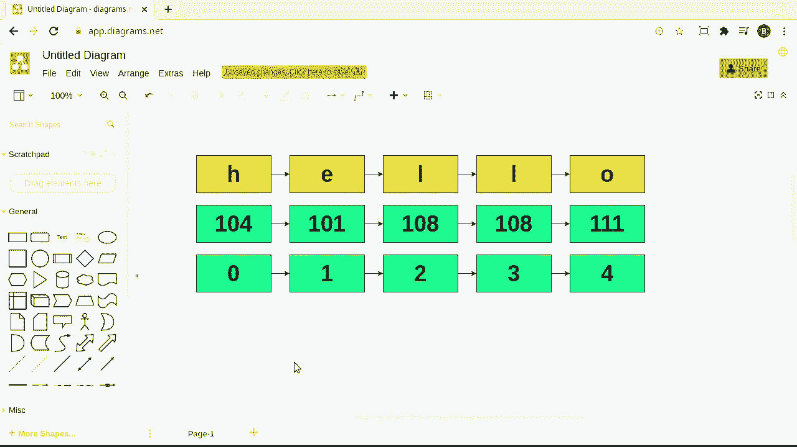
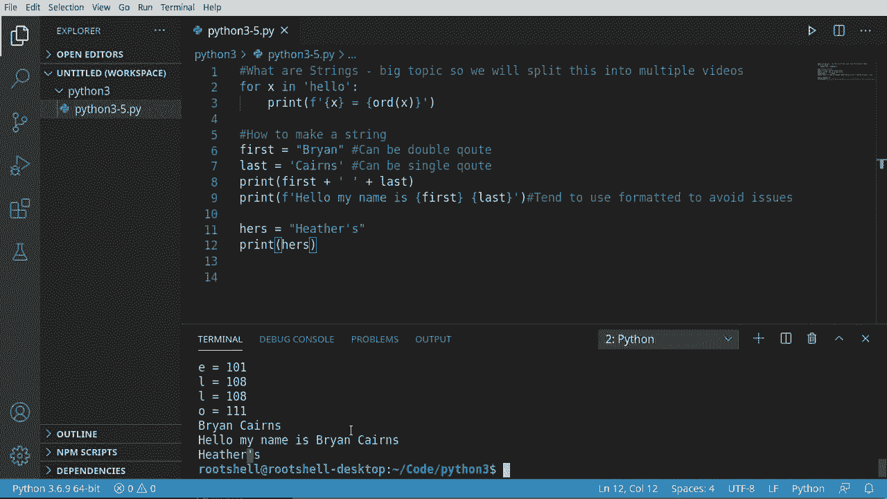
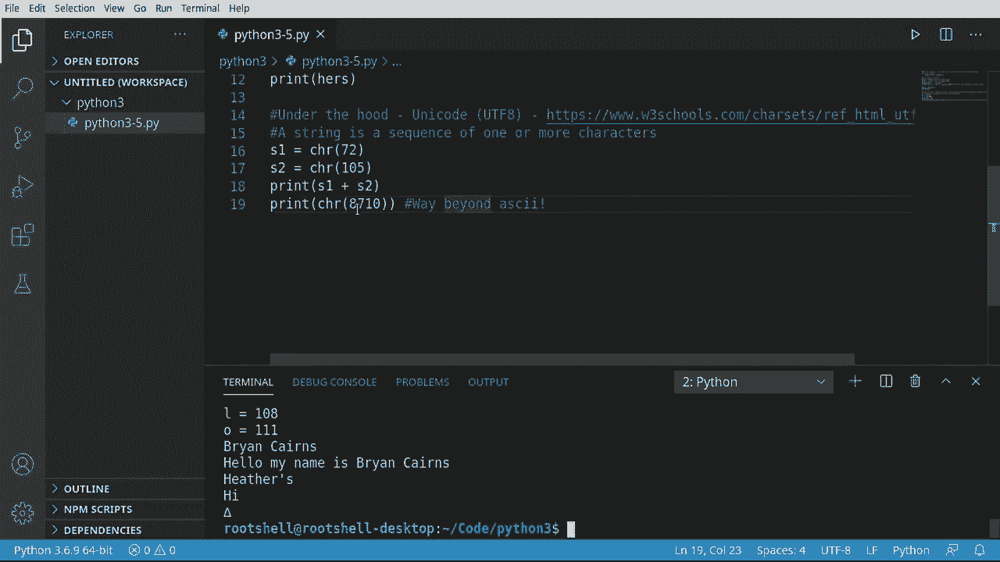
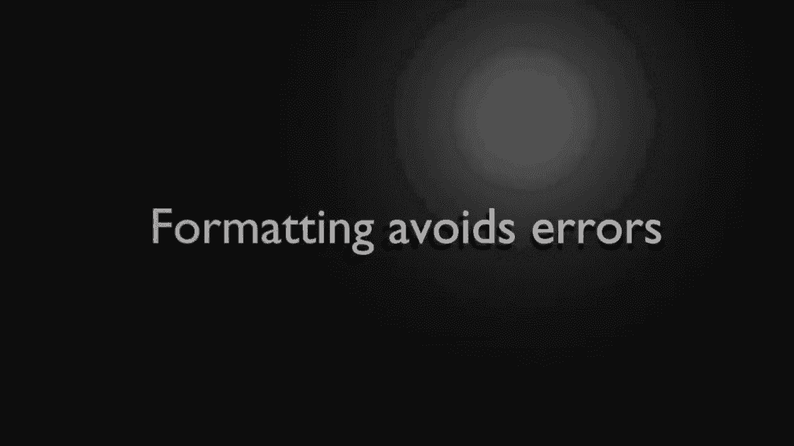
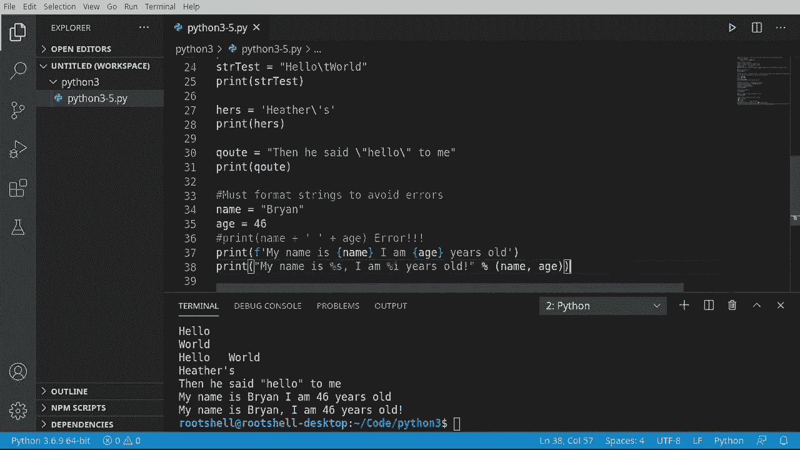

# 【双语字幕+资料下载】Python 3全系列基础教程，全程代码演示&讲解！10小时视频42节，保证你能掌握Python！快来一起跟着视频敲代码~＜快速入门系列＞ - P5：5）Python字符串 - ShowMeAI - BV1yg411c7Nw

Welcome back everyone。 My name is Brian， and we're going to talk about strings。 So what is a string That's a very good question we have before you a simple diagram。 the word hello H E LLO， and there's some numbers here and some numbers here and we're going to explain all this。So really a string is a list。Of you guessed it characters in each character translates to a numerical value。

 So if you look down at your keyboard and look it like the letter H。That letter。 depending on whether the shift key is pressed， will be 104。 And when I say depending because there's a numerical difference between lower case and upper case。 we're talking about lower case here。Some people will say。

 oh that's ASCI I've heard about this before， this is actually not ASI it's Unicode。 specifically UTF 8， I think is universal text format8 bit or version 8， I forget。 but basically Python under the hood sees as UTF 8。So it doesn't matter if you're typing in English or Korean or Spanish or。

Ancient Greek or some mathematical algorithm。 There is a number assigned to each letter。

Comp knows what that is and takes care of all of this for you。 so you don't have to worry about it。The two major things you should focus on is well， the letters themselves that form the string and this down here。 which is the position。Everything is in a list。 So when you look at it H， E， L L O。 there are five letters there， and there are five numbers starting with 0。 This is a 0 based index，0。

1，2，3，4。So if I say give me the letter at the third position。H， EL， this guy。That is actually number 2， because it's0 based。 It's a little confusing if you're newbie。 you're going to go and wait a minute。 that's actually number 3。 Remember， it starts with 0。 So the first one's always 0。 We're thinking in terms of computers 0，1，2。Is this guy right here？

Once you wrap your head around that， you know more than most people walking around， and honestly。 it's not super hard。 You just have to understand that everything you see on the screen。Has some sort of number attached to it， the computer handles that number。 You just need to worry about what letter and what position。 And we're going to go into that。Okay。

 let's flip over individual Studio code here and we're just going to copy and paste some code here and this is going to look like absolutely nothing you've seen before。 don't worry about it， just taking a leap of faith。 we're going to cover this in a future video。

 but really what we're doing is we're saying4 x。Each letter in the string hello。 we're going to print out the letter and its numerical value。And you can see 104， 101 108- 108111。Eurn those into memory 104，101，108，108111。 If we flip back。 it's exactly what I told you it was going to be。 So let's dive in here and figure out what's going on。

Now， again， we are going to cover loops in a future video。 That's not this video。 We are hyper focused on strings。 So the first thing when you do is baby steps how to make a string。Very， very simple。Simply make a variable。And assign it。Lets do that again。Notice how the first name or the first variable。Has double quotes。

 where the last name or the second variable has single quotes。In Python， you can do it either way。And they do this not so much to confuse you， but simply because there are a bunch of little gotchas that you're going to find later on in your life as a programmer。

 and this is super convenient that you can switch it around however you want。So the first thing you're going to want to try is just simply to well。 merge them into one larger string or print them out。 So we're going to print。I want to say first。 was。And last now what do you think is going to happen here。

 you notice how we're using the plus sign if you're a math nerd， you're going to say， oh。 this is going to kick out some weird number， actually no。 it's going to say you guessed it it's going I think the term is called concatenate them。 it's going to merge them together into one string in memory。

 so it's saying the first Brian with a space。And last， Karen's。Very， very simple。You can also do something called formatting， which we've done before。 and it really does help you avoid errors in the long term。 So you can say something like this。 print F。And notice how I've got quotes， doesn't matter if you're doing single or double。

And I'm going to say， hello， my name is。 and then。Let's see here。 There we go。 I had to look at my keyboard to figure out where that was。 And then we just type the variable name。First。And then， last。Now， we tend to use formatting to avoid issues。 You've seen me do it already。 but you probably haven't really realized why。 And we're going to cover that a little bit here。

 So hello， my name is Brian Karenns。To kind of compound that in your mind。 let's make a variable called hers。 And we're going to say。Others。Notice how I'm mixing and matching these。I'm using double quotes so Python knows， hey。 this is the string， but we could also use single quotes so that gets super confusing。

What it's going to do is take the first one it Cs and says up。 you're using double quotes to make the string， so if I were to change this to a single quote。Notice how this letter suddenly turned white。Even if I end it in a single quote。 it's going to get really， really annoyed with me。 See， bo syntax error in valid syntax。

 If you ever see a syntax error， really， what Python's telling you is。 you screwed something up and it'll tell you exactly where。In this file on line 11， Dat。 dot do and hers。 And then there's a little arrow right here under S。 doesn't know what to do with this。Because it is not in the string。Change that。

It put the double quote there and it magically fixes it。See， doesn't make a whole lot of sense。 so let's change that back。This is why you can mix and match these， it makes it super， super simple。And we can just print that out and it works as expected， there's our little single quote right there。 and we don't have to worry about any special encoding or formatting or anything like that。

Okay， so to solidify this under the hood， a string is a unIode series of characters specifically formatted in UTF 8。 If you want something other than UTF 8， you're going to have to go out and Google how to do that。I'm just saying we haven't covered it yet， we may cover in the future。 but if you need something immediately， definitely go out to Google。

A string is a sequence of one or more characters and those characters are numerical values and that's what we're really going to drive home right now。Let's make a variable let's call this S1。And we want this to be a character。 noticeice how it's looking for an integer。 Return a unicode string of one character with Ornal。 and then it gives you some examples there。 And I'm going to say because I have this baked into memory 72。

And then we're going to make another one。那个试一试。Character， and we're going to say 105。Now。 you don't see it， but I'm sitting here cheating a little bit。 I'm looking at。The UTF specifications and the character tables， which you can see definitely by visiting these links and other links。And it will give you the numeric values。 Now， this is if you wanted to do something like this。

 you really don't need to。I'm just demonstrating。 it can be done。So we're going to say S1 plus S2。 and let's kick that out and it spells the word high。 notice it's a capital H lowercase I。72。Now。Lowercase H is 104。Upper case H is 72。 This is what I mean by there's a fundamental difference between upper and lower。Now， you may be inclined to say now， what about bold and italic nu， that's actually not part of it。

 Those are not letters。 Those are just simply styling and formatting of what you see on the screen。 So really， all we're talking about is upper and lowercase。It actually goes way。 way beyond that you can do something like this。To say print。 and I must say character。 And I really have to cheat and look at my notes for this one，8，7，1，0。 And this goes。

Way beyond asking。Let's go ahead and save and run and see what this looks like。 Boom。 it's this little mathematical symbol right there。 That's right。 It's got math symbols baked right into it。 You can do some really cool things with just simple characters。😊。

You may have termred the term， escape characters。Now， what is an escape character。 It's not something out of a novel， although it could be。But basically。 instead of memorizing all these weird numbers， they have it built right into the language in actually most languages in even operating systems。 and they're called escape characters。What it means is you can escape a string and print a special character and let's take a look at how this works here some as a print。

And we're going to even format this just to show you how this works。 I'm going to say， hello。And then world。 And notice I've got that kind of jumbled together。Now you can do something like this。 you can say。Okay， I looked it up。 and it's， you know， character 13 for a hard return。 Plus。 I want to do like a character 10 for a line feed。And that will put this on two different lines。

 And I had to go out and look up these numbers because I didn't memorize them， but it does work。 Hello world， Or you can just simply do something like this。And we're going to grab it。Get rid of all that nonsense。Slash R for return。 slash n for line feed。 save run。And it does the exact same thing。 So under the hood。This little guy here slash R。

 notice an escape character starts with a back slash here。We're saying slash R for return or N for new line。Does the exact same thing。 You'll see that out in the real world both ways， where some programmers will demand you use the character。 and some programmers will demand you use the escape character。

 It gets a little confusing until you get used to it。 but it's super simple。 And you can do things like this。And really， all we're going to do is we're going to print out。Hello world with a tab between them。 slash T for tab。 When in doubt you go to Google and you can type out。What is an escape character。

 and it will give you a complete list of them。 There's tons and tons of them。 but they're very simple and easy to work with。 Here's hellello world with a tab in between。You may be wondering why even use escape characters。 I mean， it seems a little rudimentary now。 let's。Go back way back to this problem。We want to put。That in there， and it works fine if we do it。

In double quotes， but the minute we change it the single quotes。 remember we're going to have some sort of issue， it's not going to note it to do with X。 and it's going to say you guessed it in valid syntax。Well。 instead of going through and rechanging all our strings。

 we can just simply put slash in front of it。 And most of the time that will work。 It'll escape it right out。 Go ahead and save to clear that air out。 Let's actually clear this out just to show you， it will work。No more syntax error。 And we can print this bad boy out。So escaping actually becomes a very convenient way of， well。

 breaking out of the constraint of which quote you should use。 I know I'm going to get that question constantly of should I use single or double and really it does not matter。 just pick one and roll it with it and if you need to switch them around you can always escape out of them。 it's not super hard。You can also do things like this。

 and this is something I get a lot of questions about， not just with Python。 but pretty much every language。So I'm going to say quote equal。You see what we're doing here？

You can have multiple escapes。 It doesn't really matter。 Basically。 what we're saying here is once you do this slash， the computer will try to figure out what you're doing and it will roll with it if it can't figure it out。 it will give you an error message at which point you're going to have to probably do something like this or you're simply using the wrong escape character And win a doubt。 go go go it。It's usually pretty easy to work with here， so we're going to go good。Then he said。

 quote unquote，Ho to me。

Now， you may be wondering， what's the deal with formatting when you read books or watch videos on Python。 they would go really in depth into formatting and why it's important， really。You format to avoid errors， especially with strings。 And let me give you a very simple demonstration here， say。Name is Brian。Aged 46。 and boy。

 I feel 46 today。 I was raking leaves all day yesterday。 So wow， yeah， that sucks。Alright。 so we're gonna print these out。 I'm gonna say name plus。And we want the age。 Oh， this will work。 and'll work beautifully， right。 Well， guess what。 No， it does not。There's a reason for it。 and it's not very intelligent when you first look at it。 So we're going to say line 36。

In this module， print， and it doesn't put the little。Little arrow。 but it does tell us must be STR not in。 So what it's really talking about is this thing。What you're trying to do is take all of this and treat it like a giant number and then add these together。 We're trying to do basic numerical operations， which we already covered。

 And Python's not going to let us do that。 So let's get that out。 And let's just put a note here。And let's show the correct way of getting around this now there's a few different ways。We can do the way we've been doing， which is we just put an F in front of the string。 and then we're saying we're now formatting it。Not very hard。 We've done this before。

 but if you want a little bit more control， there are other ways of doing it。 We're not going to dive into every single possible way。 I'm just showing you the two that I use the most。And this is the next one。 We're just going to print。And I want to say， let's do double quotes， Why not， my meaning is。

And here， what we're going to do is we're going to say what we want。Sent S。And what we're doing here is we're making our own special custom string with formatting baked right in。I am， And then I want a percent I。Or integer。From I'm here， though。 now we need to do a percent sign and tell it， hey。We're going to feed you some values。

 Those values are going to be named and age。 Now， I typically don't like doing this。Because you have to read this whole thing。Skip over to this percent sign and then look at this little guy here and figure out what we're sending it。 Okay， so name is the first string， okay， and then age is the first integer。All right。 so let's run that， see what that looks like。 And it says my name is Brian。 I'm 46 years old。

 Let's play around with this。 Let's put I and S。Just to see if we can easily break this。 And sure enough， we've broken it with very minimal effort。Type error。 So really I tend to favor just the simple formatting because we don't have to mess around with any of this or worry about screwing this up。 but if you need special formatting， it is super super simple to put it right in there。

When in doubt Google is your friend and there are honestly thousands and thousands of tutorials on how to really learn that in depth。 we're not going to spend a lot of time on it though。