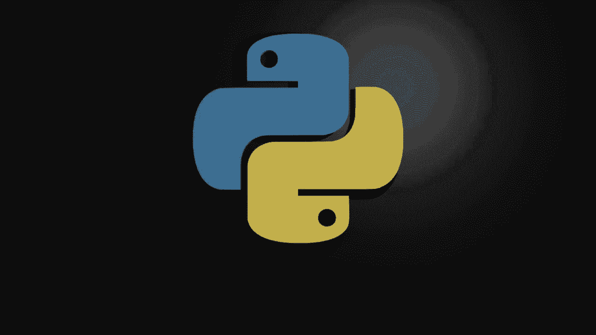
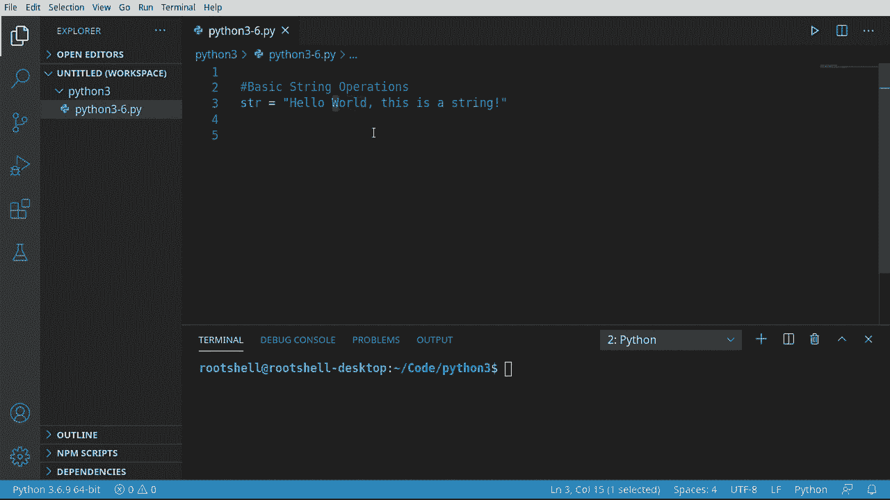
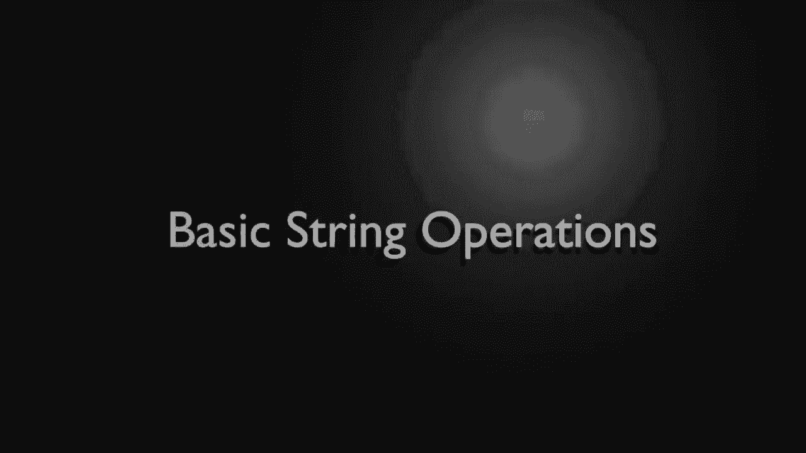
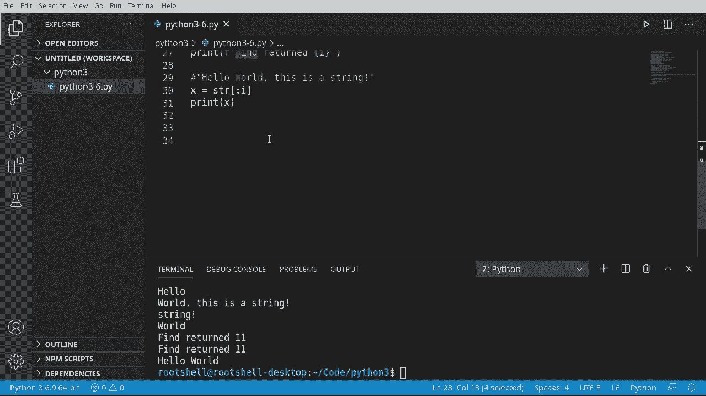

# 【双语字幕+资料下载】Python 3全系列基础教程，全程代码演示&讲解！10小时视频42节，保证你能掌握Python！快来一起跟着视频敲代码~＜快速入门系列＞ - P6：6）Python字符串操作 - ShowMeAI - BV1yg411c7Nw

欢迎大家回来，我是布赖恩，我们将继续我们的Python 3之旅，现在要继续基本的字符串操作。当我说字符串是复杂的数据类型时，我并不是在开玩笑，而我们不可能在这两段小视频中涵盖所有内容。

特别是因为我们甚至还没有涵盖编程的基本逻辑。因此，我们现在必须坚持基础知识。别担心，在系列的后面部分，我们会重新审视一些更高级的内容。但现在，你必须学会爬行，然后才能走路。所以，让我们开始爬行吧。

我将说变量STR将是：“Hello world，这是一串字符。”非常，非常简单，我们就从这里开始。我们在这个视频中要做的事情是获取字符串的长度，重复字符串，替换字符等操作。

甚至可以切片并获取字符串中的特定索引或位置。

让我们深入基本操作。因此，第一件事。假设我们想要获取长度。我将说“print”。我们将调用len函数，这不仅限于字符串，但它对字符串来说超级有用。我们将再次调用它，简单地打印一个注释，获取长度。当我们运行这个。

我们可以看到这有30个字符。现在，你可能会倾向于说“等一下，这是基于零的，所以实际上是29。”不，这实际上获取的是长度，而不是位置，这在后面你会看到是根本不同的。因此，现在我们得到了长度，我们还可以做其他事情。

假设我们想要重复一个字符串，这会让你大脑稍微痛一下。我们谈过字符串不能进行数学运算。记住吗？我们试图将一个整数和一个字符串相加。好吧，你可以进行所谓的字符串数学。这就是我所说的，它会让你的大脑受点刺激。

我们将说SR乘以3。现在，我知道你在想什么。你在想你会得到某种奇怪的东西，因为你在尝试相乘。但实际上你告诉Python做的是取这个字符串。没错，乘以3并返回一个巨大的字符串。让我们演示一下。“Hello world，Hello world，Hello world。”

所以它确实完全按照我们的预期工作。是的，第一次我这样做的时候，我坐在椅子上，想，等等，这到底是什么。但这确实是Python的一个特性。如果你来自其他语言，你可能会呆呆地盯着屏幕，心想，这是什么巫术？

但如果你需要重复一个字符串，这实际上非常方便。现在让我们看看替换。如果你来自其他语言，嗯，这正是你想的那样。它简单得令人发指。所以在 Python 中，字符串是一种数据类型，但它们也是一等对象，这意味着它们内置了函数。

我们还没有真正讨论函数，但只需知道，你可以在变量名后加一个点，然后调用一些代码。我们将调用替换函数。这将会做什么呢？它将取出字符串并替换其中的一部分。比如说，我想把 hello 替换为 Hla，所以如果你来自墨西哥、西班牙或任何讲西班牙语的国家。

这将是正确的说法，hellla 是 Holla。我在发音上有点失误，但你明白我的意思。你可以简单地替换它，所以 Oah world，这是一个字符串。这样做非常简单。你不必弄清楚事物的位置。你也可以做类似分割字符串的操作。所以如果你来自其他语言。

你之前做过这个。我想说 SDR，我想要分割。注意它在寻找一个分隔符。所以让我们在那个逗号上分割。如果你不是来自其他语言，你可能会想，等等，等等，慢点。什么是分割？所以我们将把这个字符串转换为两个字符串。

我们在寻找一个分隔符值。在这种情况下，就是这里的逗号。所以它将说 hello world。然后这是一个字符串。它将返回两个字符串。好了。Hello world。现在你可能会想，等一下，这个逗号在这里。

看看这些小括号。你有这个括号，这是开始括号。它创建了一种我们还没有讨论过的数据类型，但我们将在接下来的几个视频中讨论。它把两个字符串放入那个数据类型中，然后交给我们。这是一种非常方便的方式，告诉我们，嘿，分开它们。当你继续编程时。

你实际上会经常用到这一点。现在，假设我们想知道这是否以某个东西开头。所以我想说 SR。我想说，以……开头。是否以字母 H 开头？我几乎不好意思输入这个，因为它显而易见，但以防万一，它将返回一个布尔值，并告诉我们，嘿，是的。

如果我们把这个改成 J，是否以 J 开头？非常简单。方便判断发生了什么。我们可以通过神奇的复制和粘贴，把它改成以 ends width 结尾。假设我们想确保它以感叹号结尾。真。真。好了。现在让我们看看大写、小写和首字母大写。

我们将说print。我们想要upper。它将给我们hello world。这是一个全大写的字符串。你注意到它有这些括号吗？那是因为这是一个函数。如果我们省略这些括号，我们将获得一个内置的字符串对象的upper。然后这个数字。

你见过这样的东西吗？基本上，你想要做的就是在没有括号的情况下调用一个函数。你需要那些括号，你可能会想这个数字是什么，那是内存中的一个位置。因此，一个对象实际上就是在内存中存在的某样东西，而这就是它的位置。老实说，这条信息对于初学者来说并不是特别有帮助，但我只是想解释一下这是什么。

为了补充这个，我们说lower，我想要capitalize。所以现在我们有了全大写、全小写，并且以正确的方式首字母大写。让我们看看切片，当我第一次听到这个术语时，我实际上有一种拿出光剑切东西一半的幻想。

实际上，这与我们所讨论的内容并没有太大区别。我们在谈论获取一个子字符串。现在，当我说substr时，请记住，这个字符串只是字符的序列，每个字符都有一个位置，所以零的位置在这里。然后是1，以此类推。

所以我们想要做的是获取一个子字符串或切片。想象一下你面前有一个派，你要切一片，而不是把整个东西都拿走。所以例如，我可以说我想要单词“world”，或者我只想要这个单词“this”中的“T H”，或者我想获取到某个特定位置的所有内容。你可以这样做，非常简单。

在Python中，这个过程非常迅速。如果你来自其他语言，我要告诉你，一旦你理解了它，这个非常酷。所以我会说print。我们将使用我们的变量。现在我们将添加这些括号，这表明我们正在获取一个切片。这里的格式非常简单。我们想要开始的位置。

一个冒号和一个结束位置。在这种情况下，起始位置我们将说是0，或者说是起始位置，我们将结束在5。这将获取前五个字符。这是一个零基索引。让我们打印出来看看会发生什么。一，二，三，四。

五，hello是五个字母，好的，所以它确实完成了我们想要做的事情。正如我所说的，最开始看起来有点混乱，但一旦你开始理解它，就不是特别困难。现在我想从第六个位置开始，而我将省略结束位置。我们在这里所做的就是，我们希望从第六个位置一直获取到末尾。

所以当你发出某个东西时，它会自动默认到开始或结束，具体取决于你选择的哪个位置。所以第六个位置是你猜的。“世界”。就在这里。T按预期工作。让我们抓住这个，试试不同的东西。我们将从负7开始。现在，你可能在想。

等等，什么负数，我们怎么会有负7。好吧，当你有负数时，实际上是从结尾开始的。所以因为我们是从负数开始的，它将从这里开始并向后计数。实际上这个工作方式挺酷的。让我们运行这个。最后的七是字符串感叹号，真是挺酷的。

尝试用其他语言做这个，有些会很酷，有些则会让你完全恼火，具体取决于语言。现在让我们获取一个子串，我们要说从6到11。我们想得到。6到11。只是为了记录，看看那是什么样的，它是“世界”。非常酷，非常简单。

非常简单。现在，如果你来自其他语言，可能仍然困惑于这一点。别担心，每当你看到那个负号时，只需想象你是从结尾开始向后工作。切片很酷，但除非你能自动获取数字，否则并不太有帮助，因为没有人想在这里数东西。

对吧？所以让我们看看如何获取某个东西的索引或位置。我将说L等于。我们要找逗号。现在如果我们看看原始字符串，这里有个逗号，但我们不知道它的位置，所以我将把它隐藏在屏幕外，我们只想知道嘿。

我们想寻找这个。我们将用两种不同的方法来做。我们将说。C等于SDR查找。这就是我喜欢Python的地方。它非常直观。Fine确实做了你认为它会做的事，它找到了一些东西。它会告诉我们我们要找的是L，并且会告诉我们它的位置。

如果找不到它，比如说负一，如果不绑定。我们来打印一下。我想说。好的，返回。C。让我们运行这个，看看它做了什么。哦，实际上“fine”拼错了。修正一下。所以找返回C。它在第11个位置。我们不需要在这里数1，2，3，4。否则我们会在这里呆一天。相反。

我们希望电脑为我们做这些工作。所以我们知道这是在第11个位置。现在我们把这个改成别的。我们就用一个T。你会看到找返回负一。所以在这种情况下，当你看到负一时，可以说它根本不存在。它不会返回到0，因为记住，0是起始位置。所以，Findd确实是。

非常酷，但如果你来自另一种语言，你可能在寻找`index of`，那是完全不同的东西。所以我将说`i = SDR.index`。我们将给它相同的内容，`L`。现在我们想要这个。我们会说`find`返回。好吧，让我们看看这会做什么。现在，记得。

我们这里有这个`t`。这里的`t`在哪里？它就在这里，但它是小写的，而不是大写的。所以它应该返回负一，或者实际上，它不返回。相反，它给你一个叫做值错误的提示，`substr not found`。这是一种方便的方式来表示，嘿，那个必须存在，否则就会抛出错误。这是我们将在未来的视频中讨论的内容。

只需知道`find`不会返回错误，而`index`会返回错误。所以大多数时候你会想用`find`。但如果你来自其他语言，你可能认为你想用`index`，其实你真的想用`find`。这很令人困惑。有时候会有行和错误。我们只是想确保将这一点写在这里以防万一。现在我们切换回去。

你可以看到它们都返回11。因为我们在寻找那个逗号，记得吗？`index`会抛出一个错误，而`find`只会简单地返回负一。总结一下，我们想要从子字符串创建一个新字符串，我们该怎么做？

所以我们想说x等于`SDR`。我们要对这个字符串进行切片。我们要从起始位置开始，因为我们想从头开始，并且只想到这个逗号的位置。如果这看起来非常困惑，我们放慢速度。我们有一个字符串，内容是，`hellello world，这是一条字符串的感叹句`。

所以我们在寻找这个字符，发现它在第11个位置。我们在说，好吧，从最开始。`Eello world`实际上是要把整个内容复制到这里。复制这个，把它作为注释放在这里。好了。我们将从这里开始，一直到我们找到的位置。

我们想要创建一个字符串，称之为X。现在，我们想要取出这个字符串并打印出来。你好，世界，超级简单。快速回顾一下。在Python中，字符串是第一类对象。它们默认是Unicode，编码为UTF-8，虽然你可以指定其他方式。如果你需要立即这样做，谷歌是你的朋友。

你可以做一些很酷的事情，比如获取长度、重复、替换、拆分。确保它以某个字符串开头或结尾，或者转换为大写或小写。你可以切片、切割，做你想做的任何事情。你还可以在字符串中搜索或查找内容。如果需要在不存在时抛出错误，你可以使用`index`。

我不推荐这样做，因为在大多数情况下抛出错误并不是一个好主意。你可以很简单地从子字符串创建自己的字符串。😊。
