# 【双语字幕+资料下载】Python 3全系列基础教程，全程代码演示&讲解！10小时视频42节，保证你能掌握Python！快来一起跟着视频敲代码~＜快速入门系列＞ - P7：7）Python列表 - ShowMeAI - BV1yg411c7Nw

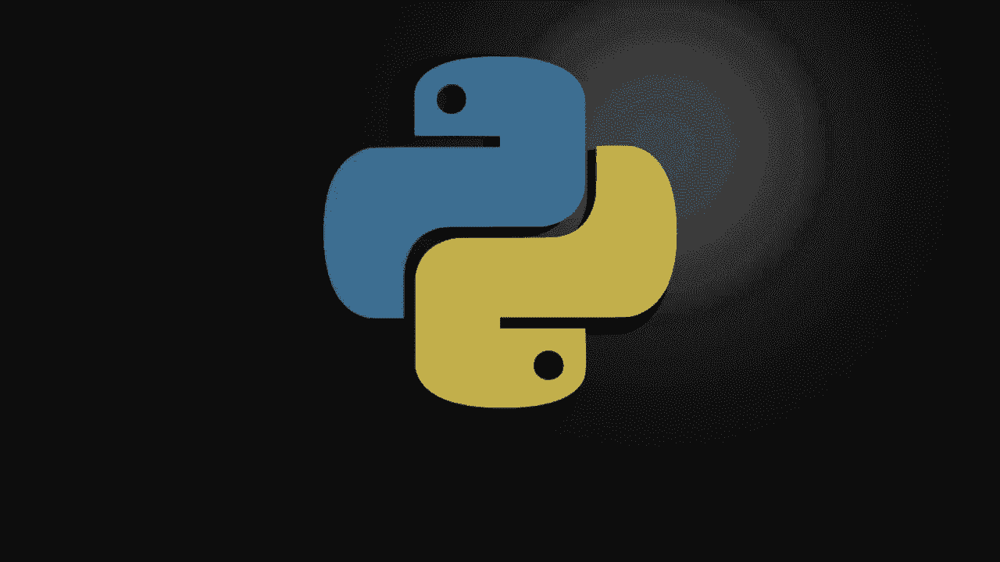

欢迎回来，大家。我是布赖恩。在这个视频中，我们将讨论列表。列表是一种复杂的数据类型，相比于我们之前讨论的内容，它非常复杂。到目前为止，我们讨论了布尔值、数字和字符串，但列表要复杂得多，正如我们即将看到的那样。那么首先，什么是列表呢？😊

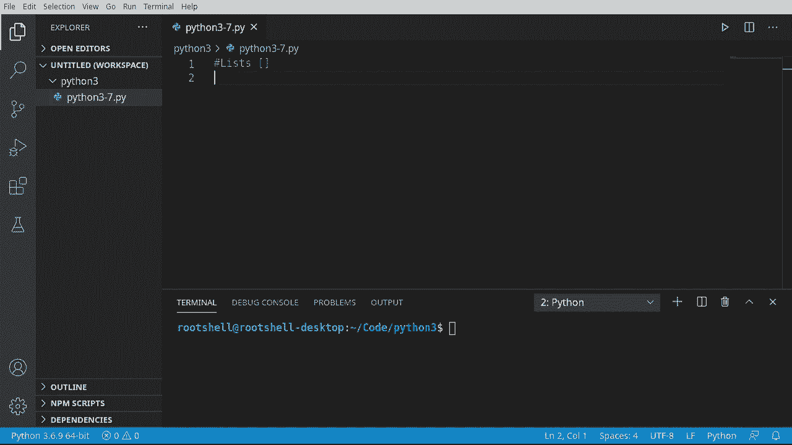

好吧，它是有序的。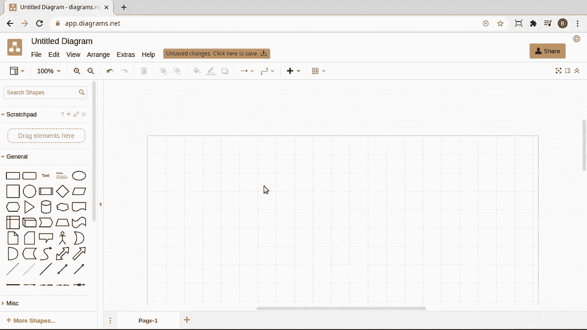

列表或数据集合，我的意思是什么？想象一下，我们添加一个项目。那个项目将位于位置0，这意味着你添加的第一项始终是0。当我们添加项目时，你猜对了。那个索引会递增。让我们在这里添加一个项目。所以01、2，这些项目可以相同，也可以不同，甚至可以是一些完全疯狂的东西。

无论我们想做什么，这就是Python的美妙之处。因此，列表不需要被称为“类型”。这意味着你不必使用相同的数据类型。这就是许多不同编程语言中很多列表的工作方式。你可以将字符串与数字和自定义数据类型混合。我们在深入之前的主要要点是，这是一个基于顺序的索引，这意味着它会按照你添加的顺序添加，第一项始终是0。从0开始，依次是1、2，等等。

好吧，让我们先创建一个列表。你会在我们的笔记中注意到这些方括号。这表明它是一个列表，记住这一点很重要，因为我们将讨论其他与列表非常相似的数据类型。

但它们是不同的，并且使用不同的风格。首先，让我们创建我们的列表。记住方括号，我将说x等于方括号。我们放在这些方括号内的任何东西都成为列表的一部分。例如，我将说布赖恩。然后我们通过分号添加另一个项目，然后随便放入我们想放的内容。

所以我们有两个字符串在里面。如果你来自另一种语言，这可能会让你很困惑。我将添加一个数字。没错，这不是一个类型列表。你可能习惯于像C++这样的东西，在那里你必须有一个特定的类型，它只能包含字符串或数字。Python完全不是这样的。

这使得它非常灵活，非常简单。所以让我们在这里写个笔记。我们可以混合数据类型。接下来我们要打印出来。我想说列表。我要打印我们的列表。它会复制和粘贴。让我们把它放在这里并获取长度。因此，你可以看到我们的列表就在这里，并且它在这些方括号内。

始终记住方括号是列表，我们可以有两个字符串和一个数字，我们可以添加任何我们想要的，并且其中有三个项目。如果你来自另一种语言，这可能会让你感到困惑，因为你会想，等一下，你不能有多种类型，但在Python中可以。这使得它非常方便。

动态创建自己的数据结构非常简单。让我们在这里特别注意索引和位置。这让很多人感到困惑。我们认为，嗯，人类，第一个项目总是1。可是计算机并不这样认为，第一个项目总是0，因为你是从零开始的。

所以当我们谈论列表时，这是基于零的。让我们继续，叫上我们的朋友打印，并说我们想要0。所以要抓取那个列表中的第一个项目。只需说方括号和索引。现在，请注意，我们并不是在创建一个列表。我们是在说，在那个列表中，获取那个索引。在这个例子中，是0或第一个项目。

我将把这一点用大写字母写出来，供新手参考，第一个项目是0。请记住。人类认为第一个项目是1，计算机认为第一个项目是0，因为你是从零开始的。现在，如果你看过前一个关于字符串的视频，我希望你看过。你应该理解切片是什么。但以防你跳过了。

切片很像切面包。你面前有一块新鲜烤制的面包。如果你只想要一片，而不是整个面包，或者一块派可能是更好的例子。所以我们将把这个打印出来，我们将进行切片。所以我将说，我想要X。然后我们要，你猜对了。现在，请注意，这些也是方括号。

我们在上一个视频中没有涵盖这一点。但是，当你看到方括号时，这意味着我们想要这个列表中的一部分，或者在这种情况下，是它的一部分。我只会在这里放一些引号。P是一些引用和评论，切片列表。所以这将意味着X，并且我们有一个起始位置和一个结束位置。

我们将从第一个位置转到第二个位置。现在，请记住，第一个不是第一个项目，而是位置零。记住，这在零基索引方面会非常混淆。为了说明这一点，从一到二的位置实际上是凯伦的。所以我们正在拿这个列表，并且我们说0，1。到2，所以它将停止。

如果我们省略这个第二个位置，我们将获得其余部分。我们将说我们想要那个整个切片。让我们演示一下这是否按预期工作。切片是一种非常方便获取子项目的方法。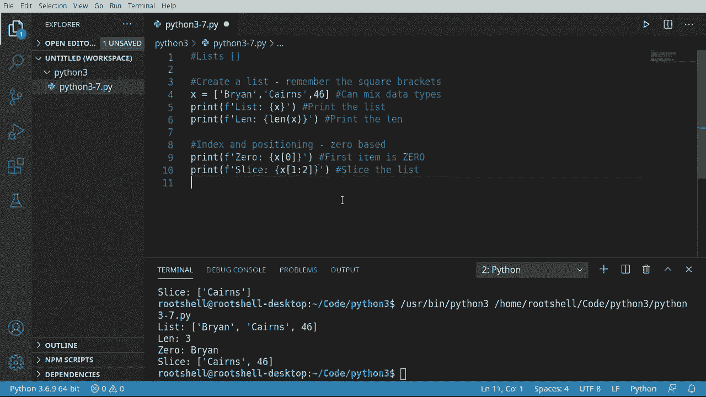

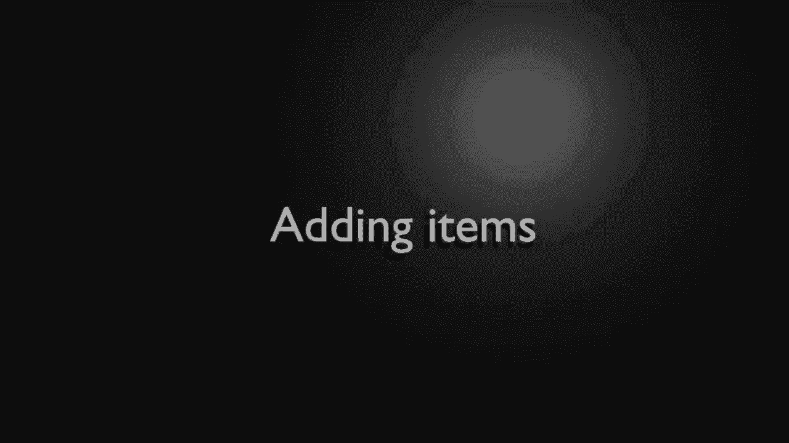

你可能会想，列表很好，但现在我创建了列表，如何向其中添加项目呢？这是一个常见问题。所以我们将在这一小节中讨论如何添加项目，你可以选择追加或插入。它们的功能确实如同听起来那样，举个例子，X。pen。我们要说一根笔披萨。让我们继续进行 X dot append。

我这样做两次是有原因的，你稍后会明白。并添加啤酒，因为每个人都喜欢披萨和啤酒，对吧？现在我们想要插入。因此，aend 会将项目按顺序放在末尾。注意我们进行了两个追加。披萨和啤酒，所以它将添加披萨，然后添加啤酒，两个都会放在末尾。

现在插入。允许你说，我想把这个放在特定的位置。因此，因为我们在谈论一个特定的，我需要给它一个数字。在这种情况下是 1。你注意到它需要一个索引，一个整数，说明你要把这个放在哪里。所以我会简单地说 1。然后我们添加猫。继续跟着。

我们在这里做的是将披萨添加到这个列表的末尾，然后添加啤酒。接着我们要去到一的位置，而不是开头。开头是 0。记得哦。我们要去到一的位置。并添加猫。让我们在这里添加一些注释。这样，任何从 GitHub 下载此代码的人都能有注释并轻松跟随。

现在，让我们进行打印。我想查看这个列表的完整内容。让我们看看这是什么样子。好的，在这里。你可以看到我们的列表，我们有布莱恩，然后猫被插入到第一个位置。接着是我的名字凯伦的 46，然后是披萨和啤酒。

理解追加会按你追加的顺序进行是非常重要的。所以它把披萨放入了列表。然后把啤酒放在了列表的末尾。一旦你理解这一点，就会很简单，但这常常让很多新手困惑。记住这一点，当你想添加特定的索引时。

如果你想将其放在末尾，你需要执行插入，你要做 append。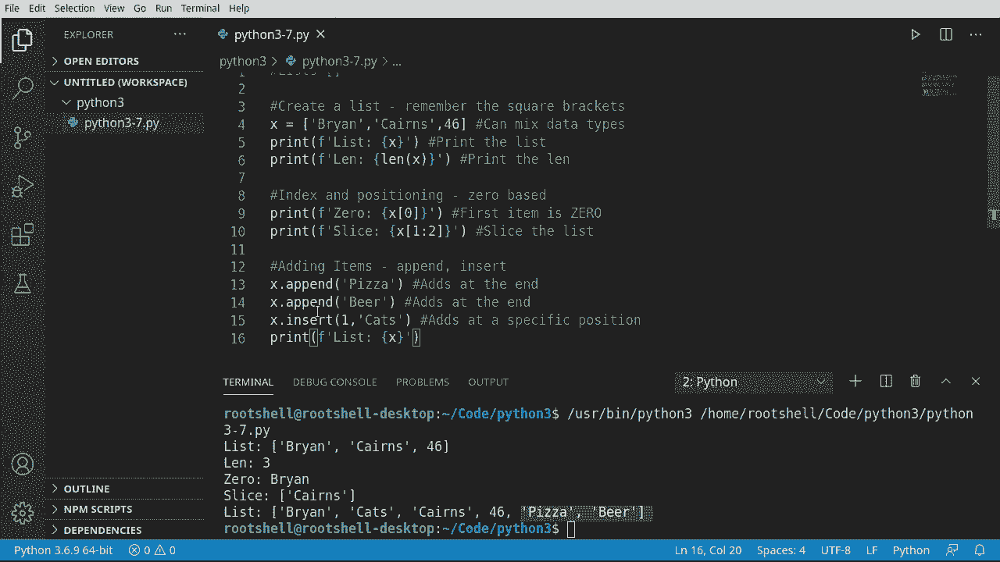

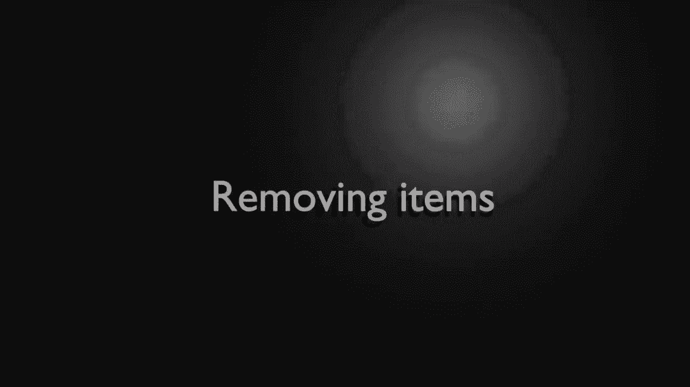

好吧，现在我们添加了项目，接下来我们来谈谈如何移除项目。我们说的是删除。我们要删除 pop 和 delete。这两者的功能非常不同。乍一看，它们可能看起来非常相似，所以我会说 X。那就移除。可我不想移除猫。我不是特别喜欢移除猫，因为我正好爱猫。

但你知道我的意思，有时你就是得把猫弄出去。因此，remove 将做的是遍历并移除这里的第一个项目。Sra 我们的打印语句。把它放在这里，然后运行这个。好的，你可以看到布莱恩卡斯，凯伦。现在是布莱恩凯伦，我们移除了猫，所以只移除了那个第一个项目。现在，让我们谈谈。

现在。不要太兴奋，pop 不像可乐或百事可乐之类的。但我们想做的是删除一个项目，同时返回它。这意味着我们希望能够在这里处理它。所以我要说我等于。我们将做 X.dot.index，因为我们想在这里找到某些东西。我们想找到比萨。

如果在里面没有找到，这将引发错误，所以如果你只是找一些疯狂的东西。它不会返回负一，实际上并没有“fine”，记得我们在上个视频中谈到的“fine”吗，它返回了负一。这只会说，嘿，有个错误，它会让你的程序崩溃。听起来确实很糟糕，直到我们进入更高级的讨论，讨论如何绕过这个问题，以及它为什么会存在。

所以，现在要大跨步信任一下。我们知道比萨在里面，因为我们已经添加了它。我们要获取那个索引，因为没有人想坐在这里数数，弄清楚这个位置实际上在哪。我们要说食物。然后我们要 pop。现在，当你想到 pop 时，想象一下把一个冰凉的汽水或啤酒的顶部打开，或者任何你喜欢的饮料。

现在你手里有那个盖子了，当你把它打开的时候。这就是我学习 P 的方式。所以当你打开盖子时，你仍然有这个盖子，在这种情况下，它是索引中任意比萨的项目。听起来超级混乱，确实是，但一旦你看到它的实际操作，就会觉得很简单。所以我们要做的是，我将清空这个列表，以避免任何混淆。

我们要运行这个。砰，所以这里发生了什么。我们有我们的列表，看看里面有比萨。我们要 pop。意思是我们要把手里的那个东西的盖子打开，现在我们有了那个瓶盖。这个瓶盖是比萨，所以我们现在可以使用它，但一旦我们打开它。

它不再在列表中，看看它是如何被移除的。如果你想移除项目，这非常方便，但同时也可以使用该项目。听起来有点混淆，但请耐心一点。实际上，在更高级的编程中，这种情况会用得很多。好的，接下来，我们要谈谈删除。所以我想说我等于。说 X 索引。

让我们获取啤酒的索引。因为毕竟，没有人想坐在这里一个个数零、1、2、3。没有人想这样做，我们只想让计算机为我们找到它实际上在哪儿。所以一旦我们获得那个索引，我应该在这里做个特别说明。如果没有找到，这会引发错误。但一旦我们获得它，我们就想实际删除它。所以我们要说 D EL。X。

然后无论那个位置是什么。现在这将删除项目而不返回它。我会在这里复制并粘贴一些笔记。所以删除特定项目而不返回它。而 pop 将移除并返回项目。这是根本的区别。你会使用哪个，为什么呢？好吧，pop 是如果你想实际使用它的话。

删除就是如果你想让它消失。现在，当你删除它时，它就不复存在了，你不能再使用它。它甚至在内存中都不存在了。这就是它被称为删除的原因，因为你实际上是将其从内存中删除。如果你来自C或C++或其他任何语言进行内存管理，没错。

你实际上是将其从内存中删除。现在，底层发生的事情是Python将其标记为垃圾收集和其他一些新手不太理解的复杂操作。但如果你是更高级的用户，这就是Python在说。😊。将其从Python内部列表中删除。我们只是让垃圾收集稍后清除它。

保存并运行，这里发生的事情是，我们找到了beer的索引并将其删除。非常酷，非常容易理解，所以从移除项目的主要收获是，如果remove将删除第一个，pop将删除它，但让你操作，而delete将实际删除它并让它消失。让我们谈谈从另一个列表扩展或添加元素。

这可能有点困惑，但请耐心点。你会选择扩展而不是简单地添加一个列表，是因为在Python中，你实际上可以将列表添加到列表中。我们将在本视频的最后部分介绍，但这会变得超级复杂。所以让我们看看。我们将说我们要再创建一个列表。

让我们称之为猫。Tma，狗。那么，Bds。如果有人在想，怎么添加逗号，你并不会直接添加逗号，而是像这样添加为字符串。但我们只是要将猫、狗和鸟加入到我们叫做Y的列表中。现在我们正在使用的列表叫做X。

所以我们想把Y的内容放到X里面。我们将使用x dot extend。有时智能会帮我们，有时则不会。我们将使用Y列表来扩展。让我们打印一下。注意我们在打印X。你觉得这运行时会是什么样子？嗯。

如果你说它将包含两个列表的内容，你是完全正确的。现在。注意它所做的事情是它取了RX。并将Y的元素添加到其中。所以这些现在是X内部的真实项。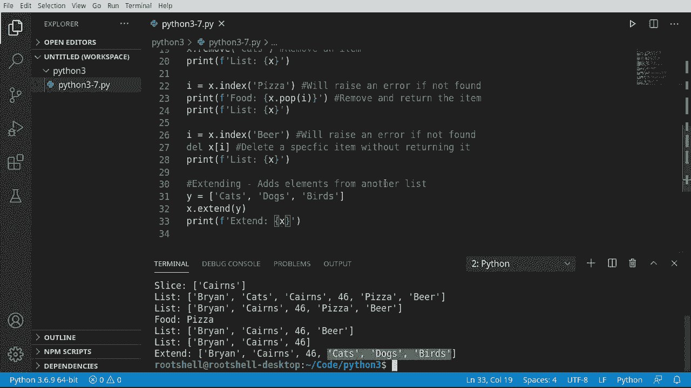

这个功能真的很酷！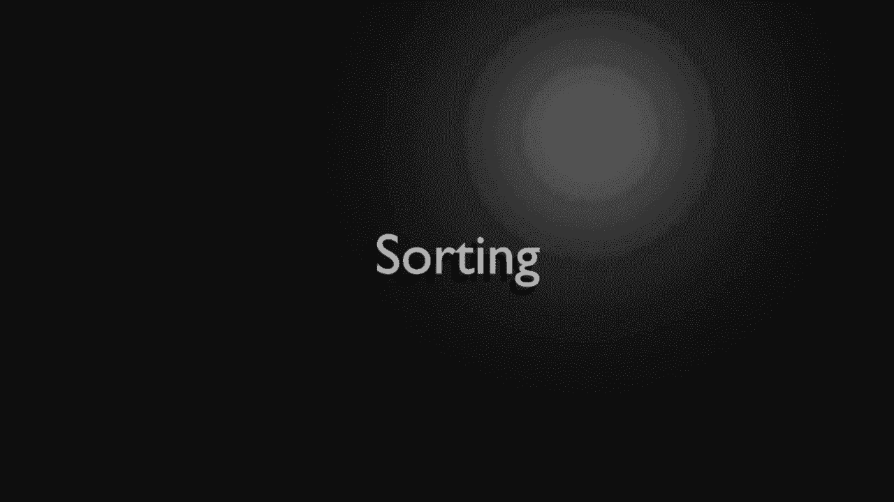

让我们谈谈排序，当我说排序时，我们是指排序和反向排序。意味着做与字母顺序相反的事。所以我们来做。反向排序。现在，把它想象成升序、降序。现在我们的列表是混合的。那么我所说的混合是什么意思呢？所以如果我们只取这个。打印出来，运行它。

你可以看到我们得到了字符串、字符串、整数、字符串、字符串、字符串。我们将对这个整数遇到问题，我们需要把它移除。我会非常快地演示一下，所以我将说x.dot.sort。这是很多新手会被绊倒的地方，出现了“整数和字符串之间不支持”。

这正是这样，所以它在说它知道如何排序字符串，知道如何排序数字，但它不知道如何将字符串与数字排序。想想这个。假设你面前有一张桌子，我进来扔了一堆土豆和一堆苹果，我说，给我排序。好吧，你想如何排序？你想要土豆在苹果之前，还是想按颜色排序？

但它们都是不同的颜色。这就是我所说的，Python会感到非常困惑。它只会说，知道吗，我甚至不想尝试搞明白这个。我只会抛出一个错误，让你自己去解决。此时摆脱这个的最简单方法就是直接移除它。有些人会说X.dot.remove。

我们将去掉那个提示，然后进行排序。所以现在是按字母顺序，因为我们去掉了那个。它完全知道如何排序这些字符串：Bir，Bryan，Karen的，猫，狗。非常简单。相反的当然就是反转。我们只是为了节省时间来抓取这个。

这显而易见。就像是升序排序，降序排序。我几乎希望他们不叫它反转，而是叫做降序排序之类的，或者在排序内部有一个参数，我们稍后会讨论参数。虽然这可能有点混乱，但只要把排序想象成按字母排序，而反转则是相反的。

你注意到了吗？当我们排序时，我们必须移除那个整数，**因为如果类型混合，排序会抛出某种错误**。现在，如果你想这样做，但又不想真的修改原始列表，那我们现在要做的就是复制，有些人称之为浅复制。

基本上我们只是这里在做一个复制，所以我们将说y等于x.dot.copy。这正是你想的那样，实际上它创建了一个新列表并将元素复制到其中。我们将说，将元素复制到新列表中。现在我们可以简单地说why.dot.reverse。我们可以添加项目，移除项目，做我们想做的任何事情，所以我可以说，嗯，我得到了一个。

我们来处理苹果吧。我们可以做任何其他我们真正想做的事情，所以让我们抓取这个打印语句。x是原始的，New是R Y。让我们看看它们的样子。所以我们的原始保持不变，而我们的新列表现在有苹果，并且它已经反转了。这个方式真不错，如果你完成了wine，并且不想再要了。

你只需简单地删除它。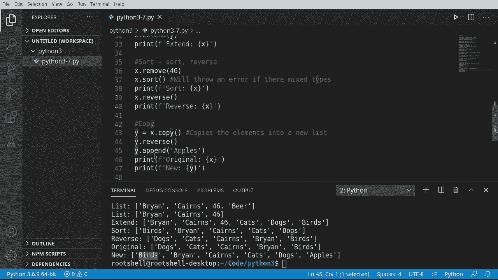

这就是我们接下来要讨论的内容。

好吧，所以删除。嗯。删除整个内容实际上就是我在这里要说的。你为什么想删除某样东西呢？在之前的小段落中，我们提到我们要创建 Y，而 Y 是 X 的一个副本。现在我们完成了 Y，就不再需要它了。我们可以做两件事。

我们可以让 Python 自动垃圾回收，意味着它会在不再需要时自行处理。或者我们可以明确地说删除整个列表。是的，这确实会删除整个内容。如果我尝试打印 why，会出错并提示名称 why 未定义。你还记得在之前的视频中，每当你看到未定义的情况。

这意味着它根本不存在了，意味着我们现在已经摧毁了 why，里面的所有内容也被摧毁了。所以对于你们这些计算机爱好者来说，所有的内存现在都被释放并消失了。我们可以用它做其他事情。当你开始谈论嵌入式系统等内存可能会比你的台式机或笔记本更有限时，这一点尤为重要。你要明白，删除某样东西，它就消失了。

我是说，消失得无影无踪，未定义意味着你必须从头开始重建整个数据结构。根本没有恢复它的方式。删除可能有点激烈，正如我们所见，名称 Y 未定义确实是个问题。我是说，如果你不想删除整个变量，而只想删除其中的一部分或清空整个内容呢？

这就是我们在这个小段落中要讨论的内容。我们在谈论清空。把你的列表想象成一张大桌子，上面有盘子、碗碟和各种东西。你不想把整张桌子扔掉。你只想把它清理掉。这正是 clear 所做的。所以它会清除列表中的所有元素。

但列表本身仍然存在。它只是会是空的。演示一下，类型被清空了。因此，在编程的世界里，大多数时候你并不想删除。你只想清空它。所以我们的列表存在，你可以通过这些括号看到，里面只是没有元素。我们实际上可以测试一下。

让我们获取 X 的长度。所以它存在，但里面没有项目。大多数时候，如果你感到困惑，可以这样想：删除就是把整个东西扔掉。你是把整个餐桌都扔掉，而清空只是把桌子上的碗碟清理掉。通常你想要清空，而不是删除，但删除存在是为了你需要释放内存时。

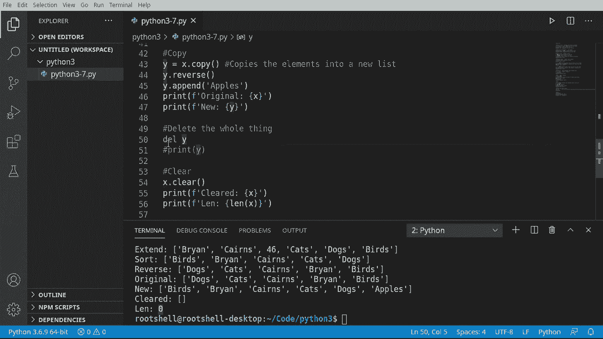

你想做点疯狂的事情。一个列表可以包含其他列表。如果你看这个，它看起来有点奇怪。但想象一下，你有一个开始括号和一个结束括号，接着是开始结束、开始结束，再到开始和结束。所以没错，一个列表可以包含其他列表。如果你来自另一种语言，想象这就像一个数组的数组。

这有点复杂，新手可能不太理解。但如果你感兴趣，这就是你该怎么做。所以我们要说x等于，并将x变成一个空列表，里面什么都没有。w等于，我们要创建另一个列表，内容是1，2，3。

让我们再创建一个列表，叫做Z。在这里，我要说。我的名字。你可以把你的名字放进去，或者猫、狗、鸟，随便你想放的东西。所以现在我们有三个不同的列表。我们想要做的是把Z和Y的内容放入X。有人说X停止，接下来让我们加入Y。现在。

我做的是把所有这些数字放在X里面。让我们打印一下。现在，我说合并，但这其实不是我们在做的事情。我们实际上是把所有这些合并成一个巨大的数据结构。你注意到我们有这些双括号吗？所以我们所说的就是这个项目。

这个独立元素是它自己独特的列表。所以我说列表。无穷大。好吧，现在我们想要做的是将Z的内容放入X，但我们想把它放在我们放进去的其他东西之前。说X插入。让我们把这个放在零索引处，把所有的Z放进去。

让我们继续运行这个。你现在看到我们的列表。实际上，它由两个较小的列表组成。新手可能会看到这里有五个项目，但其实并没有。让我们在这里测试一下。所以我们说，抓住这个，叫它我们的列表。让我们开始吧，Lyn。

我们要获取这里面的项目数量。这里面只有两个项目。非常简单，非常容易理解。现在假设我们想抓取第一个项目。我们要说零，然后去0。让我们抓住那个第二个项目。所以我们的第一个项目是这个列表，它是自己的小列表。第二个项目是这个列表。

如果你在想，是的，你可以在这里有点疯狂。我们现在所做的是深入这些列表。所以在我们的第一个列表中，就在这里，我们要抓取第一个项目，它是素数。在我们的第二个列表中，我们要抓取第二个项目，注意那是在位置一，即2。

这看起来超级混乱，但你可以这样想。想象每次看到这些括号时，你就像是一步步走向地下室。所以例如，我们可以把这个调换过来，抓住第一个项目，就是1。

我们可以再调整一下，说我们想要第二个项目。那就是三。如果你是新手，这似乎超级困惑，但相信我，一旦你深入更高级的内容，这将是一个巨大的时间节省，仅仅是简单地列出列表。当你开始处理像网络服务这样的事物时，你会发现数据基本上是一个列表的列表，你只需简单地导航。

好吧，这里有一点额外的材料。我知道我会被问到这个问题，所以我想我就加上。你如何改变一个项目？记住，这是基于位置的。所以比如说，让我们设定x等于一些数字，1，2，3，4，5。我们实际上想改变这个，当我说改变这个时。

我们不想改变整个列表，只想改变一个特定的项目。所以我将说X，然后无论项目编号是多少。假设我想改变位置2的项目。我们想把它改为“测试”这个词。记住，这是基于零的，这让很多新手感到困惑，所以我们有零，1，2。

所以我们要改变这个家伙。我们直接打印出来。让我们看看实际效果，来吧。01，2，我们的两个位置现在是测试4，5。这就是改变某样东西的非常简单的方法。很多人，尤其是我，会认为这理所当然，因为这太简单易用了。

如果你使用过其他语言，你可能在寻找像“更改元素”或“交换元素”这样的东西。实际上，这非常简单。你获取列表，取出位置，然后赋值给它。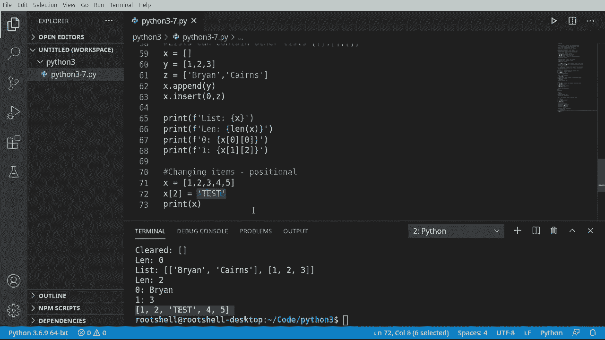
