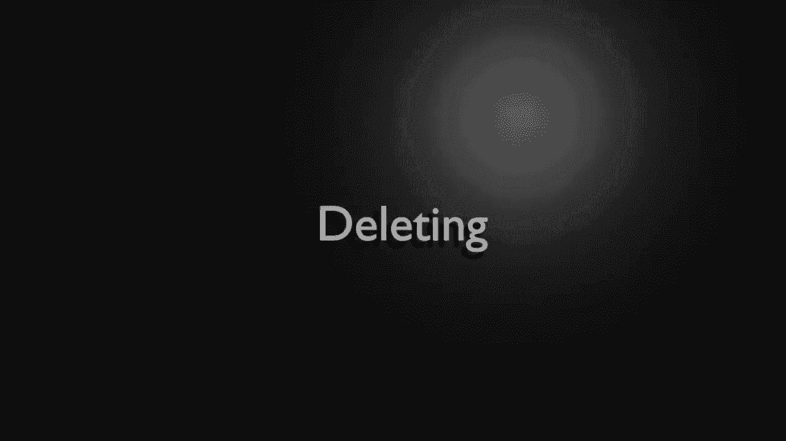
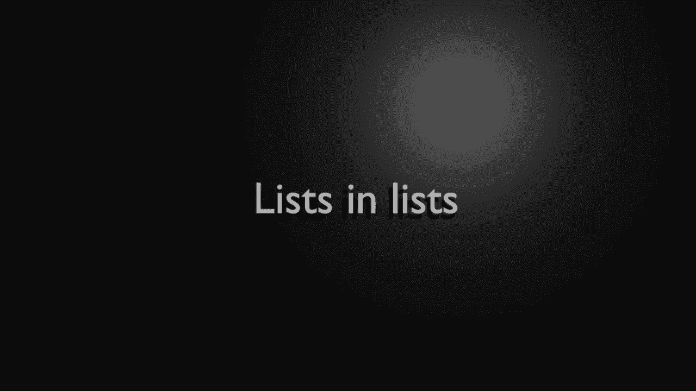

# 【双语字幕+资料下载】Python 3全系列基础教程，全程代码演示&讲解！10小时视频42节，保证你能掌握Python！快来一起跟着视频敲代码~＜快速入门系列＞ - P7：7）Python列表 - ShowMeAI - BV1yg411c7Nw

Welcome back， everyone。 My name is Brian。 And in this video， we're going to cover lists。 A list is a complex data type compared to what we've been talking about。 It's very complex。 So far。 we've covered bulls， numbers and strings， but the list as well vastly more complex as we're about to see。 So first off， what is a list。😊。

Well， it's an ordered。

List or collection of data， and what do I mean by that？Imagine， we add an item。That item is going to be at position 0， meaning the first item you add is always 0。 And as we add items。You guessed it。That index will increment。LetsGo ahead and add an item here。So01。2， and these items， they can be the same， they can be different， they can be something totally crazy。

Whatever we want to do。This is the beauty of Python。So the list doesn't have to be what's called typed。 meaning you don't have to have the same data type。 That's how a lot of lists work in a lot of different programming languages。 You can intermix strings with numbers and custom data types。 The main takeaway before we dive in here is that this is an ordered0 based index， meaning。It will be added in the order you add them， and the first item is always0。From zero。 it goes to1 and two and so on and so on。

Okay， let's go ahead and create a list first thing you'll notice in our notes here is I have these square brackets right here。What that denotes is that it is a list， it's important that you remember that because we're going to talk about other data types that are very similar to a list。

 but they are different and they use a different style。First things first， let's create our list。 remember the square brackets， I'm going to say x equals square brackets。And anything we put inside these square brackets becomes part of the list。For example。 I'm going to say Brian。And we're going to add another item by our syn comma and then whatever we want to put in here。

So we have two strings in there。Now， really hurt your brain。 if you're coming from another language。 I'm going to add a number。 That's right。This is not a typed list。 You might be used to something like C++ where well， you have to have a specific type。 it can only have strings or only have numbers。Python is not like that at all。

 It makes it very flexible， very easy。So let's go ahead and put a note in here。We can mix data types。And let's go ahead and print this out。And I want to say list。Go'ming to print our list out。It'll copy and paste。 Let's put this down here and let's get the length。So you can see right off the bat， our list is this right here and it's inside those square brackets。

 always remember square brackets are lists， and we can have two strings and a number we could add whatever we want。 and there are three items in there。If you're coming from another language。 this may actually hurt your brain because you're going to go wait a minute。 you can't have multiple types， but with Python you can。It makes it super convenient。

 super easy to create your own data structures on the fly。Let's make a special note here about indexing and positioning。 so this really confuses a lot of people。We think like， well， humans， the first item is always one。 well computers don't think that way and the first item is always zero because you're starting with nothing。

So when we talk about lists， this is zero based。Let's go ahead and let's grab our friend print here。And let's say， we want the 0。So to grab the first item in that list。Simply say square brackets and the index。 Now， note we are not creating a list。 We're saying inside of that list， get that index。 In this case， it's the0 or the first item。

I'm going to put that in all caps for you newbies out there， the first item is0。Remember。 humans think the first item is one， computers think the first item is zero because you're starting with nothing。Now， if you watched the previous video on strings， and I hope you did。 you understand what slicing is。 But just in case you skipped it。

 a slice is a lot like making a slice of bread。 You have a nice bake loaf of bread in front of you。And you don't want the whole loaf if you just want a slice of it or a slice of pie is probably a better example。So we're going to print this out and we're going to slice this。So I'm going to say， I want X。 and then we're going to。 You guessed it。 Now， notice those are square brackets as well。

 We didn't cover this in the last video。 But， yes， when you see that square bracket。 that means we want a piece of this list。 or in this case， a slice of it。I'm just going to put some quotes here。P are some quote some comments， slice the list。So what this is going to do is it's going to say X and we have a starting position and an ending position。

 we're going to go from the first to the second。 Now， remember the first is not the first item。 It's position one。 Remember that gets super confusing as far as zero based indexes。To illustrate that。One to two position is actually Karen's。So what we're doing is we're taking this list here。And we're saying0，1。To two， so it's going to stop。

If we omit this second position， we're going to get the remainder of this。 We're going to say we want that whole slice right there。 So let's demonstrate that works as expected。Slicing is a very convenient way of getting a sub item。

You may be thinking lists are great， but now that I've created the list， how do I add items to it。 that's a common question。So that's what we're going to cover in this little section here is how to add the items and you can either append or insert。And both of them do well exactly what they sound like they do， for example， X。pen。We are going to say a pen pizza。And let's go ahead and X dot append。

I'm doing this twice for a reason， and you'll see why here in just a second。And add beer because everybody likes pizza and beer， right now we want to insert。So aend will put things at the end in the order you put them。 noticeice we did two appends。 pizza and beer， so it's going to add pizza， then it's going to add beer and it's going to do both of those at the end。

Now insert。Allows you to say， I want to put this at a specific position。So because we're talking about a specific， I need to give it a number。 and in this case one。 you notice it wants an index， an integer of where you're going to put this in the list。So I'm simply going to say one。And let's add cats。So following along。

 what we're doing here is we're adding pizza to the end of this list， then we're adding beer。Then we're going to go to the one position， not the beginning。 the beginning would be 0。 remember。 we're going to go to the one position。And add cats。Let's go ahead and add a few notes here。That way。 anybody who downloads this code off GitHub will just have the notes and be able to easily follow along。

Now， let's go ahead and do a print。And I want to see this list in its entirety。And let's see what this looks like。Okay， down here。 you can see we have our list and we have Brian and then cats got inserted in the first position。And then my name Karen's 46， and then it did pizzas and beer。

 Very important to understand that append will do it in the order you append it。 So it put pizza at the into the list。Then it put beer at the end of the list。Very simple once you wrap your head around that just trips up a lot of newbies。Just bear that in mind when you're adding things if you want a specific。Index。

 you need to do insert if you want to slab it at the end， you do a pen。

Okay， now that we've added items， let's talk about how we get rid of items。 We're talking about removing。 Let's remove pop and delete。 And these do things very differently。 even though。At first glance， they may seem very， very similar， so I'm going to say X。That remove。No want to remove cats。I'm not a big fan of removing cats becauseuse I happen to love cats。

 But you know what I mean， we sometimes you just got to get the cats out。So what remove is going to do is go through and remove the first item here。Sra our print statement。 slap that down here， and let's run this。All right， so you can see Brian Kas， Karens。 now it's Brian Karen's， we remove cats， so just remove that first item there。Now， let's talk about。

Up now。Don't get excited， pop is not like Coke or pepsi or anything like that but。What we want to do is we want to remove an item， but at the same time return it。 meaning we want to be able to work with it here。So I'm going to say I equals。 and we're going to do X dot index because we want to find something here。 We want to find pizza。

Now this will raise an error if it's not found in there， so if you just look for something crazy。 it's not going to return negative one and there really isn't a fine remember we talked about fine in the last video where it returned a negative one。 this is just going to say， hey， there's an error and it's going to crash your program。That sounds really bad until we get into more advanced discussions where we talk about how to get around that and why it even exists in the first place。

So。Just big leap of faith at the moment。We know that pizza is in there because we appended it。We're going to get that index because nobody wants to sit here and count and figure out what position this is actually at。We're going to say food。And we're going to pop。Now， when you think pop。Think of it like popping the top off of an nice cold soda or beer， whatever your favorite beverages。

 you now have that cap in your hand after you've popped it off。That's at least how I learn P。 so when you pop off the cap you still have that cap in this case。 it is the item at index of whatever pizzas is at。Sounds super confusing， it really， really does。 but it's really simple once you see it in action。 So what we're going to do here is I'm going to clear this list just to avoid any confusion。

And we're going to run this。Boom， so what's going on here。 We have our list and see there's pizza in there。And we're going to pop。 meaning we're going to pop the cap off that thing that's in our hand and we now have that bottle cap。And that bottle cap is pizza， so we can now use that， but once we've popped it。

 it's no longer in the list， see how it removed it。Very convenient if you want to remove the item。 but at the same time， use the item。Seems a little confusing， but bear with me。That is actually used quite a bit when you get in a little bit more advanced programming。All right。 next up， we're going to talk about deleting。So I want to say I equals。Say X index。

And let's get the index of beer。Because again， no one wants to sit here and go zero，1，2， three。 no one wants to do that， we just want the computer to figure out where it's actually at for us。So once we get that index， and I should put a special note here。This will raise an error。 if not found。But once we get that， we want to actually just delete it。 So we're going to say D EL。X。

 and then whatever that position was。Now this will delete the item without returning it。 and I'm going to copy and paste some notes in here。So delete a specific item without returning it。Where pop will remove。And return the item。Fundamental difference there。Which one would you use and why， Well， pop is if you want to actually use it。

 delete is if you want it gone。 Now， when you delete this。It's gone， you cannot use it。 it doesn't even exist in memory anymore。And that's why it's called delete。 because you're literally deleting that out of memory。 If you're coming from like C or C plus plus or any other language that does memory management， Yes。

 you are actually deleting that out of memory。 Now， under the hood。 what's really happening is Python's flagging that for garbage collection and all this other fancy stuff that newbies don't really understand。 But if you're more of an advanced person， that's what's going on is Python saying。😊。Get rid of it out of the Python internal list。Were just going to let garbage collection wipe it out later on。

Save run， this is what's going on here， so we found the index of beer in we deleted it。Pretty cool。 pretty easy to understand so major takeaway from removing items if remove will remove the first one。 pop will remove it， but let you play with it and you can do whatever you want and delete will well actually delete it and get rid of it。Let's talk about extending or adding elements from another list。

 and this will be a little bit confusing， but bear with me here。There's a reason why you would extend rather than just add a list and it's because Python you can actually add lists into list。 which we're going to cover at the very end of this video， but it gets super confusing。So let's look at this。 so we're going to say we're going to make another list。

And let's call this cats。Tma， dogs。那么。Bds and in case somebody out there is like， well。 how would you actually add a comma， you wouldn't add a comma directly。 you'd added as string like that。But we're just going to add in cats， dogs and birds。Into our list called Y。 Now the list we've been working with is called X。

 So we want to take the contents of Y and put it inside of X。 So we're going to say x dot extend。Sometimes intelligencetelence helps us out， sometimes it doesn't。And we're going to extend with the Y list。Let's go ahead and print this out。Notice we're printing X。 what do you think pop quiz， what do you think this is going to look like when we run this？Well。

 if you said it's going to have the contents of both lists， you're absolutely correct。 Now。 notice how what it's done is it's taken R X。And added the elements of Y to it。 so these are now。True items inside of X。

Very cool how that works。

So let's talk about sorting and when I say sorting， we mean sorting and reverse sorting。 meaning doing the exact opposite of like an alphabetical。 So let's go ahead and say。Sort in reverse。 Now， think of this as like sort ascending， sort descendending now。Our list is a mixture right now。 And what do I mean by a mixture， So if we just take this。Prennt this out， run it。

You can see how we got string， string， int， string， string， string。We're going to have problems with this integer and we're going to have to take that out。 and I'll demonstrate this really， really quickly。 so I'm going say x dot sort。And this is where a lot of newbies get tripped up and it goes not supported between instances of end and string。

 and it's exactly that so it's saying it knows how to sort strings。And it knows how to sort numbers。 but it doesn't know how to sort a string to a number。So think about that。Let's say you have a table in front of you。And I come in and I dump a bunch of potatoes and a bunch of apples and I say sort these。Well， how do you want them sorted， Do you want the potatoes in the apple sorted or do you want them sorted by color。

 but they're all different colors。 And this is what I mean， Python gets really confused。 And it just says， you know what， I'm not even going to try and figure this out。 I'm just going to drop an arrow and let you just figure it out on your own。The easiest way to get rid of this at this point is to simply remove it。 Some must say X dot remove。

We're going to just remove that hint。And then we're going to sort。So now it's alphabetical because we've removed that。 It knows exactly how to sort these strings。 Bir。 Bryan， Karen's， cats， dogs。 Very， very simple。 The polar opposite， of course， is reverse。 And we're just going to grab this for the sake of time。

Pretty self explanatory what's going on there。This would be like sort ascending， sort descendending。I almost wish they didn't call it reverse， but called it like sort descend or something like that。 or you know had a parameter inside of sort and we'll talk about parameters later on。 but it can be a little bit confusing， but just think of sort as you're going to sort alphabetical and reverse is the polar opposite of that。

You notice how。When we sorted， we had to remove that int。 simply because sort will throw some sort of error if there's a mixed type。 Now。 what if you wanted to do that。But you didn't want to really modify the original list。Well what we're going to do now is called a copy and some people call this cloning with this various shallow clone。

 but basically we're just making a copy here， So we're going to say y equals x dot copy。Does exactly what you think it does。 It actually makes a new list and copies the elements into it。 so we're going to say。Proopies the elements into a new list。Now we can simply say why dot reverse。And we could add items， remove items， do whatever we wanted to do so I could say， well， I got aend。

Let's go ahead and pan apples。We could do any other thing we really wanted to do here。 so let's grab this print statement here。So x is the original。New is R Y。Let's see what these look like here。So our original remains unchanged where our new now has apples and it's been reversed。Pretty cool the way that works and then if you were done with wine and you didn't want anymore。

 you just simply delete it。

Which is what we're going to talk about next。

Okay， so deleting。嗯。Delete the whole thing is really what I'm going to put here。Why would you want to delete something？ Well， in the previous little segment here。 we said we're going to make Y and Y is a copy of X Now that we're done with Y。 we don't need it anymore more。 We can do one of two things。

 We can either let Python garbage collect it， meaning it's going to figure out when it's not needed any more。 or we can specifically say delete the whole list。And yes， that deletes the whole thing。So if I try to say something like print， why。It's going to have a bad time here and it's going to say name why is not defined。 And you remember from a previous video， whenever you see is not defined。

 it means it simply does not exist， meaningan we have now destroyed why and everything in it has been destroyed as well。 So all that memory for your computer nerds out there iss now freed up and gone。 We can use it for other things。This really becomes important when you start talking about embedded systems and things of that nature where memory might be a little bit more constrained than。 say your desktop or your laptop。You got to understand that when you delete something， it is gone。

 And I mean， gone gone is not defined means you would have to rebuild this entire data structure from scratch。 There's simply no way to recover it。Deleting can be a little bit drastic， as we saw。 name Y is not defined is well kind of a problem。 I mean。 what if you didn't want to delete the entire variable you just want to delete part of it or clear the whole thing off。

That's what we're going to talk about in this little segment here。We're talking about clearing。 Think of your list like a big table， and you got plates and dishes and all sorts of stuff on there。 You don't want to throw the whole table out。 You just want to clear it off。 And that's exactly what clear does。So it's going to clear。All of those elements out of the list。

 but the list itself will still exist。 It will just be blank。 demonstrate that。The' type cleared。So most of the time in programming land， you don't actually want to delete。 You just want to clear it out。 So our list exists， you can see by these brackets。 there's just no elements in there。And we can actually test that。

Let's go ahead and get the length of X。So it exists， but there's no items in there。Most of the time。 if you're confused， just think of it this way。 Delete is throwing the entire thing out。 You're throwing the whole kitchen table out where clear is you're just clearing the dishes off the table。Usually you want clear， not delete， but delete exists in case you need to free up that memory。

You want to do something a little crazy。 A list can contain other lists。 And if you look at this。 it looks kind of weird。But just think you have a start bracket and an in bracket。 followed by start end， start end and start and end。 So that's right a list。Can contain other lists。 If you're coming from another language， think of this like an array of arrays。

It's kind of advanced and it's not something a newbie really understands。 But in case you're curious。 this is how you would do it。 So we're going to say x equals。 and we're going to turn x into a blank list with nothing in it。W equals。 and we're going to create another list， and we're going to say 1，2，3。

And let's go ahead and make another list， called Z。And in here， I'm going to say。My name。 you go ahead and put your name。Or cats， dogs， birds， whatever you want to put in there。So now we have three different lists。 What we want to do is we want to。Take the contents of。Z and y and put them in X。 Some say x stop aend。Let's go ahead and pen why。Now。

 what I've done is I've taken。All of these numbers and put them inside of X。Let's go ahead and print this out。Now， I'm saying merge， but that's not really what we're doing here。 We're actually merging all these into one giant data structure。 You notice how we've got these double brackets here。So what we're saying is this item。

 this individual element is its own unique list。So I'm going to say list。Enless。All right。 now what we want to do is we want to take。The contents of Z。And put them in X。 but we want to put them before all the other stuff that we put in there。Say X insert。And let's go ahead and put this at the zero index， and we're going to put all of Z in there。

Let's go ahead and run this。And you see now our list。Actually， is made up of two smaller lists。Newbies may look at this and go， well， there's five items in here。 there's really not。 Let's go ahead and test this out here。 So we're going to say。Grab this and let's call this our lists。And let's go， Lyn。

And we're going to get the number of items in here。There's only two items in there。Very simple。 very easy to understand。Now let's say we want to grab the first item。We want to say zero and we want to go。0。And let's go ahead and grab that second item。So our first item is this list here， which is its own little list and。Second item is this list here。

 And in case you're wondering， yes， you can get kind of nuts here。What we're doing now is we're diving into those lists。So in our first list。Right here。 we're going to grab the first item。Which is prime In our second list。 we're going to grab the second item notice that's at the one position， which is2。

Seems super confusing， but just think of it this way。 Think of it like a stair step every time you see these brackets。You're going deeper down a step into the basement。So for example， we could switch this around here。And we can grab the very first item， which was one。

We could switch this around again and say we want the second item。Which is three。Seems super confusing if you're in a newbie， but trust me， once you get into more advanced stuff。 this is a huge， huge time saver is just simply putting lists and lists and when you start working with things like web services。 you're going to find that quite a bit where the data they're going to hand you is basically a list of lists and you just simply have to navigate through it。

Okay， a little bit of bonus material here。 I know I'm going to get the question。 So I thought I would just add it。 How do you change an item。 Remember， it's positional。So for example， let's say x equals， and let's just make some numbers here，1，2，3，4，5。We want to actually change this When I say change this。

 we don't want to change the whole list just one specific item。 So what I'm going to do is I'm going to say X。 and then whatever the item number is。 So let's say I want to change。The item at position 2。And we want to change this to。The word test。Remember， this is zero based and this trips up a lot of newbie， so we have zero，1， two。

 so this guy right here， we're going to change that。It's go ahead and print this out。And let's sit in action， there we go。01，2， our two position is now test 4， five。 so that is very simple how you change something。lot of people， especially me。 take this for granted because it is so simple and easy to work with。

 and if you worked with other languages， you may be looking for like a change element ad or swap element or something like that。 It's actually very simple。 You take the list， you take the position and then you assign it a value。