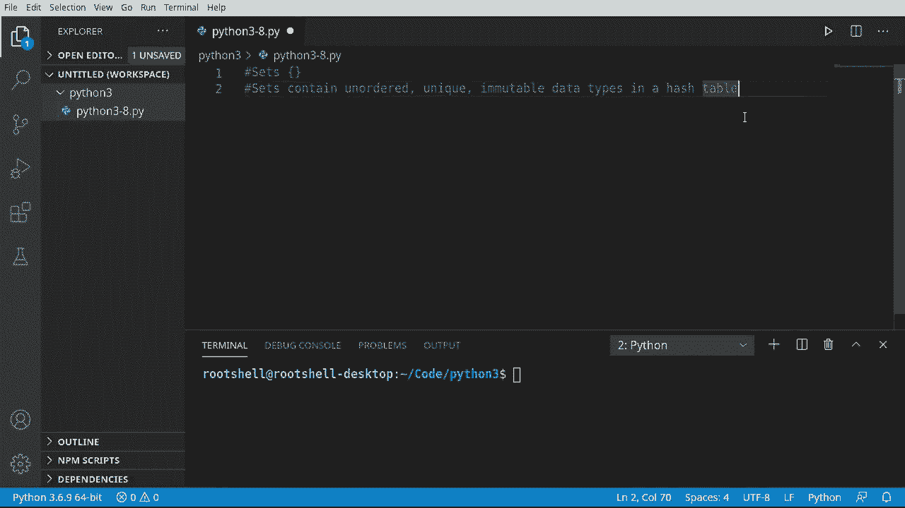
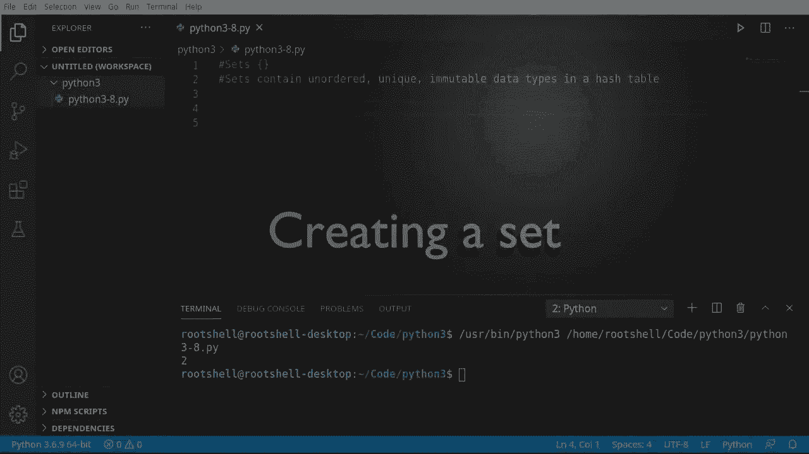

# 【双语字幕+资料下载】Python 3全系列基础教程，全程代码演示&讲解！10小时视频42节，保证你能掌握Python！快来一起跟着视频敲代码~＜快速入门系列＞ - P8：8）Python集合 - ShowMeAI - BV1yg411c7Nw

欢迎回来，大家好。我叫布莱恩。在这个视频中，我们要讨论集合。现在，集合与列表有些不同。我们在上一个视频中花了30多分钟深入探讨列表。如果你还没看那个视频，我强烈建议你回去看，因为我们真的深入讨论了列表。😊，集合。

不过，它稍有不同。这个区别意味着在底层有着深远的不同。我们来看看。集合包含无序、唯一和不可变的数据类型在一个哈希表中。让我们分解一下。这究竟意味着什么？无序，意味着我们无法控制顺序，就像在列表中。

你可以添加或插入，这意味着我们现在可以控制顺序。集合无法做到这一点。集合确定唯一的顺序，这意味着你不能有多个相同的项。如果你试图添加两个猫或两个狗，它就是不行的。不可变数据类型。这意味着什么？意味着一旦添加，我们无法更改它们。

我们只能删除或添加它们，不能更改单个项目，而且它是在哈希表中。哈希表在计算机理论中有点复杂。但当你听到哈希表这个术语时，想想超快的读取访问。集合确定顺序，以便它确切知道内存中的位置，使其速度非常快，所以如果你想要非常。

如果你需要快速查找，集合就是你需要的。

现在我们明白了什么是集合，让我们创建一个。首先，我们说S等于，然后我们想要这些小的花括号。记住，如果你使用方括号，那是列表，完全不同的数据类型。你需要花括号。在这里，我只会说一，但还有两个。

三，四，五。你可能会想，等一下。我以为它必须是唯一的。嗯。这是我非常喜欢Python的一点。它会自动为你剔除所有重复项，所以你不必担心。看到没。一，二，三，四，五。即使我们尝试在这里添加多个二。

它聪明到足以意识到它已经存在，并说，不，不能这样做。并且不会引发错误或其他问题。所以我们不必担心它会在这里崩溃。我们还可以将列表反转为集合。让我们展示如何做到这一点，梅赛。这里是我们的列表。

A的名字和年龄即将出现。现在我们要说S等于，并使用集合函数。它的作用是将任何类型的数据，例如我们之前讨论过的列表，进行转换。它会自动处理，我们甚至不需要思考。我会抓取这个。现在，请注意顺序。

我做了 Brian Karen 的 46，在列表中，它将完全按照我们放置的方式。然而，在集合中，它实际上是 46 Brian Karens。所以集合现在正在确定位置。这是关于集合你真的需要牢记的一件事：集合是无序的、唯一的，正如我们稍后将看到的，不可变数据类型。好的。

让我们看看如何向集合中添加项目。实际上，这非常非常简单。所以必须说 S.dot add。你几乎可以添加任何类型的元素。我只是想添加单词 hello。不过还有另一种方法，叫做 update。当我们查看这个时，它看起来有点挑战，写着 star S colon iderable。T none。

这都意味着什么？但当你看到这里的术语时。基本上，我们在谈论类似列表的东西。我不应该说列表，而是像列表那样的东西。某种你可以像列表、集合或元组那样遍历或导航的东西，而我们还没有讨论过。你只需要某种包含多个项目的数据容器，你可以对其进行迭代。

在这种情况下，我们将说。我们想在一个列表中做这件事。说 1，2，3。我将继续添加 hello。注意我有 Ho 两次。但我们正在处理一个只有唯一项目的集合。那么，在后台会发生什么？如果你猜测集合会自动去掉第二个 hello。

你绝对是对的。让我们看看它的实际效果。对。😊，1，2，3，46，Karen 的 hello Bryan，再次。只有无序和唯一的项目。现在我们已经添加了项目。让我们看看如何去掉项目。这同样简单，S discard。discard 正好会执行你想的那样。

它只是把它放进去，直接扔进垃圾箱。然而，discard 和 remove 之间有一个微妙的区别。小测验，有谁知道这里的区别是什么吗？嗯，一个会抛出错误，而另一个不会。因此，discard 不会抛出错误，而 remove 会。

将会抛出一个错误。我们所说的是什么？如果我们以当前的形式运行它，一切都会正常工作。让我们稍微修改一下这个并演示这个错误。因此，在我们的集合中，我们有 1，2，3，Karen 的 46，Brian 和 hello。让我们假设一个我们知道不在里面的数字，78。运行这个，结果是 O。

我们有一个关键字 78，这意味着它知道 78 不在里面。在接下来的视频中，我们将讨论如何解决这个问题。你将使用关键字 in 来确定它是否实际上在里面。但就我们初学者的角度而言，discard 不会抛出错误，而 remove 会。请对此保持警惕，随着你继续前进。我们在这里真的可以做的另一件事。

我们现在可以弹出。集合的弹出功能并不是很常用。我只想说，你可能会倾向于说，我想获取第一个项目、第二个项目或最后一个项目，但你不能这样做。它只会返回一个任意项目。你无法控制它给你哪个项目，这让人有点沮丧。

但如果你只是将集合用作容器，想要获取每个项目并将其移除，那么弹出其实很有用，但对于你来说这将是随机的，你对此将没有控制权。现在你已经弹出了它，你可以对B做任何你想做的事情，因为它仍然存在于内存中。然而，它不再在我们的集合中。我常被问到一个问题，尤其是初学者。

我有一个集合，我想修改它，但不幸的是你不能。不仅无法修改它，你也不能根据索引访问项目，因为集合没有这种概念。我们来演示一下。我将说S和0。然后我们要将其改为A。去运行一下，看看会发生什么，对象不支持项目赋值，哦。

这真让人感到非常沮丧。这实际上是设计使然。一旦你将其放入集合，它就不会改变，因为在底层，它是一个哈希表。它在进行数学计算，以确定需要存储的位置，以便进行快速查找。好的，这并不是什么大事，但我只想打印出一个项目。

我们先尝试打印出第一个项目，看看会发生什么。集合对象不支持索引。哦，我的天，这太让人沮丧了。你可能在想，这真傻。为什么要用这个？我们就用列表算了。不过，你可以这样做，但集合是为了特定的原因而设计的，那就是快速查找。

把集合想象成你电脑设置的集合，例如，所有的电脑设置，可能有成千上万的电脑设置。如果你把这些放在列表里，会很难真正导航。因此你会使用类似循环的东西，或使用一些我们尚未涵盖的关键字，这些将在未来的视频中讨论。但我们要谈的是一些简单粗暴的方式来修改集合，比如说。

我们来运行我们的代码，看看结果，我们有346个Karen和Brian。我们来试试3和S。我们先打印出来，看看这个在里面吗。是真的，因此我们知道3在S中。接下来，S去移除，我们想移除那个3。现在，我们要打开并添加。好吧。

基本上，我们在做的事情是，取这个集合，移除这个3并将其改为12。不幸的是，我们无法控制它在集合中放置的位置。让我们打印一下。可能会更多一点。好了，现在是12，46个Karen和Brian。老实说。

纯粹是运气好，它在同一位置，不要指望这个，因为集合是无序的。现在。我们可以在这里做一些疯狂的事情，这真的会让你头疼。所以让我们来。X 等于。我们将创建一个集合。假设 A，B，C，D。我实际上只是重新格式化这个，所以请期待我在输入时犯一些错误。我们将说 C，E，E，F，G。

所以我们有两个集合。现在我们想对这些进行一些数学计算，而这就是进行任何集合修改的标准方法。我们将进行所谓的并集。因此我要说 S 等于，我们想要 x，而不是并集。为什么呢？这将会……我看看我是否有一些屏幕外的笔记。

所有在任一集合中的元素。我将添加一个小的打印语句。因此我们的并集现在是。所有在任一集合中的元素。对集合进行快速修改，你不必去移除再添加、移除再添加并检查是否在其中。它会直接抓取整个集合。

让我们进行交集操作。交集有点不同。它将获取两个集合中的所有元素。但展示一下。两个集合中都有的是 D 和 C。嘿。相当简单，很容易理解。现在我们来点疯狂的。所以我们将抓取这个。我们想要差异。

你有没有听过有人对你说，我们来分一分差异吧。差异是所有在 x 中但不在 y 中的元素。在这种情况下是 B 和 A。还有一个我们将在这里讨论的元素。也许我能让我的鼠标工作。对称差异。现在，这将与你想的有所不同。

所以这就是其中一个集合中的所有元素。这究竟意味着什么呢？保存并运行。所有在其中一个集合中的元素，所以它将获取两个集合，基本上在内存中生成一个第三个集合，并说好的。确保我们返回的是至少存在于我们给定的集合中的唯一项目顺序。

而且这比这要复杂得多，但基本上就是后台发生的事情。你可以看到我们有 F，B，A，G。所以这里的主要结论在顶部。集合包含无序、唯一且不可变的数据类型，存储在极快的哈希表中。集合和列表之间的根本区别是什么呢？

这个集合的使用会稍微有点挑战性，你不能像操作列表那样轻松修改它，但它快得多，快得多。你真的不会理解它有多快，直到你进入更高级的编程。现在，我们正在学习基本数据类型，我们将深入探讨集合。

