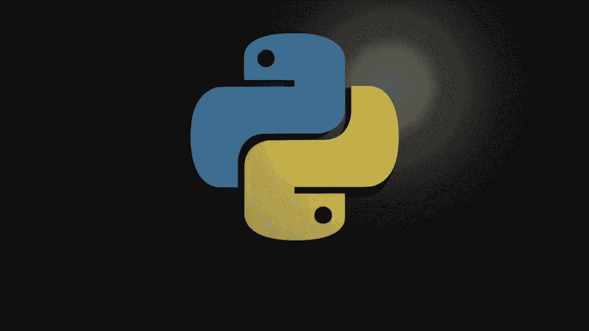
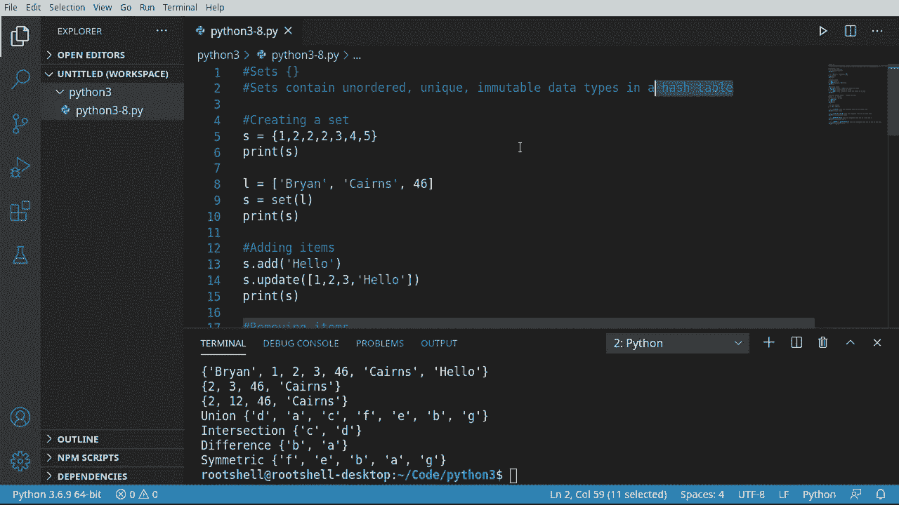

# 【双语字幕+资料下载】Python 3全系列基础教程，全程代码演示&讲解！10小时视频42节，保证你能掌握Python！快来一起跟着视频敲代码~＜快速入门系列＞ - P8：8）Python集合 - ShowMeAI - BV1yg411c7Nw

Welcome back， everyone。 My name is Brian。 And in this video， we're going to talk about the set。 Now。

 the set is a little bit different than the list。 We spent 30 plus minutes in the last video。

 deep diving into the list。 If you haven't watched that video。

 I highly encourage you to go back and watch it because we really do dive into the list。😊，Set。

 however， is slightly different。 That difference， though。

 means it is profoundly different under the hood。Let's take a look at this。

 so a set contains unordered， unique and immutable data types in a hash table。Let's break that down。

 What does that really mean？Unordered， meaning we cannot control the order， like in a list。

 you could add or insert， meaning we could now control the order。 Can't do that with a set。

 The set determines the order unique， meaning you cannot have multiple。

 So if you try to add two cats or two dogs， it's just not going to do it。And immutable data types。

 what does that mean？ItMean that once we add them， we cannot change them。

 we can only remove them or add them， we cannot change individual items， and it's in a hash table。

Hash table that gets a little bit complex into the computer theory。

 but really when you hear the term hash table， think blistering fast， read access。

 the set determines the order so that it knows exactly where things are in memory and it makes it very fast so if you want very。

 very quick lookups， a set is what you need。

Now that we understand what a set is， let's go ahead and let's create one。 So first things first。

We'll say S equals， and then we want。These little curly brackets。

 remember if you do the square brackets， that's a list， completely different data type。

You want the curly brackets。And in here， I'm going to just say one but one。Two， come two， come two。

 come three， four， and five。You may be going now wait a minute。 I thought it had to be unique。 Well。

 this is one thing I absolutely love about Python。 It automatically strips all that out for you。

 so you don't have to worry about it， see。One， two，3，4，5。

 even though we tried adding multiple twos in here。

It's smart enough to realize it already exists and says， nope， can't do it。

 and it doesn't raise an air or anything like that。

 So we don't have to worry about it exploding on us here。We can also， Hasha wondering。

Invert a list into a set。 And let's show how to do that， Mesay。Here's our list。

A's gonna to have my name and my age。And now we're going to say S equals。

 and we're going to use the set function。And what this does is take any sort of aorable。

Data type like the list， which we've talked about and convert that。Does it automatically。

 we don't even have to think about it。I'm going to grab this。Now， notice the order。

I did Brian Karen's 46， and in a list， it's going to be exactly the way we put it。 However。

 in the set， it's actually 46 Brian Karens。 So the set is now determining the position。

That's one thing you mean to really， really drive into your brain about a set is the set。

Is unordered， unique， and as we're going to see later on， immutable data types。Okay。

 let's see how we would add items to a set。 It's actually very， very simple。 So must say S dot add。

And you can add pretty much any element type you want。 I'm just going to add the word hello。

There is another way， though， and it's called update。

And it looks a little bit challenging when we look at this， it says star S colon iderable。T none。

 what does all this mean？But when you see this term right here。Basically。

 we're talking about something like a list。 I shouldn't say a list， but like a list。

 something that you can go through or navigate through like a list or a set or a tuple。

 which we haven't talked about yet。You just need some sort of data container that contains multiple items that you can iterate through。

So in this case， we're going to say。We want to do this in a list。Say 1，2，3。

 And I'm going to go ahead and add in hello。 Notice I've got Ho twice。

 but we're working with a set which is unique items。 So what's going to happen under the hood。

If you're going to guess that the set is going to automatically strip out that second hello。

 you'd be absolutely correct。 let's see it in action。对。😊，1，2，3，46， Karen's Hello Bryan， again。

 unordered and unique items only。Now that we've added items。

 let's look at how we would go ahead and remove items。 and it's just as simple S discard。

And discard does well exactly what you think it would。

 It just takes it and throws it right in the trash。However。

 there's a subtle difference between discard and。Remove。

Top quiz does anybody know what the difference really is here？Well。

 one will throw an error and one will not so。Discard。Will not。Trow and air。Where removed。

 will throw an he。And what do we mean by that？If we run it in its current form。

 everything is well just going to work。Let's go ahead and modify this a little bit。

 and demonstrate this error。So in our set， we have 1，2，3， Karens 46， Brian， and hello。

 let's go ahead and say some number that we know is not in there， 78。Run this and a O。

We have a key Air 78， which means。It knows 78 is not in there。In future videos。

 we're going to talk about how to get around that。 you're going to use the keyword in to determine whether or not it's actually in there。

 but just for our beginner's perspective， discard will not throw an error and remove will。

Be very mindful of that， as you're moving forward。Another thing we can really do here。

Is we can pop now。Oop for a set really isn't abundantly used。 I'm just going to say it。

You may be inclined to say， hey， I want to get like the first item or the second item or the last that you can't do that。

 It's just going to return an arbitrary item。 You don't control what item it gives you。

 It's just going to give you an item。That gets a little frustrating。

 but if you're just using the set as a container and you want to just get each item and remove it。

 pop is actually pretty useful， but this is going to be pretty random as far as you're concerned and you're going to have zero control over it。

Now that you've popped it， you could do whatever you want it with B because it still exists in memory。

 however。It's no longer in our set。One question I'm often asked， especially if by Nabies， is。

 well I have a set and I want to modify it， well unfortunately you can't。

Not only can you not modify it， you can't access items based on their index because the set has no concept of this。

Let's go ahead and demonstrate。 I'm going to say S and 0。And we're going to change this a。

Go ahead and run this see what happens and object does not support item assignment Oh。

 that is super frustrating。This is actually by design。 Once you put it in the set。

 it will not change because under the hood， it's a hash table。

 It's making a mathematical computation to determine where and memory it needs to go so it can do a fast look up。

Okay。Not a huge super deal， but I just want to print one item out。

Let's just try to print that first item out and see what happens here。

Set object does not support indexing。Oh my goodness。 That is so frustrating。 You may be thinking。

 well， this is stupid。 Why even use this。 Let's just use a list and get it over with。Well， you can。

 however， a set is designed for a specific reason。 that is fast look up。

 Think of a set like you would have set， like， for example， all of your computer settings。

 there's probably thousands and thousands of computer settings。 If you put that in a list。

 it's going to be hard to really navigate。So you would use something like a loop or use the keyword in things that we haven't covered yet and we will cover in future videos。

But what we're going to talk about is some down and dirty ways you can modify a set， So for example。

Let's say。嗯。Let's run our our code here and see what we got， so we've got346 Karens and Brian。

 let's go ahead and say。3 and S。Let's go ahead and print this out just to see。This is in there。True。

 so we know that3 is in S。 Let's go ahead and。Say S that remove move。

And we want to remove that three。Now， we want to go ahead and turn on and add。Well。

 so basically what we're doing。Is we're saying， take this set。

Remove this three and change it to a 12。 Unfortunately。

 we cannot control where it's going to put it in the set。Let's go ahead and print that out。

 probably a little more。Aful， there we go。hSo now it's 12，46 Karen's a Brian。Honestly。

 dumb luck that it's in the same position don't count on that because the set is unordered。Now。

 we can do some crazy things here， and this is going to really hurt your brain。 So let's go。X equals。

 and we're going to make a set。And let's say A， BC， D。And I'm quite literally just resttyling this。

 so expect me to make some typing errors here。And we're going to say C。E， E， FG。

So we've got two sets。Now we want to do some mathematical computations on these。

 and this is kind of the standard way of doing any sort of set modification。

We're going to do what's called a union。 So I'm going to say S equals， and we want x， not union。Why。

And what this is going to do is it's going to， and I'm going to see if I got some notes off the screen here。

All the elements that are in either set。And I'm going to。The little print statement here。

So our union is now。All the elements that are in either set。

Very rapid modification of that set you don't have to go in remove and add。

 remove and add and check and see if it's in there。And it just grab this whole thing。

And let's go ahead and do an intersection。Now an intersection is a little bit different。

It's going to get all the elements are in both sets。But demonstrate that。

And what's in both is D and C。诶。Pretty simple， pretty easy to wrap your head around。

Now let's get a little bit crazy here。 So we're going to grab this。And we want the difference。

You ever have somebody say that to you， let's know split the difference。

So the difference are all the elements that are in x， but not in y。Which in this case is B and A。

And one more that we're going to cover here。And this is the。Maybe if I get my mouse to work。

The symmetric difference。Now， this is going to be a little bit different than what you're thinking。

So this is all the elements there are in。One of the sets。What does that mean exactly？Save and run。

All of the elements that are in one of the sets， so it's going to take both of them and basically make a third set in memory and say。

 okay。Make sure what we're giving back is a unique。

Order of items that exist in at least one of the sets that we've given it。

And it gets way more complex than that， but that's basically what's going on under the hood。

 you can see we have F， B A G。So the main takeaway from here is all the way up at the top。

 sets contain unordered， unique immutable data types in a blistering fast hash table。

What is the fundamental difference between a set and a list， Well。

 the set is well a little bit more challenging to work with。

 and you cannot modify it as easily as you can with a list， but it is much， much faster。

 which you're really not going to understand how fast that is until you get into more advanced programming right now。

 we're learning the fundamental data types， and we just cover the set in depth。

