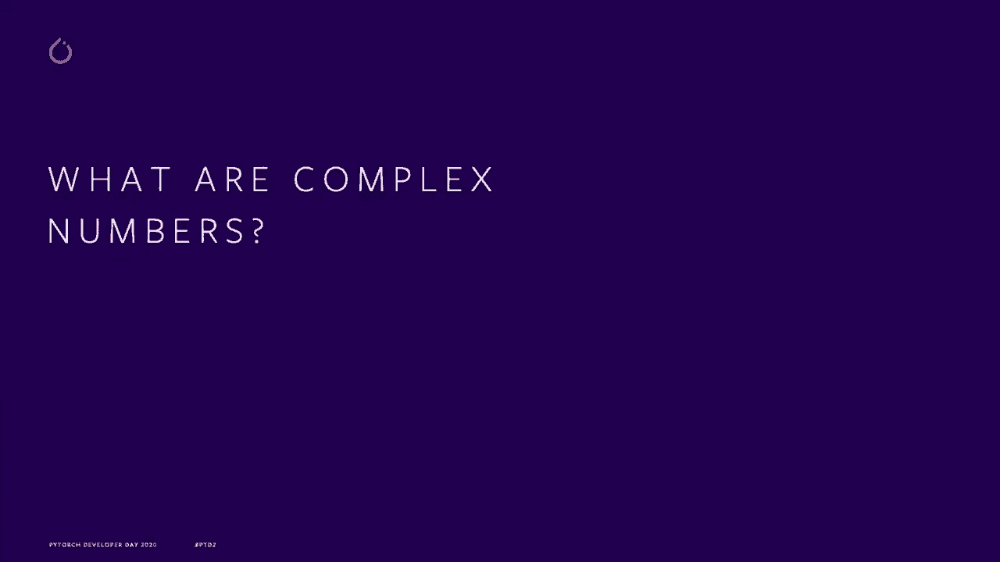
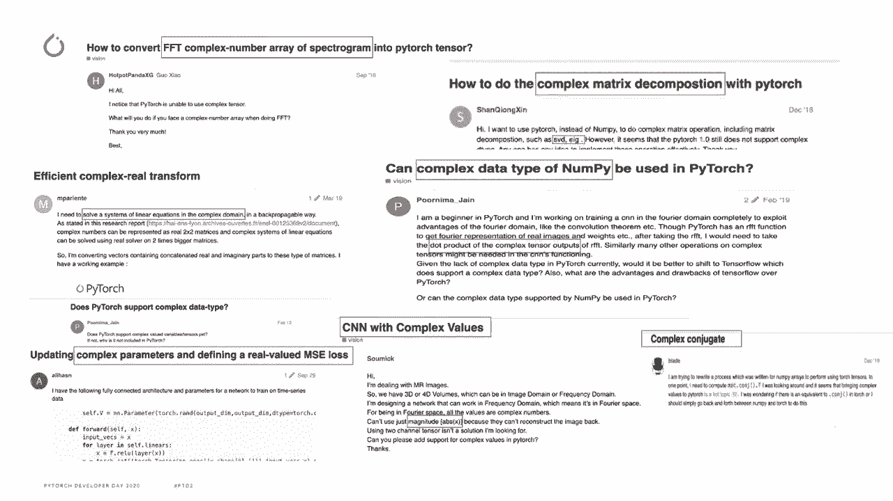
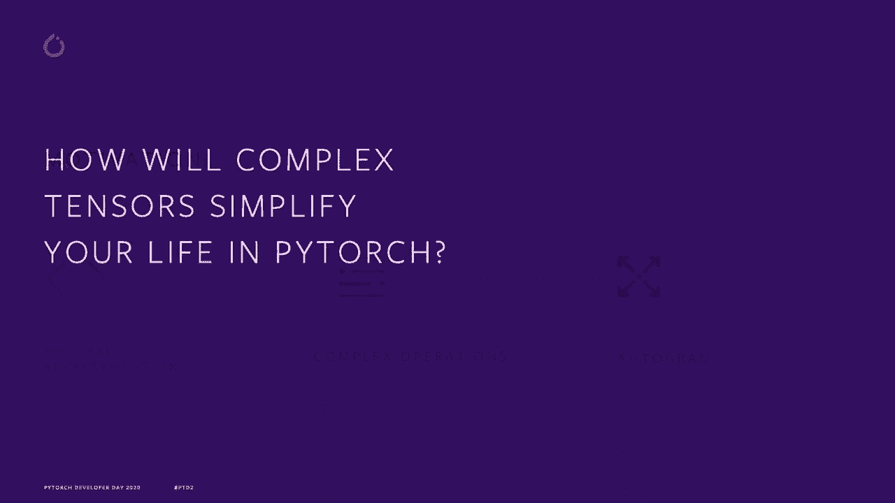
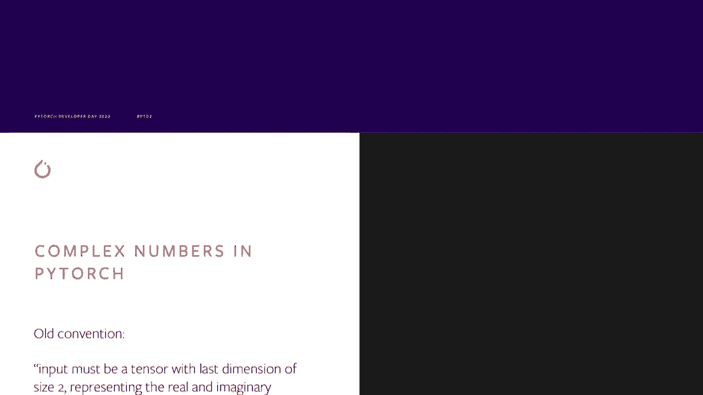
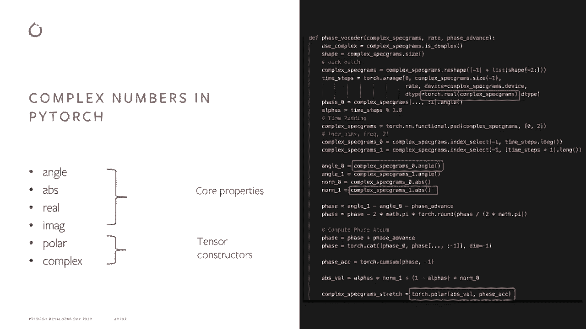
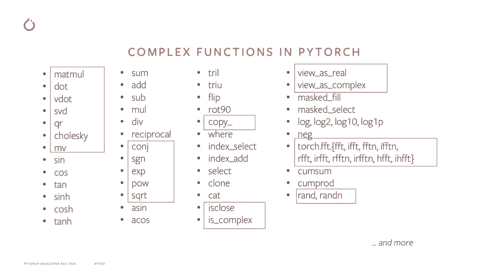
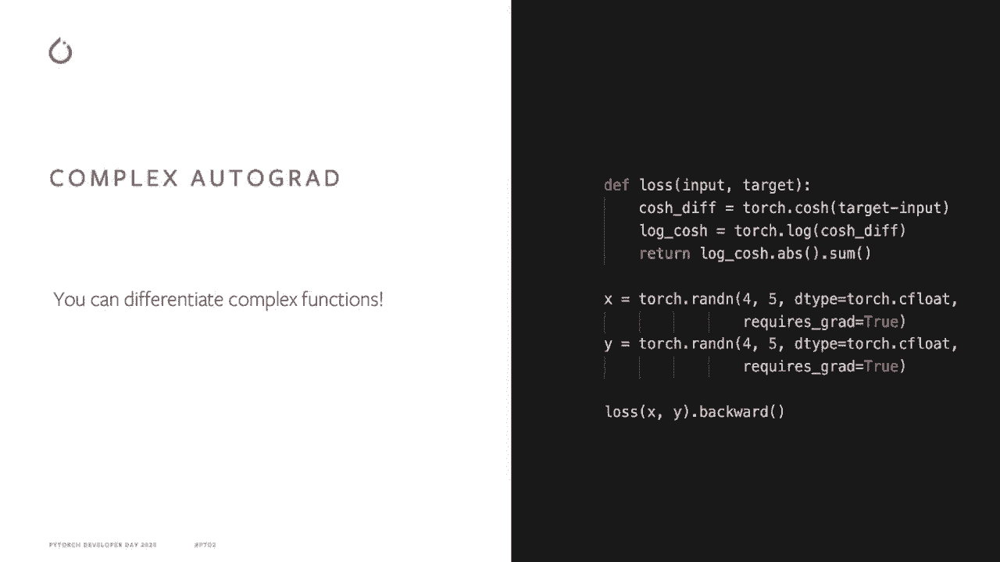
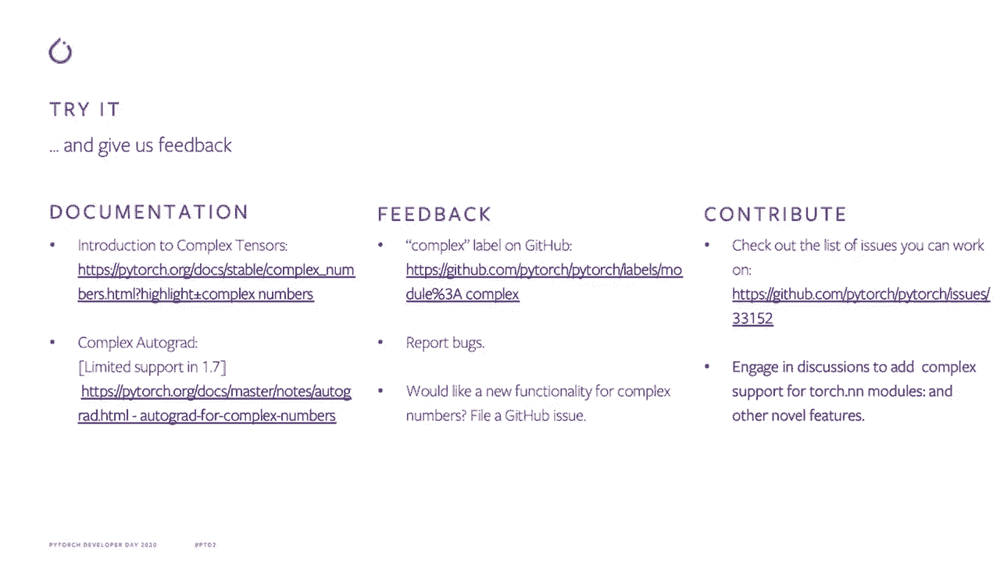
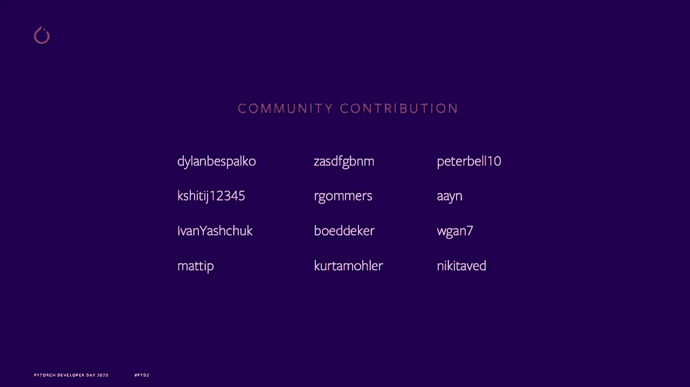

# 【双语字幕+资料下载】Pytorch 进阶学习讲座！14位Facebook工程师带你解锁 PyTorch 的生产应用与技术细节 ＜官方教程系列＞ - P1：L1- PyTorch 中的复数 - ShowMeAI - BV1ZZ4y1U7dg

🎼。

Hi， everyone。 Thanks for having me here today。 My name is Anjuli。

 and I've spent the last year working on an exciting project in the Pytorch team。

 That project is complex numbers， and that's all we're going to be talking about today。

 So jumping right in。 let's talk a little about what complex numbers are。

 Some of you may already be familiar with complex numbers。

 but I'll just go over them briefly to make sure we're on the same page。😊。

Conft numbers are numbers that can be expressed as a+ B。

 where A and B are real numbers and I is a unit imaginary number。

 which equals to square root of minus1。So now that we have established what complex numbers are。

 let's talk a little about where they are used。Complex numbers of applications in a variety of fields。

 especially ones in math， physics and engineering quantum mechanics and signal processing are some of the examples you might be familiar with。

 and thanks to Euler who came up with this amazing formula as shown on the screen that relates in imaginary number to sine and cosine terms so for example。

 this relationship can be used to rewrite a standard cosine wave equation as a product of two complex exponentials and this often simplifies a math involved since complex exponentials are easier to manipulate than their sinusoidal counterparts。

😊，We can also get benefit from complex numbers in the field of deep learning。

Recent work on neural nets and older fundamental theoretical analysis suggests that complex numbers could have a rich representational capacity before Pytorch's lack of native complex support made it harder than it had to be to unlock that potential and at Pytororch we're about empowering research in our users our philosophy is to make things easy to use and to get the hard things out of users way So as we've been receiving a request for complex number support。

 we decided to do something about it。 Here are some of the request from the Pytorge discussion forum that we have received over the years。

 we're going to talk about some of these things listed here later。

 but what I would really like to emphasize on is that this is a community drivenn project and we prioritize the features weve built based on the ongoing feedback from the community as well with the community to do the actual development。

So what we heard from the community boils down to three main points。

 which were the motivation behind adding native complex support。 First is natural representation。

 Historically， we represented complex numbers as a tuple of two real numbers。

 but we heard from many users。 that was just plain exhausting to write code with that convention。

 And so we wanted to introduce an API that makes working with complex numbers in Pytorrch easier。

 as well as makes the code more maintainable。 Second， is complex functionality。

 If would like to provide nuy like support for complex operations and leverage Pytorch's ability to run with accelerators。

😊，So far， we've also added many specialized kernels on both CPUU and GPU to optimize complex operations。

 in fact on CPUU we also support recization for complex operations。And third is autograd。

 as I mentioned before， we want to support neuralNe research。

 and so we're working to add complex autograd support， which is helpful in optimization problems。

So let's take a look at how will complex tensor simplify our life in Pitorrch？

Those of you who view spectrallos in Pytorch before might be familiar with the code on the right。

 the display tensor shows how we have historically represented complex numbers in torch。

 As you can see it looks bulky， ugly and hard to read。

 and there's really no good reason to not have complex data types in torch。 so in Pytorch 1。6。

 we introduced two native complex D types， complex 64 and complex 128。

 which correspond to float and double data types。I would also like to mention here that the functions in the newly added towards 15 module。

 which Michael will talk about later support complex numbers。

Now another good thing about having native complex support is that you no longer have to write all the annoying time consuming and error prone workarounds which used to be necessary。

 and with our latest release， many common operations like Mamall， SVD。

 etc are available for our complex number users。We've also added support for core properties as well as Tensa constructors to have natural complex number support that you may be familiar with from Ny and Python。

 and on their right is an example of a Facebook code of function written using the native complex support。

The details of the code are not really important， it's really to tell that we're constantly adding functionality to prioritize use cases that our community finds valuable。

😊。

Here are some examples of the operators we have added so far。

 as you can see we have added support for many linear algebra ops。

 trignometric ops and algebraic ops， and we're constantly working to add more。

And it doesn't stop there， with the latest release， you can also differentiate complex functions。

For those of you who are familiar with complex differentiation。

 we compute the conjugate wording derivatives For those of you who are not but just want to be able to use optimizers with complex parameters。

 we got you covered with a gradientd convention the existing optimizers work out of the box with a common case of optimizing real valued objective and in case you are just curious to write custom gradient functions you can check out our complex autograd documentation on our website。

And that's where we stand today， going forward， we're actively working to a and distribute computing support。

 which would help us deliver performance wins bigger than before。😊。

We're also expanding complex operator coverage and working to add native complex support to torch audio。

 which uses a lot of complex numbers。

So I hope we got you excited about using conflict numbers in Pytorch。

 We had the documentation up on our website to get you started， So try it， give us feedback。

 let us know what you think and really every bit of feedback we get like every bug report and every you know this was weird and we didn't really understand why this happened is really valuable to us we also have a lot of interesting ongoing discussions at Github like conflict support for To N N modules that you can get involved in Finally。

 if you would like to request new functionality or join the amazing community of contributors check us out on Github。

 we're constantly monitoring the complex table on Github。

 So filing new issues and engaging in discussions is a great way to let us know what youd like to see in the upcoming releases。

 I would like to bring this presentation to a close by giving a shout out to our amazing open source contributors and thanking them for adding a lot of conflict support to Pytorch。

😊。

And thank you for tuning in today and showing interest。

