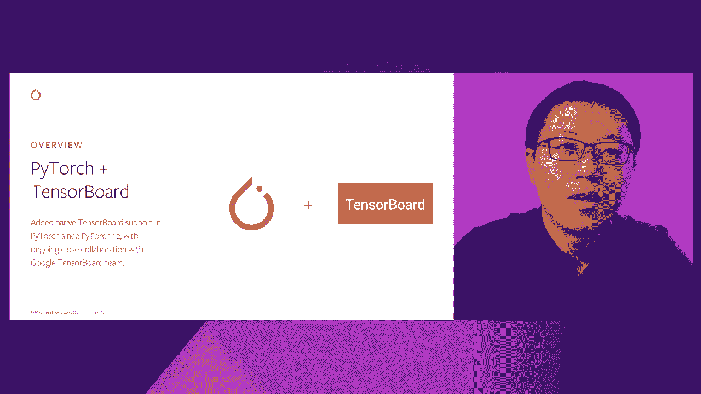
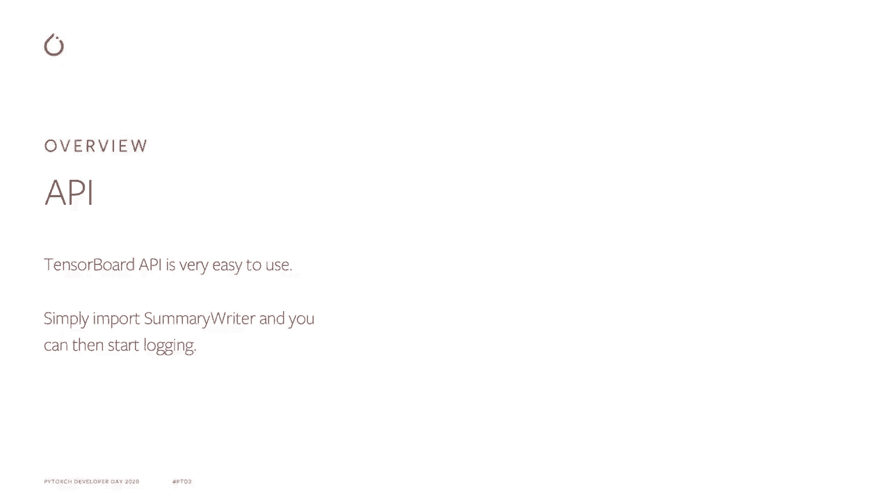
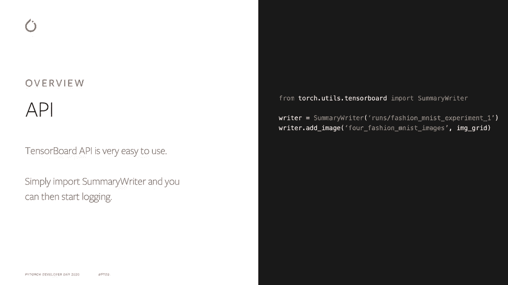
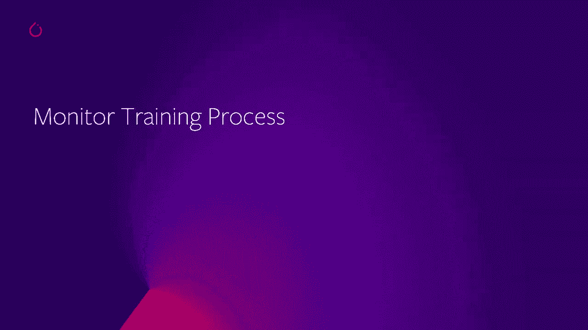
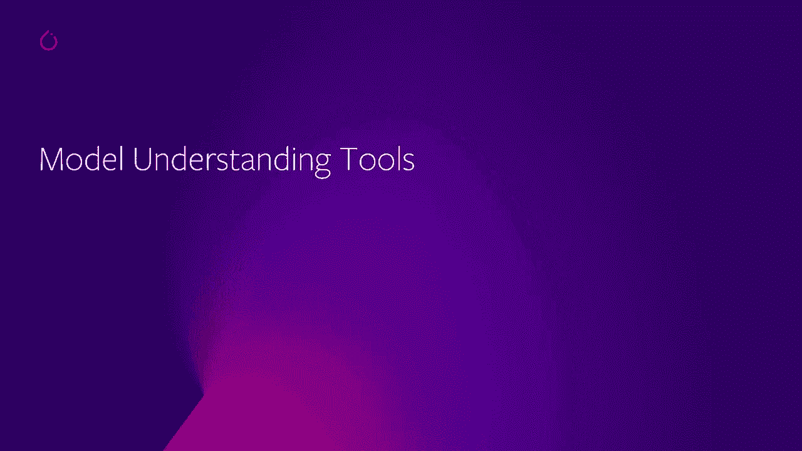
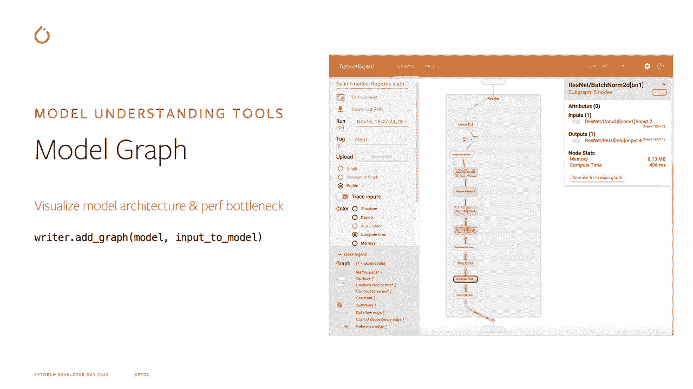
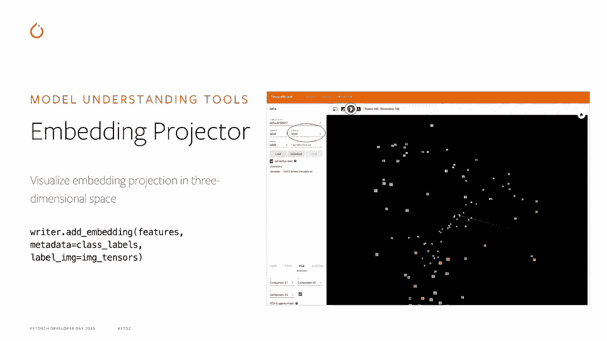
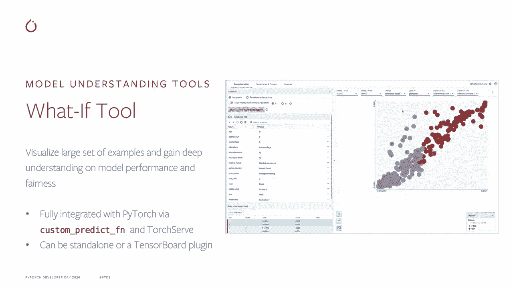
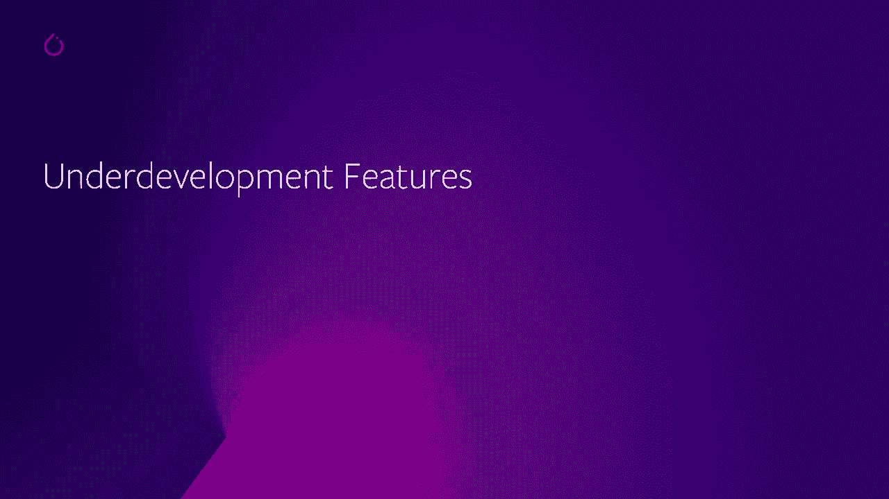
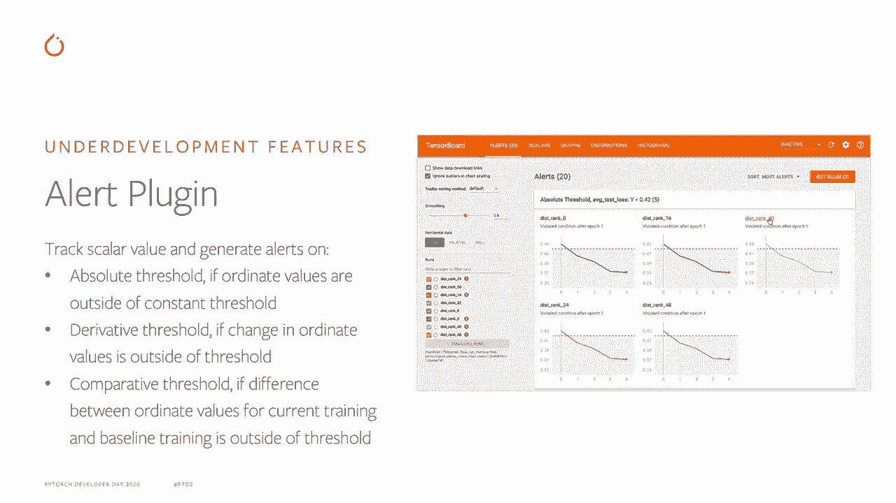

# 【双语字幕+资料下载】Pytorch 进阶学习讲座！14位Facebook工程师带你解锁 PyTorch 的生产应用与技术细节 ＜官方教程系列＞ - P10：L10- 使用 TensorBoard 进行可视化 - ShowMeAI - BV1ZZ4y1U7dg

🎼。

Hello， everyone。 My name is Si Chii Yan。 I'm a software engineer at Pytorch Model DevX team at Facebook。 Today I'm going to talk about visualizing Pytorch model using Tensorboard。Here's the agenda of my talk。 First， I'm going to give an overview of the Tensable API。 then dive deep into the API to monitor training process and then the API for modelstand tools。

 And last I'm going to give a sneak peek on some of the features that's currently under development。

So for overview， we have shipped native support for Tensorboard since Pytorge 1。2 since then we formed an ongoing close relationship with Google Tensorboard team。 So the Tensor API in Pythtor is very easy to use。 You just need to initialize the summerwriter and passing the locker representing the directory where you want to log your data into。

It can either be a local directory or remote directory， like S3。And then you can use APIs like At Scalla or add image to load your data。

The most common use case potentialtensA board is to monitor training process。 This includes using the Sca API to monitor model learning curve。 QPS or CPU YouTubes throughout training。

You just need to pass in the tag name and the sca value to the Add Sca API。You can also。Visualize multiple scala series in the same chart by using the multi line chart or the margin chart API。 The histogram API allow us to visualize the histogram and distribution of tensors throughout our training。 This includes the model weights， activation or gradients。

You just need to pass in the tag name and the tensor value to add histogram API。 and then the tensor histogram and distribution will be computed automatically unlock to Tensor board。The image MPI allow us to visualize the image training samples or the object detection boxes or the images generated from Mapllib or Pli throughout training。 for example， people can generate the scatter plot or bar chart。

Of the model prediction values through my partlib and convert into image and log through the image API。Tensible also have various other APIs for logging the PR curve of a model， text， video， mesh， etc。

The next section is about model and standing tools in Tenor board。

The graph plug allow us to visualize the model architecture and identify performance bottleneck。 You just need to pass in a Pythr model and input tensor。 and then the model graph will be generated automatically unlock toten board。

The embedding projector plug allow us to visualize the embedding value in the three dimensional space。

And H prime plugin allows us to visualize the correlation between model parameters and model performance metrics。 and then help us identify the most promising set of hyperparmeter。In this example。 we're using parallel colonary view to drill down onto some of the most promising runs and identify the common traits of them in terms of hyperparameter。The what if2 allow us to visualize large set of examples and bucketize them by either the。

Feature value or the model prediction value to help gain deep understanding into the model performance or fairness across different segments。It is fully integrated with Pytorrch via the custom predict function and Torch serve。 It can be viewed both as standalone app or as the Tensoror plugin。

The last section will cover some of the features we are currently developing and plan to bring into open source community in the near future。

The profiler plug will enable automatic model perf analysis and recommendations。 It will also enable detailed view of model Perf per operator and GPU kernel。The ploty plugging will enable us to visualize the ploty figures natively inboard。It will offer much better and more interactive user experience。

Comp with converting them to image and logs through the image API。The alert plug allows us to monitor certain model metrics across training。And then get alerts automatically when they go above or below certain thresholds。 This threshold can be either absolute threshold or derivativeive or comparative threshold。

So that concludes my talk to get more information on Pythtor Tensor board。 please visit our website at Pythtor。org and look up the Tensor board documentation and tutorial。Thanks so much for watching this video。