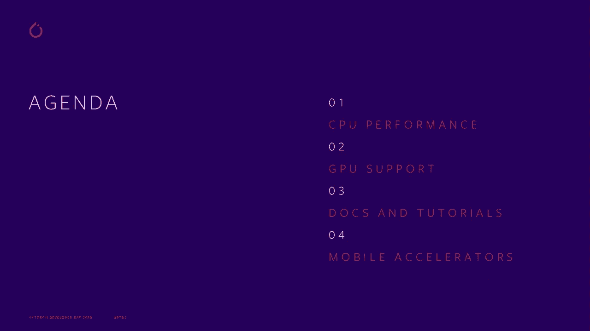
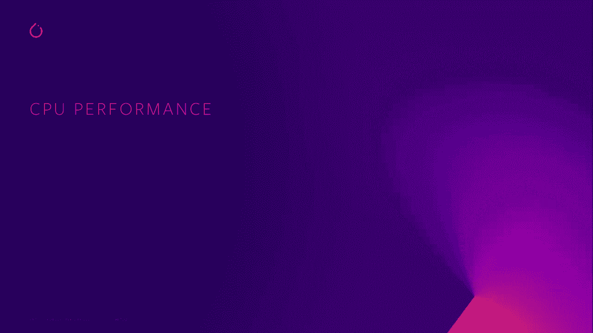
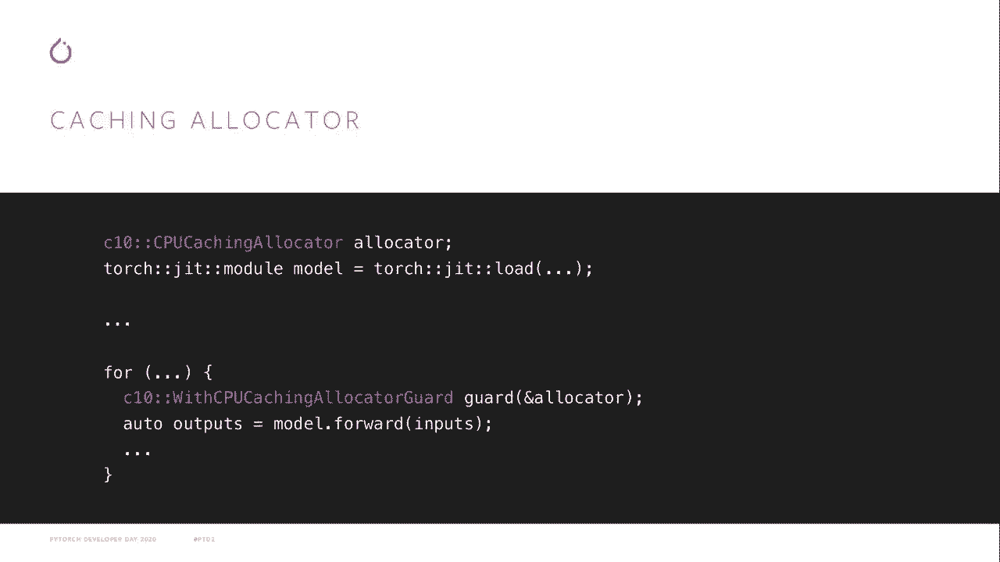
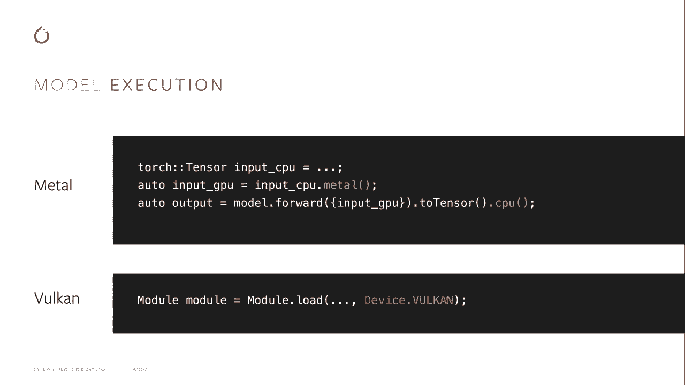
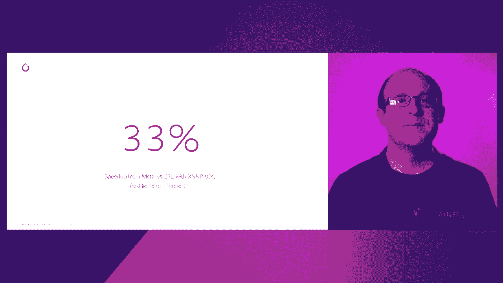
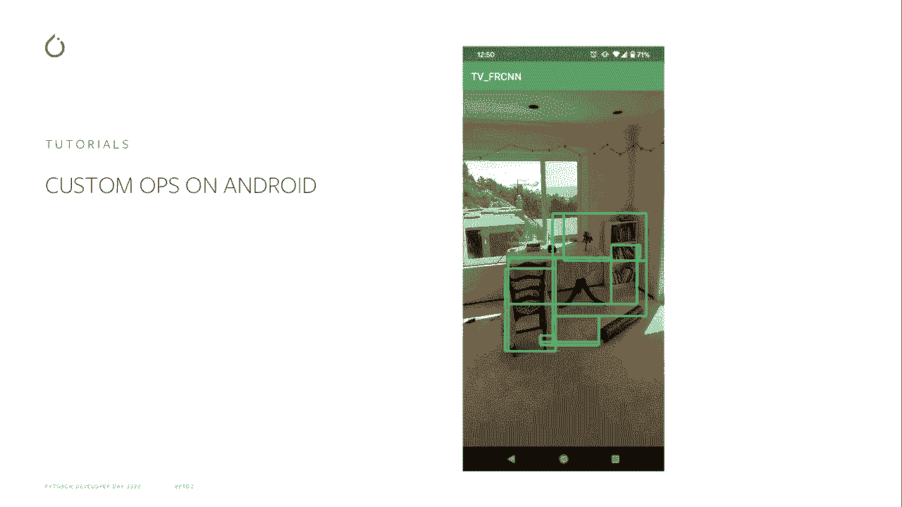

# 【双语字幕+资料下载】Pytorch 进阶学习讲座！14位Facebook工程师带你解锁 PyTorch 的生产应用与技术细节 ＜官方教程系列＞ - P13：L13- PyTorch 移动版 - ShowMeAI - BV1ZZ4y1U7dg

🎼。

Hi， I'm David。I'm an engineer on Pytorch， and today I'm going to be talking about some of the improvements we've made to Pytorch Mobi over the past year。Specifically， improvements to CPU performance， our prototype support for GPUs。 our expanded documentation and tutorials， and some news about mobile inference accelerators。

So first， CPU performance。CPUs are the most ubiquitous computational units on mobile phones。They are also the most versatile and in some cases also the most powerful。 and so CPU performance will always be a high priority for us on PyTtorch Mo。

And we've made a lot of improvements over the past year。Here is a comparison between PyTtororch 1。3。 the first release of PyTtorch Mobi， and a latest release Pythtororch 1。7。As a benchmark。 we're using a floating point version of the mobileNet V2 model。And initially。 we were running this model in about 250 milliseconds， but now in the latest release。

 we're over 10 times faster， running this model in under 15 milliseconds。And so if you compare us to some of the other mobile inference frameworks out there。 we're about in the middle of the pack， which is something we're pretty happy about considering the high quality of the other frameworks we're comparing against。Now， mobile phones are more limited than servers， and so we can't run all the fancy compiler machinery that Pytorch on the server side uses to get the best performance out of your model。

 you have to do a little bit of upfront preparation to make sure your model runs as fast as possible。

But fortunately， we've been able to bundle all that up into a single function that you can call to get the best performance It's called optimizeize for mobile。 it's very simple to use as you can see here， you just import it from Pytororch。 you run it on your model and you save the resulting model to disk。And this will ensure that you're running optimizations like folding batch norm operations into a prior convolution。

Prepacking model weights to get maximum throughput and running model freezing to eliminate unnecessary overhead。 and we hope to add more optimizations to this entry point in the future。So that covers the preparation of your model， but then when you run the model。 there are some other things you can do to improve performance as well。

We've recently released a caching allocator for memory。Now， the default behavior on PyTtorch。 both on mobile and on the server side。Is that as soon as you're done with a tensor。 its memory buffer gets immediately released back to the system allocator and in some cases。 back to the operating system， and this is great for memory efficiency。

 but if you're running the same model over and over again。 you can waste a lot of time freeing and reallocating these buffers very quickly and the caching allocator gives you more explicit control over that memory policy。😊，So the way you use it is fairly simple， you create this caching allocator object。 normally right around the same time as when you're loading your model。

 and then every time you're going to run the model。 you first create this caching allocator guard object。 which ensures that your caching allocator is being actively used during that inference。And that's all you need to do， we've seen in performance improvements on the order of 5 to 20% from using the caching allocator。

 of course， at the cost of some increased memory usage while the inference is running now moving on from CPU to GPU。

Many of you probably know that GPUs have been popular for machine learning on the server side for quite a while now。 but almost all mobile devices have a GPU as well， and they can be used for accelerating inference on device。Now， in high end phones with powerful GPUs， you can see significant performance wins from using the GPU。 but even on devices with more modest GPUs， you can get other benefits like reducing power consumption and freeing up the CPU to do other intensive operations like running a video chat call。

 for example。And so today we're releasing prototype support for GPU inference using two different APIs on iOS we have metal。 which is Apple's high performance low level API for GPU access， and on Android we have Vulcan。 which is the next generation open standard for crossplatform GPU access。The way you make use of these backends is with optimized for mobile。

 the utility function we introduced earlier for getting the best performance。 you just have to pass this one other argument to it to tell it which backend you want to use and it will perform the appropriate preparations for your model。Now， when you run the model， there's a few extra small steps you need to do。This first example is for iOS。When you take your input tensor。

 you need to call this dot metal method it to move it to the GPU so that metal can access it。 and then after you're finished running the model you need to call dot CPUU and your result to bring it back to the CPU for further processing。If you are using Vulcan on Android using the C++ API， you'll do something very similar。 but if you're using our Java API， there's a simpler method。

 you can just pass this one extra argument when you're loading the model， device。Vulcan to tell it which device the model is going to run on and it can automatically handle moving your input and output to the GPU and back whenever you run your model。Now， the benefits that you get from running on GPU will vary from device to device and model to model。 but just to give one example， we've seen a 33% improvement in performance from switching to metal from our best CPU implementation with a ResNe 18 model on an iPhone 11。

I think the release I'm most excited about today is not a code release at all。 but rather our expanded set of documentation and tutorials one of our highest priorities on Pytororch mobile is to make it easy to use and accessible and we think that documentation is an important way of enabling that so I'll talk about some of the doc tutorials that we have available one of the most interesting ones is the Pytororch mobile performance recipes this is a onestop shop for performance tips and tricks including how to do operator fusion quantization。

 making sure that you're using the best memory format。

Making sure you're reusing memory appropriately。And also how to set up your benchmarks to make sure that you're able to measure your models and verify you're getting the gains that you expect from these optimizations。We are also releasing today tutorials for Vulcan and metal which go into a little bit more depth on how to use these APIs appropriately to get access to GPUs。

And we have a number of demo apps that are being released to give you a live example of how you integrate Pythorch mobile into a app。 and these are available for both Android and iOS and they cover a set of features like image segmentation and machine translation。

We also have a tutorial out that shows how to use a custom operator in an Android application this has been a little tricky so far because you have to configure your Android NK to use an external dependency。 but the tutorial should walk you through it and simplify the process and we have an example here of using the ROI align operator to run the sorry faster RCNN object detection model in this demo app。

The last release we're making today is something to give you access to mobile inference accelerators these take the benefits of running your model on GPU and just bring them to the next level but I'm going to let the next presenter talk about the details of this release and I will just leave you with some links to further resources from the Pytororch。

org website you can click on mobile to see our homepage tutorials then mobile to see our in-depth tutorials and tutorials recipes mobile that will take you to the recipes which are little quick tips and tricks for how to use specific features I hope you have a great time using Pytororch mobile Thank you very much。

