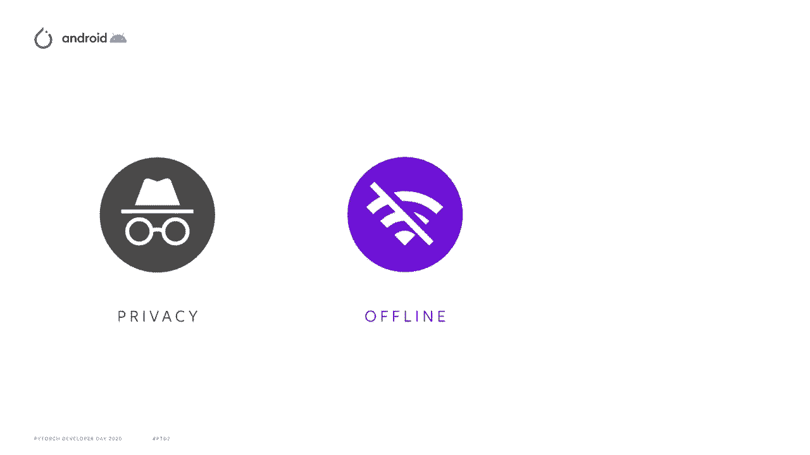
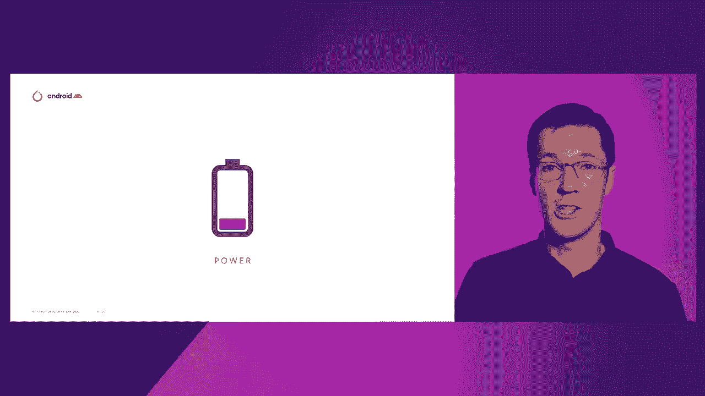
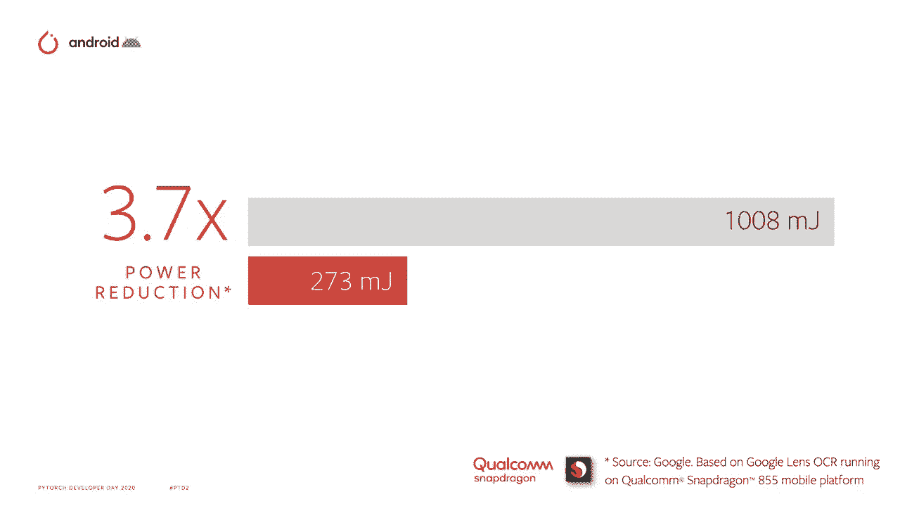
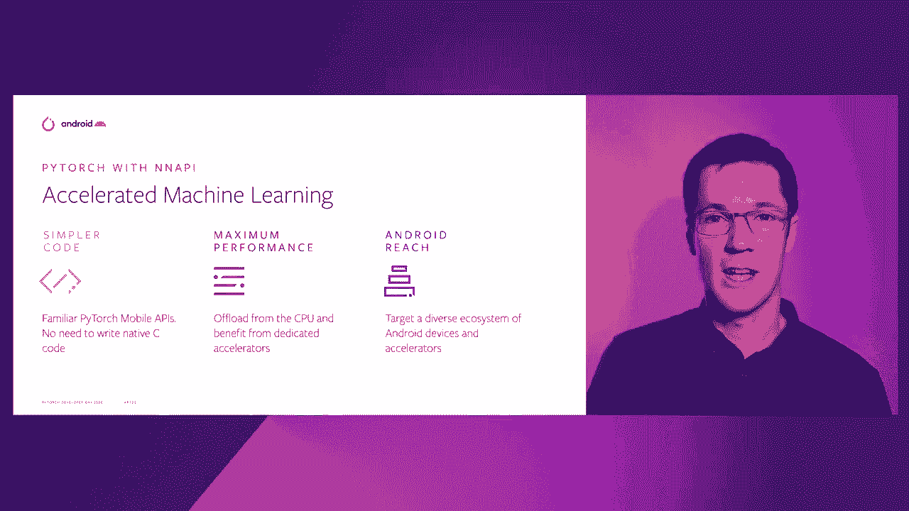
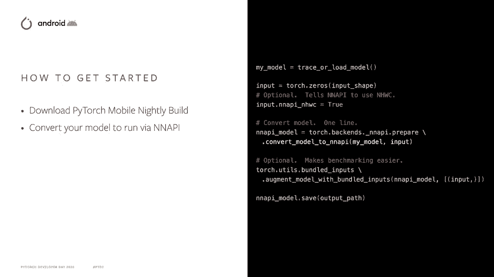
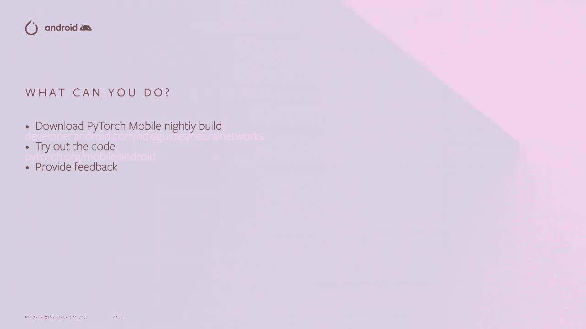
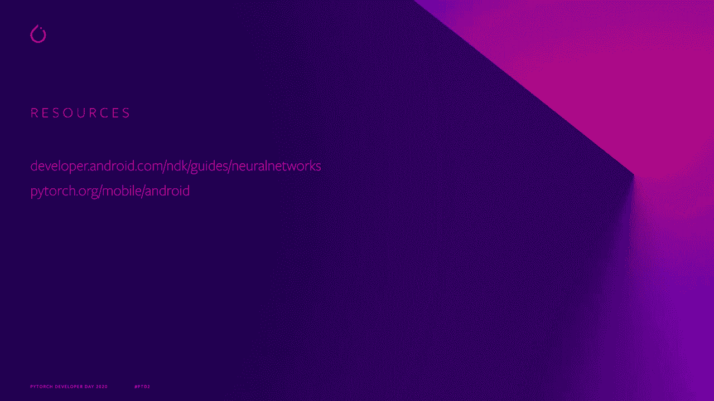

# 【双语字幕+资料下载】Pytorch 进阶学习讲座！14位Facebook工程师带你解锁 PyTorch 的生产应用与技术细节 ＜官方教程系列＞ - P14：L14- PyTorch 移动和 Android 神经网络 API - ShowMeAI - BV1ZZ4y1U7dg

🎼。

Hi， I'm Ollly， Product Manager on Android Machine learning。

And I'm going to talk to you about Pytorch mobile support for Android neuralural Networks API。

On device machine learning can bring a range of benefits。

By moving computation to be local with the data， we can improve privacy。

Ensure that our features work， even with intermittent connectivity and reduce latency。

 It's a great set of benefits。😊。

But on mobile devices， we're always power constrained。

 So it's critical we perform this computation as efficiently as possible。

Thankfully， modern devices have a range of specialist chips that can really help。😊，GPUs。

 DSPs and new dedicated ML hardware Acccelerators often termed NPUs can improve the power efficiency beyond utilizing the CPU alone。

Each of these chips is suited to different tasks， and different mobile devices can have different configurations of these chips。

This complexity can make it hard to scale a feature out to all your user base。

So the Android neuralural Network API provides a single consistent CAP for computational offload。

The diagram to the right shows an example architecture。

The app can call into an ML framework or directly into the neural Networks API。

And the graph is then partitioned according to the capabilities of the device at runtime。

 These partitions are then handed off to specific vendor driver code that optimizes the calls based on the piece of hardware that's being utilized。

We've been building the capabilities and in Android 11 we support over 100 ops， including LSTM。

We have both float and quantized data types， and you can now implement control flow directly within your graph using if and wild constructs。

 features like quality of service， asynchronous command cus and memory domains enable for extensive optimization of your workload。

And we've also made Android neural networks API an upable module。

This means we can produce updates outside of Android Deer releases to better keep pace with the ML community。

Advancedments in machine learning， a harder acceleration can produce big benefits with developing features。

MLKt saw a 9X latency reduction when they moved from CPU to utilizing an API。

And the Google Lens team saw an almost 4X reduction when they switched their OCR model over to an API。

We want to bring these benefits to as many developers as possible and so it' pleased that Pytorj Mo has added support for a neural networks API。

Utilizing Pytorch Mo， you get the same familiar Pytorch APIs with no need to write native C code。

You can offload directly from the CPU to dedicated hardware to get maximum performance across the Android ecosystem。

So how do you get started， Well， it's pretty easy。

First， download the Pythtorch mobile nightly builds and then convert your model。

It's just a few lines of code as shown here。You take your torchscript model。

Create an input variable to match the input shape and then set the layout to N HWC。

Then you convert your model。Optionally， if you want。

 you can even bundle the input to make it easier for benchmarking。Finally。

 save your model and you're good to go。

When it comes time for runtime inference， if you're using the benchmark or directly within your app。

 there are no code changes needed。 Just switch out your existing model for the new N& API model。

Real time segmentation is a feature that can really benefit from hardware acceleration。

Imagine the case of trying to determine the foreground user from their background for a virtual green screen effect。

You want to run this continuously and at low latency to provide a responsive experience to the user。

But you're typically also running a lot of computation in parallel at the same time， for example。

 video compositing effects。The Facebook Mesenger team are now testing N API to use for their immersive 360 backgrounds feature。

 utilizing the new Pytorrch mobile capabilities。They're seeing a two x reduction in latency and a two x reduction in power consumption。

The initial release supports a powerful but small set of features。

It has support for Android 10+ devices， linear convolution models such as Facebook Ne and multiplayer perceptron models。

In addition， the team are hard at work on the next set of features。

 including additional operator types， support for the popular mask RCNN model and fallback for optimized CPU paths。

The team are also investigating additional support for earlier devices and control flow semantics。

So that was a brief overview of the new Pytorj mobile support for Android neuralural Networks API。

Download the Pytorch mobile nightly bill today and get started testing the code。Please。

 do provide your feedback。

For more on Android Ne networkss API， check out the Android NDKDevelop docs and for more on the Pytorch mobile integration use the Pytorch mobileDevelop page。

🎼We can't wait to see how you take advantage of the full hardware capabilities with Pytorch mobile in order to produce amazing machine learning powered experiences on Android。

 Thank you。😊。

