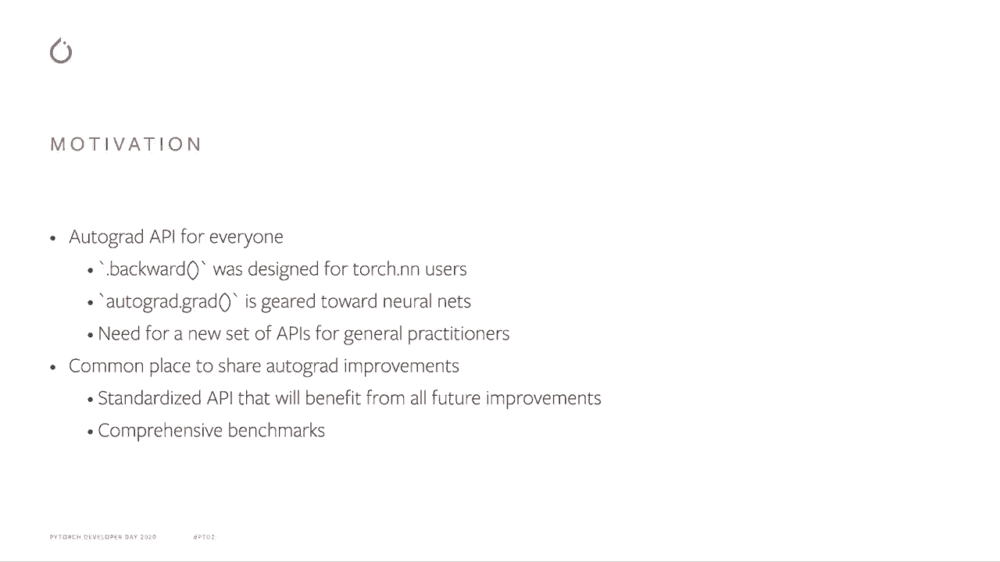

# 【双语字幕+资料下载】Pytorch 进阶学习讲座！14位Facebook工程师带你解锁 PyTorch 的生产应用与技术细节 ＜官方教程系列＞ - P3：L3- Autograd 的高级 API - ShowMeAI - BV1ZZ4y1U7dg

🎼。

Hi everyone， my name is Alban， I'm a research engineer here at Facebook and I'm working on the frontend team for Pytorch in New York。More particularly on the Autograd sub system。 and so today I'm going to talk to you about the brand new high level API that we added for the Autograd。

In particular， I'm going to give you a quick overview of like the motivations for this new API。 what it actually looks like and how to use it and finally some future works for what's going to come for it。

So to begin with the motivation for it is that the current autograd API we have is not for everyone。In particular， the dot backward function is really geared toward Torch。t andN users as it populates the dot grad fields of all the tensors and it's really associated with the states and the optimizes that we use with StN。Similarly， autogradgrad is geared toward neural network user in the sense that it is built to do back propagation and all the namings and all the API design has been done。

Thinking about neural networks。And so we think that now nowadays that we have more general users that use Autograd to do more optimization than just neural network。We needed a good generic API that these people can use to actually do everything they need。Moreover。

 for higher level functions such as computing a Jacobian that I'm going to use here is like an example for many things。It's very nice to have a reference implementation within Pythtorch。The reason for that is up to fairly recently if you wanted to compute the Jacobn with Spytorch。 you had to copy paste some code from a guest that was made few years ago。

And so people have basically a stale version of that g， potentially in their code。 And we can't really make any improvement to the way。Jacoian are computed for everyone to basically get automatically this new upgraded version。And so this new API is going to help us bring more performance improvements to the users via this generic API。

And。Following this idea， we also added recently a whole benchmark system around this API to make sure that existing models and models that are used very often by our users。Have good performance， and we can also measure improvements we're making by different change。

 but also we can measure regressions and make sure they are not significant and we can catch them and fix them before they hit main releases。

So where does this new API live？So it lives under the torch dot autogra dot functional symbolial。You can find it in the autograd documentation under like the functional higher level API name。And it has a slightly different spirit comparing to the existing APIs。 mainly that it takes function as inputs。And not the result of the forwardd pass。

The main reason for that is our twofold， one is because it's closer to the mathematical formulation and people are getting used to differentiate functions directly。 not do the forward paths and then as for the gradient。Second。 it also allows us to get more freedom respect to what happens during the forward pass。And in particular， for some of the optimization we have planned。

 we will need to do some special things during the forward pass that we don't want the user to have to worry about。 and so this new pay is going to allow us to do that very efficiently。

So what does this new API contain The first big part is first order gradients。So as I mentioned before， we have a function that directly computed Jacobian for you。 given a function and some input points。We also have a vector Jacobian product which corresponds to backward mode automatic differentiation。 and in the neural network world it corresponds to the backward propagation algorithm。

So this is actually very close to the existing autograd dot grad function。And finally。 we also provide a Jacobin vector product。 So the other way around。 and this one corresponds more to forward mode automatic differentiation。And can be used to compute directional derivatives。

And we also have the second product of this API corresponds to second order gradient and very similar functions so。A hassian function that computes all the second order derivatives。A vector Hessian product which allows us to efficiently compute with backward mode automatic differentiation。 a product between the Hesian and a given vector。

And the similarly， the other way around the hesian vector product to that corresponds more to foreign mode automatic differentiation。

So now an example on how to use DC APII。So again， as an example for the Jacobian function。 now you don't have to copy past code from that old guest， you can just import it from torch。And as you can see in the first example， where you have some input。 you just call jackhoion on it and you get the value of the jackbion and that's easy。

 that's everything you need to do。What is very nice as well is that you can compose this new API with the existing autoquad API and here。 for example， if you input requires gradients， you can ask the Jacobian computation to create graph and so to be able to back through it and as you can see you can then compute norm of the Jacob you just got and backward through that。

And then you can compose that with the rest of your training to get all the quantities that you need。There are many more examples and。A few examples here are like gradient penalties based on Jacobn computations。Jacoian vector product computations that corresponds to the forward mode automatic differentiation。This is especially interesting because they actually compute directional derivatives in higher dimension。

These derivatives are very useful for quite a few optimization algorithms。And similarly。 the second order methods that compute Hessian or Hesian vector products allow you to do Newton step methods or approximate Newton step methods much more efficiently and much in a much easier way than with the current Auto RE API。

So to finish with some future work。The first part is actually things that we are already currently working on。So the first one is for node 8， so the idea would be for both Jacob vector and Hesian vector products。To replace that with an actual for node automatic differentiation。 So this is work in progress。 hopefully we'll be able to release that very soon。

And get very good performance improvements based on that。You so one interesting thing about this new API is that you will get the benefits of this new forward mode ID for free if you already use that API when it is released。Similarly， you can get badge gradients。So this is a collaboration with the VMap features that you heard about。 and the idea here will be to speed up computation for Jacobian and Hesian computations。

And finally torch。nN composibility is another topic we're working on。 The reason for that is currently NN modules hold a lot of states and they are not functional so they don't work very out of the box with the new API that we design。 So the idea here is going to be to work on Torch end to try and provide a functional version of the NN modules so that we can work with them more efficiently。And for longer time work， we are looking for ideas and please do share your feedback on how this works。

 how it helps you do what you want to do。Do open issues on GiHub or on the Pythtorch forum if you have questions or concerns about what is happening here。 and please help us make DC API exactly what you're looking for。

🎼So thank you very much for listening and have a good day。