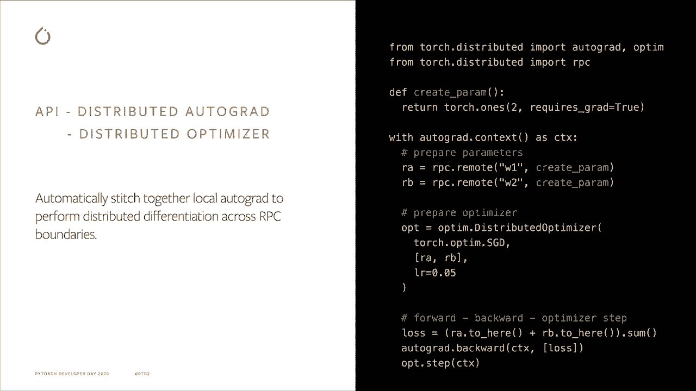

# 【双语字幕+资料下载】Pytorch 进阶学习讲座！14位Facebook工程师带你解锁 PyTorch 的生产应用与技术细节 ＜官方教程系列＞ - P4：L4- PyTorch 分布式 RPC - ShowMeAI - BV1ZZ4y1U7dg

🎼。

Hello， everyone。 My name is Shen Li。I am a research scientist in the P team。Today。

 I will talk about Py distributed package and will'll focus on RPC。

Which is a new feature that we introduced this year。

I will first briefly explain what is PC and then go through some basic RC APIs。After that。

 I will present high level ideas of how to implement different training applications using RPRPC。

Allright， so what is PythalRPC， PythalRPC is a low level framework for general distributed training。

Before RPC distributeded data parallelel or DDP has been the main feature that Py coach offered for distributed training。

However， GDPDP is one specific training paradigm where every process has a full replica of the model。

 and you split the input across multiple processes。It works for many applications。

 but there are also many other applications that do not fit into GDPP。For example。

 if your model is too large for one machine， you will need multi machine model parallelism。

Which does not work with DP。 You will have to manually send intermediate outputs and ingredients across processes and also resume all required in application code。

Which can become very complicated。Another example is that sometimes we need to mix parameter server with DP。

 using parameter servers for sparse sensors and DP for dense sensors。

This cannot be easily done with just DDP。One option to solve this problem is by adding a different feature to support each of these use cases。

Nevertheless， if we did that， it will create a large API surface。

 which can become a hurdle for users to pick up。And it will also create a high engineering overhead to write and maintain。

Moreover， we cannot fully anticipate what new training paradigms might emerge in the future。

Another option is that we can provide a set of flexible low level tools。

 which would allow users to improvise。So here comes Pwach RPRPC。

We hope it can fill the gaps for the distributed training applications that cannot use our GDPDP。

And if some new distributed training paradigm becomes widely adopted。

 we always have the option to introduce a dedicated high level API for it。

So now we know why we introduce RPRPC。Then what features do RC offer。S up 1。7。

 theres already a long list of features in IP PC package。

But I will only focus on the most basic parts in today's talk。The first one is remote execution。

This allows you to run a user function on a specific remote process。

Which is what you would expect from any RPC system。The second one is remote reference。

Which allows you to reference the remote object and pass it around。

Using remote execution without transmitting the real data。It serves as a discreted ShaPoer。

The third one is a distributed daughter grad。It will stitch together local autograd graphs of remote executions into one distributed autogra graph。

 so that when you call backward on the loss tensor in one process。

 it will reach out to all participating processes and machines and compute gradients accordingly。

That's a very high level explanation。 Let's now dive into more details。Remote execution。

It allows running a carable remotely。In Part sharp C， all processes are。

Any process can be both color and colly。After initialization by calling in RRPC。

 any process will have a message listener running in the background and use a thread pool to process requests and responses。

After that， there are three ways to run a callable remotely。RRPC syncnc， RC A sync and a remote。

RRPC S rolls R PCC synchronously。It will block until the return value is available on the color。

RBC ASync， on the other hand， immediately returns a future object of the result。

The third API is remote， which also returns right away。 but instead of returning a future object。

 it returns a remote reference。Which can be treated as a discreted sharePoer of the result。

The difference between R PCC async and remote is that the former will always fetch the result back to the color。

But the remote API does not do that。 The remote reference will keep the result alive on the call Li。

The code in this slide shows how to pass different types of callables to A R PCC API。

It can be Pythtch building operators， it can be user Python functions can also be script functions。

If performance is a concern， please use script functions。

 as there won't be a contentions on the global interpreter log。

 meaning a different IP PCCs can run concurrently on the call。Remote reference。

A remote reference is like a distributed sharepointer。

 It points to an object on the local or remote processes and will manage the lifetime of the data object using the reference count。

This is useful when a call would like to directly forward the output from the col to another process and avoid fetching the real data back to the color。

In the example， worker Ze is acting as a coordinator process。

It sets up data dependencies across four other processes。

 and none of the real data object goes through W0。The white dashed arrows are lightweight R PCC remote cause。

 and the bold red arrows are heavyweight data patterns。Let's look at one of the remote cause。

 the one from W 0 to W 3。The arguments R and RB are remote references of outputs from W1W2 when using R and RB as arguments in RPRPC API。

 the RRPC system will automatically fork R and RB on W3 and increment the reference count accordingly。

Then on W 3， it costs2 here to fetch the real data from W1 and W2。

 which will block until the data is received in W 3。In this way。

 the remote reference allows WDro to asynchronously and efficiently set up function executions and data dependencies in a distributed environment。

Remote execution and remote reference help applications to piece together forward path across processes and machines。

Another important component in Pytorch is the autograd system， which powers the backward path。

The RPC framework extends local autograd engine to work in a distributed environment。

And it also provides distributed o to update all parameters involved in the application。

One difference between local autograd and distributed autograd is that instead of storing the gradient in the peri dotgrad field。

 the distributed autograd engine stores the gradients in a dedicated context。

 and there can be multiple autograd contexts coexist for the same set of parameters。

The reason for this design is because there can be multiple concurrent backward passes showing same parameters and when this happens。

 we need to make sure that these backward passes do not step into each other's toes。Hence。

 in order to use distributed autogra， you need to first create。It contacts。

All R PCs made within that context will carry the context I information。

 which will help callers and colleagues to find each other in the back of the path。

In this tool example on the right， it first uses two remote calls to create two kilometers and initializes the distributed optimizeim using the list of kilometer remote references。

After that， it runs the forward pass by simply fetch the parameter from the owners and then sum them together。

Then it feeds the loss tensor to the discreted autogra backward function。

Which were compute gradients for all parameters in the distributed auto grid graph and store the gradient in the context。

Finally， we can pass the contact I D to the distributed optimizeimr step function。

Which will reach out to owners of all parameters， retrieve corresponding ingredients from context and update parameters using the provided local optim。

In this case， it's STGD。As you can see， the API for distributed training is very similar to local training。

Except that you will need to create a context for it。

Given all these new tools。What can you do with them？

It unlocks many discrete training scenarios on Pythtorch， and I will briefly describe three of them。

The first one is a parameter server where you can have one parametermeter server。

Or several sharded peri service holding the premiers。

 And then there can be multiple trainers running training integrations。

The R PC framework can help link them together。Another example is a distributed model parallel。

Where the model might not fit in one machine。In this case。

 you can divide the model into multiple sub modules and use RPC and RF to piece them together。

The third example is pipeline parallelism。 You can use the asynchronous APIs in R PCC to process one batch and then run interventions on multiple batchges concurrently。

Tinorials are available for all these use cases。All right。

 that's a very short introduction of Python Sha PCC。With this talk。

 I want to make sure that at least I deliver one message to you， which is。

 if DDP does not sufficient for your use case， please try P tryC。We have quite a few tutorials。

 and we also have an extensive API page。 We are actively monitoring data issues and forum questions for RPC on daily basis。

 so let us know if you encounter any problem and also let us know if there's any way that Pyth RRPC can be improved。

