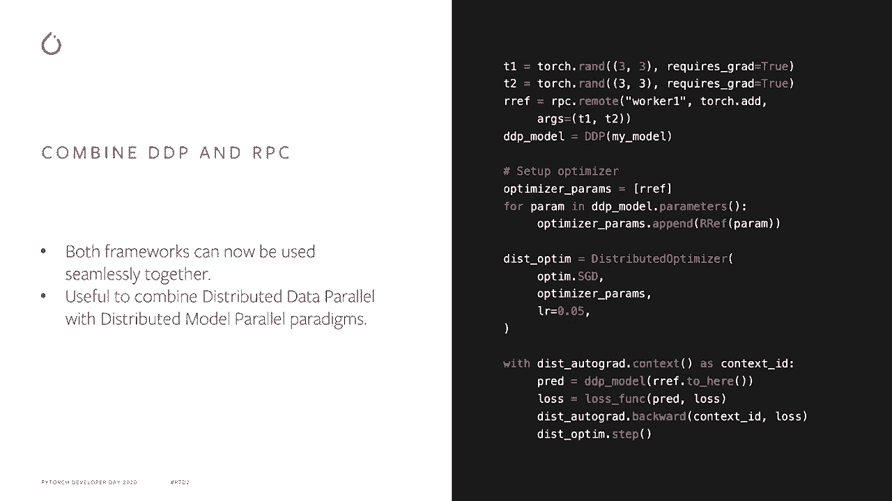

# 【双语字幕+资料下载】Pytorch 进阶学习讲座！14位Facebook工程师带你解锁 PyTorch 的生产应用与技术细节 ＜官方教程系列＞ - P5：L5- PyTorch 分布式数据并行 (DDP) - ShowMeAI - BV1ZZ4y1U7dg

🎼。

Hey everybody， this is Priam themania and I'm a software engineer at Facebook working on Pythtos Disbut I'm going to talk a little bit more about Pyths Dis today。

In terms of agenda， I'm going to talk a little bit about distributed data parallelable。

 which is DP and CTND， which is a distributed communication library。

 and then I'll talk a little bit about like future work in terms of what's coming in the future for PythOs distributed。

So let's take a quick refresher of distributed data parallel first。

 so if you have a single model that's small enough to fit on a single GPU。

 what youd do is like you'd use distributed data parallel to train this on a large scale in terms of large amount of data and large amount of GPUs。

 so you would replicate this model on multiple GPUs。

 run the forward and backward Pass and parallel and then once you have the gradients。

 you'd have like a synchronized gradients operation which all of the ranks will enter to kind of aggregate all of the gradients。

 and then you'd kind of continue other iterations where you run more forward and backward passes and synchronized gradients。

So that was a quick overview now let's talk about what's coming what are kind of some of the new improvements in DP so the first one is DP communication hook So what this does it allows you to completely override the synchronized gradient operation that I just talked about so you can register a Python colable and then have some arbitrary logic in terms of how you want to like aggregate the gradients So one example here is if youll actually want to do FP16 compression of gradients before you communicate that you could have like a callable like this where you kind of compress the gradients you convert them to float 16 you all reduce and float 16 and then finally you decompress back to float 32 so there's one example you could do more fancier things like gossip gridd which is an non full sync SD algorithm。

Okay the next item is support for uneven inputs in DP so if you have like uneven number of batches across different ranks。

 what would typically happen is some ranks which have like finished their data would not enter like this synchronized gradient call while other ranks which are still kind of processing data would enter this call and as a result this will lead to either a hang or some sort of timeout so this has been a longstanding issue in DP that a lot of Pythto users have complained about so now we do have a fix for this you can use this modeled or joint context wrapper that's shown in the example here so what this ensures is that once some ranks are finished with their data theyll kind of do a bunch of dummy synchronized operations to kind of match other ranks which are still processing data and this guarantees all ranks complete their processing altogether so this is a nice。

wayay to kind of deal with uneven inputs across your training。

Then we have some memory optimizations for DP， so DP today creates a bunch of buckets and to kind of batch parameters together for an all reduceduce call which is much more efficient but what DP does is it creates entire copy of the gradients for these buckets so if you have a one gigabyte model you'll have like one gigyte of parameters。

 one gigabyte of gradients and the DP would take another gigabyte because it creates a copy of these gradients so to get around this we have a new parameter and D called gradient as bucket view so what this does is it makes the dot grad field of your parameter a view of the bucket so that way we kind of have only one copy of the gradients。

Then I'd like to talk about combining DP and RPpC so Shan in his talk kind of described the RPpC framework and how it can be used for distributed model parallelism and DDP is used for distributed data parallelism so now we can kind of combine both of these frameworks together to kind of have more complicated training paradigms so as you can see in this example we have a DP model where it's a model wrapped in DP here so that model is replicated and then we have some remote parameters here on worker1 so now if you'd like to train this model you set up your distributed optimizer in your forward pass you retrieve the RF which is typically retrieve via RPpC and then you feed that into DP you compute the loss and then you run your backward and optimizer step so this will kind of run the backward it will kind of aggregate the gradients across all of the replicas and then it'll also update the remote parameters。

And it'll kind of run the optimizer remotery as well。 So as you can see。

 you can like combine both of these frameworks pretty seamlessly。

Okay now I' like to talk about dynamic bucketing in DP so DP would kind of split the parameters into multiple buckets as I just mentioned and it kind of assumes that the order of the backward pass is the reverse of model do parameters when it kind of builds these buckets so if this if this order is not true and in many models this is the case what would happen is like the buckets are not built in the optimal order and as a result maybe bucket2 gets ready before bucket one and then bucket one needs to wait before it can kind of schedule it's all reduce so this kind of results in suboptimal performance to kind of get around this DP now records the order of the parameters in the first backward pass and then rebuilds the buckets in the optimal order so that you can now schedule the all reduces optimally so this kind of showed about like3 to7% speed up in models like B and Roberta。

Then finally a few miscellaneous improvements we've added better error handling in niel by a couple of environment variables so you can look at the documentation for these for more details we had like a distributed keyvalue store in CD this is mostly used for Rndezvous and coordination so we've mostly just formalized this API added some good documentation around it for users we've added Windows support for CTD and I'd like to thank Microsoft for this contribution。

So now what's coming soon in Py distributed so this is probably in the short term maybe like Pytch 1。

8 or Pytch 1。9 we're adding point to point communication support and process group and C1D so this is built upon nichels point to point send and receive support we're adding native GPU support for the RPpC framework so you can send and receive GPU tensors over RPC seamlessly we're going to add a remote module remote device kind of API for distributed model parallelism so you don't have to use the RC framework directly if you want to like just place a module or part of a model on a different host different GPU you can just use remote module to kind of do that and it will be a nice highlevel API。

We're going to add pipeline parallelism to Pytch， so this is a very popular way of training models which don't fit on a single GPU。

 so it' will be very useful for training much larger models。And then finally。

 we're going to add a C&D extension to support third party collective communication libraries and I like to sorry。

 thank Intel for this contribution。Okay， so that was short term now。

 if we think about more longer term， maybe a year from now or even longer what we are thinking about in Pyth distributed。

 so we think about adding zero style training framework for really large model so this was like a very interesting paradigm that was。

That was proposed by Microsoft and we are trying to incorporate that into Py distributed then were planning to add intralaopalism so this is a very interesting technique that was used by megatron from NviDdia to kind of train large transformer models then we're also planning to add like tocr support for C1D APIs。

 So today if you have like a very complex model with some collective communication within the model you can't really tocr that model because this is not possible for C1D API so we're planning to add support for that then we have like auto tuunning for DDP so DDP has many parameters that need to be tuned manually today for example like the bucket size for the buckets that I talked about so we're planning to add some auto tuning where users don't have to tune DP for the particular environments。

Then we have an idea called hybrid parallelism where we're planning to make sure that things like pipeline parallelism。

 modism， data parallelism， and things like even intralaopalism work together seamlessly so users can kind of mix and match and figure out what's the best training paradigm for them。

And then the next step to that is like once you have hybrid parallelism。

 can we kind of automate this completely in terms of like the user just gives us a model and their training resources and then we figure out what combination of hybrid parallelism kind of works best for this model and the user doesn't have to worry about this。

Finally， I would like to share this page of like distributed overview on Pyth。

 so it's a place where you have all the information for Pyths distributed。

 I'll definitely recommend that you check this out。

🎼That's all I had。 Thank you very much， and thank you for watching。

