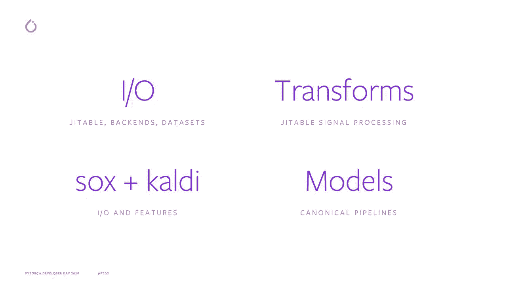
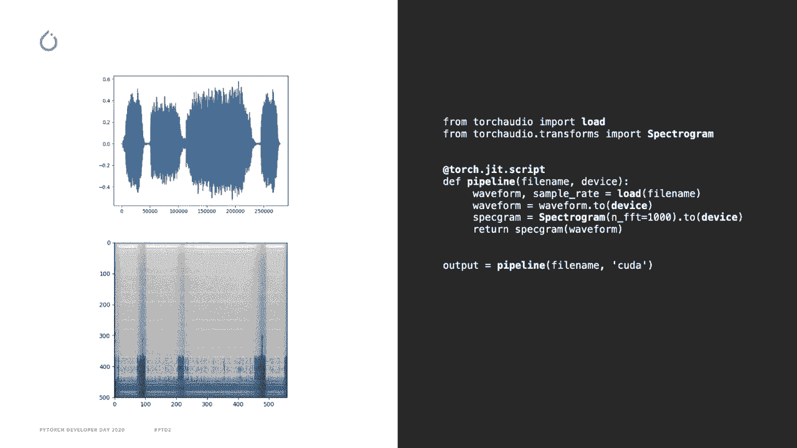
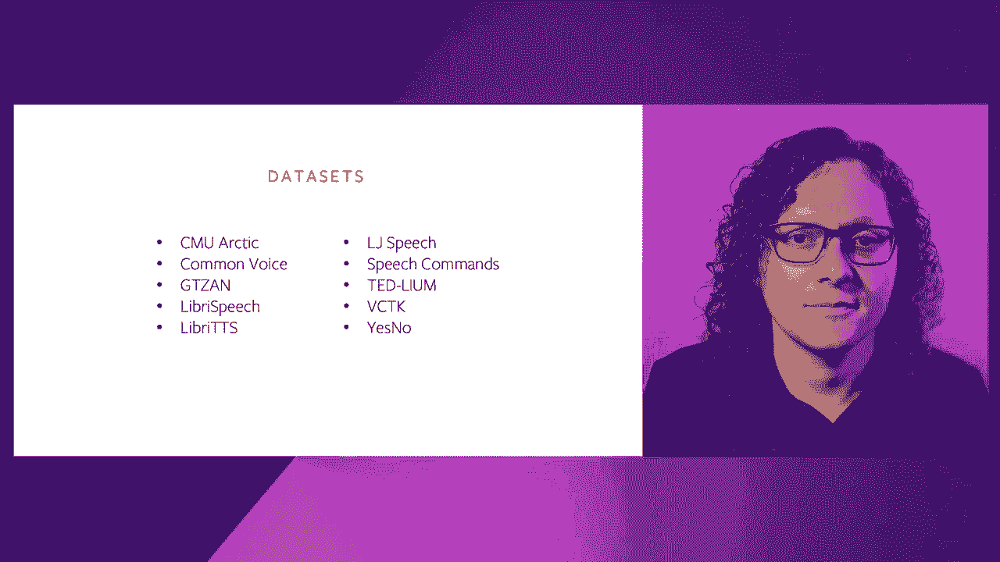
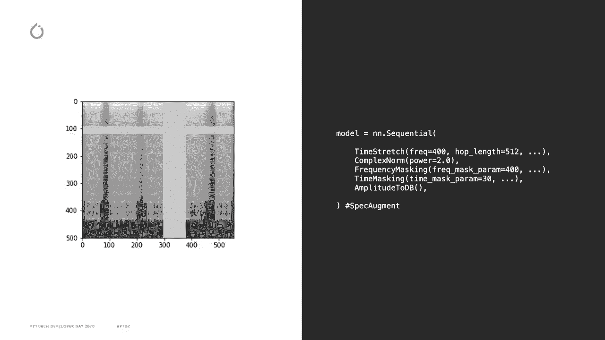
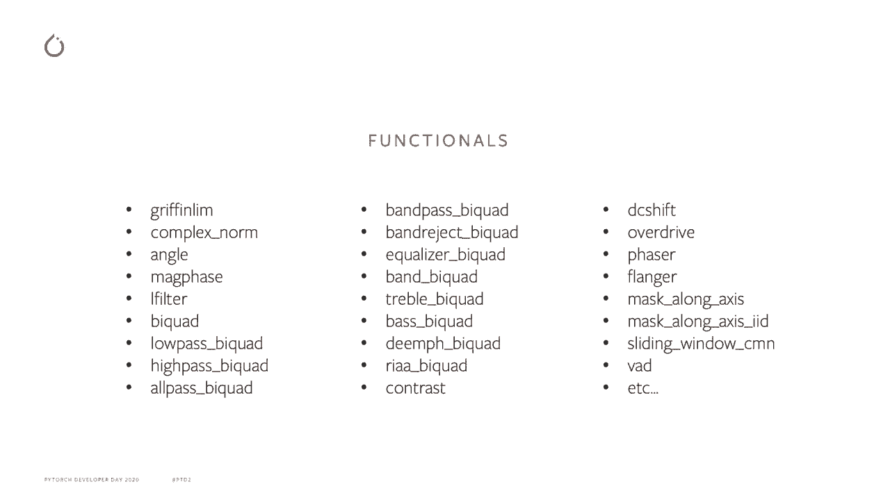
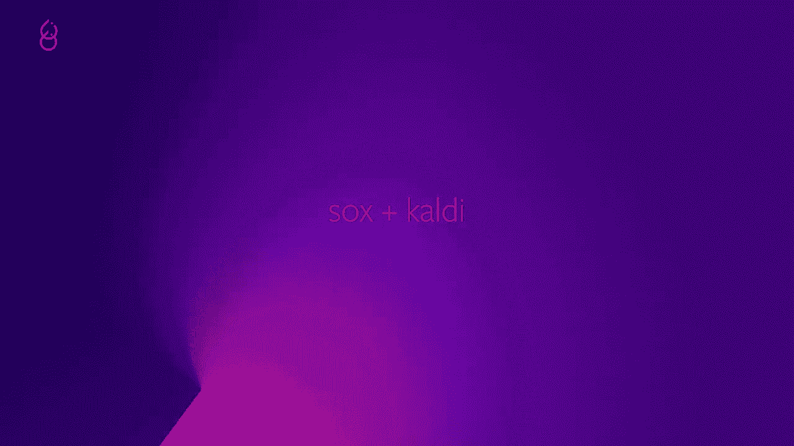
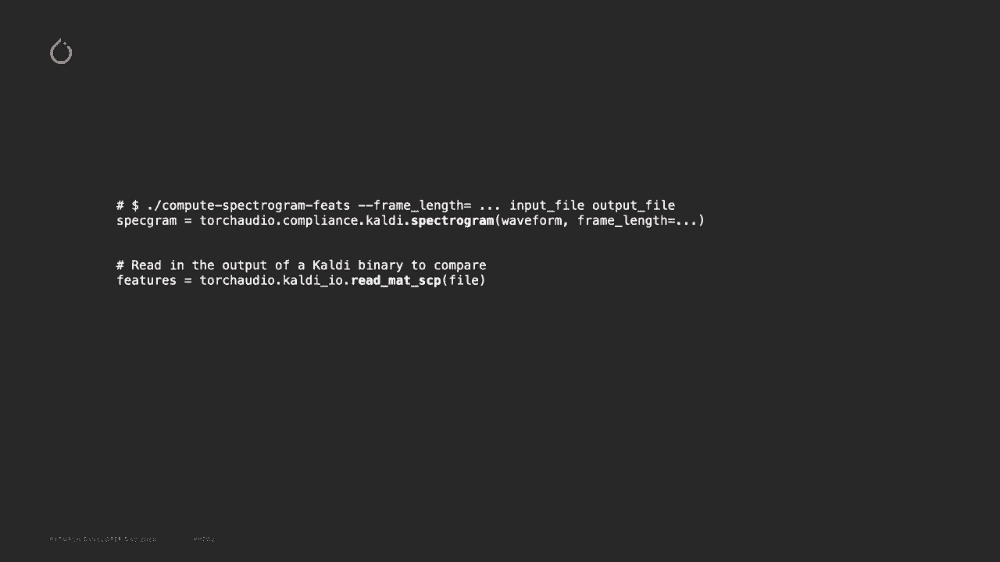
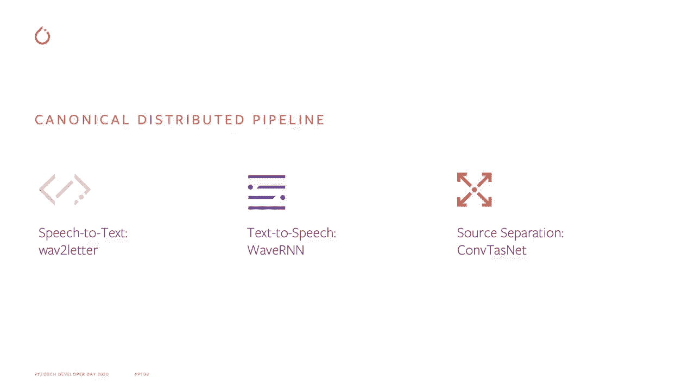
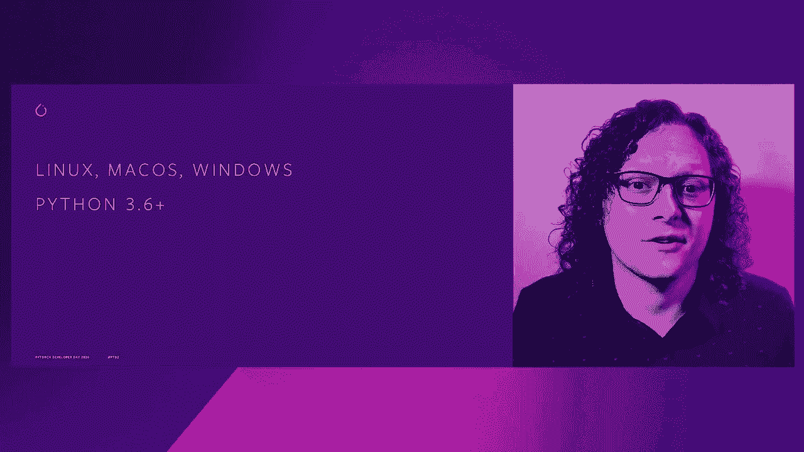

# 【双语字幕+资料下载】Pytorch 进阶学习讲座！14位Facebook工程师带你解锁 PyTorch 的生产应用与技术细节 ＜官方教程系列＞ - P6：L6- TorchAudio - ShowMeAI - BV1ZZ4y1U7dg

🎼。

Hello everyone， my name is Vincent Kenville Bellair and I'm the tech lead for Tordu。

 which is what I'm going to talk about today。The goal of Torruio is to provide building blocks to other researchers and engineers that allows them to bring research to production。

This way， Tortrivio can accelerate the development of other libraries in the open sourceurce ecosystem。

Toorodo is built around the following core functionalities。

The first functionality is IO to read and save tensors from various file formats like MP3， wave。

 Fl and Sp， we can also download and use common audio datasets where samples are loaded in parallel using torch multi processingcessing workers。

The second functionality is transforms for audio and signal processing such as spectrogram and FCC and resembling。

The transforms are provided as neural network modules in Tor2 dot transforms。

Since the transforms are written using pure Pytorrch operations。

 the computations can be done on the GPU and it can be compiled using Trchcr。

The third is Sox and Cdi compatibility。 Sox and Cdi our audio processingces library written in C++ for Sox。

 we provide an interface to use their transforms for CAdi。

 we provide reading and writing of CAdi binary files。

 as well as equivalent features like spectrogram Ns NF bank。

The final functionality is a distribution of models。

 along with canonical example pipelines for distributed training for major tasks。

As I said， the first set of functionality revolves around IO。

Here's a small snippet using To dualode and transform。The waveform variable is a tensor。

 which is read from file， and the correspondingpon example rate of the file is read as a scalar。

The torture to transform spectrogram is given an input parameter to configure its behavior。

 It is then past the input tensor， which computes the spectrogram tensors as output。

What's special here that I want to highlight is that not only are the transform standard torch and and module and so can be compiled using Jt。

 but the loads function uses torch minings and so can also be compiled and ported wherever Git is supported。

 The goal is thus to make it possible to Jit an entire pipeline to be around in production easily。😊。

We support several data sets for different tasks， for instance， library speech。

 for speech recognition， library TTS for text to speech。

The next set of functionalities I mentioned is transforms， as I said before。

 they're written in pure Pi torch and as such support， batching， torch grip and GPU。

Here's another example， since each transform is a torch and a module。

 they can be combined in a standard sequential wrapper for convenient data augmentation。

Here we take a spectrogram， apply a random time stretch， computeute the complex norm。

 apply a random frequency masking and a random time masking。

 and then convert the amplitude to decibel。 Frency masking and time masking are part of speckcle meant。

 which is what I'm illrating in the image。 A band of frequency and another in time are randomly masked。

The code is divided in functional that perform the computation and a transform。

 which is an NN module that wraps each functional and keeps their state Here I'm listing a few new functional that we added recently。

 You can see， for instance， maone axis that is used within the the frequency and time masking。

 We also have several bicode filters that are used in signal processing or voice executeded detection operation to detect voice。

The next functionality is the interface with socks and qualitydi。

For suck， we offer a way of using their efficiency plus operations directly within Pytorrch in a torchscriptable manner。

 For instance， here I am applying a sequence of gain， speed， rate change。

 pad and trim using apply effects tensor directly on the Pytorrch tensor。For CAdi。

 Torrode provides a wrapper for Torrodo transforms that mimics the flags provided to CAdi binaries。

 you can also read Arc and SCP files through Torrojiio so that the processed output of CAdi can be used within your Torrod program CAdi is used quite a lot in the Aio community。

 so we want to make it easy to interface with it。

The final set of functionalities that I want to talk about is the addition of models within the library。

For speech recognition， we added a training example pipeline for speech recognition that uses Lib speech data set and the Wa to letter model。

For text to speech， we added a vcoder based on the WaR&N model。

 along with an example training pipeline in the example folder that uses Libris TTS dataset。

For source separation， we added the COVtizedNe model and an example training pipeline with the Wall Street Journal0 mixed data set。

Before finishing， I would like to highlight a few features that are on our roadmap。

First， we would like to include the qualityy pitch feature extraction due to demand from the community。

Second， we are interested in including a beam surge decoder interface。

 this is especially useful for speech recognition application。And finally。

 another loss that has been requested by users is the addition of the RNN transducer loss。

To use and learn about Pytorch， you can visit Pytorch。org/udio。

 It contains documentation about the API， installation instructions。

 tutorials and links to the Gitthub page。 We also have a new tutorial for the recognition of speech command。

 have fun playing with it。Torchd is compatible with Linux， Mac OS， Windows， and supports Python 3。

6 and up， just like Pytororch。

Thank you for watching。

