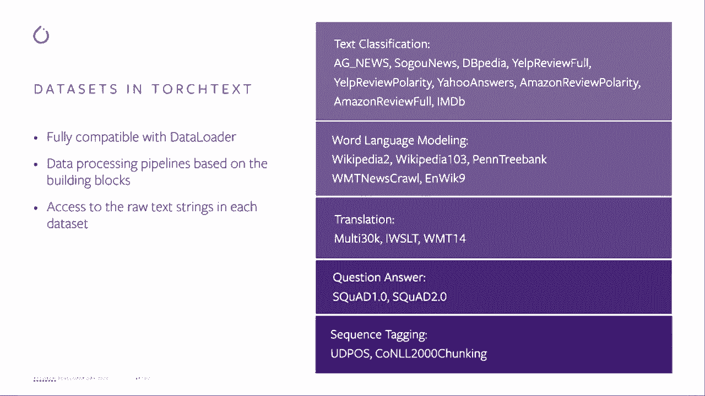
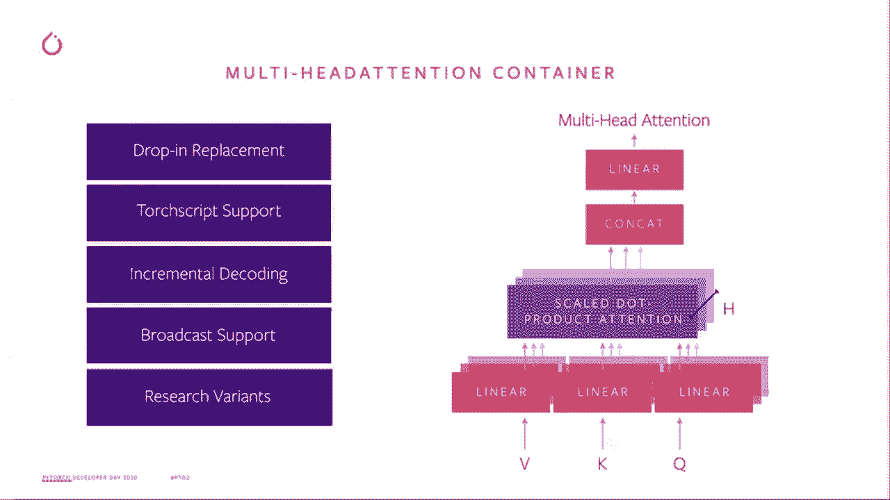
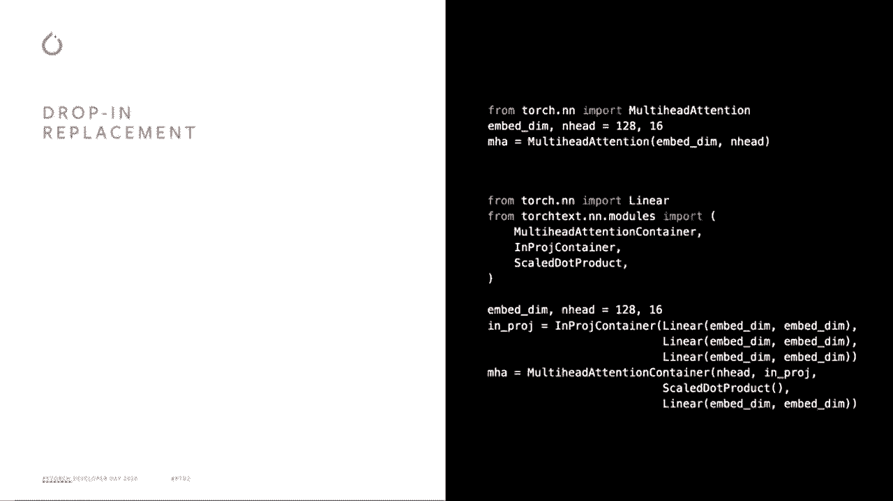
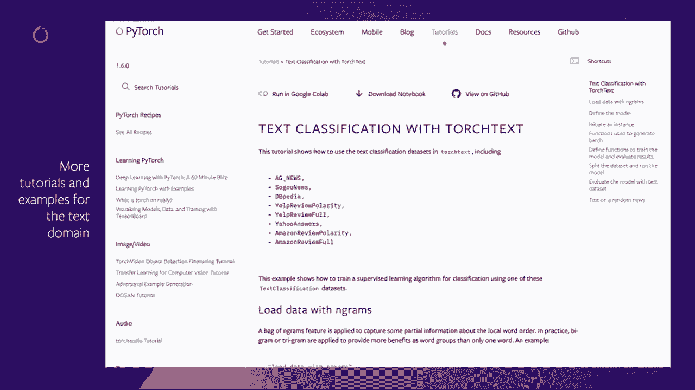

# 【双语字幕+资料下载】Pytorch 进阶学习讲座！14位Facebook工程师带你解锁 PyTorch 的生产应用与技术细节 ＜官方教程系列＞ - P7：L7- TorchText - ShowMeAI - BV1ZZ4y1U7dg

🎼。

大家好，欢迎参加2020年的PyTch开发者日。我叫乔治。我是Facebook的一个软件工程师，工作于Pytot的文本领域。我在Facebook的工作是支持PyToch用户，特别是在文本领域，从研究到生产。因此，在这次演讲中，我将讲解2020年的一些主要更新，并帮助你了解我们的工作如何促进你的研究和PyToch的生产。

那么为什么我们希望在Pyth之外有一个文本领域呢？首先。我们希望加速NLP研究，并为前沿研究提供一些可重用的正交和正确的构建块。基于我们对文本领域和研究社区的了解。我们希望与内部团队和外部开源社区合作，建立一个更好支持的管道。

同时支持Facebook的产品和外部研究。其次。😊。我们希望提供一个解决方案，将研究转化为生产。我们在这里的意思是将这些管道和模块与广泛的py能力集成，如touchscript量化、分布式数据并行和移动。我们的目标是为大多数NLP管道的研究到生产过渡提供更好的支持，第三，我们希望与社区互动，探索新技术。

正如人们所注意到的，NRP领域发展非常迅速。所以Pyth团队希望在NLP领域发展良好的技术理解，并建立新的研究合作。为了未来的社区。考虑到这些，我们提供了对数据集的便捷访问、文本处理管道和一些与NLP相关的模块。所以如果你有时间，请逐一查看这些内容。

我们的行文本数据集和转换。还有一些与NP相关的模块，我会逐一和你讲解。

好的，所以新的数据集在文本中。我们也重写了一些现有的数据集，在文本夜间发布中。所以在这里。对于夜间发布，我们将这些新内容视为原型。因此，我们将很快发布这些新的数据集。😊，很快就会发布。所以这里展示的新数据集与Py中的数据加载器完全兼容。

用户将能够灵活构建数据处理管道，并使用一些标准的分词器和词汇块。好的，在这里我列出了我们beta发布中可用的新数据集。与此同时，你可能会想，一旦我有了这些原始数据，我该如何将其转换。

像张量可以用于训练模型，所以在这里我们提供了一些改进的性能，我们提供了一些具有改进性能的数据管道。使用一些 C++ 扩展。因此，这里的目标是我们希望能轻松转移到生产环境。以下是使用 PyTorch 和 Torch Text 的一些端到端管道的概述。原始数据字符串被读取并发送到字段转换，这里您可以看到分词器。

词汇，向量占用和转换癌症，对吧？

目前我们正在将此数据处理转换重写为一个正交构建模块，并与 G 端口结合。因此，在这一步之后，我们称之为预处理。数据被发送到数据加载器和采样器，在那里我们生成。它们有学士学位。然后数据就准备好供模型使用。因此，我们尽力将这些写成一个构建模块。

单独的构建模块，这样您将拥有完全的灵活性来将它们组合在一起。通过 C++ 扩展，我们能够支持所有这些转换的 Gt。我们相信这对生产环境提供了更好的支持。好的，现在我们进入与 NLP 相关的模块，我们在 Torch Text 中发布了新的多头注意力模块。

除了丢弃替换之外，如果您在 PyTorch 库中使用多头注意力，我们支持丢弃替换，因此您可以轻松地从 PyTorch 的多头注意力切换到文本的多头注意力。此外，新的多头注意力容器也适用于 Touch 脚本。根据用户的反馈，我们添加了增量解码和广播支持。

这个新多头注意力容器的想法是为用户提供一些在变换器架构下的新颖研究理念。现在，变换器架构在文本、音频和视觉领域非常流行。我们希望能提供一个非常灵活的多头注意力模块，以便用户可以在不同的想法中应用它。这里我给您一个例子，展示如何将 PyTorch 的多头注意力切换到我们的 Torch Text 多头注意力容器。

仅通过这几行，用户可以更灵活地尝试不同的自定义组件，与多头注意力的概念相结合。您可以放置自定义的投影容器、多头注意力容器。O 技能狗产品。您可以在这个多头注意力容器中应用不同的想法。

好的，最后但同样重要的是。在我们的网站上，我们有几个与文本相关的教程，包括一个展示如何使用新的数据集进行文本分类分析的教程。请查看这些教程，了解如何将其写入 NLP 管道。请记住，我们也会更新这个教程，以展示如何构建 N 到 N 管道。

在视频的最后，感谢观看这个视频，并希望你享受今年的**Pytor开发日**，我们下次再见！

