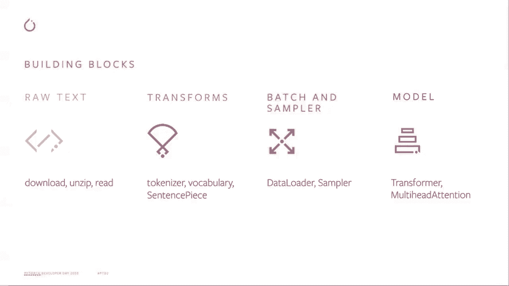

# 【双语字幕+资料下载】Pytorch 进阶学习讲座！14位Facebook工程师带你解锁 PyTorch 的生产应用与技术细节 ＜官方教程系列＞ - P7：L7- TorchText - ShowMeAI - BV1ZZ4y1U7dg

🎼。

Hello everyone， welcome to PyTchDeveloper Day for 2020。My name is George。 I'm a software engineer at Facebook， I work for the text domain in Pytot。My job at Facebook is to support the PyToch user， especially in the text domain for research to production。 so in this talk I will go over some major update in 2020 and help you understand how our work can facilitate your research and production for the PyToch。

So why we want to have a text domain in addition to Pyth。First。We want to accelerate NLP research and provide some reusful orthogonal and correct building block for cutting edge research。Based on our knowledge for the text domain and the research community。We want to work with the both internal team and external open source community to build a pipeline like can better support。

Both the Facebook products and external research。Second。😊。We want to provide a solution to transfer from research to production。What we mean here is we integrate those pipeline and module with a wide range of py capabilities such as touchscript quantization。 distribute data parallel and mobile with this goal we want to have a better support for research to production transition for most end an NLP pipeline thirdly we want to engage with the community and Disc novel technology。

As people notes， the NRP domain。Move very fast。 So the text domain in Pyth team want to develop a good technology understanding。In the NLP area and build a new research collaboration。For the future community。With those go in mind， we provide those easy access to data sets。Text processing pipeline。And some NLP related module。So if you have time， please go over those one by one。

 our row text data set， the transform。And our more some NP related module， I will go。 go over this one by one with you。

Okay， so the new data set in To text。We have also rewrite a few existing data set in To text nightly release。So here。For the nightly release， we consider those new stuff as a prototype。 So we will release those new data sets with our。😊，Better release very soon。So the new data set show here are fully compatible with data loader in Py。

User will have the flexibility to build the data processing pipeline with some standard tokenizer and vocabulary blocks。Okay， here I list all the new data set available to our user in our beta release。 at same。 you may wondering， once I have those raw data， what should I do to convert this raw data into。

A tensor like can be used to train a model okay， so here we provide some improved performance we provide some data pipeline with improved performance。With some C+ plus extension。So the goal here is we want to have an easy transfer to production。Here's the overview of some end to end pipeline with Ptoch and Torch text。The row data string read and send to a field transform here here you can see like tokenizer。

 vocabulary， vector took up and convertive cancer， right？

So currently we are rewriting this data processing transform as an orthogonal building block with the G port。So after this after this step， we call this a pre processing。 The data are sent to data loader and sampler， where we generate。They have bachelor。Then the data are ready for the model。So we are do our best to write those a building block。

 individual building block， like so you will have the full flexibility to combine them together。And with the C++ extension， we are able to support the Gt for all this transform。And we believe that's a better support for the production。Okay， so now we go to the。The NLP related module， so we released a new multiha attention module in Tor text。

 so in addition to the dropping replacement， if you are using the multiha attention in Pytoch co library。 we support the dropping replacement so you can easily switch from a Pytoch multiha attention to To text multiha attention。In addition。The new multi attention container also for touch script。Based on the feedback from our user， we add the incremental decoding and the broadcasting support。

The idea for this new multi high attention container is to facilitate user with some novel research idea under the transformer architecture。Right now， the transformer architecture is very popular across the text， audio and vision domain。We hope here like we can provide a very flexible multiha attention module so our user can apply this with different idea here I give you an example like how you switch from the Pych multiha attention to our Tosh text multiha attention container。

Just with this a few lines。User has more flexibility to try different custom component with the concept multi attention。You can put。Custom in projection container， multihaitation container。O skilled dog products。 you can apply different idea with this multi hair attention container。

Okay， last， but not least。On our website， we have several text related tutorials。Including the one to show how to use the new data set for text classification analysis。Please check out those tutorial and have some idea about how to write those into an NLP pipeline。Keep in mind， like we will also update this tutorial and to show how to build the N to N pipeline with the。

With the new Tosht library for different NLP task at the end， thank you for watching this video。 and I hope you enjoy the Pytor Develop day for this year， and I will see you around。

