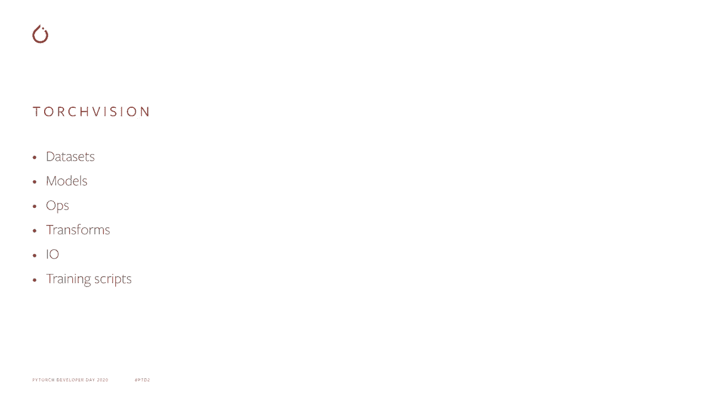
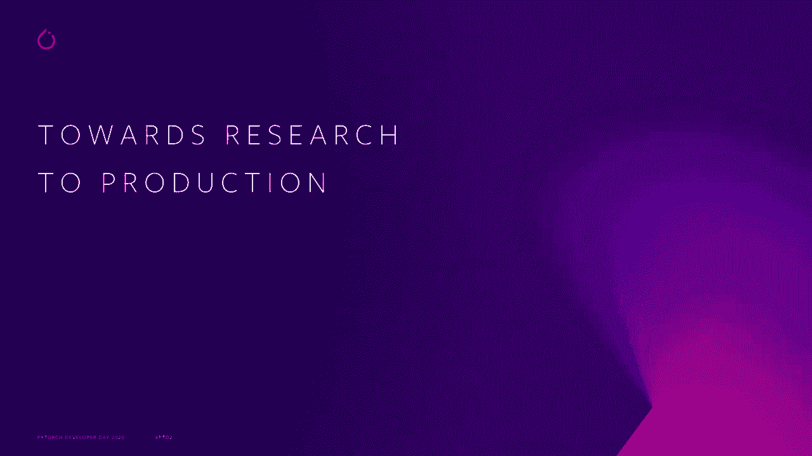
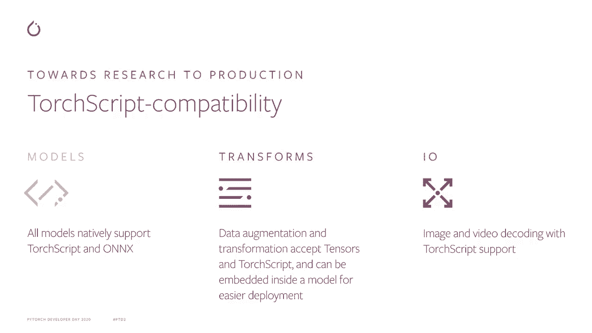
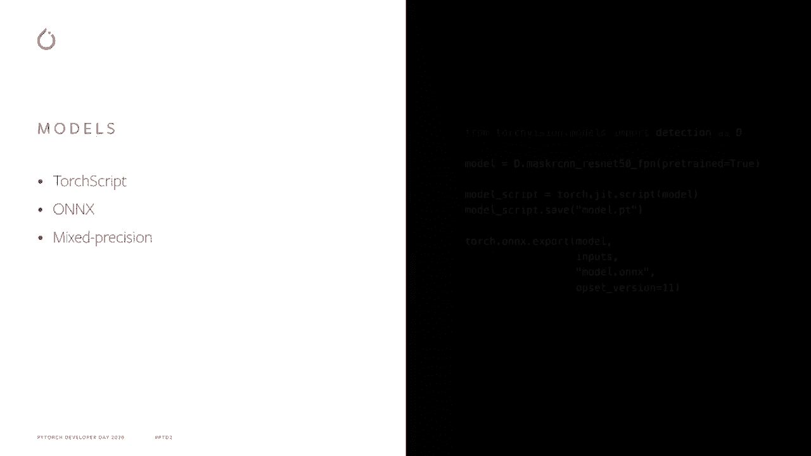
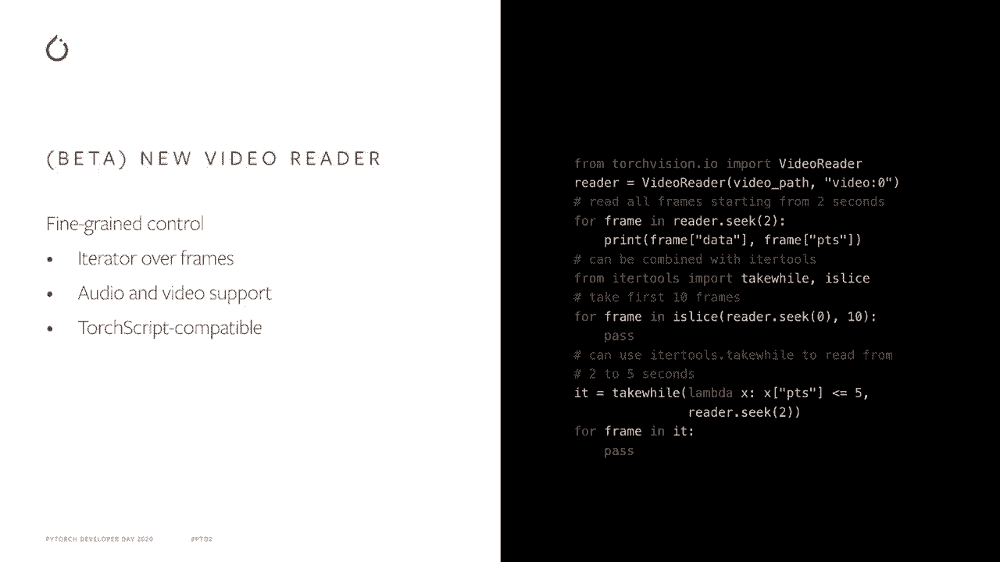
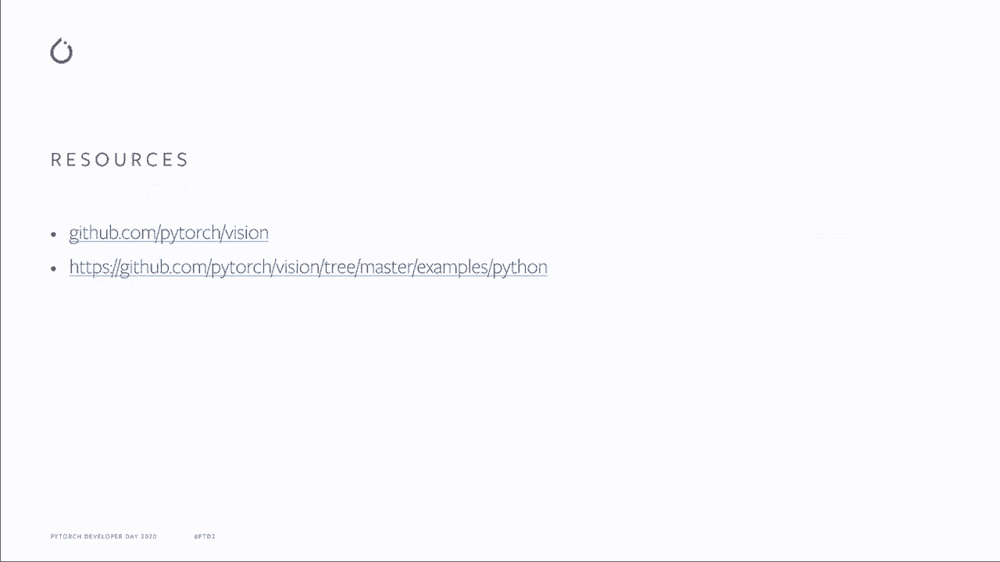

# 【双语字幕+资料下载】Pytorch 进阶学习讲座！14位Facebook工程师带你解锁 PyTorch 的生产应用与技术细节 ＜官方教程系列＞ - P8：L8- TorchVision - ShowMeAI - BV1ZZ4y1U7dg

🎼。

Hi everyone and welcome to the 2020 P Georgeor Developer Day。I'm Francisco Massa and I'm a researcher at Facebook AI。I work in the Ptorrch team and I'm the maintainer of Torch Vision。Today。 I'll be talking about what TorteViion is， how it can enable you to get started in computer Visual with Byytorch。

 and the latest additions that have been introduced to TorVision over the last year。

The first question you might ask yourself is， what a storage vision？

Torch Vision is a library that is built to facilitate research and experimentation and computer vision。It extends Pytorch with functionality which is very specific and useful to computer vision。 so that keeps the Pytorch library lean and focused on core different abstractions。But what is actually is there in our vision， let's have a closer look。

T Divisionion facilitates research and experimentation in computer vision by providing a number of building blocks that allows you to quickly start a new project end to end。It provides data sets， common data sets for a number of mainstream vision tasks such as classification and object detection。

It also has models， we provide reference per models for classification， detection， and more。TtVision also has stored print operators specific to computer vision models。And data transformation operators to simplify creating data augmentation pipelines。Additionally。 it contains primitives for efficient image and video reading and finally reference training scripts。

 which illustrates with a few files how it can train yourself the model to vision。😊。

Leveraging the building blocks that we provide。Over the last year。 we have been improving through our vision in order to simplify the path from research to production。

The way Pytororch enables the research production path is via Trot script。 an intermediate representation of your Pytororch program that it can be exportable to run on C++ environments via the T script runtime。The core part of every deep learning pipeline resides on its models。By closely working with the Torch script and Onx teams。

 we have enabled all Tortvis models to natively support Trch script and OnX export。Thanks to the preed models and for visionion， you can quickly build C+ classifications。 leveraging the power of deep learning。But models are only part of the story when it comes to embedding your Python code into a C++ run time。Very often you need to prepare the input data into a format that is compatible with the model。

DVi used to rely on pillow for most of the data transformations。 so moving your application C++ required re implementingpleing the transformations in a way which is compatible with C++。Now， Torch Vi transforms can directly work on Torch dance and it can be exported to Torch script。 so you only need to implement the transforms once in Python。Finally。

 T Divisionion now provides native IO functions for image and video decoding。 enabling the full raw data to model production pipeline to be converted from Python to C++。

Now let's take a closer look at each one of those points。

All charger Vi models have native Trar script and Onx support so that exporting them to C+ can be done with a couple of lines of code。Additionally， mixeding precision training and inference is available for all models enabling having faster run time with lower memory footprint。

😊，Tort vision transforms have been a to inherit from N module and accepts torch tensors as input with torch cry compatibility。This brings several benefits to the data augmentation pipeline， such as off the shelf GPU support。 video use case enablement， via efficient batch transformations of frames。 and the possibility to export the transforms together with your model in C++ environment。

TorchVision now provides image， reading and writing operators for JPEG and PNG formats with native TorchQ support。You can directly read local image path into a torch densesr。 or alternatively decompose the operators into raw file reading。 where only the bites of the file are read and returned as the U8 densesor and the cutting of the raw data into an image densesr。

Thanks to native charge food support， image decocoding can be embedded together with your model for an N to end export experience。Finally， TVision provides a frame based video written API with support for both audio and video and Tr script compibility。

The video reader is an iterator and can be combined with it tools for advanced video reading patterns such as reading the next10 frames after a specified timestamp or skipping every other frame of the video or reading all frames between two timestamps。

This new video reader API is currently released as better and its API can change following user feedback。

We have some additional examples of the new functionalities and our in the examples followed on GitHub。 where you can find notebooks for the Vi Read API as well as the transforms。In Tro vision。 we welcome any contributions。If you find a bug， have a request for an improvement or a new feature inclusion。 let us know if via the issue tracker on the ToVision Github page or contribute via pull request。

🎼I'd like to thank you for watching and I hope that Torch Vision can help you build great new applications leveraging by Torch。

