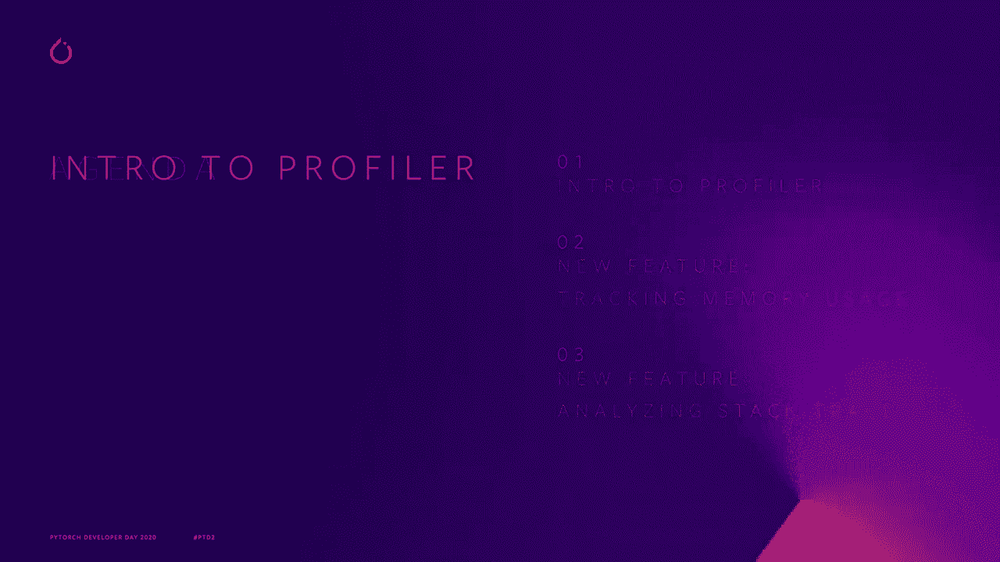
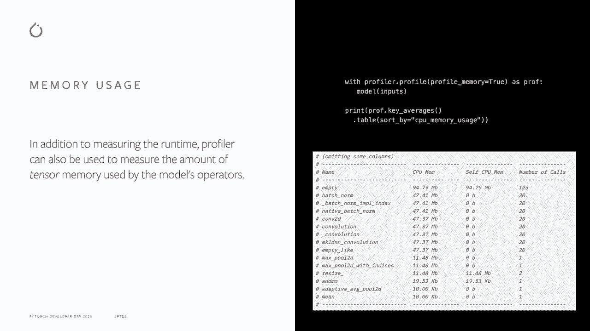
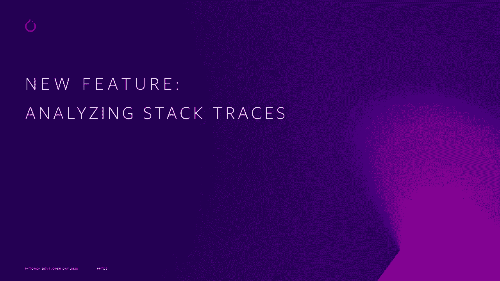
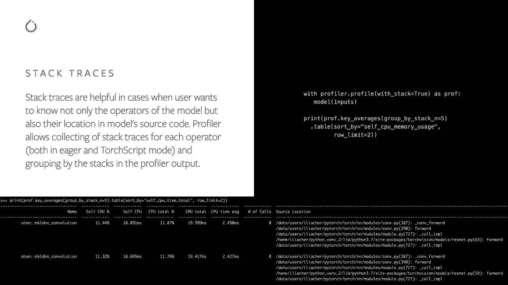
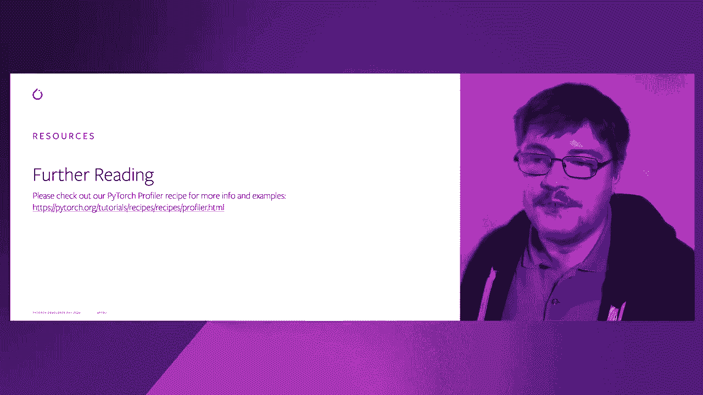

# 【双语字幕+资料下载】Pytorch 进阶学习讲座！14位Facebook工程师带你解锁 PyTorch 的生产应用与技术细节 ＜官方教程系列＞ - P9：L9- 最新的 Profiler API 和最佳实践 - ShowMeAI - BV1ZZ4y1U7dg

🎼。

Hello， my name is Ellia， I'm a software engineer at Facebook working on PyOch and in this presentation I'll talk about PyTch Pror and two new features that we recently added。

So what is Pytoch Pror Pytoch includes an easy to use tool that allows you to measure runtime and other performance metrics of models operators。In a simple example， we first start with necessary module inputs。 then we create Gsite 18 model and then as you can see we're on model inference inside。By profile Cons manager。Everything inside this Conx Manager is profiled， and once you have finished。

 you can print out the results。In this case， you will see a table with entries grouped by operator name。And with some rail metrics such as self and total CPU time。Profiller also has more features such as group by operator input shapes。 support for both CPU and GPU operators， custom labeled code rangers。

 and saving the trace in Chrome JON format。For example。 if you want to see the input shapes of the operators。Just past record shapes true and grew by input shapes。In this case。 we see multiple operators such as convolution with different input shapes as expected。

So let's check the check in memory usage feature that we recently added。In addition to measuring runtime， Pror can also be used to measure the amount of tensor memory used by the model's operators。Just pass Pro memory true， and then you can sort by CPU or Quda memory usage。In our example。 we see that most of the memory was consumed by empty operator。

 which is not surprising because we use this operator to create new tensors。And also memory was consumed by Resize operator， which is used to change tensor size。Based on the total CPU memory column， you can see that there are other operators that directly or indirectly call empty and resize。

But what if you want to know not only the operator， but where in the model the operator is？

Stack traces are helpful in cases like this。So you can just。Pass with stack2。 and then you can group by top and stack entries。And in our example。 we see that there are two top Mkelian N convolution operators。And in the source location。 we can see not only the location inside torch andM convolution model。

 but also two different coal sites in the original Resnet model script。

If you want to learn more about Profilr and see more examples。 please check out our Pror recipe on website Thank you very much。

