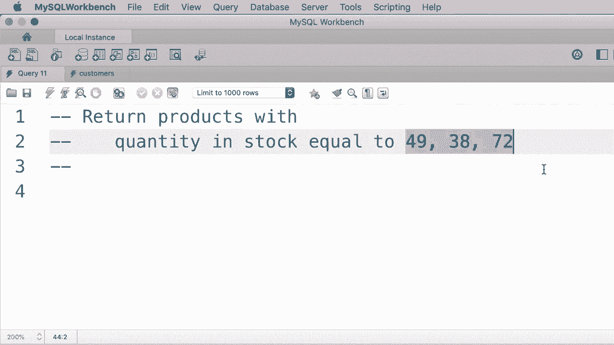

# 【双语字幕+资料下载】SQL常用知识点合辑——高效优雅的学习教程，复杂SQL剖析与最佳实践！＜快速入门系列＞ - P11：L11- IN 运算符 - ShowMeAI - BV1Pu41117ku

In this tutorial I'm going to show you how to use the in operator in SQL so as an example。

 let's say we want to get the customers that are located in Virginia or Florida or Georgia。

 one way to write this query is like this， so where state equals Virginia or state equals Georgia。😊。

Or state equals Florida。Now people who are new to the SQL language or programming in general find this expression a little bit strange。

 they ask，Msh， why can't we write this expression like this？

Where state equals Virginia or Georgia or Florida。Heres the reason we use the ore operator to combine multiple conditions。

 so here we have a condition or an expression more accurately。

 but on the right side of this or operator we have a string in SQL we cannot combine a string with a Boolean expression that produces a Boolean value which can be true or false so that is why we have to write our query like this so we have multiple expressions or multiple conditions and we're combining them using the ore operator okay so now if we execute this query we get these customers here。

 but there is a shorter and cleaner way to get the same result instead of combining multiple conditions using the or operator。

 we can use the in operator so where state is in and then in parenthesis we add all the values like Virginia。

 comm Florida， comm Georgia and the order doesn't matter this query is exactly equivalent to what we had earlier。

😊，But as you can see， it's shorter and easier to understand。So let's execute it。 Look。

 we get the exact same result。 Now here we can also use the not operator。

 Let's say we want to get the customers outside of these states so we can use where state， not in。😊。

This list。Now if we execute this query， we get customers who are located in Colorado。

 Texas and so on。So use the in operator when you want to compare an attribute with a list of values。

😊。

Now here exercise I want you to write a query to get the products where their quantity in stock equals to one of these values。

 49， 38 and 72， so pause the video do this exercise and then come back continue watching。😊。

Alright， this is pretty easy， so we do a select star to get all the columns from the products table where quantity in stock in we use the in operator to compare this attribute with these values。

 49，38 and 72， let's execute the query we get。😊，Only two records because we don't have a product with quantity in stock equal to 72。

Oh。

