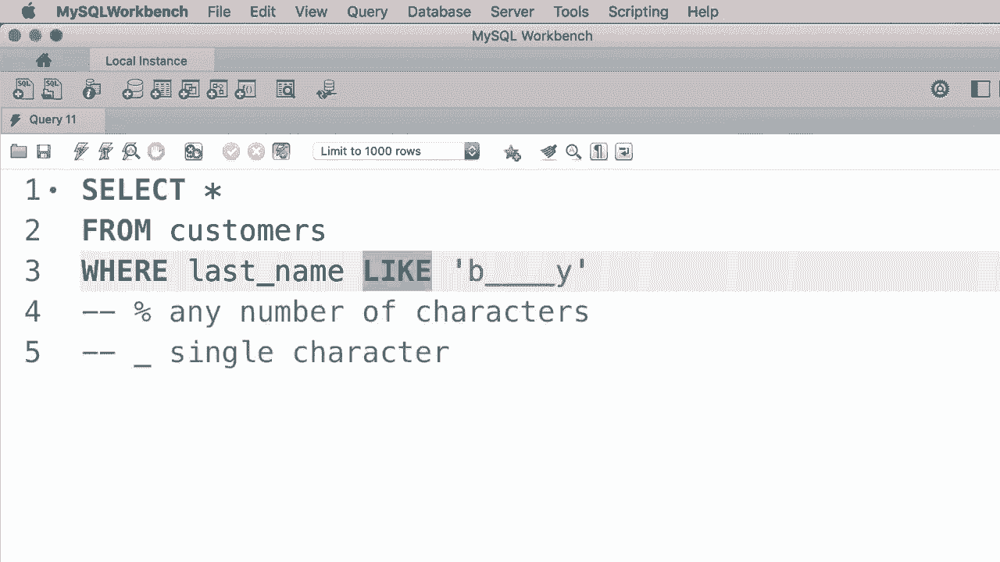
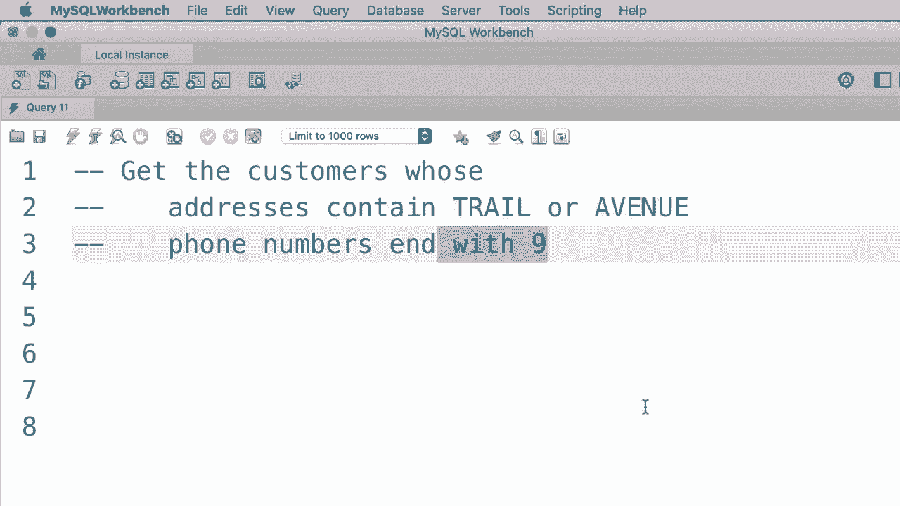

# 【双语字幕+资料下载】SQL常用知识点合辑——高效优雅的学习教程，复杂SQL剖析与最佳实践！＜快速入门系列＞ - P13：L13- LIKE 运算符 - ShowMeAI - BV1Pu41117ku

In this tutorial I'm going to show you how to retrieve rows that match a specific string pattern。

 For example， let's say we only want to get the customers whose last name start with B。

 So here in the word clause。😊，We type out where last name。This is where we use the like operator。

 and right after that we add a string pattern。 So we want to get the customers whose last name start with B and we have any number of characters after B。

 So we use the percent sign to indicate any number of characters。

 you might have one character after B or no characters or 10 characters with this pattern we get all the customers whose last name start with B。

 And also it doesn't matter if it's an uppercase or a lowercase B So let's execute this query there you go。

 So we only have three customers whose last name start with B。😊，As another example。

 let's say we only want to get the customers whose last name start with brush。

 so we change our pattern to brush percent。 Now let's execute the query。

 we only get this one customer here。Now， this percent sign doesn't have to be at the end of the pattern。

 It cant be anywhere。 For example， let's say we want to search for customers who have a B in their last name。

 whether it's at the beginning in the middle or at the end。

 So we change our pattern to percent B percent。 This pattern means we can have any number of characters before or after B。

 Let's execute the query。These are the customers who have a be somewhere and their last name。

 it doesn't matter if B is at the beginning or in the middle or at the end。

Let's look at another example。I want to get all the customers whose last name and with why。😊。

So here's the pattern we use， let's execute this query and we have five customers whose last name ands with a why。

So this is how we use the percent sign。 Now we also have an underscore and that matches a single character。

 So with this pattern we get customers whose last name is exactly two characters long。

 we don't care what the first character is， but the second character should be y let's execute the query。

 obviously we don't have any customers whose last name matches this pattern。

 but if you change this pattern to five underscores， So one，2，3，4，5。😊，Followed by a why。

We should get these customers， so their last name is exactly six characters。

 We don't care about the first five characters， but all of them end with a why。Now。

 as another example， we can replace the first underscore with B。

 and that means we want to get the customers whose last name start with B and after B we have exactly four characters followed by a Y let's execute this query。

 so we only have one customer that matches this pattern。😊，So this is how we use the like operator。

We use the percent sign to represent any number of characters。And。😊。

An underscore to represent a single character。Now this like operator in MyQl is an older operator。

 but we also have a newer one that is more powerful and it allows us to search for any string patterns。

 and that's what I'm going to show you next。😊。

Al right here I'm going to give you two exercises for the like operator first。

 I want you to get the customers whose addresses contain trail or avenue。

 and next I want you to get the customers whose phone numbers and with9。😊。

Al right， let's get started with the first exercise。

 so select star from customers where address like like here we want to use a search pattern like this。

😊，We want to have trail， but trail can be anywhere in the address。

 so we put a percent before and after Tra。Next， we should use the or operator to search for another pattern。

Or address， like， let me put this on a new line that is better address like once again。

 percent Avenue percent。That's it。So let's execute this query。😊。

Here is the result you should get the customers with IDs 2， 9 and 10 if you look at their addresses。

 all of them have either Trail or avenue in their address。Now let's work on the second exercise。

 We want to get the customers whose phone numbers and with night。

 that is pretty easy so let me change our work clause。😊，Where phone， once again。

 we use the likeU operator at a percent followed by a nine， that's all you had to do。😊。

Let's execute the query， So here's the result， customers with IDs 3 and 7。

 their phone numbers and with 9。So this is how we use the like operator and by the way you can always use the not operator here。

 let's say if you want to get the customers whose phone numbers don't end with9。

 so we simply prefix like with not Now if we execute this query one more time we get all the other customers and the database。

😊。

哦。