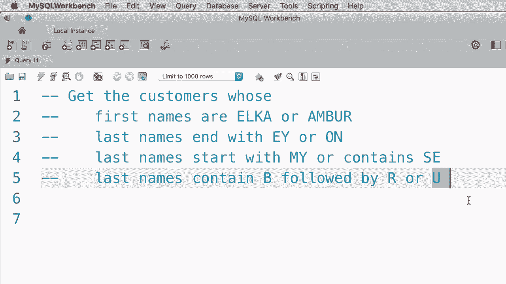

# 【双语字幕+资料下载】SQL常用知识点合辑——高效优雅的学习教程，复杂SQL剖析与最佳实践！＜快速入门系列＞ - P14：L14- REGEXP 运算符 - ShowMeAI - BV1Pu41117ku

In the last tutorial you learn about the like operator in SQL， so as another example。 let's say we want to search for the customers who have the word filled in their last name。 so we type out a where clause like this where last name like percent， field percent。So the word field can be anywhere in the last name。 Let's execute this query。

 We get only one customer beautiful。 Now， we also have another operator in myql that is red X。😊。Which is short for regular expression， and regular expressions are extremely powerful when it comes to searching for strings。 So they allow us to search for more complex patterns。 Here is an example。 If I want to rewrite this last word clause using a regular expression， it looks like this。

 where last name， R A G， E X P。😊，Now here in our string pattern。 we don't have to type out the person signs， we only type out field。So what we have on line 4 is exactly identical to what we have on line 3。 Let's execute this query。😊。We get the same result beautifuli。 Now here in regular expressions。

 we have additional characters that we don't have when we use the like operator。 For example。 we can use the carrot sign to indicate the beginning of a string。 So if I put a carrot just before the word filled。😊。That means our last name must start with field Obviously， if we execute this query。

 we don't get anyone that matches this criteria， so we use the carrot sign to represent the beginning of a string。😊，We also have a dollar sign to represent the end of a string。 so this pattern means the last name must end with field。 Let's execute this query。 We get the same result as before。Now we can also search for multiple words here。 For example。

 let's say we want to find the customers who have the words filled or Mac in their last name。 So we use a pipe， a vertical bar and type out another pattern。😊，Let's execute this query。So here we have two customers， one of them has the word Mac。 the other has the word field in their last name。😊，Now we can take this to the next level。

 let's say we want to find the customers who have the words field or Mac or row and their last name。😊，Let's execute the query。 We get three customers， beautiful。 So we use a pipe or a vertical bar to represent multiple search patterns。 Now， as another example。 we can change our first search pattern to something like this。😊。

Now this pattern means the last name should either start with the word field or it should have the wordm it or it should have the word row。 let's execute the query。😊，Now we get only two customers because our customer with the last name。 Bru field， doesn't match this pattern。However， if we change our first pattern to field dollar sign and execute the query。 we get three people here， three customers。So this is how we can combine multiple special characters when building a complex pattern。

Now let's look at another example， let's say we want to search for customers who have an E in their last name。So these are all the people alright now let's say we want to make sure that before the letter E we should either have a G or an I。 so this is where we use square brackets and inside the brackets we add multiple characters like G IM and that matches any customers who have G or Ie or ME in their last name so any of these characters can come before E。😊，Now let's execute this query。There you go， we only get two customers in the first example before E we have I。

 which is one of the characters inside the brackets in the second example before E we have a G which is also another valid character before E。Now， once again， the square brackets don't have to be before E， we could add them after E。 so any customers who have E followed by an F or an M or a Q in their last name。Can be returned with this pattern。 Obviously， we don't have anyone in the database So this is how we use square brackets。

 So we can also supply a range of characters。 For example， we can have E and just before E。 we want to have any characters from A to H We don't have to type them out explicitly like AB，C， D。 E， FG， that's very verbos so we can type out a to H and now if you execute this query。 we get these three people。😊，So let's quickly recap everything you learn about regular expressions in this tutorial。

We use a carrot to represent the beginning of a string， so beginning。😊。We use a dollar sign to represent the end of our string。We use a vertical bar or a pipe to represent a logical or， so we can supply multiple search patterns。We use square brackets to match any single characters listed in the brackets。

 and finally we use square brackets with a hyphen to represent a range， so any characters from A to。 let's say F。😊，Now technically， my school supports more special characters， but quite honestly。 the ones that I have listed in this tutorial are the ones that you will be using 90% of the time。 so just memorize these and you're good to go。Qu honestly。

 a lot of beginners find the syntax for regular expressions confusing。 So in this video。 I'm going to give you four exercises that I have carefully designed to help you quickly learn about this syntax。 Here's the first exercise。 Get the customers whose first names are Elca or Amber。 and note that this is Amber with you。😊，Now for the second exercise。

 return the customers whose last names and with EY or ON。Here's the third exercise。 get the customers whose last names， start with my， or it contains SE。 and finally as the last exercise return the customers whose last names contain B followed by R or U so go ahead and spend two to three minutes on this exercise when you are done come back continue watching。

Alright， let's knock out the first exercise。 So we want to get all。😊，Oops， there's a C here。 select store from customers where first name， regular expression。😊，And here's our pattern。 we want to search for two wordss， either Elca or Amber， as simple as that， let's execute this query。We should get two customers。 There you go Amber and Elca。 Allright。

 now let's knock out the second an exercise， so I'm going to delete this。 We don't need it anymore。😊。So we want to get the customers， select start fromCustom。Where last name？

Should end with either EY or ON。So in the search pattern。 we type out EY followed by a dollar sign to indicate the end of a string。 then we add a vertical bar to supply the second search pattern， So O and once again， a dollar sign。Let's execute this query， oops， actually I forgot to type out regular expression， there you go。😊。

So let's execute this query。And we should get。These four customers with IDs 1，3，5 and 7。 the first three， their last names end with E Y and the last customer。 his or her last name ends with ON All right。Now， let's work on the third exercise。 So I'm just going to change the regular expression here。

 We want to get the customers whose last name starts with my or contains S。 So we use a character to indicate the beginning of a string。😊，So it should start with my。 or it should contain S again very easy， lets execute the query。😊，And we get the customers with ID 4。8 and 10， and finally we want to get the customers whose last names contained B。

 so let's change the search pattern， we should have a B followed by R or U。Now。 there are two ways to write this regular expression。 We can use square bracket。 So we have B followed by R or U。 That's one way。 The other way is to use a vertical bar， so。BR or BU， these are both valid solutions。So I hope you knocked out these exercises in the next tutorial I'm going to show you how to get the records with missing values。

😊。

Oh。