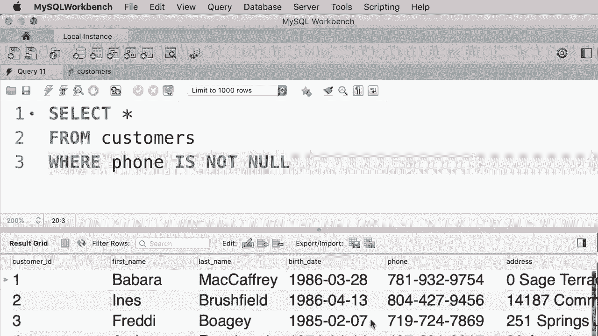
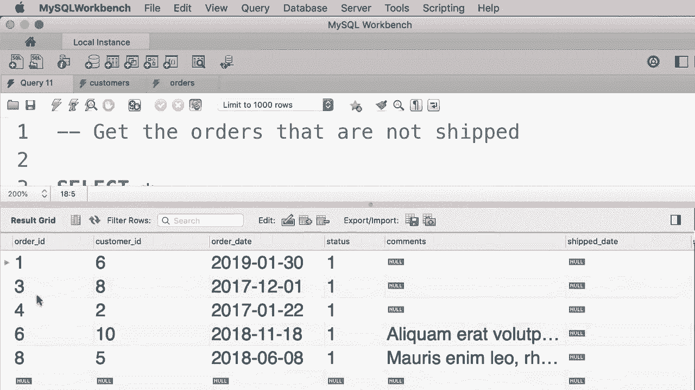

# 【双语字幕+资料下载】SQL常用知识点合辑——高效优雅的学习教程，复杂SQL剖析与最佳实践！＜快速入门系列＞ - P15：L15- IS NULL 运算符 - ShowMeAI - BV1Pu41117ku

哦。In this tutorial， I'm going to show you how to look for records that miss an attribute。 for example， if we select all the customers in our database。😊。You can see that the customer with I5 doesn't have a phone number。 So if you look closely here。 you can see the value null。 null means the absence of a value。 Now。

 let's say we want to search for all the customers who don't have a phone Perhaps we want to send them an email and say hey。 your phone is missing in our system。 So how can we get this customers。 that is very easy。 we use the is null operator。 So in the word clause we type out where phone is null。 Now let's execute this query。😊，We only get one customer who doesn't have a phone。

 Now here we can also use the not operator to get the customers who do have a phone。So we change the condition to is not null lets execute the query。Now in the query results。 every customer does have a phone number。

For this exercise， I wanted to write a query to get the orders that are not shipped yet。 This is a very useful query that is used in a lot of real applications。 For example。 let's say you're an admin for an online shop。 You want to see the orders that are not shipped yet so you can follow them up。😊，So write a query to get these orders。😊，So here we have the orders table。

 let's have a quick look at the data in this table。😊，Alright， so if you pay close attention。 you see some of these orders don't have a shipped date and these orders also don't have a shipper ID。 which is a unique number for identifying the shippers。 so any order that misses a value for the ship date or shipper ID is considered an order that is not shipped so let's go ahead and write a query to get these orders。

So back to our query editor， select star。From orders earth。Where。Shipped underlyingline date is no。 You could also write shipper I D is no。 They're both equally correct。 So let's execute this query。 and we should get。Five orders， orders 1，3，4，6， and eight。

