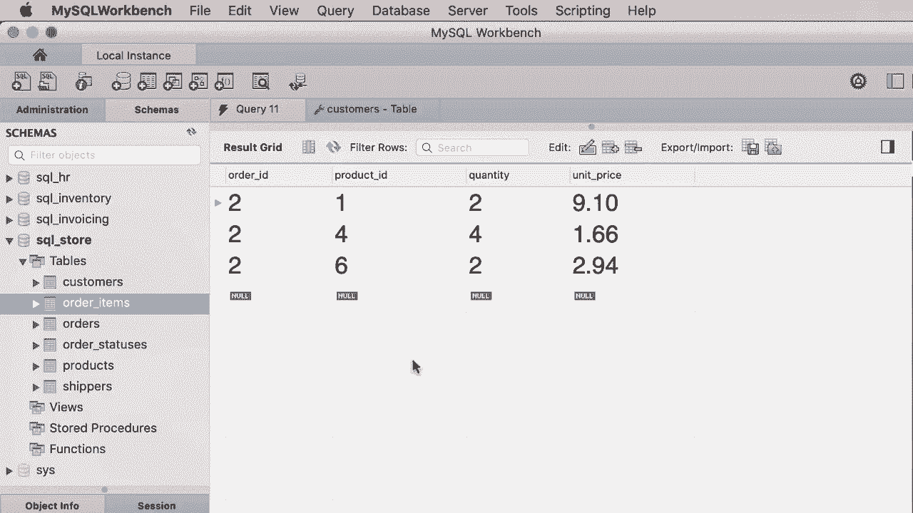
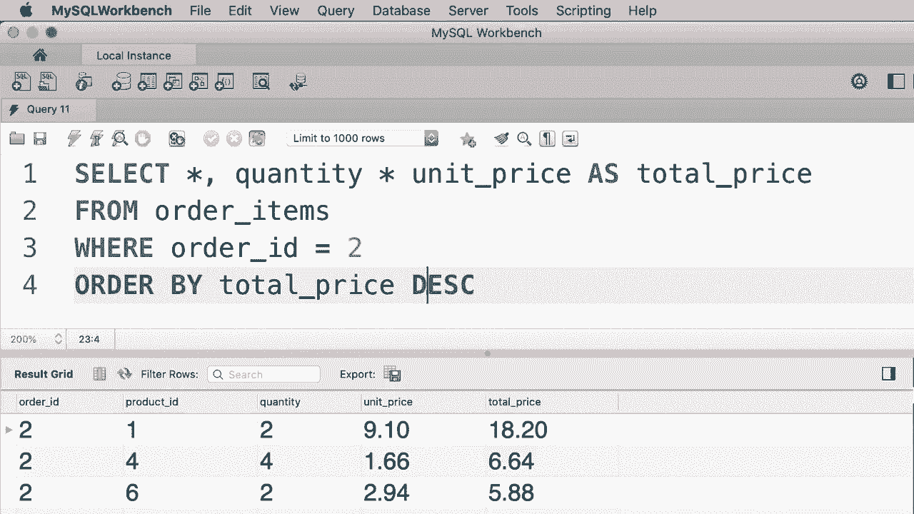

# 【双语字幕+资料下载】SQL常用知识点合辑——高效优雅的学习教程，复杂SQL剖析与最佳实践！＜快速入门系列＞ - P16：L16- ORDER BY 运算符 - ShowMeAI - BV1Pu41117ku

哦。In this tutorial I'm going to show you how to sort data in your SQL queries So here we have a query to select all the customers from the customers table。

 If you look at the query result， you can see that our customers are sorted by their ID so we have customers1。

2，3，4 and so on This is the default sort column but we can always change this using the order by clause but first let me explain why the customer ID column is the default sort column。

😊，So first I'm going to open up the navigator panel on the left side here is the customers table。

 Now let's click on this middle icon here that looks like a tool。😊。

This opens up our customers table in the design mode， so here we can change our columns。

 we can add new columns or remove existing ones or change their name or order and so on。

Now if you pay close attention， you can see a yellow key just before customer ID This means that this column is the primary key column for this table。

 so in relational databases every table should have a primary key column and the values in that column should uniquely identify the records in that table so back to our query window。

You can see that the values in this column uniquely identify each customer。

 So the customer ID column is the primary key column in this table。

 and that is why when we write a query against this table。

 our customers are sorted by their ID by default。 Now let me show you how to sort customers by a different column。

 So here in the order by clause。 We type out the name of another column like first name。😊。

Let's execute the query。 Now you can see our customers are no longer sorted by their I。 Instead。

 they're sorted by their first name in ascending order。 Now， if you want to reverse the sort order。

 simply type out。D E SC， which is short for descending。

 Now you are sorting these customers in descending order。Okay。

 we can also sort data by multiple columns， for example。

 let's say first we want to sort our customers based on their state。

 and then within each state we want to sort them by their first name。So。

We type out multiple columns here， state， and first name， let's execute the query。

Now you can see that the first state we have here is California。

 followed by Colorado and now here in Florida we have two customers and these customers are sorted by their first name let's have a close look here so first we have Amber and then we have this other customer here and we can also use the descending argument anywhere here for example we can sort this customers by their state in descending order and then sort them by their first name in ascending order or once again in descending order so there are various ways we can sort data。

Now， one of the differences between MyQl and other database management systems is that in Mysql。

 we can sort data by any columns whether that column is in the select clause or not， for example。

 let's say we only want to select the first and last name for each customer Now we can sort the result by any columns in this table。

 they don't have to be first name and last name， for example， we can sort them by their birth date。

Take a look。 So this is a valid query in myQ， but other database management system sometimes yell at you when you write a query like this。

 Now we can also sort data by an alias for example。

 here in our select clause let's add the number 10 and give it an alias as let's say points So points is not a valid column in this table it's simply an alias for an expression in this case a simple number。

 Now here we could have a complex mathematical expression。 it doesn't really matter。😊。

We can still sort data by an alias so we can order it by points and then first name。Once again。

 this is a valid query from Maya Ski's point of view。

Now one last thing before we finish this tutorial， I've seen some tutorials that teach you how to sort data by column positions。

 for example， here we can order by one and2， and that basically means sorted data by their first name and then the last name so these are the order of these columns if we execute this query。

 you can see that our customers are sorted by their first name and then the last name。😊。

While this approach works， it's something that you should avoid because if in the future you come back here and add a new column in front of the first name column。

 let's say burst date。Now， our customers are no longer sorted in the previous order。

 so sorting data by column positions produces unexpected results and is something that you should avoid。

 Instead， always sort by column names like first name。嗯。All right。

 here's your exercise for this tutorial。In this database， we have this table called order items。

 where we can find the items for each order。 Now I've written a query that you cannot see here because that's the solution to the exercise I'm going to give you That query produces this result。

 So we only have the items for the order with I2 and we have sorted this items based on the total price for each item。

 So the total price for each item equals quantity times unit price。 In this case。

 the total price for product 1 is just over $18。 So go ahead and write a query to select all the items for order with I2 and sort them by their total price in descending order。

😊。

嗯。

All right， let's select everything from order items where order IDd equals 2。

That returns all the items for this order。Now we want to make sure to sort them by their total price。

 So here in order by clause， we write an expression quantity times unit price。

This returns the total price for each item， and then we add the descending argument here。

So once again， the expression that we use in the order by clause doesn't have to be a column name。

 it can be an alias or an arithmetic expression like this。 Let's go ahead and execute this query。😊。

This is what we get。 Now， for clarity， I would like to add another column in the result。

 So let's say quantity。😊，Times unit under price， but give it an alias like total price。

 let's execute the query。We can clearly see that this data is sorted by the total price in descending order。

 however， there is a bit of duplication in our query。 we have repeated this expression in two places。

 so now we can simplify our order by clause by using an alias that is total price and we get the exact same result。

😊，Next， I'm going to show you how to limit the number of records returned from your queries。

Oh。

