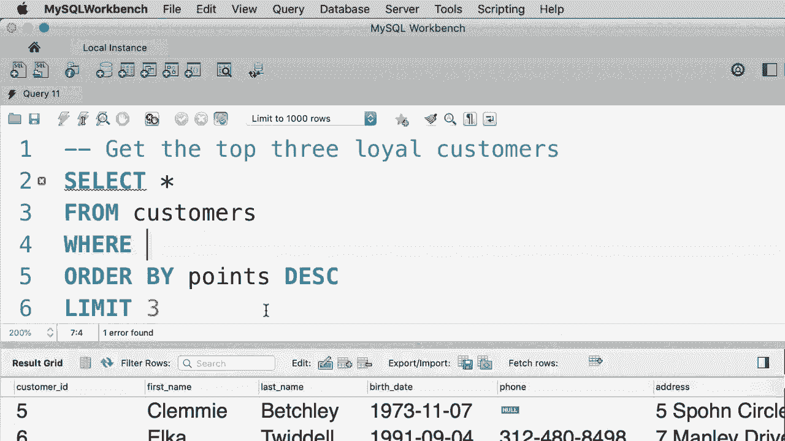

# 【双语字幕+资料下载】SQL常用知识点合辑——高效优雅的学习教程，复杂SQL剖析与最佳实践！＜快速入门系列＞ - P17：L17- LIMIT 运算符 - ShowMeAI - BV1Pu41117ku

哦。In this tutorial， I'm going to show you how to limit the number of records returned from your query。 For example， when we execute this query， we get all the customers and the customer table。 so we have 10 customers here。😊，Now， what if we only want to get the first three customers。 that's where we use the limit clause， let me show you so。After from， we type out limit3。

And this will return only the first three customers。If the argument that we pass here is greater than the number of records that our query produces we'll get all the records in the query result。 for example， if I pass 300 here， obviously we don't have 300 customers in this table。 so when we execute this query we'll get all the 10 customers in this table。

 so this is how the limit clause works。😊，Now here we can optionally supply an offset。 and this is very useful in situations where we want to paginate the data。 For example。 let's say we have a website and on this website we have a web page for the user to see all the customers in the database。 Now for simplicity， let's imagine we want to show only three customers per page。

 So what are the customers that we're going to have on page one。😊，We're going to have customers， one。 two， three。On page two， we're going to have customers 4，56， and on page 3。 we're going to have customers 7，8，9。😊，Now let's say we want to write to query to retrieve the customers on page 3 how can we do that Well。 we want to skip the first six records and then pick three records right so we change our limit clause to something like this。

😊，Limit 6 and 3。So6 is what we call an offset， and that basically tells myqQL to skip the first six records and then pick three records。 Let's execute this query。😊，All right， now we get。Customers，7，8 and 9。

Now， for your exercise， I want you to get the top three loyal customers。 These are the customers that have more points than everyone else。All right， first。 we select everything from the customers table。😊，Now we need to order these customers by their points in descending order。So if you look at the query result， you can see that customers are sorted by their loyalty。

 so the most loyal customers come first now we want to pick only the first three customers and that's where we use the limit clause。 so limit 3。😊，Let's execute this query。And these are the most loyal customers， customers with IDs， 5。6， and3。Now here's one thing I want you to remember， and that is the order of the limit clause。 the limit clause should always come at the end， so first we have the select clause then we have from optionally we can have where followed by order by and finally limit the order of these clauses matters if you change the order My SQL is going to yell at you so pay attention to the order when writing your queries。

😊。

Oh。