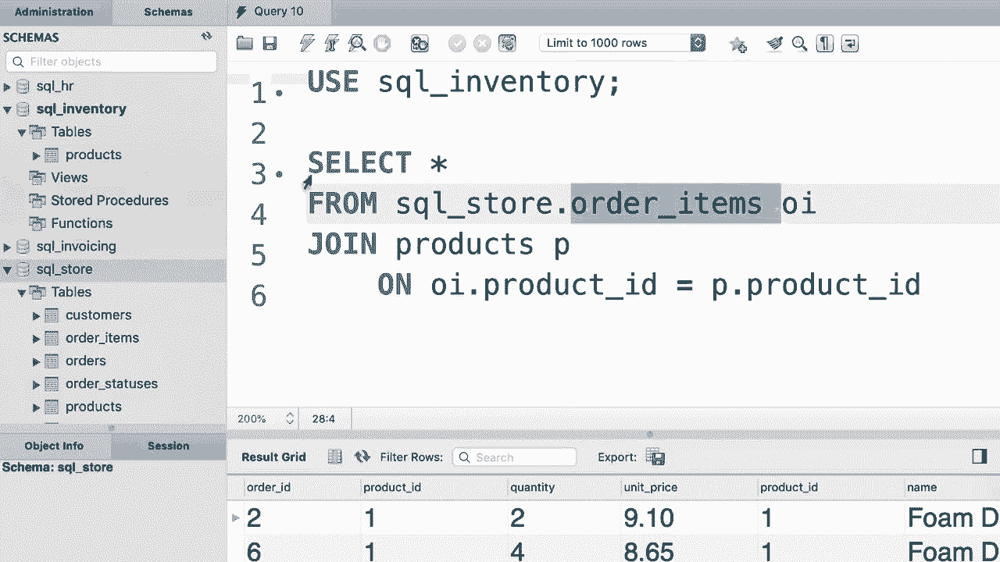

# 【双语字幕+资料下载】SQL常用知识点合辑——高效优雅的学习教程，复杂SQL剖析与最佳实践！＜快速入门系列＞ - P19：L19- 跨数据库联接 - ShowMeAI - BV1Pu41117ku

哦。In the real world， when you work as a developer or a database administrator。 Qui often you' will have to work with multiple databases in this tutorial。 I'm going to show you how to combine columns from tables across multiple databases。 that's pretty easy。 So in the SQL store database we have these tables that you're fairly familiar with。

 Now imagine this product table was not here。😊，Now， if you look at the SQL inventory database。 you can see here we have。😊，Another products table。 this product table is exactly the same as the product table that we have in a SQL store database。 so it has the same columns and the same data。😊，Now technicalically， this is not a good design。

 We don't want to have the same table repeated in multiple places。 but for this demo。 let's just imagine that we don't have the products table here。 So we want to join the order items table with the product table in the SQL inventory database Let's get started So select everything from the order items table let's give it an alias straight away。 we want to join this with the product table This product table is part of the SQL inventory database So we'll have to prefix this with the name of its database So we type out SQL inventory。

😊，Dot。😡，Now， once again， we can give this an alias like P。😊，Then type out our join condition。 so OI dot product ID should be the same as P dot product ID let's run a query。There you go。 so we successfully join tables across multiple databases。Now note that we're prefixing the product table with the name of its database because the current database that we are writing this query against is the SQL store database。

 Take a look in the navigator panel， the SQL store database is displayed in bold because earlier we wrote。😊，The use statement to select a database that was SQL store。Now。 what if we select the SQL inventory database， Let's see what happened。 So SQL inventory。😊，Now。 because we have multiple statements， we have to terminate this with a semicolon。😊。

Now we want to select everything from the order items table。 but we don't have this table inside of this database。😊。So now we'll have to prefix this table with an name of its database that is SQL Underline Store。😊。Let's execute the query。😊，Okay， everything works beautifully。 So here's the lesson。

 you only have to prefix the tables that are not part of the current database。 In other words。 your query will be different depending on the current database。😊。

Oh。