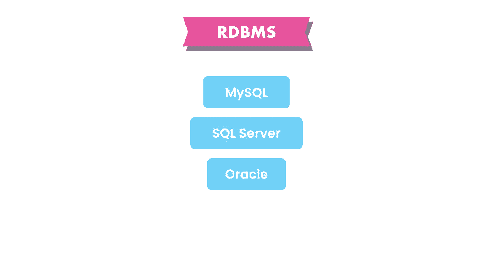
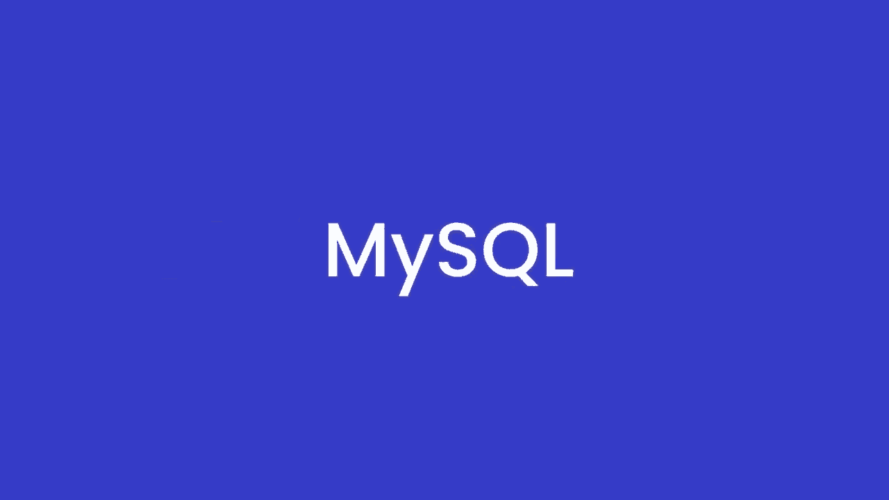
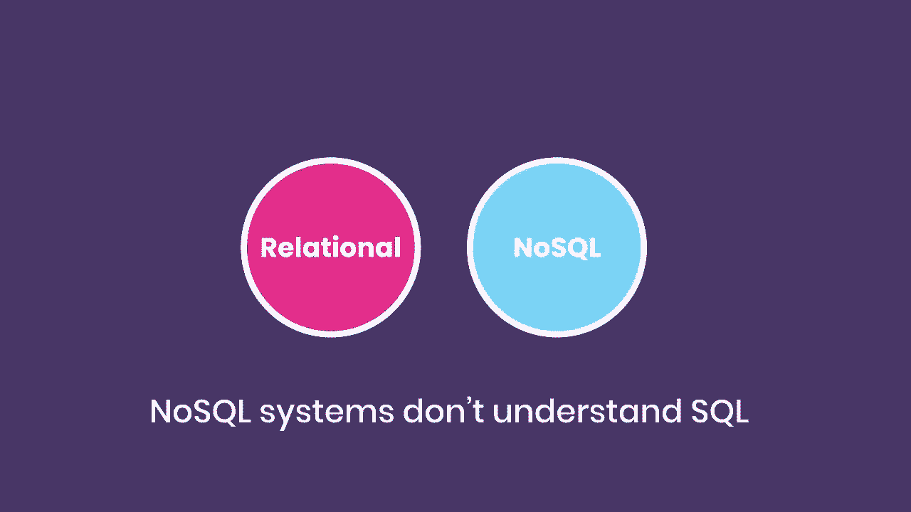

# 【双语字幕+资料下载】SQL常用知识点合辑——高效优雅的学习教程，复杂SQL剖析与最佳实践！＜快速入门系列＞ - P2：L2- 什么是 SQL？ - ShowMeAI - BV1Pu41117ku

🎼让我们以快速概述数据库开始课程，什么是数据库以及我们如何使用它。数据库是以易于访问的格式存储的数据集合。为了管理我们的数据库，我们使用一个叫做数据库管理系统（DBMS）的软件应用程序。我们连接到DBMS并给它指令以查询或修改数据，DBMS将执行我们的指令并返回结果。

🎼现在有几种数据库管理系统，这些系统分为两类：关系型和非关系型，也称为NoSQL。在关系型数据库中，我们将数据存储在通过关系相互链接的表中，这就是我们称这些数据库为关系型数据库的原因。每个表存储特定类型对象的数据，如客户、产品、订单等。SQL或结构化查询语言是我们用来操作这些关系型数据库管理系统的语言。它看起来像这样：我们使用SQL查询或修改数据。在本课程中，我们将学习关于这门强大语言的一切。现在市面上有许多不同的关系型数据库管理系统，最流行的有MySQL、微软的SQL Server和Oracle，当然还有许多其他的。每个数据库管理系统都有自己版本的SQL，但所有这些实现都非常相似。

🎼基于标准SQL规范，因此你在本课程中学习的大部分SQL代码都适用于任何数据库管理系统，在本课程中我们将使用MySQL，这是全球最受欢迎的开源数据库。

现在回到这个图表，关于非关系型数据库：在非关系型数据库中，我们没有表或关系。这些数据库与关系型数据库非常不同，但这是另一个完全不同课程的话题。你需要知道的是，非关系型数据库管理系统不理解SQL，它们有自己的查询语言，因此我们使用SQL来处理关系型数据库管理系统。在我们开始安装MySQL之前，让我迅速澄清一件事：当你与不同的人交谈时，你会听到SQL的两种不同发音：SQL或S-Q-L。哪个是正确的发音？这要看你问谁，当然每个人都认为自己的发音方式是正确的。但这里有一个关于这门语言的小历史：SQL最初是在70年代由IBM开发的，当时最初被称为QL，代表结构化英语查询语言，但后来他们将缩写改为SQL，因为QL。

一直以来，这种语言的发音方式存在争议。一般来说，非英语国家的人称其为SQL。我习惯称之为SQL，因为它比SQL更简短、更易记，但如果你更喜欢称它为SQL，我对此完全没问题，我不会因此而生气。这就是这种语言的历史。那么，关于MySQL作为软件产品，开发者们更喜欢称之为MySQL，而不是MyQL，但他们并不介意我们称之为MyQL。在本课程中，我将教你如何使用MySQL。

