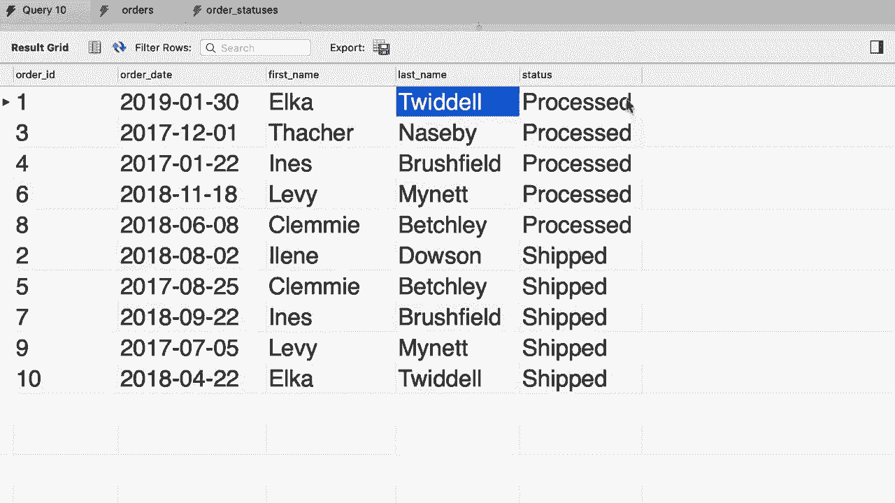
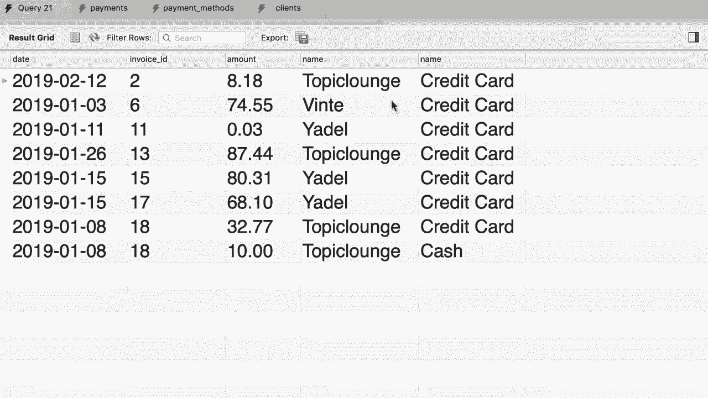

# 【双语字幕+资料下载】SQL常用知识点合辑——高效优雅的学习教程，复杂SQL剖析与最佳实践！＜快速入门系列＞ - P21：L21- 连接多个表 - ShowMeAI - BV1Pu41117ku

在本教程中，我将向您展示如何在编写查询时连接多个表，例如。回到我们的 SQL 商店数据库，看看订单表。😊。现在您知道如何编写查询，将此表与客户表连接，以返回每个订单的客户信息。但是这里我们还有一个类似于客户 ID 列的状态列，因此这些状态的名称并不存储在此表中，而是在订单状态表的其他地方。

我们快速看一下。所以我们的订单可以是处理中的、已发货或已交付的，这些是每个状态的标识符。现在回到我们的订单表。😊。在状态列中，我们存储订单状态 ID。因此现在我们应该编写一个查询，将订单表与两个表连接。

客户表和订单状态表，这个查询的结果将如下所示。😊。因此，对于每个订单，我们看到订单 ID、日期、客户的名字和姓氏，最后是订单的状态，这是我们可以为用户创建的美丽报告，所以让我告诉您如何编写这个查询。

😊，回到我们的查询编辑器，首先我们需要选择 SQL 商店数据库。现在我们需要从。😊，订单表中选择所有内容，让我们给它一个别名。😊。接下来，我们要与客户表连接。哦，客户 ID 应该等于那个客户 ID。目前为止没有新内容，和之前完全一样。

现在这里我们可以写另一个连接关键字。😊，将订单表与订单状态表连接。因此我们输入订单状态，并给它一个别名，比如 O。我们的连接条件是什么？好吧。回到订单表，我们有状态列，因此该列中的值应等于订单状态表中的订单状态 ID 列，对吧，所以回到查询。😊。

所以订单表的状态应该等于订单状态的订单状态 ID。确保名字正确，不要拼写错误。否则您将遇到错误。这就是我们如何连接三个表。在现实世界中，随着您处理更复杂的问题，您可能会最终连接多达 10 个表。因此，在 SQL 世界中，这并不罕见。

现在让我们继续执行这个查询。😊，首先我们从订单表中获取列，接着是客户表的列，依此类推。这个结果非常复杂，难以提取信息。😊。让我们明确选择几个列，从订单表中。

我们想选择订单 ID 列。😊，以及订单日期，然后从客户表中选择名字和姓氏？最后，从订单状态表中选择名称列，现在我们可以给它一个别名，比如状态。😊，这样更好。让我们再执行一次查询。😊，所以，结果如下，我们有订单 ID 或日期。

客户的名称，接着是订单的状态。😊 

嗯。

好吧，作为你的练习，看看这个SQL发票数据库。这里有一个支付表，这些是每个客户对特定发票所做的支付。让我们看看数据。😊，我们有像客户ID这样的列来识别客户，因此可以将此表与客户表连接，以查看客户的名称。😊。

接下来我们有发票ID，还有日期、金额和支付方式。因此，我们可以类似地将此表与支付方式表连接。让我们看看这个表中的数据，这些是支付方式：信用卡、现金、PayPal和电汇，所以回到支付表，我希望你写一个查询，将此表与支付方式表以及客户表连接，生成一个显示更多细节的报告，比如客户名称和支付方式。

嗯。一开始，我们需要使用SQL发票数据库。现在我们可以选择支付表中的所有内容，我们称之为P。😊。接下来，我们要将其与客户表连接，称之为C。😊。在P的客户ID应该等于C的客户ID，让我仔细检查一下列名，以确保我没记错，回到支付表，列叫客户ID。

😊，我们还有一个叫做支付方式的列，需要与支付方式表的支付方式ID列连接。所以回到查询中。再次使用连接语句。与支付方式连接，但给它一个别名PM。在P的支付方式上，应该等于PM的支付方式ID。

确保正确输入，否则会出现错误。让我们继续执行到此为止的查询。好了。最后，让我们选择最有意义的列。所以，从支付表中选择一个日期，接着是发票ID。还有什么呢？我们有客户ID，发票ID，日期。

金额和支付方式，我也要从这里选择金额列。回到查询P。金额。😊，现在我们需要添加客户的信息。让我们看看这个表，客户。这里有像名称、地址、城市等列。我们需要的只是名称列，所以回到查询。😊，从客户的表中。

让我们选择名称列，最后从支付方式表中选择那个列？😊，它叫做名称。所以回到查询。PM，那名称。所以这是最终结果。😊，现在我们可以按任意顺序放置这些列，这真的无所谓，让我们执行查询，确保一切正常。😊，那么在这个日期。

对于这个发票，我们有这个客户使用信用卡支付的金额。

