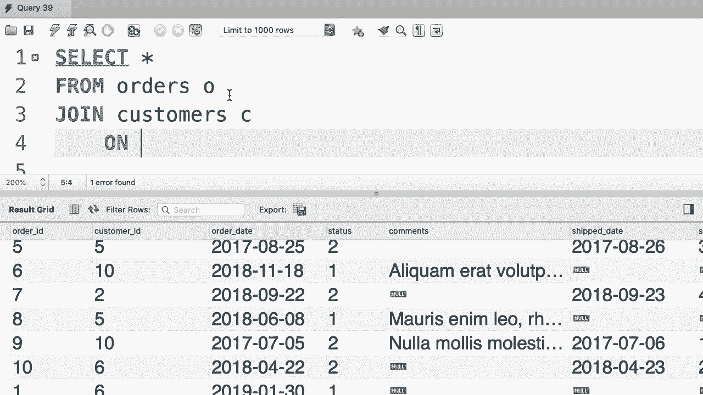

# 【双语字幕+资料下载】SQL常用知识点合辑——高效优雅的学习教程，复杂SQL剖析与最佳实践！＜快速入门系列＞ - P23：L23- 隐式连接语法 - ShowMeAI - BV1Pu41117ku

哦。In this tutorial I'm going to talk about the implicit join syntax in My SQL so here we have a basic inner join。

 we're selecting everything from the orders table， joining it with customer table on orders that customer ID equal to customers customer ID Pre basic There is another way to write this query using implicit join syntax Let me show you how that works。

😊，So。We select everything。From now here we can type out multiple table namess， so orders， comma。

 customers， and we can also give them an alias， so C and O。

And then we move this join condition to the where clause， so I'm going to copy this from here。

 type out a where clause and paste the condition。😊，These two queries are equivalent。😊。

What we have here is called implicit join syntax Now even though MyQ supports this syntax。

 it's something that I suggest you not to use because if you accidentally forget to type out the work clauses。

 you will get a cross join。😊，Let me show you what I mean。

 So first I'm going to delete the first query。😊，And execute this。

So we get 10 records because we have 10 orders in this database， so far so good。😊，But what happens。

If we accidentally forget to type out the word clause。Instead of 10 records。

 we're going to get probably 100 records。Because every record in the order table is now joined with every record in the customers table。

😊，This is what we call a cross join now later in this section I'm going to talk about cross joins in more detail。

 but what I want to point out in this tutorial is that it's better to use the explicit join syntax。

 so we use join because this syntax forces you to type out the join condition。😊。

If you simply join orders with customers without typing the join condition。

 you're going to get a syntax error， so to recap， be aware of the implicit join syntax。

 but write all your joints using the explicit syntax。

Oh。

