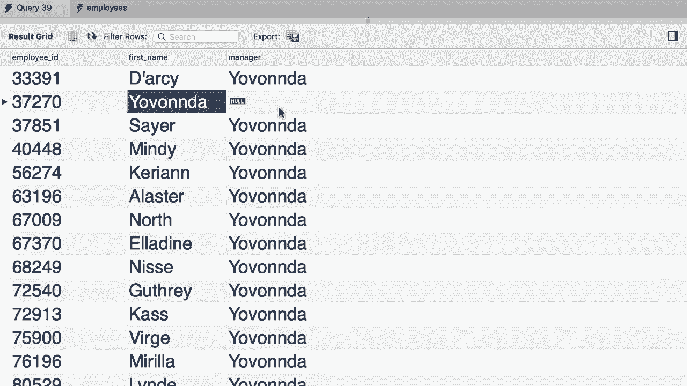

# 【双语字幕+资料下载】SQL常用知识点合辑——高效优雅的学习教程，复杂SQL剖析与最佳实践！＜快速入门系列＞ - P26：L26- 自外连接 - ShowMeAI - BV1Pu41117ku

哦。Early we talked about self joints in SQL， so here in the SQL HR database。 we have this employees table。😊，We wrote a query to get all the employees and their manager。 so here we have this column reports2 that specifies the manager for each employee。So let's go back and rewrite this query to get all the employees and their manager。😊。

Back to our query editor window。First， let's use a SQL HR database。Then select everything。😊。From the employees's table。We give it an alias and then join it with itself。😊。So this is what we call a self join。Now we're going to use a different alias like M for managers。😊。Now。What is the joint condition E dot reports to should be equal to M dot employee ID right now for clarity。

 let's pick only three columns so E dot employee ID E dot first name。And M dot first name。 which we rename to manager。 Allright， let's execute this query and see what we get。So here's the result。As we can see， all these employees have the same manager。However。 there is something missing here。 We don't have a record for this person， this manager himself。

So what is missing is a record where we can see the employee ID for this person， their name。 and their manager， which should be null because this person is the CEO or the head of the company。 but why is this happening？There is an is。Our innertroy。Because this condition we have here will only return people who have a manager。

 we can solve this problem by using a left join， so we do a left join because we want to get every employee in this table。 whether they have a manager or not。😊，Okay， now let's execute the query one more time。😊。There you go now we have a record for this person， the manager， as you can see。 this person does not have a manager， that's why we have null here。😊。

Oh。