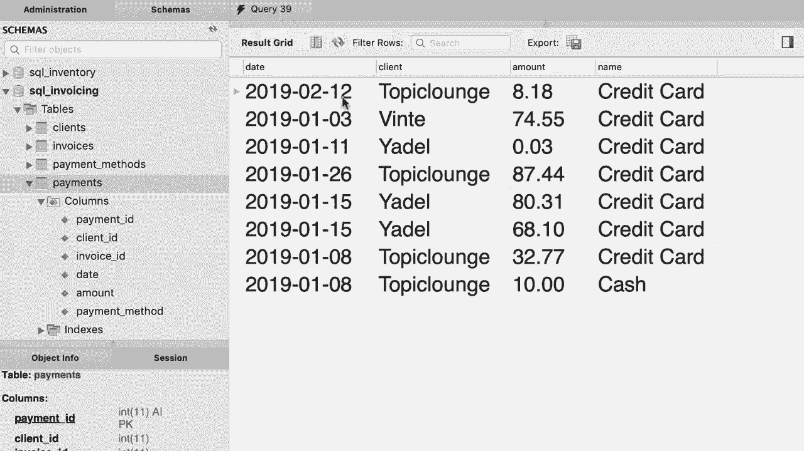

# 【双语字幕+资料下载】SQL常用知识点合辑——高效优雅的学习教程，复杂SQL剖析与最佳实践！＜快速入门系列＞ - P27：L27- USING表达式 - ShowMeAI - BV1Pu41117ku

哦。

Back to our SQL store database here we have a simple query that joins the order table with a customer table。

 and here's our join condition。 You have seen several examples of this before。

 Now as our queries get more complex， these join conditions get in the way。

 they make our queries hard to read， but the good news is that in MyQl。

 we have a powerful feature for simplifying these queries。😊。

If the column name is exactly the same across these two tables。

 we can replace the on clause with the using clause， which is simpler and shorter。 Let me show you。

 So I'm going to comment out this line and instead type out using。😊，In parenthses。

 we type out the column name that is customer I D。 What we have on line 7 is exactly identical to what we have on line 6。

 but is shorter and easier to read。 So let me delete this line。

We can add another join statement here to join the orders with the shippers， so join with shippers。😊。

Using。Shiper ID in both these tables， we have a column with the exact same name。All right。

 now let's execute this query。This is what we get。 We have the order I followed by the first name of the customer。

 Let's add a new column here。So。I'm gonna add。S H。That name that is the name of the shipper So shipper。

 Now obviously because some of our orders are not shipped。

 we need to replace this inner join with a left join。😊。

So we can use the using keyword with both inner and outer joins。

Let's execute the query one more time。There you go now we have the name of the shipper next to each order。

 beautiful。😊，However， we cannot use this technique to join the result with the order statuses table because in the order table we have this column called status。

 but in order statuses table this column has a different name。

 itss order status ID let me show you so order statuses columns there you go order status ID so the using keyword only works if the column name is exactly the same across different tables。

Now， what if we have multiple columns in our joint condition， for example， earlier。

 we talked about this order items table。😊，I told you that in this table we have a composite primary key。

 which basically means a primary key that consists of multiple columns。

 so the combination of these two columns uniquely identify each record in this table Now if you want to join this table with order item notes table in our join condition。

 we should compare both these columns with their corresponding columns in the order item notes table。

So let's quickly write that query and then simplify it with the using keyword。😊，So select everything。

From order items。Now join it with Order item notess。On so here we need to compare Oi。

 order ID with OI。 order ID。And。OI dot product ID equal to OIN dot product ID。

This join condition is kind of messy。 It's hard to read this query。

 Now we can simplify this query with the using keyword。 So we talk about using。😊，In parentheses。

 we add both columns and separate them using a comma， so order ID and product ID。

Isn't that better？嗯。

Now for exercise， back to our SQL invoicing database。

 write a query to select the payments from the payments table and produce something like this。

 so in this table we have the date， the client， the amount and the payment method we can see on what date who has paid how much using what payment method。

All right， I'm going to use the SQL invoicing database。😊，And then select everything。😊。

From the payment table。Join it with the client's table。Using。Client ID because in both these tables。

 we have the client ID column。Next we need to join this with payment methods， however。

 the column name between these two tables is different。

 so in the payment table we have a column called payment method。

 but in payment methods table our column is called payment method ID。😊。

So here we cannot use the using keyword。And we'll have to use the on clause。

 so on P dot payment underlyingline method equals PM dot payment method ID。

Now let's pick our columns， so payment do date， client do name， and we re name this as client。Next。

 we pick the amount and finally the payment method， so let's rename that to payment under method。

And execute the query。 there you go， this is what we get。😊，The date， the client。

 the amount and the payment method。

Oh。

