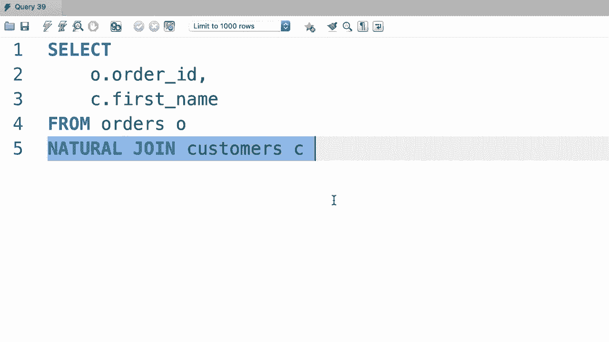

# 【双语字幕+资料下载】SQL常用知识点合辑——高效优雅的学习教程，复杂SQL剖析与最佳实践！＜快速入门系列＞ - P28：L28- 自然连接 - ShowMeAI - BV1Pu41117ku

哦。在我的技能中，我们还有另一种更简单的方法来连接两个表。它叫做自然连接，更容易编码，但我不推荐，因为有时会产生意想不到的结果。但让我快速向你展示一下它是如何工作的，以防你在某处看到过，至少你对此有些了解，所以回到之前的例子，让我们选择订单表中的所有内容。

现在我们应该与客户表进行自然连接。现在通过这些自然连接，我们不明确指定列名，因此数据库引擎将查看这两个表，并根据具有相同名称的公共列进行连接，这就是为什么这个查询写得很简短的原因。

为了清晰起见，我们选择这里的几列。O的订单 ID D，并看一下名字。😊，让我们执行查询，看看吧。😊。所以我们看到所有订单和客户会下的单。因此，自然连接确实很容易编码，但它们可能有点危险，因为我们让数据库引擎来推测连接。

我们无法控制这一点。正因如此，自然连接可能会产生意想不到的结果，这就是我不鼓励你使用它们的原因。

哦。
