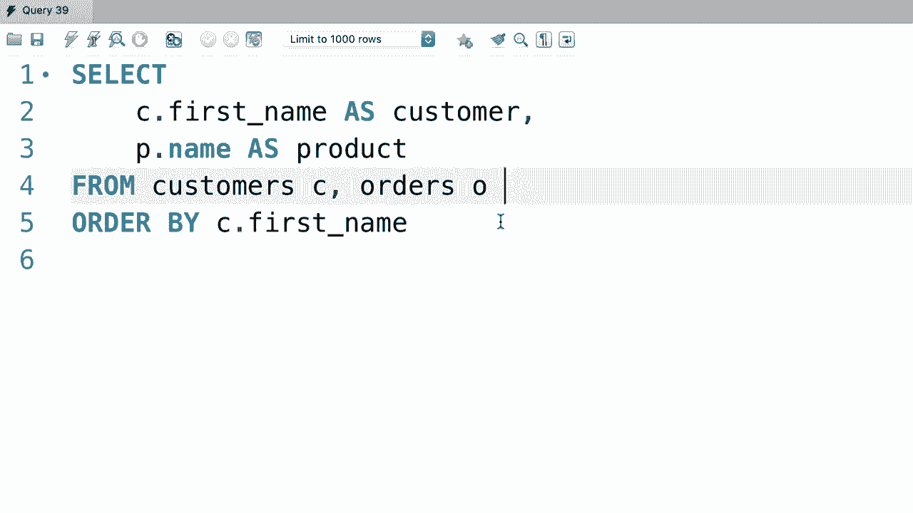
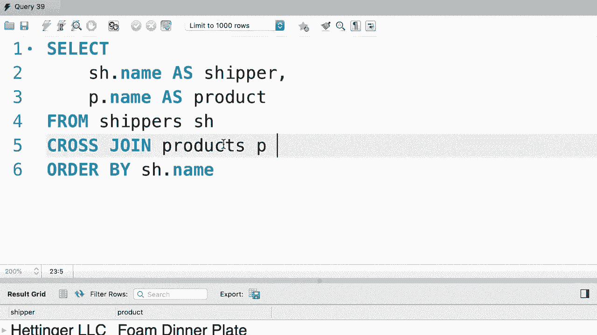

# 【双语字幕+资料下载】SQL常用知识点合辑——高效优雅的学习教程，复杂SQL剖析与最佳实践！＜快速入门系列＞ - P29：L29- 交叉连接 - ShowMeAI - BV1Pu41117ku

哦。In this tutorial， we're going to look at cross joins in SQA。

 we use cross joins to combine or join every record from the first table with every record and the second table。

 Here's an example。 Let's select everything。😊，From the customer's table。Now here we do a cross join。

With the products table。 So every record in the customer's table will be combined with every record in the products table。

 And that is why we don't have a condition here。 Okay， so this is what we call a cross join。

 Now for clarity， let's pick a couple of columns。 like see that first name。

We rename it as customer and then。Product the name， which wename to product。Also。

 let's sort the result by customer。t first name。Now let's execute the query。😊。

Here is the result of a cross joinin。 So first we have Amber as the customer。

 and here are all the combinations of amber with different products。 Next。

 we have barbara or whatever it is。 And again， we have the combination of this customer with all the products。

 Now in this particular example， it doesn't really make sense to use a cross joinin。

 A real example for using cross joins is where you have a table of sizes like small， medium， large。

 and a table of colors like red， blue green， whatever。

 And then you want to combine all the sizes with all the colors。 that is when you use a crosstroin。😊。

Now， what we have here is called the explicit syntax for a cross join。

 We also have the implicit syntax， which looks like this instead of typing out the cross join。

We type out multiple tables in the F clause， so customers and orders。

Both these queries produce the same result， but I personally prefer to use the explicit syntax because it's more clear。

And here is a simple exercise for you。 Do a cross join between shippers and products。

 first do it using the implicit syntax and then using the explicit syntax。

 It's pretty straightforward。 I just want you to get your hands dirty in the code and get used to this syntax。

😊。

Al right， first， I'm going to use the implicit syntax， and then I will show you the explicit syntax。

 So let's start by selecting everything from two tables， shippers。😊，And products。Now for clarity。

 let's pick two columns， Shiper do name， which we were named to Shiper。And product of name。

 which were renamed to product。And finally， let's order everything by shipper that name。

Let's execute the query。This is what we get。 So the combination of all shippers and all products。

 beautiful。 Now let's use the explicit syntax。 So we select everything from the base table in this case。

 shippers and then do a cross join with products。😊，That produces exactly the same result。

Oh。