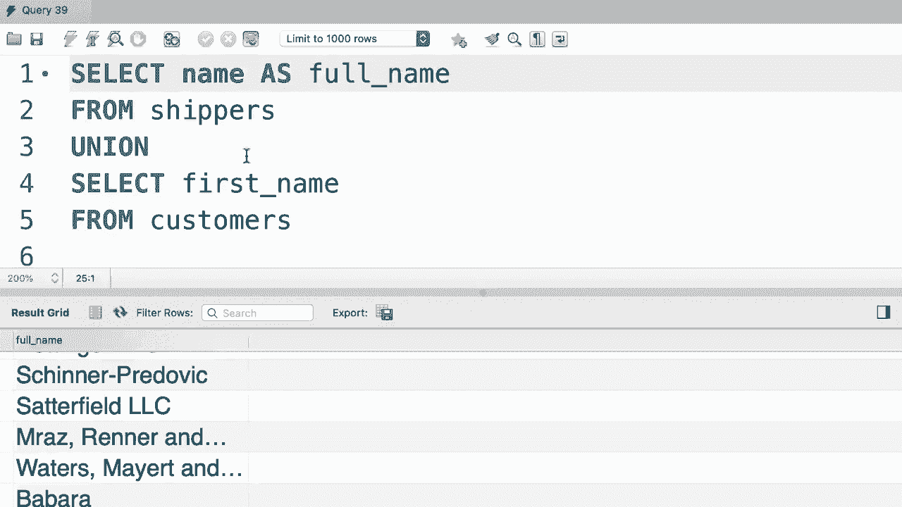
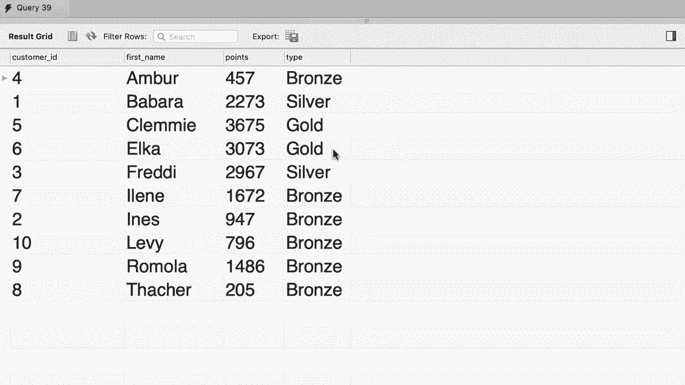

# 【双语字幕+资料下载】SQL常用知识点合辑——高效优雅的学习教程，复杂SQL剖析与最佳实践！＜快速入门系列＞ - P30：L30- Unions - ShowMeAI - BV1Pu41117ku

哦。We covered everything about joints。 youll learn that with joints we can combine columns from multiple tables。 but in SQL we can also combine rows from multiple tables， and this is extremely powerful。 Let me show you how that works。😊，First， let's have a quick look at our orders table。 so select everything from the orders table。Now， if you look at the data。😊。

We can see that the first order was placed in the current year 2019。 all the other orders were placed in previous years。Now let's say we want to create a report。 get all the orders and next to each order add a label， if the order is placed in the current year。 the label is going to be active and if the order was placed in previous years。

 we want to label it as archived so。😊，Let's change our query and add a condition here。 First。 we want to get all the orders in the current here， So where。Order。Date is greater than or equal to 2019，0，1，01。NowI just want to highlight that this is not the ideal way to get the orders in the current year because here we have hard coded 2019。 so if we execute the score in next year， we're not going to get the right result。

 but don't worry about this for now later in the course I will show you how to get the orders in the current year without hard coding a date here。😊，So let's execute this query。😊，Now we get only one order， let's hand pick a couple of columns here。So order ID。And or na date。And also， I want to add a string literal here。😊，Like active。Right。Let's execute this query。This is what we get。 we have three columns， order ID， order date。

 and an active， and in this column currently we have this string value active。😊。Now let's rename this column too。Status。And execute the queryium。😊，That is better。Now we want to write another query similar to this that will return to orders in the previous years。 but with a different label archive， so to save time。😊，I'm going to copy this few lines。

And paste them right after our first select statement Now note that here we have a syntax error because we didn't terminate the first select statement with a semicolon。 but don't worry about it， we're going to get back to this in a second。So for the second queryium。

 we want to return a different label archive。😊，And we want to change our condition to less than 2019。Now。Select only these few lines and execute this query either by clicking on this icon here or using the keyboard shortcut that you learned earlier in the course。

There you go。Here are all the orders from the previous years with the label archive。This query returns nine records， the previous query returned one record Now using the union operator。 we can combine data from these two queries。In between our select statements。 we type out union now let's execute query one more time。

So here's our first order in the current year that is active and below that we have all the orders in the previous years。 so using the union operator we can combine records from multiple queries Now in this example。 both our queries are against the same table， but we can also have queries against different tables and then combine the result into one result set。😊，Let me show you another example。So I'm going to delete everything here。😊。

Let's select the first name。From the customers table， and then we can union that with。😊。Select the name from the shippers's table， Let's execute the queryium。So in one result set。 we can see all the customers and all the shippers。As far as I know。 there is no real world use case for this particular query。

 but what I want to point out is that with union you can combine results from multiple queries。😊。These queries can be against the same table or different tables。In your database you could have a table like archived orders and in another table like orders。 and then you could combine all the archived and active orders into one result set。

 Just remember that the number of columns that each query returns should be equal。 otherwise you're going to get an error。 for example。 let's select the first name and last name from customers and then union that。😊。With the name of shippers， let me execute this query will'll get an error because the first part of this query returns two columns。

 but the second part returns one column。 so my skill doesn't know how to combine these records。 and one last thing before we finish this tutorial。If you look at the result here。The name of this column is based on the first query， so the first query returns first name。 and that's why this column is called first name。If we change the order of this queries。

And move this union up here。Now let's run this query。😊，As we can see， our column is called name。 so whatever we have in the first query is used to determine the name of these columns here we can also rename the column to let's say full name。

There一个。

Al right， here's your exercise for this tutorial。Write a query to produce this report so here we have four columns。 customer ID， first name， points and type as you know we don't have this column in the customers table so we have calculated the values in this column based on the points each customer has。

If they have less than 2000 points， their type is bronze。 If they have between 2000 to 3000 points。 they are silver customers， and if they have more than 3000 points， there are gold customers。 Also note that here we have sorted the result by the first name。 So go ahead and spend two minutes to write this query。Alright， first。

 let's get the bronze customers。 So select everything from customers where。😊。Points is less than 2000。Now here going to pick three columns， customer I D。First name。And points。And finally， we add a new column with a string literal。😊，Fronance。Let's run this query and see what we get。 So these are all the bronze customers。

 but the name of this column is bronze。 We don't want that。 So let's rename this two type Now this is off the screen。 So I'm going to break this up into multiple lines that makes our query cleaner and easier to read。😊。So there you go。Let's run the query one more time。Now the column is called type Beai。

Now we should do a union。And repeat this query but extract the silver customers。 so I'm going to paste this query here。😊，And then make a couple of changes here。I'm going to replace bronze with silver。And change the condition to。Between 2000 and 3000。 let's run our query and see what we get。We have all the bronze customers first。

 followed by all the silver customers。 So the order of these records are based on our queries In our first query。 we got the bronze customers。 That's why they are listed first。 But this is not what we want。 We want to order the result by the first name of our customers。 So let's apply an order by at the end。So order by first name。Now there is one more piece remaining。

 we should do a union one more time。I'm ready to query to get the gold customers。 So I'm going to select these few lines and。😊，Pas them here。Nowhou us change silver to gold。And the condition2 points greater than 3000。And finally we do on order by。Let's run the query one more time。😊，And here's the end result。

 our customers are sorted by their first name。 We see all the bronze， silver and gold customers。