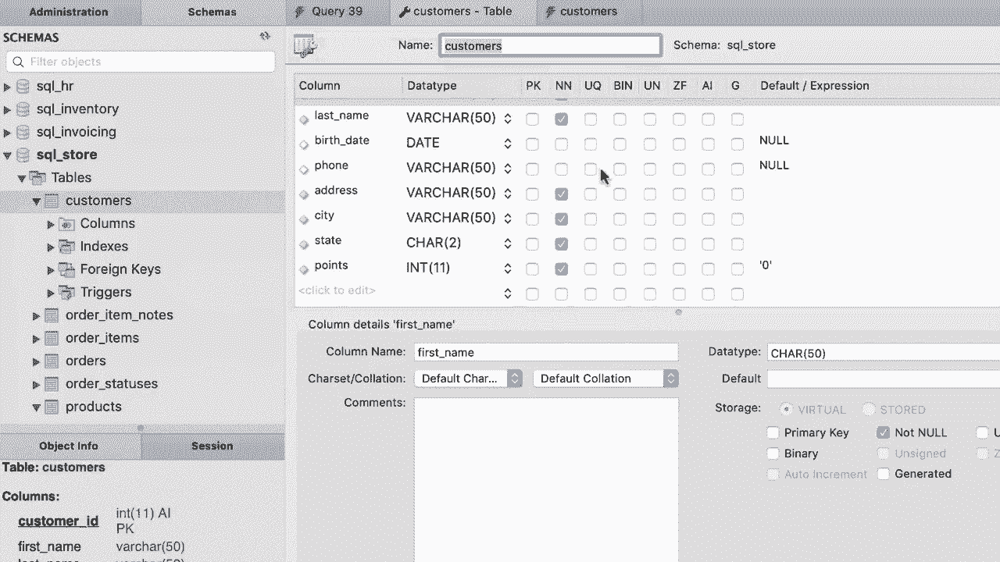

# 【双语字幕+资料下载】SQL常用知识点合辑——高效优雅的学习教程，复杂SQL剖析与最佳实践！＜快速入门系列＞ - P31：L31- 列属性 - ShowMeAI - BV1Pu41117ku

哦。In this section I'm going to teach you how to insert， update and delete data Before we get started。

 let's have a closer look at our customerss table， so click on this middle icon to open this table in the design mode。

What you see here might look a little bit intimidating at first， but trust me。

 this is actually so easy and in this tutorial I'm going to explain exactly what we have in these columns。

😊，So on the left side， you can see the column name next to that you can see the data type for each column。

 so our customer ID column can only accept inger values。 integers are whole numbers like 1，2，3。

4 and so on。 they don't have decimal points。 first name is a varchar。

 which is short for variable character Now here in parenthesesis。

 we can see 50 that basically means in this column， we can have a maximum of 50 characters。

 Now if the name of a customer is only five characters long， we only store those five characters。

 So even though the maximum length for this column is 50。

 we are not going to waste space if the customer's name is less than 50 characters。

 That is why here we have varchar， which is short for variable In contrast we have another data type that is character。

😊，If we had character 50 here and the name of the customer was only five characters long。

 my skill would insert additional 45 spaces to fill this column。 So this is a waste of space。

 So as a best practice， most of the time we use varchar to store string or textual values。

Now here on the right side， we have this column PK。

 which is short for primary key so customer ID is marked as the primary key and that is why we have this yellow key here So the values in this column uniquely identify each customer next to that we have NN which is short for not null and that determines if this column can accept null values or not In this case every customer record must have the customer ID first name last name as well as these other attributes but birth date and phone are optional so in this columns we can have null values now we have another column here AI which is short for auto increment and this is often used with primary key columns so every time we insert a new record in this table we let myql or our database engine insert a value in this column So essentially it gets the customer ID for the last row and it will incremented by one at the time we insert a new record So if you look at the data。

三？You can see that currently we have only 10 customers here， so if you have a new customer here。

 myQ will assign 11 to the new customer okay。😊，And finally here we have another column that specifies the default value for each column。

 for example， for our birth date and phone columns that default values are null。

 so if we don't supply a value， MyQ will use the null values for these columns。Similarly。

 we have another default value for the points column。

 so if we don't supply the points for a customer， My skill will use zero。

 Now we have a few other columns here which are not important at this stage。

 you will learn about them later in the course so now that you understand the attributes of each column in this table let's go ahead and insert data into this table。

