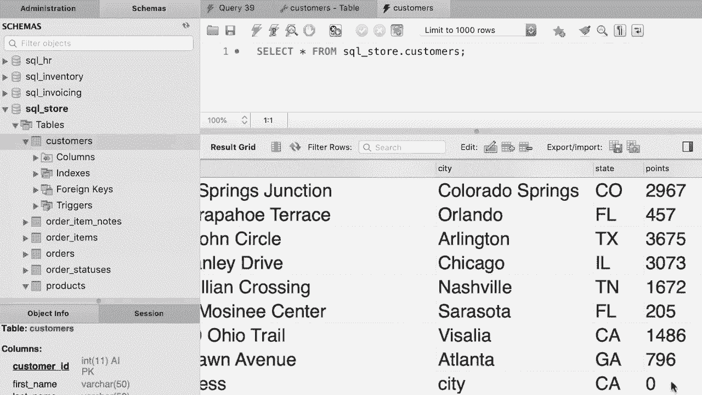

# 【双语字幕+资料下载】SQL常用知识点合辑——高效优雅的学习教程，复杂SQL剖析与最佳实践！＜快速入门系列＞ - P32：L32- 插入单行 - ShowMeAI - BV1Pu41117ku

哦。In this tutorial tutorial， you're going to learn how to insert a row into a table for that。 we're going to use the insert into statement。😊，Where are we going to insert this row into the customers table。 so we type out the name of the table here， followed by the values clause。And here in parentheses we supply the values for every column in this table。

 so back to our table definition， these are all the columns first we need to supply a value for the customer ID column。 however， in this column the auto increment attribute is enabled and as I told you before。 if we don't supply a value， My skill will generate a unique value for us。😊。So we can go back to our statement and either assign an explicit value or use default to let MyQl take care of generating this value。

 This is the preferred approach because if you use an explicit value like 200 it is possible that you might have another customer with the same ID。 So when you execute this statement you're going to get an error because you cannot have duplicate values in this column every value should be unique So here we're going to use the default keyword to let MyQl generate a unique value for the customer ID。

Now after that， we need to supply a value for the first name and last name columns。 so let's say John Smith。Note that I have enclosed these values with quotes because as I told you before in SQL。 we should always enclose string and date values with quotes， either single or double quotes。😊，Now。 what else？Back to our customers' table。After the last name we have the birth date， however。

 as we can see this column is optional because this checkbox is not checked。 so here we can use null or an explicit value， known means the absence of value。😊。So back to our statement。We can type out a birth date like 1990， January 1， or we could use。The null keyword to leave out this value in this demo I'm going to use。A valid date。Now。

 to make this code cleaner and more readable， I'm going to break it up into multiple lines。😊。That's better。Now back to our table。Next， we have phone and phone is also optional because this checkbox is not checked and none is the default value for this column。

 So here we can explicitly pass null or use the default keyword and let Myql put null into this column。 It's exactly the same。So back to our statement， we can pass null or default。Both these cures will have the same result。In this case， I'm going to use the null keyword。😊。All right， let's have one more look at our table。😊，Next， we have。For more columns that are required。

 so address， city， state and points， and note that points has the default value of 0。 so we can either use an explicit value like 200 or use the default key and let MyQl generate 0。So back to our statement， let type out an address。It doesn't really matter， followed by a city。😊。And a estate， let's say， California。And finally， points。Again。

 we can use an explicit value or default。😊，So this is how we can insert a row into a table。However。 in this example， we are only supplying values for first name， last name， birth date。 and this address field。So we are leaving out the phone number， the customer ID and the points。 So there is another way to write your statement and me' show you。😊，So after the table name。

 we can optionally supply the list of columns that we want to insert values into in this case。 first name。😊，Last name。Birthday。Now， once again， I'm going to break off this statementman into multiple lines。😊，So three more columns， address， city， and state。So these are the six columns that we're going to supply values for。With this change， we don't have to use these default or null values。

 we only supply values for these columns， so I'm going to remove default from here then null。 and finally this last default keyword。So these six values that we supplied here are used for these six columns。Now with this change， we can also reorder the columns。 we don't have to list them in the same order that they are defined in the customers table。😊。

For example， we can put the last name first。😊，And then obviously。 we should also swap the order of these values so we can list them in any orders。 Now。 let's execute the statement。😊，Now if you look at the output window down the bottom。 you should see the statement followed by one rows affected。 Unfortunately。

 I cannot resize this window to show you this message。 but if you look down below you can see that one record was affected。 which basically means one record was inserted into this table。Now let's look at the data in the customers table。😊，Okay。So the last row is the one that we inserted。

 You can see that my skill automatically generated the value 11。 This is the effect of auto increment attribute。 So it takes the value of the last row and increments it by one。😊，So here we have the first name， last name， the birthday。 we didn't supply a value for the phone attribute， so that's why we have no here。

We also have address， city， state， and the default value of 0 for the points。

Oh。