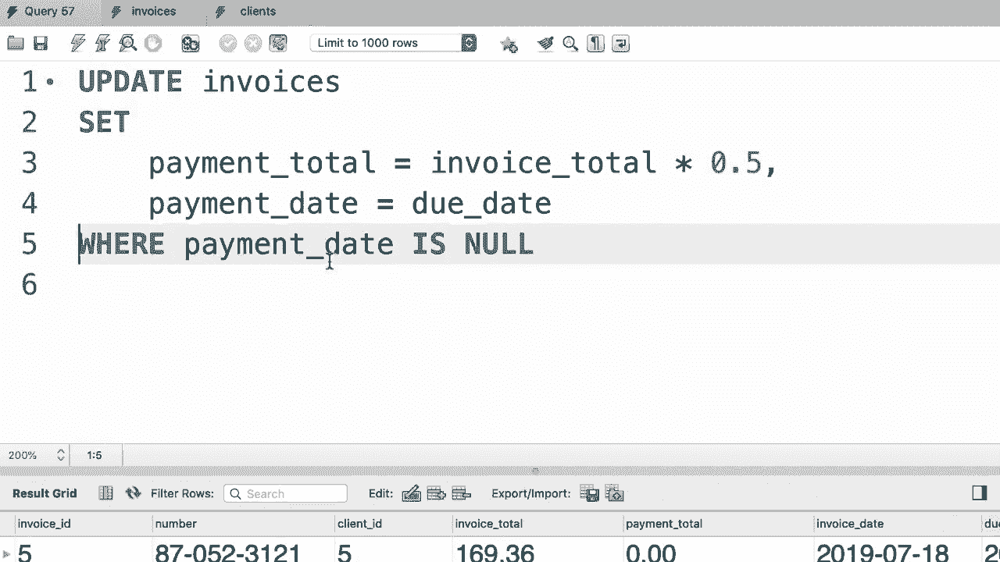
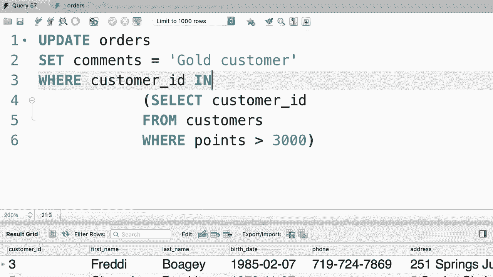

# 【双语字幕+资料下载】SQL常用知识点合辑——高效优雅的学习教程，复杂SQL剖析与最佳实践！＜快速入门系列＞ - P38：L38- 在更新中使用子查询 - ShowMeAI - BV1Pu41117ku

哦。In this tutorial you're going to learn how to use subqueries in an update statement that's extremely powerful。 So we're going to continue with the example from the last tutorial。 but we're going to make it more interesting Here we are updating all the invoices for client number three but what if we don't have the idea of a client we only have the name for example。 imagine you have an application and in that application the user types in the name of the client So first we should find the I for that client and then use that I to update all their invoices How do we do that Well。

 let's have a quick look at our client table。😊，So here we have this client， My works。 let's say we have the name， we want to find the ID。😊，So back to our query editor window。😊。After this update statement， I'm going to write a select statement to select the client ID column。😊。From the client's table， where name equals my works。

Now here we have a syntax error because we didn't terminate the last statement with a semicollon。 but don't worry about that， we're going to get back to that in a second。 let's just select these few lines and execute this query。😊，The idea of this client is too beautiful。Now we can use this select statement as a sub queryry in an update statement。

 so as I told you before， a sub queryry is a select statement that is within another SQL statement。😊。So instead of hard coding3 here， we're going to use this select statement as a sub query。 but we need to put it in parenthsesis。😊，So my school will execute this query first。 it will return the client ID and then use it in this condition。😊，So for clarity。

 let's remove the line break and indent these few lines。😊，So this is the end result。Now we execute this query and this updated all the invoices for this client Now。 what if this query returns multiple clients， for example， back to the client's table。 let's imagine we want to update the invoices for all clients located in New York or California。

 so we need to update our subquery like this。😊，Where。State。In。California。And New York。Now。 before executing the entire statement， let's just select our sub query and execute it to see what we get。So we get two client ID， one and three beautiful now because this query。 this sub query returns multiple records， we cannot use an equal sign here anymore。

 so we need to replace this with the in operator。😊。And now this statement updates the invoices for all clients located in these two states。 Let's execute it。😊，Beautiful， everything worked。So as a best practice。 before executing your update statement， run your query to see what records you're going to update so you don't accidentally update the records that shouldn't be updated Now here we have a sub queryry。

 but even if it didn't have a sub queryry， we could still query the records that we're going to update let me show you so let's imagine we're going to update all the invoices where payment date is nu。😊，Before executing this entire update statement， I would run a query like this。

 select start from invoices where payment date is not。 Now， let's execute this query。😊。These are the two records that don't have a payment date。 so once we're confident that we are updating the right records， then we come back here。And get rid of this select statement and just attach the word clause to our update statement。😊。

Al right， here's your exercise for this tutorial Back to our SQL store database。 Look at the orders table。😊，As you can see， some of your orders don't have a comment。 I want you to write a SQL statement to update the comments for orders for customers who have more than 3000 points。 so customers who have more than 3000 points regard them as gold customers Find their orders if they have placed an order update the comments column and set it to gold customer that's a really good exercise。

All at first we need to find the gold customers， so select everything from the customers table where points is greater than 3000。 and by the way， because the current database is SQL invoicing。 we either have to type out a use statement on the top or double click this database before executing this query。So there you go。 We have three gold customers。 Now。

 we need to get the idea of these customers to use them in an update statement map。 So we only select。Customer Id here。And then use this select statement as a sub query and an update statement。😊，Update orders， set comments to。Gold customer。Where customer I。 because we're dealing with multiple customer IDs， we need to use the in operator。😊。

And then to use this as a sub query， we need to enclose it in parenthesis。 That's it。 Let's indent the code。 that's better。 So here is the final solution。

Oh。