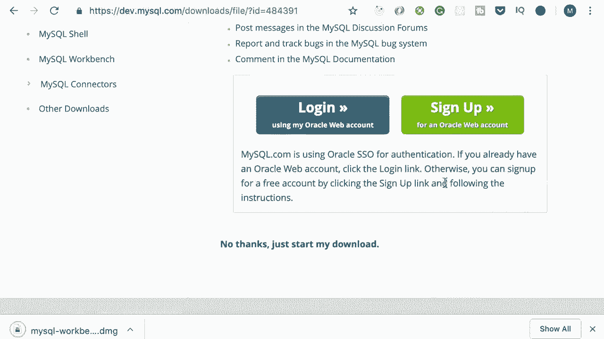
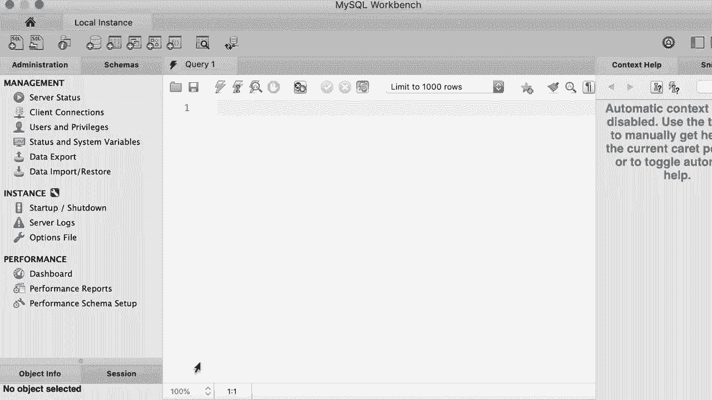

# 【双语字幕+资料下载】SQL常用知识点合辑——高效优雅的学习教程，复杂SQL剖析与最佳实践！＜快速入门系列＞ - P4：L4- 在 Mac 上安装 MySQL - ShowMeAI - BV1Pu41117ku

哦。In this tutorial I'm going to show you how to install MyQl on your computer now here I'm using a Mac。 so first I will show you how to install MyQl on a Mac computer and then I will show you how to install it on Windows。 So if you're a Windows user， feel free to skip this tutorial。😊，Now。 open up your browser and head over to MysqL。com。Then go to the downloads page and scroll down to the bottom。

Here you should see my SQL community edition。 This is absolutely free。 And we're going to use that throughout this course。 So let's go ahead with that。😊，Now on this page。 click on My SQL Community Ser。And then， on this page。You should see available releases for Mac OS。 so in this list， download the first item which is a DMG archive。All right， now on the next page。

 click on no thanks， Just start my download。😊，All right， as you can see， we are getting a DMmG file。 which is basically a setup of wizard。😊，Al right， now the Dmg is downloaded。 So let's open it and then double click on this package。This will launch an installation wizard。 which is pretty easy to use， so simply click on continuein and again and again。

 I agree with the license agreement。😊，And install My skill。 It's going to ask for your password。 This is the password that used to log into your computer。 So let's put that here。😊，All right。Now here we need to set a password for the route or the admin user， so click next and in this box。 type a complex password。😊，All right， now let's finish the installation。

And enter your computer's password one more time。嗯。And we're done。 That was super easy， and sweet。😊。Al right， we installed MyQl community server。 Now we need a graphical tool to connect to the server and manage our databases。 So back to the downloads page。😊，One more time， scroll to the bottom。And go to My SQL Community Edition。And on this page。Somewhere you should see My SQl workbech。

 This is a graphical tool that we use to connect to our database server。 So let's go ahead and download this as well。😊，Now once again on this page。Wait to download a DG archive。 So download。And again， we have to say， no。 we don't want to log in or sign up。 So let's just go ahead and download the DMG。

And then， open it。Alright， you're going to see something like this。 So simply drag this minus skill workbench and drop it onto the applications folder。 So let's go ahead with that。😊，Now I'm going to copy this into the applications folder。😊。

Beautiful， so we' are done with the installation。 That was super easy。 Now。 press command on space and search for my Sql workbench。 There you go。 Let's open it。😊，Now。 the first time we get this message because this is an application that we have downloaded from the internet。 So we need to tell Mac that we trust this。 let's go ahead with that。 So this is my SQl workbench。

 Now by default， you should see a connection here。 If you don't see that you need to create it。 let me show you how to do that。 So for this demo， I'm going to right click this and delete this connection。😊，Alright， now let's create a connection from scratch， so click on this plus icon。😊，On this page。 give this connection a name， let's say local instance。

Now the connection method that we're going to use is TCpiIP， which is set by default。 The host name is 127。0。0。1 which is the address of the local machine and the port is 3306 This is the default port for MyQ server that is the username of the admin Now we need to enter the password this is the password that we set during the installation so click on store in keychain and in this box type the password。

For the MyQ server， all right。And， finally。Let's test a connection。Okay。 we successfully connected to MyosQl server on the local machine， Beai。 let's click OK and here we have a connection on the home page of MyosQql Workbench Every time we open MyosQql Workbench。 we use this connection to connect to our local server。😊，Al right。

 we're done with the installation of MyosQ on a Mac。 Next I will talk about installing MyosQl on a Windows computer， so feel free to skip that tutorial。😊。

Yeah。