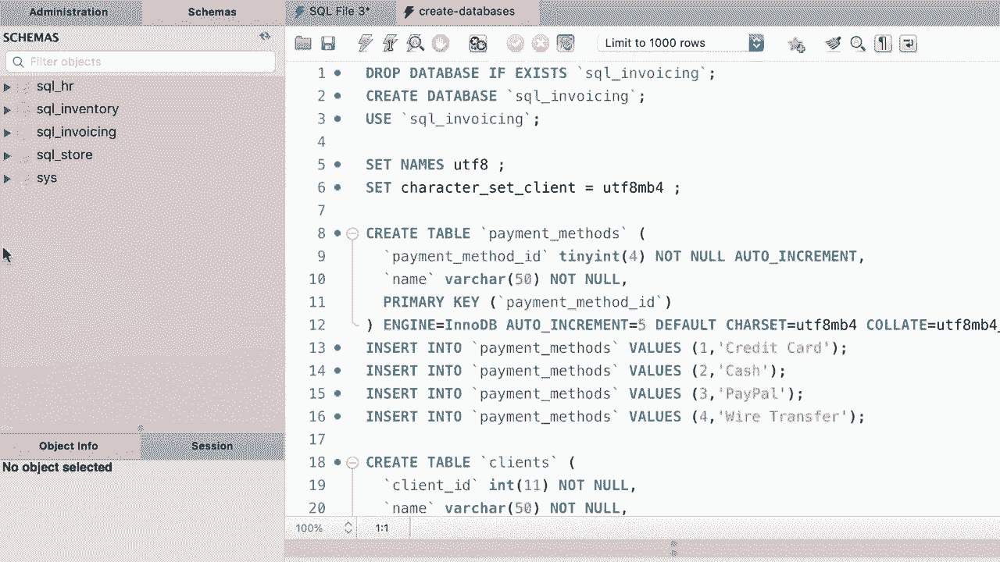

# 【双语字幕+资料下载】SQL常用知识点合辑——高效优雅的学习教程，复杂SQL剖析与最佳实践！＜快速入门系列＞ - P40：L40- 恢复课程数据库 - ShowMeAI - BV1Pu41117ku

哦。好的，我们完成了这一部分，但在进入下一部分之前。我希望你恢复所有这些数据库到它们的原始状态，因为在这一部分我们添加了一些数据。我们更新了一些数据，我们删除了一些记录，所以如果你不恢复这些数据库，你可能会看到不同的结果。因此，在MyQL工作台中恢复这些数据库非常简单，顶部去文件菜单，打开SQL脚本，然后导航到你存储这个课程SQL脚本的目录。如果你忘记了那个目录，可以回到第一部分，我们有一节课是用来下载补充材料的。

所以在这个目录中打开，创建数据库。sQL。现在。执行脚本以重新创建我们所有的数据库。太好了，真美。现在让我们打开导航面板。你可以看到这里的数据库消失了。只需点击这个刷新图标。😊，真美，好吧。我们完成了这一部分。

下一个部分见。😊。
