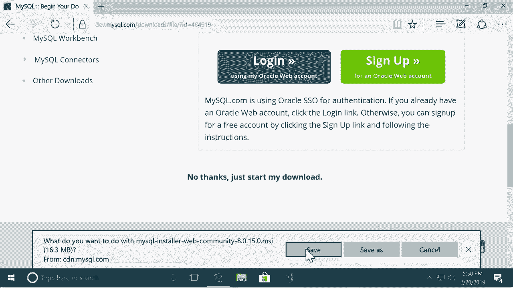
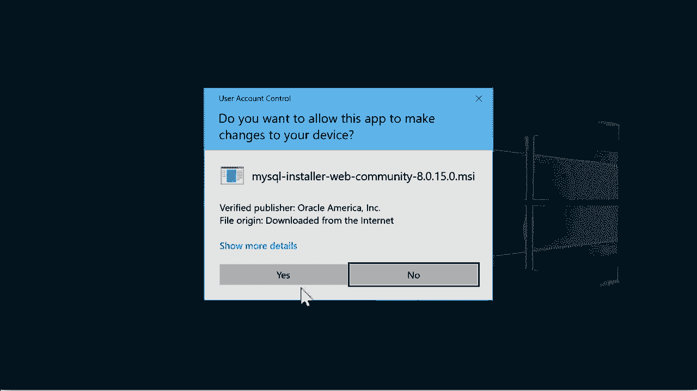
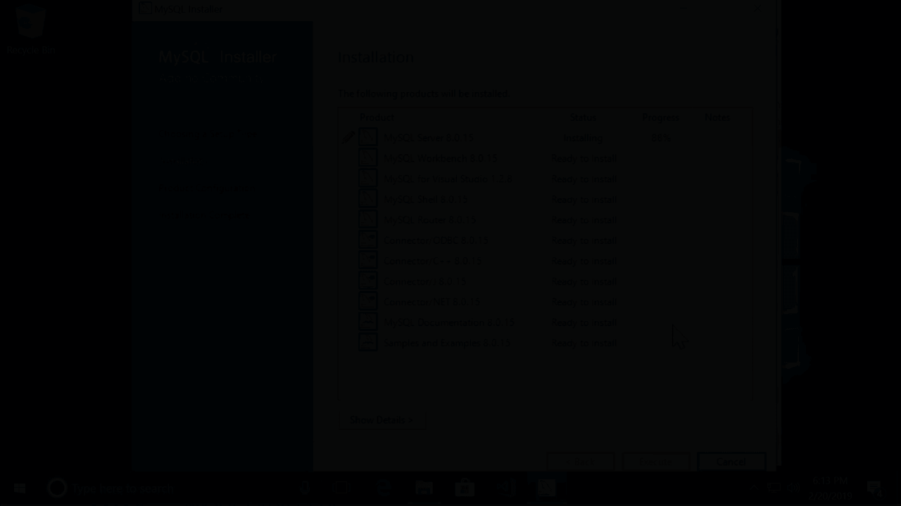
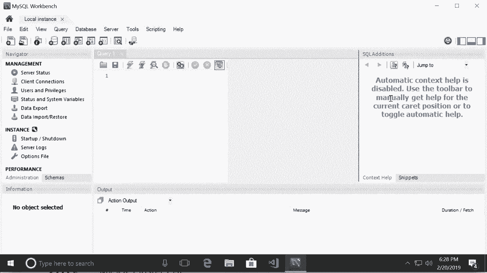

# 【双语字幕+资料下载】SQL常用知识点合辑——高效优雅的学习教程，复杂SQL剖析与最佳实践！＜快速入门系列＞ - P5：L5- 在 Windows 上安装 MySQL - ShowMeAI - BV1Pu41117ku

哦。In this tutorial， I'm going to show you how to install MySQl on Windows。 So open up your browser and head over to Mysql。 co。😊，Then go to the downloads page。Now， here。 scroll down to the bottom。We're going to use My SQL Community Edition， which is absolutely free。 so let's go with this。😊，Now select My SQL Community Server。😊，And then， scroll down。

So here you should see something like this My Sql installer for Windows。 This is the recommended method for installing My Sql on Windows。 So click on this。All right。 on the next page， scroll down。And。Download the first installer here。On the next page。 scroll down and click on no thanks。 Just start my download。 Otherwise。

 you have to create an account on login， which is unnecessary for following this course。 So let's go with this。And save this file to our computer。😊。

And then， run it。

Al we're going to use this setup wizard to install My Sql on our computer。 This is very easy。 All you have to do is to click next， but there are a couple of places where you need to enter a password。 let me show you。 So on the first page for the setup type。 we're going to use the developer default setup。😊，Go to the next page here we're getting a little warning because this installation wizard wants to install the connector for Python 3。

7， but I don't have Python on this machine， so that's why I'm getting this warning Now on your machine you might or you might not get this error it doesn't really matter just click next and one more time。😊，So here are the products that are going to get installed。 The first one is mySql server。

 The second one is mysql workbench。 This is the graphical tool that we use to connect to our database server and manage our databases。 You're going to see that soon。 So click on execute。😊。Now this is going to take about five to 10 minutes， so I'm going to pause the recording。

Alright， all the products are installed， beautiful。 let's go to the next page and again here on the group replication page， also click on next。😊。On the next page， which is about networking， leave all the default settings。 So let's go to the next page。 Now we should set a password for the root or the admin user。

 So click on next。😊，And in this box， type a password for the admin user。Allright。 and then let's go to the next page， once again， leave all the default settings and click on next and execute one more time。Alright， and now let's finish the installation。 Once again， we have to click on next and then finish。😊，One more time， there are so many steps Now here's the page where you need to enter the admin password。

 so the page is called connect to Server。 you can see the username is root。 which represents the admin user。😊，So in this box， enter the password that you said earlier。 then click on check。 Okay， connection was successful， beautiful。 Let's go to the next page and click on execute。😊，And finally， finish。There you go。

 We have one more step next。 Now finally， after all these steps， the installation is complete。 Now this is going to start my Sql workbench， which is the graphical tool we use to manage our databases and run SQL queries。 So click on finish。😊。

So now we have a command prompt window where we can type instructions to talk to our MyosQl server。 we don't really need this， so close it。😊。

And here's my SQL workbech。 Now， the first time you open this page by default。 you shall see a connection here， if you don't see it， click on this plus icon。😊，On this page。 give this connection a name， let's say local instance that leave all the settings to their default value。 but here for the password， click on store Invault。😊，And in this box。

 type the password that you set for the admin user。 So I'm going to put that here。Okay。Now click on Test connectionion。All right， we successfully connected to the MyosQL server on this computer。😊，Then click on OK。Now we click on this connection to connect to our database server Alright。 so here is the interface that you will be using throughout this course on the left side we have the navigator panel in the middle we have the query editor。

 which we can resize。😊，This is where we're going to write our SQL queries。 and on the right side we have SQL additions。😊，So we're done with the installation of MyQQL on our computer。 next I'm going to show you how to create the databases for this course。😊。

Oh。