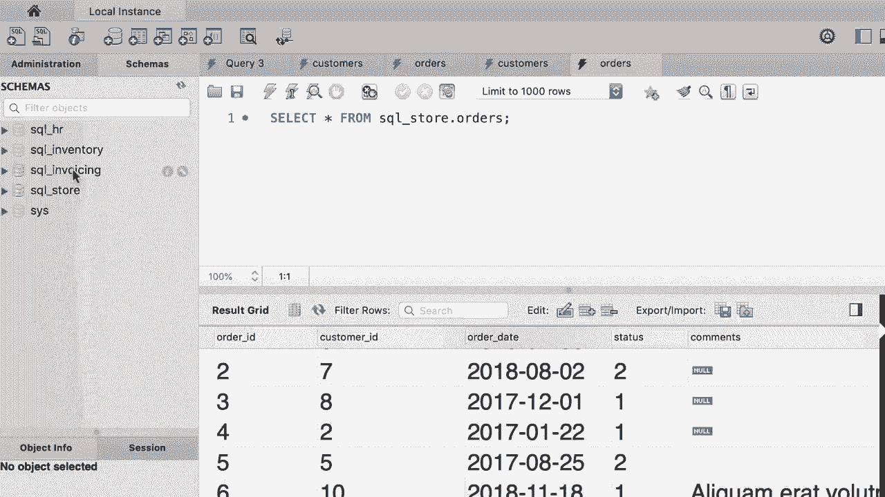

# 【双语字幕+资料下载】SQL常用知识点合辑——高效优雅的学习教程，复杂SQL剖析与最佳实践！＜快速入门系列＞ - P6：L6- 为本课程创建数据库 - ShowMeAI - BV1Pu41117ku

哦。！

在本教程中，我将向你展示如何创建本课程的数据库。所以我打开了我的 SQL Workbench。让我快速给你介绍一下这个界面，因为第一次打开时，它可能看起来有点吓人，但实际上并不难。所以在顶部我们有一个工具栏，里面有用于创建新标签以编写 SQL 代码以及打开 SQL 文件的按钮。

😊，接下来我们有一堆用于创建数据库和新表等的按钮。在左侧，我们有导航面板，包含两个选项卡：管理和模式。我们使用管理选项卡进行管理工作，比如启动或停止服务器，导入或导出数据等。😊，模式选项卡显示我们在当前数据库服务器中拥有的数据库。

目前我们只存在一个数据库，这个数据库是我的 SQL 内部使用的。现在在中间是查询编辑器窗口，这是我们编写 SQL 代码的地方。在本课程中，我们大部分时间都会在这个窗口中度过。在右侧，我们还有一个包含两个选项卡的面板，内容帮助和代码片段。这个界面在 Windows 上可能看起来略有不同，但我展示的几乎和 Windows 上的是一样的，所以如果你的机器上看起来略有不同也没关系。现在，在这里我们有这些按钮用于显示或隐藏这些面板。为了清理这个界面，我将隐藏右侧的面板以及底部的面板。

现在创建本课程所需的数据库是更好的选择。请下载我在视频下方附上的压缩文件。😊！

当你解压缩压缩文件时，会看到一堆这样的 SQL 文件。所以在本教程中，你将使用的主要文件叫做 create databases do SQL。这个文件包含了创建本课程所需所有数据库的 SQL 代码。现在我们还有用于创建单独数据库的文件。

我添加这些文件是为了以防你将来需要重新创建其中一个数据库。但现在，不用担心它们。😊！

现在，回到 My SQL Workbench，让我们打开创建数据库的主 SQL 文件。这是一个 SQL 代码的示例，起初可能看起来复杂，但相信我。随着你深入学习，你会准确理解这里的一切工作原理。你将能够像这样编写 SQL 代码。😊

我们想要执行此操作以创建本课程的所有数据库。😊，为此，我们点击这个图标，也就是工具栏上的黄色闪电图标。这将执行选定的部分或整个代码，如果没有选择任何内容。例如，如果我选择这一行并点击这个图标，这只会执行这一行。

我们想要执行整个代码，所以不应该选择任何内容。现在，让我们执行这个美妙的代码。😊，所以在底部，我们有一个叫做输出窗口的面板，它显示我们数据库服务器上执行的所有操作，这样我们就可以检查所有操作是否成功完成或者是否出现了问题。如我们所见，每个操作旁边都有这个绿色的勾。

我将关闭这个面板。😊，这样更好。现在在左侧的架构标签中，目前我们看不到新数据库。因此我们需要刷新这个视图。美妙的地方是，我们有这些以SQL或SQL为前缀的数据库。我决定将它们以SQL为前缀，这样我们就知道这些是本课程的数据库。

这样可以避免与数据库服务器上同名的其他数据库意外冲突。录制此视频时，这里只有四个数据库。但在课程进行过程中，我会更新创建数据库的脚本。因此，当你观看这门课程时，你可能会看到更多的数据库。

不用担心这些区别。😊，现在作为示例，让我们探索其中一个数据库，顺便说一下，我们不再需要这个标签了。所以让我们关闭它，这样更好。让我们展开SQL存储数据库。😊。在每个数据库中，我们都有这些对象，我们有表，这就是我们存储数据的地方。

我们有视图，这种视图就像虚拟表，可以将来自多个表的数据组合并放入一个视图。这在创建报告时特别强大。你将在未来学习到它们。我们还有存储过程和函数，这些是我们存储在数据库中的小程序，用于查询数据。例如。

我们可以有一个存储过程，用于获取某个城市的所有客户。所以我们调用那个过程并说：嘿，给我所有在旧金山的客户。这将返回所有在旧金山的客户。好的，现在让我们展开表。😊，在这个数据库中，我们有客户、订单、产品、运输商等。现在，选择这个客户表，每当你将鼠标悬停在这个项目上时。

你应该在右侧看到这三个图标。点击最右侧的图标，它看起来像一个带有闪电的表。这样，我们就可以看到这个表中的所有数据。这是我们的客户表。😊。在这个表中，我们有这些列，比如客户ID，我们用它来唯一标识客户。

我们还拥有名字、姓氏、出生日期、电话、地址等等。这些就是这个表中的列，每一行称为记录。每一行代表一个客户，这些是我们对每个客户所知道的信息。😊现在，让我们看看另一个表。打开订单表。

在这个表中，我们有这些列，如订单ID、客户ID、订单日期、状态等等。这里的客户ID是什么？我们使用这一列来识别每个订单是由谁下的。现在有趣的是，你是通过他们的客户ID来引用这些客户，这唯一标识了他们。换句话说，如果约翰·史密斯下了一个订单。

我们这里不存储约翰·史密斯的记录，我们只存储约翰的客户ID。为什么呢？原因是约翰·史密斯可能在我们的系统中下过多个订单，每次约翰下订单时，我们需要查找他的地址和电话来发货。现在，可能这些信息将来会发生变化。

约翰可能会搬到新地方或更改他的电话号码，甚至可能会更改他的名字。如果我们在每个订单旁边重复所有这些信息，那我们就得回来在多个地方进行修改。相比之下，通过这种设计，我们只需存储约翰的信息。所以每当我们想要更改约翰的任何信息时。

而不是在这里进行更改，我们返回到客户表。😊让我们看看客户ID为6的客户，实际上叫ElLca。以下是关于ElLca的所有信息，这是她的电话号码，这是她的地址。顺便说一下，这都是我使用工具创建的虚拟数据。

所以如果关于ElLca的信息将来有任何变化，这就是我们需要修改的唯一地方。这就是这些数据库的工作原理。我们称这些数据库为关系数据库。基本上，这种数据库中有多个表，它们通过关系相互关联。

所以在内部，客户表和订单表之间存在关系。客户表中的客户ID列与订单表中的客户ID列相关或链接在一起。😊这是订单表，我们有客户ID列。这是对关系数据库的简要介绍，你了解了数据库、表、列。

行和关系。在下一部分，我将向你展示如何从这个数据库中的单个表中检索数据，但在进一步之前，作为练习，我希望你探索发票数据库，查看所有表，查看所有数据，以了解我们在这个数据库中拥有的数据类型，我们将来会经常使用这个数据库。😊所以我们花几分钟来探索这个数据库。

是的。
