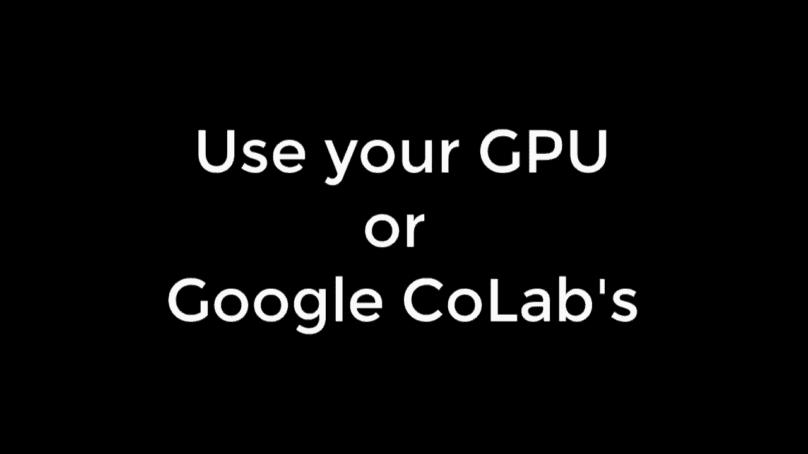
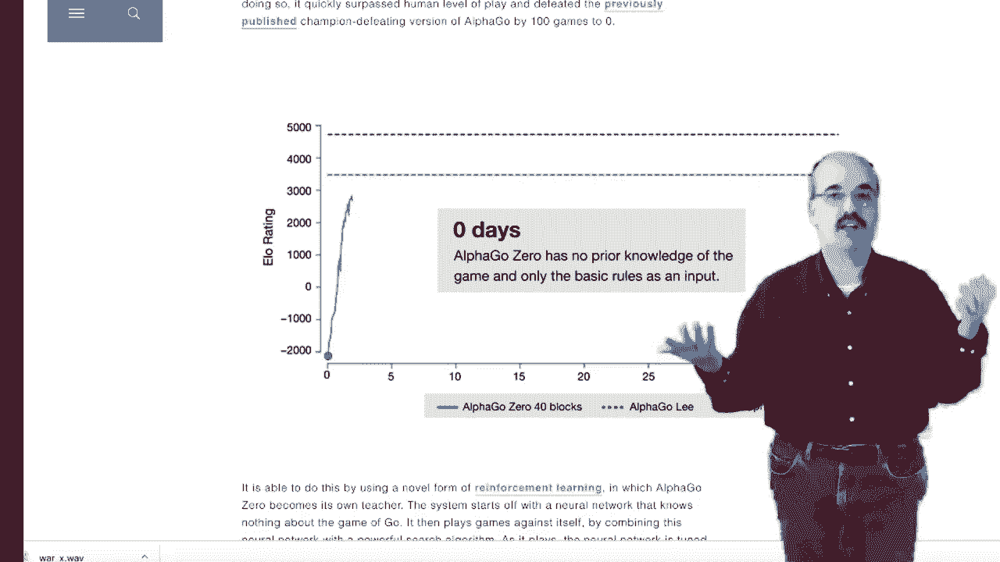

# 【双语字幕+资料下载】T81-558 ｜ 深度神经网络应用-全案例实操系列(2021最新·完整版) - P1：[讲座] Python、Keras和TensorFlow深度学习课程以及深度神经网络的应用 - ShowMeAI - BV15f4y1w7b8

The thing that makes deep neural networks as are fantastic technology is that they can accept input in just about any format that can take in tabular data。 images， text， and even audio。They then process this information。 perform all sorts of mathematical magic， and then they output either a decision or a number rating。 but they can also output much of the same type of data that they got in。

 They can output tabular data， images， text or audio。😊，In my class。 applications of deep neural networks， I'll show you how to apply these neural networks to everyday problems。 Everything in this course is taught using Jupiter notebooks in Python。 As you can see。 you can look at your code Intermixed with information from my course and see the actual results from your programs as you run them。

 Now， some of the applications that will create our video game like and will require video。 So for those will run them actually outside of a Jupyter notebook and directly from Python。

Everything is ensured to be compatible with Google coab so that you can run it with a free GPU。 if needed， The GP， believe me， can save hours and hours on your training times。 I'll show you a lot of graphics and other cool things in this video。 everything comes from what we do in class。 So there's no video magic。 Now， to put me in。

 I do need a little bit of green screen magic。 But believe me。 the neural networks need no such processing to look great。😊。

The GN is one type of neural network that we'll look at in this course。 GN stands for generative adversarial neural network。 GNs are typically used to generate faces。 although they can generate any sort of fake data that they're trained on。 A G works by having two neural networks。 The first neural network is the generator。

 It essentially takes random numbers and generates faces。 The second neural network is the discriminator， it essentially tells if the generator is producing correct faces or not。 These two go back and forth and wage and adversarial war。Once they're done。 you have a generator that is able to take really lots of different random numbers and keeps generating pretty realistic looking faces。

 reinforcement learning， particularly when you apply it through deep learning is a very powerful technique that allowed Google Alpha0 to beat Stockfish at essentially master all of chess in a short amount of time。 In this course， will take a look at Atari video games using the AI gym and create reinforcement programs that learn how to play these games by looking at both the actual video image of what's going on in the game and in some cases。

 the Ram state of the actual video games。

Who's a good boy， Hickory？Just like training your pet， when you use reinforcement learning。 you provide rewards to the neural network for performing a good job or doing something that leads to a favorable outcome neural networks are also very good at generating supplementliminal messages for advertising。

Okay， well， sorry。 I had to try。 Remember when I said neural networks can accept any type of input。 Well， guess what， they can actually accept multiple types of input at the same time。 This is how image capturing works。 to create a neural network that is capable of writing a caption for a image。 What you do is you create a neural network that accepts two different types of input。 a photo。

 and then a sequence and that sequence is a set of evergrow words。 First。 you pass it in with just an empty array and a start token。 and then it adds words describing what that picture is supposed to be。 Yolo， you only look once。 This is an amazing technology that you can see running all around me。

 It's classifying objects multiple objects and doing it very efficiently because it only needs to look once。 We'll see how you can transfer this technology into your Python program。 and receive the actual coordinates and class。😊，Of what see going on around you。Yellow can be fooled here。 It cant tell the difference between my dog and a stuffed animal。

 It also has trouble telling billboards and things that have people on it and thinking their people。 This billboard might be very concerning to a self driving car who thinks it's about to get broad sideed。 But wait， there's more。 This video was only able to show you the highlights from this course。 Here's a complete list of some of the other topics that we'll cover as well。

Thanks for watching this video。 If you have any questions about this course。 just leave something in the comment， please subscribe to this channel so that you are updated whenever new videos are added to this course All the information is available in the playlist and in GiHub。

