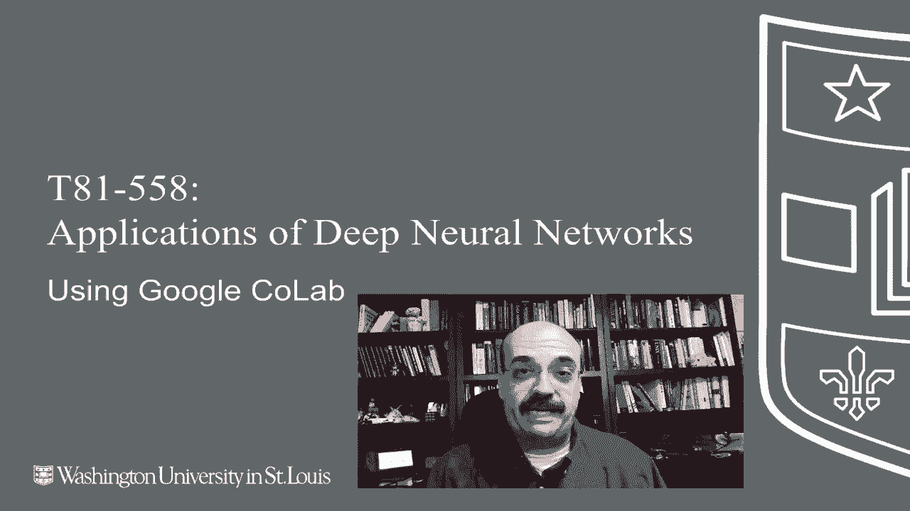
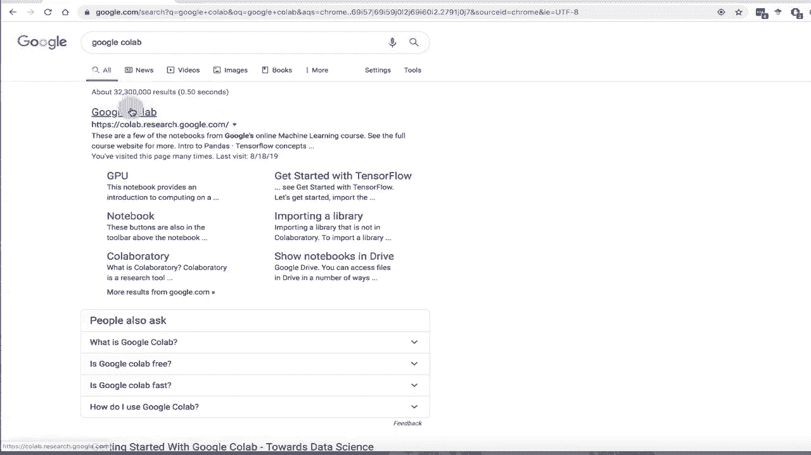
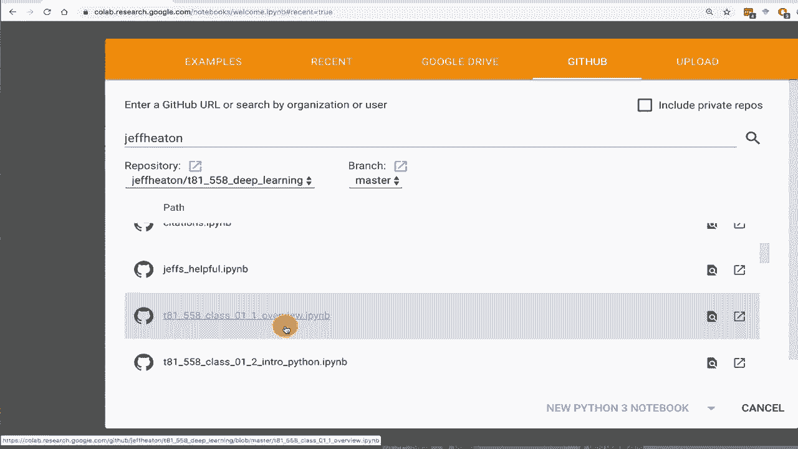
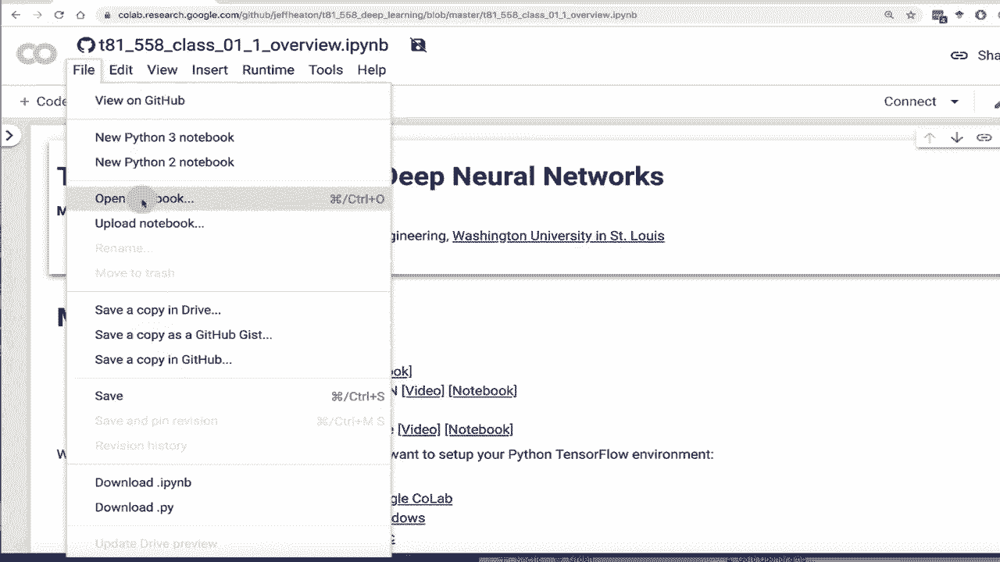
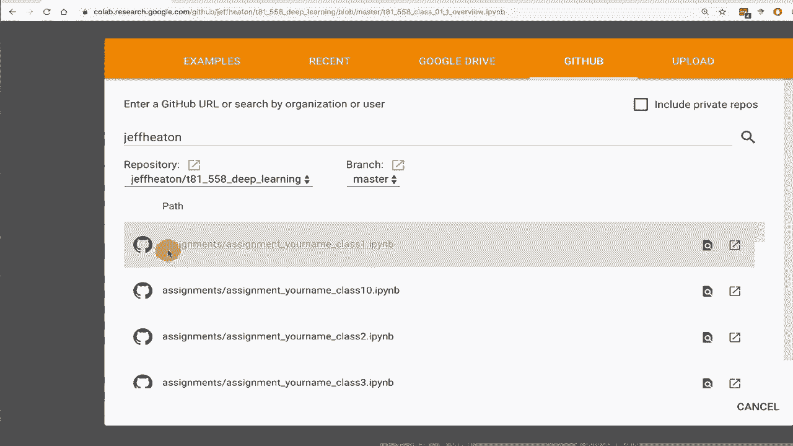
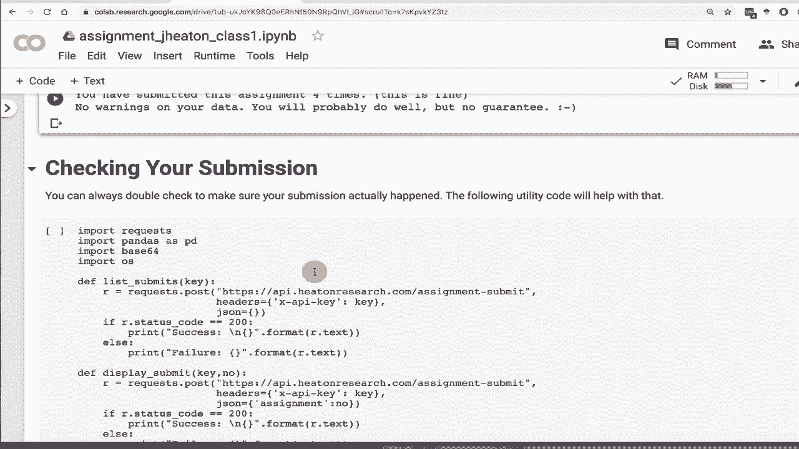

# 【双语字幕+资料下载】T81-558 ｜ 深度神经网络应用-全案例实操系列(2021最新·完整版) - P10：[讲座] 使用 Google CoLab 进行深度神经网络课程应用 - ShowMeAI - BV15f4y1w7b8

嗨，我是Jeff Heaton。欢迎来到华盛顿大学的深度神经网络应用。在这段视频中，我将介绍Google CoLab，并展示如何使用Google CoLab运行本课程的各种模块，以及如何使用它提交作业。😊，大多数功能在Google CoLab中都能正常运行。事实上，由于它为你提供GPU，本课程的大部分内容在Google CoLab中运行会快得多。

现在，你的本地机器可能有比Google CoLab更强的GPU，如果是这样的话，我确实鼓励你在你的电脑上安装Tensorflow的GPU版。然而，在TensorFlow中让GPU工作可能有点复杂。要了解我AI课程和项目的最新信息，请点击旁边的铃铛订阅，以便收到每个新视频的通知。

Google CoLab可以是完成这门课程的好方法。你可以完全在云中使用Google CoLab完成整个课程。只需注意一些事情。这就是我将在这个视频中向你展示的。首先，为了进入Google CoLab，我建议你在Google上搜索Google CoLab，它会直接带你去。

这是Coab研究，Google CoLab，我在我的课程网站上也有相关链接。现在，当你进入Google CoLab时，你会看到许多事情在进行中。我用这个做了很多不同的事情。所以这里的文件可能会比你拥有的多得多。

你将要使用的所有笔记本都会存储在你的Google Drive中。那么我们来展示一下如何获取第一个模块的第一个课程。点击Github，你会输入Jeff Heaton所有。😊。

ord是我Github代码库的名称。现在，你可能会看到这样的内容。这实际上是我第一次看到这个。显然，我已经足够频繁地将Github与CoLab结合使用，以至于他们想让我授权API访问。这没问题，我会点击这个。

并授权Google CoLab要求我登录。好吧，现在我们已授权。起初可能不会问你，但如果问了，请务必继续授权，以便你可以访问相关内容。现在会显示Jeff Heaton，并给你我的所有代码库。这些库有相当多。这是你需要的，T81，558深度学习。

这是华盛顿大学的课程编号。你会首先看到作业，稍后我们会详细讲解这些作业。现在我们就打开第一个模块的第一个课。这个是一个笔记本，所以它在这里打开，你现在基本上可以看到这个。

它没有保存到你的G驱动。如果你想将其复制到G驱动，这是个好主意。你需要在提交作业时这样做，但我们先复制它。所以它会创建一个副本。你会看到这里的名称。它说是T 81的副本。这实际上直接进入你的G驱动。如果我们进入G驱动。再一次。

我在我的Google驱动中有各种各样的东西，你可能没有。但你会有一个叫做Coab笔记本的目录。这是Google Coab放置所有笔记本的地方。所以这是这个副本。我建议将其重命名为其他名称。所以我们现在在Google Coab中。

我要浏览这个。我有一个完整的视频讲解。

关于这门课的介绍，但这里有一小段Python代码可以运行Python版本。现在，请注意，这里是2.0.0。Google，至少在录制时，还没有将Coab更新到TensorFlow 2.0，我怀疑这学期会发生。所以这就是为什么我几乎每次都要重新录制这个视频。

我将运行这个，我们将看到它将去到它的某个版本之一。是的，所以1.14，这是一个相当新的版本。我已经确保这里的所有代码，或者至少大部分与Coab兼容。那些不兼容的部分，可能不到课程的10%，我会警告你为什么会这样。

我也没有让任何作业需要Google Coab不支持的功能。现在，请注意，这里说GPU不可用。这是Google Coab一个很酷的特点。我们去运行时。更改运行时类型。我们保持不变。但我们放入一个GPU。现在它说GPU可用。稍后，这真的会为你节省一些执行这些程序的时间。

所以这向你展示了如何基本上将课程模块转移到Google Coab，如果你想运行它们。不幸的是，你需要像这样一个一个地复制。你可以下载，这将是一个快速的方法。你可以下载整个Github库，基本上只需将文件复制到你的G驱动，然后它们就会显示出来并可用。

现在让我们看看如何使用Google Coab提交作业。所以如果我们回到Coab，我们基本上尝试打开一个笔记本。我们会像之前一样回到Github。这很烦人。它希望我不断重新授权。它默认为作业。

这只是因为作业以一个开始，所以我们。

我将快速完成class1作业，我已经打开它，我们绝对必须将其复制到你的Google驱动，否则它将无法工作。你会想要更改它的名称。不要用副本，只称其为作业，我将命名为J Heaton作业。

把你的名字放到这里，替换为你的名字和class1。这是指令。一些常见问题会出现。你将基本上使用这个提交功能。所以继续运行这个，以构建提交功能。这只是我为你提供的一个功能。我们不会详细讨论它的工作原理。

这更多是用于使用这个课程的工具。这是一个重要部分。你需要这样做，以便基本上可以在你的笔记本中使用来自Google CoLab的文件。这将让你能够提交作业，还有一些课程要求你下载一个Cv文件作为输入数据，或者是图像或其他东西。

你需要把那些文件复制到你的Google G驱动器，然后通过这个访问。所以让我们看看这怎么运作。我们将继续运行这个，它也会要求我进行身份验证。我需要一个来自Google的授权码。我点击这个。这里是我的授权码。我不认为你能用这个做什么坏事，因为我认为它们持续的时间不长。

不过我会模糊处理这个，以确保安全。把它放到这里，按回车，现在它已经挂载。它挂载在这个位置。所以你需要用那个路径前缀你的文件，以证明它确实在那里。我可以运行感叹号L。所以这是Unix的ls命令。我在这里列出文件。

这是我创建的文件。你还会在这个课程中获得一个API密钥。我发给这些信息，实际上只是给参加课程的学生。如果你是普通互联网用户，可以在我的Patreon链接上查看，有些等级可以让你获得访问权限，如果你对此感兴趣的话。

但这个API密钥，我里面的那个实际上并不是真正的密钥。曾经是一个真实的密钥，但我基本上把它们换掉了，以免所有人都用我的演示密钥提交。所以在课程开始时，当你观看这个视频时，这将不再是有效的密钥。我将运行这个程序，作业一非常简单。

这只是证明你能够进行操作，并实际运行一个Python程序并提交它。我在这里运行，现在你可能会遇到这样的错误，这是重要的。所以它在说用户Jheton文件，我发现它需要知道你的笔记本文件在哪里，以便能够发送它。这更多是针对Mac和Linux。所以切换到这个用于CoLab。现在，你需要修改这个。

也许。所以你不会有你的名字。它将是你的名字，比如J Heaton_underbar class 1。所以不管这个文件叫什么，它应该会与这个非常相似。但确保把你的名字放进去。现在我们可以再试一次提交，它成功了。成功，你已提交作业1。这只是一个演示账户，实际上是我妻子的名字。

你已经提交了这份作业四次，这很好。所以你可以随意提交这些。如果下方有警告告诉你有问题，一定要修复这些警告，因为这肯定会导致你失分。现在，有时它会说你的值与我的值相差某个数字，如果是像0.0123这样的小数。

像那样，数字非常少。可能没关系，但再说一遍。对你实际成绩的自动评估没有保证。这只是为了帮助你，给你一个不因容易纠正的问题而失分的机会。这些每周都有截止日期。确保你按时提交。如果你迟交，会失去分数。

这就是运作的方式。如果你提交得太晚，你将根本得不到分数。所以确保你能掌握这些。这是一个混合课程，因此每周跟上进度非常重要，而不仅仅是在课程最后一天提交所有内容。你也可以检查你的提交情况。

这只是一些额外的代码。你把你的密钥放在这里，你可以确保我是否收到了作业。现在在我实际评分之前，你不会看到这些出现在canvas上，然后它就成为你实际课程成绩的一部分。好的，这就是你如何使用Google Colab。这是一个很好的选择，如果你不想麻烦地在电脑上安装Python和各种工具。

这让你可以访问相当不错的GPU。这些内容经常更改。所以订阅频道，以便随时了解这门课程和其他人工智能主题的最新动态。
