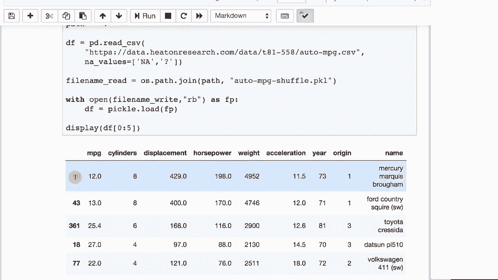

# 【双语字幕+资料下载】T81-558 ｜ 深度神经网络应用-全案例实操系列(2021最新·完整版) - P12：L2.1- 深度学习数据处理工具库Pandas 简介 - ShowMeAI - BV15f4y1w7b8

嗨，我是杰夫·希顿，欢迎来到华盛顿大学的深度神经网络应用。在这个视频中，我们将开始这个模块的一系列内容，接下来的五个视频将讨论 pandas。现在，神经网络可以接受表格数据，这种数据就像你在 Microsoft Excel 中看到的一样。许多传统数据科学问题都是这样设置的。

Kagle 上的许多比赛都是这样设置的。我们将在本课程的后面深入探讨图像和音频处理以及文本自然语言处理，而不会使用 pandas。但在开始时，当我们处理一些传统数据集时，情况则不同。

pandas 对处理可以分为列的数据集非常有用。关于我最新的 AI 课程和项目，请点击旁边的铃铛订阅，以便收到每个新视频的通知。神经网络接收多种数据进行预测。

一种你将要读取的数据是 CSV 文件，这与表格数据有关。我们将在几节课上花时间讨论表格数据，几个模块。但我们还将深入研究神经网络擅长处理的图像和其他更高级的输入。不过现在，我们要看看 pandas，看看如何处理表格数据。

在这里我们使用 pandas 读取 CSV。你将在读取不同数据集时看到很多这一点。我是从网络读取的，所以在 collab 和本地运行时都应该有效，它会打印出数据框的输出。至少是前五行。我们也可以使用 display 函数，使其打印得更好看。这显示了每加仑英里数数据集，这是一个经典的数据集。

在许多机器学习文献中你会看到，我们会使用它，但不太多。它显示了这些不同车型的每加仑英里数，特别是1970年代的车型。你试图用这里看到的其他值来预测每加仑英里数。这个展示了一种打印该值基本统计信息的方法。

并且它展示了你如何与 pandas 一起工作。如果你运行这个，它基本上会给你每个字段。因此，字段被命名为每加仑英里数。下一个字段被命名为气缸，依此类推。这会给你一些统计信息，均值、方差、标准差等等。稍微有点难读。

但我们稍后会让它更易读。让我们看看我们实际上是如何做到这一点的。我们正在使用数据框，只使用整数和浮点数类型的数据。这实际上是丢弃了名称。然后我们获取这些值的标题，并创建一个名为 fields 的空列表。我们将循环遍历列中的每个字段。

所以我们将遍历每一列，并将一个我们动态构建的字典附加到字段中。这个字典有四个元素，分别是条目名称、我们当前处理的字段的均值。数据框就是这样计算某一列的均值：`.mean`、`.variance` 和 `.standard deviation`。

你可以使用中位数，许多统计值都可以使用。然后我们将它们打印出来。这是构建字典列表的一个好例子，这是一种非常常见的结构。这就像一个数据库表格。这也是你可以将数据放入的确切格式，以便直接加载到数据框中。

在这里，我们可以看到我们可以将这里创建的数据转换为 pandas 数据框。这非常方便，因为现在我们可以很好地展示它。因此，我们基本上是从头开始创建了一个数据框。所有这些均值、标准差和方差的值我们都放在了 NA 中，这个字典是我们一个个添加的。

这些就像我们正在创建的这个特定表格中的行。现在，缺失值的现实是，作为数据科学家，你处理的数据总是有问题。😊。如果数据完美，我几乎会担心我没有发现的问题。我们将在这里加载每加仑的汽车英里数，这就是那个相同的数据集。但我们在这里说 NA 值是 NA 和问号，因为在这个特定数据集中有几个问号，其中有一个马力值缺失。所以如果你运行这个，它会显示是的。

如果马力确实有 NA 值，那么我们填充缺失的值。我们取中位数，现在中位数通常比均值更适合用于填充缺失值，因为中位数对离群值的敏感度较低，而均值则较高。如果你有一个巨大的离群值，这会影响你的均值。

但这并不会真正影响你的中位数。因此我们采用马力，并用那个中位数填充缺失的 NA 值，如果你愿意，也可以直接删除 NA 值，这会删除整个包含 NA 值的行，现在我们打印出马力确实没有 NA 值。

有 NA，因为我们填充了它。离群值是你可能需要处理的另一件事。你可以删除它们或以其他方式处理它们。我在这里向你展示如何删除它们。我们将离群值定义为高于或低于均值两个或更多标准差的值，两个可能有点近，但也许是三个或更高。

但这向你展示了如何删除，我们想删除大量数据，因此我们将删除任何高于或低于均值两个标准差的值。我们做的第一件事是计算要删除的行。因此我们基本上是在要求一个绝对值的列表。

对于每个单独的值，name 是我们正在计算离群值的列。我们从均值中减去它，并确保它不超过该标准差的数量。然后我们删除这些行，这些行的索引已获取。我们使用 axis 等于 0，因为我们处理的是行和列。我们并没有删除列。

就地意味着它修改实际的数据框，而不是返回第二个数据框。运行函数。因此它在内存中。这将加载相同的数据集并创建特征向量。它通过将马力替换为中位数来实现。我们将删除 name，因为我们不需要它，这在这个例子中并不重要。

然后我们查看每加仑的英里数的长度，看看在删除这些值之前和之后，我们看到数量从 398 变为 388。我在这里展示了一些数据，你可能真的看不到明显的不同。在 pandas 中删除字段非常简单，如果我们想删除 name 字段，只需这样做。

它告诉你列的数量在前后或实际的列，你可以看到 name 之前在那里。能够从数据框中删除整个列是非常方便的，我们也可以将东西连接在一起，这在我们开始生成虚拟变量和其他变量时变得非常有用，我们需要将它们添加到数据框中。

这将创建一个新的数据框，仅包含两个值，因此这是仅创建 name 和马力。我们提取马力，提取 name，然后将这两者作为列连接在一起，axis 1 总是表示列，你会得到这个漂亮的结果，我们只显示前五行。

但这就是你可以选择其中一个的方法，无论你如何选择。并从头开始构建数据框，有些作业会要求你做非常类似的事情。因此，能够将这些列或系列放在一起以构建全新的数据框是非常有用的，你还可以将行连接在一起。这是将前两行和最后两行连接起来，因此我们从零到二取数据框，然后从负二开始，这意味着从末尾往回数两行到末尾。

现在一起处理 catatum。这是访问零，因为我们处理的是行。你经常会使用 pandas4 进行训练。将训练数据分割为训练集和验证集，甚至进行 k 折交叉验证，在后面的模块中会深入讨论 k 折交叉验证。但你基本上可以将数据分割为训练集和验证集，这样你就可以在这里拥有整个数据集。

但你取80%作为训练，20%作为验证。你通常会在训练集上训练和拟合你的模型，并在验证集上评估从训练集中创建的模型。这是一段简单的代码，展示了如何做到这一点。我们基本上是在这里使用掩码来创建一个。

一组值的掩码，这只是一组真和假的列表。真是会被包含的，而假则不会。因此，由于我们取了80%的训练数据框。基本上，得到应用掩码后的数据框，反向掩码，我们能够打印出我们的训练集为312，而验证集为86。

这非常重要，你不能直接将数据框发送到Kras，你需要能够使用nuy来实现。Numpy的do values正是这样做的，所以在这里你可以看到，它基本上是提取了值并创建了一个矩阵。现在你可能不想要所有这些值，比如这里的名字不是数字，这可能会导致问题。

你现在可以传入一个列表，这在Python中经常会引起一些混淆，当你看到数组的双大括号时。这不是双大括号。这只是意味着你传入的索引是一个列表。因此你是在说，我想要数据框中的所有行，但我只想要这些列。如果你现在运行这一段，没有名字，那样你就没有了那个丑陋的字符字符串，它是纯数字的。

这就是你想要的。当我们学习如何为神经网络准备特征向量时，我们会看到更多的内容。你可以将创建或修改的数据框保存为CSV文件，这允许你在Jupyter Notebook外部使用Excel或更高级的CSV文件查看工具查看它。你必须小心使用Excel，它往往会修改CSV文件，甚至会通过删除前导零和其他方式来破坏它，并且它对文本编码如UTF-8的支持也有限。仅使用Excel查看内容是可以的，但要注意它可能会重新格式化某些数据并破坏它。现在，当你将其保存为CSV文件时，这很有用，因为我通常会让你以这种形式提交这些文件作为一些作业。

当你参加CAgle竞赛时，你通常会提交一个CSV文件。我会在我们到达那个点时发布本学期CAgle竞赛的确切要求。保存CSV的命令简单如下to CSV。我们基本上只是在洗牌这个数据框，然后写回去。

索引等于 false，通常你希望索引等于 false，因为这会告诉它不要在每一行上放置行号。现在，当你运行这个时，它只是显示完成，并生成我们所说的路径中的 CSV，点表示当前目录。如果你正在使用 Google Colab，可能需要将你映射的 G 盘路径放在那里，然后它会将输出放到你可以获取该文件的地方，你可以在 Google Docs 或其他地方查看它。Google Docs 是查看 CSV 的非常好用的程序。将数据框保存为 pickle，pickle 是一种二进制文件格式，因此当你保存为 CSV 时，实际上是将其写入文本文件中，这通常可以读取，但在 CSV 文件之间来回传输时可能会遇到非常小的精度问题，通常这不是问题，只有在你试图比较两个文件时才会出现。

Pickle 将确保你获得文件的准确渲染，并且它还存储在数据框中不适合存入 CSV 的其他元数据，比如行号。如果我运行这个，它只是告诉我我已经完成了，再次进行了这个重新索引的操作。我们将重新加载 pickle 文件，使用 pickle dump 来保存，而这会将其加载回去。现在，有一点很重要要注意，这是文件。

这些是所有列和内容，但这里是你可以区分加载 pickle 文件和加载 CSV 文件的方法，注意行号不对齐，因为我们进行了重排，而且我们没有重建索引。因此，存储在 pickle 文件中的内容在 CSV 文件中将会丢失，通常你并不在意丢失这些。

但是你实际的行号是从最初加载时来的。这些行号只是因为我们进行了洗牌而不按顺序排列，但这并不是会存储到 CSV 文件中的内容。

感谢观看关于 pandas 介绍的视频。我们将在本模块的其他部分深入探讨如何进行更高级的处理。该内容经常更新，因此请订阅频道以获取有关本课程和人工智能其他主题的最新信息。😊
